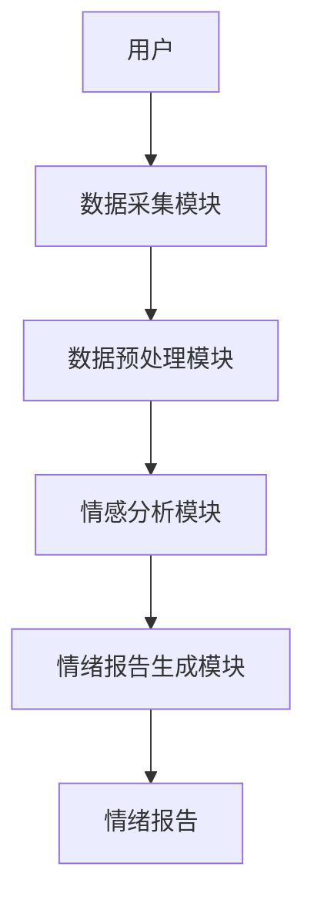
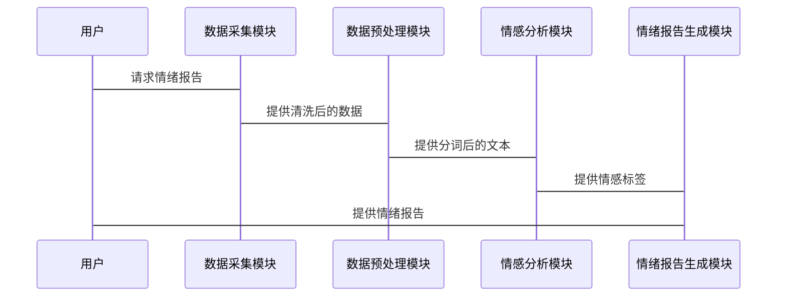

                 


# 深度学习分析社交媒体投资情绪

> 关键词：深度学习，社交媒体，投资情绪，情感分析，自然语言处理，深度学习模型，投资决策

> 摘要：本文探讨了如何利用深度学习技术分析社交媒体上的投资情绪。通过详细分析问题背景、核心概念、算法原理、系统架构和项目实战，本文为读者提供了从理论到实践的全面指导。文章结合情感分析、自然语言处理和深度学习模型，展示了如何从社交媒体数据中提取投资情绪信息，为投资决策提供支持。

---

# 第一部分: 深度学习分析社交媒体投资情绪概述

# 第1章: 背景与问题描述

## 1.1 投资情绪分析的背景

### 1.1.1 社会媒体在投资决策中的作用
社交媒体已成为投资者获取信息、分享观点和做出决策的重要渠道。通过分析社交媒体上的文本数据，可以提取出投资者的情绪倾向，从而辅助投资决策。

### 1.1.2 投资情绪分析的定义与目标
投资情绪分析是指通过对社交媒体上的文本数据进行分析，识别出投资者的情绪倾向（如乐观、悲观、中性等），并量化整体市场情绪。

### 1.1.3 情绪分析在金融领域的应用价值
情绪分析可以帮助投资者识别市场情绪变化，预测股价波动，优化投资策略。此外，情绪分析还可以用于风险控制、市场趋势预测等领域。

## 1.2 深度学习技术的引入

### 1.2.1 深度学习在自然语言处理中的优势
深度学习能够自动提取文本中的语义信息，无需手动特征提取。相比于传统机器学习，深度学习在处理复杂文本数据时表现更优。

### 1.2.2 深度学习在情感分析中的应用
深度学习模型（如LSTM、Transformer）在情感分析任务中表现出色，能够捕捉文本中的长距离依赖关系。

### 1.2.3 社会媒体数据的特点与挑战
社交媒体数据具有海量、异构、实时更新等特点。同时，数据中存在噪声、歧义和情感表达多样性，增加了分析的难度。

## 1.3 问题描述与研究目标

### 1.3.1 投资情绪分析的核心问题
如何准确提取社交媒体上的投资情绪信息，并将其应用于投资决策中。

### 1.3.2 数据来源与处理挑战
社交媒体数据来源多样，格式复杂，需要进行清洗、预处理和特征提取。

### 1.3.3 研究目标与预期成果
本研究旨在构建一个基于深度学习的社交媒体投资情绪分析系统，提供实时情绪监测和投资建议。

---

# 第二部分: 核心概念与理论基础

# 第2章: 情感分析的核心概念

## 2.1 情感分析的定义与分类

### 2.1.1 情感分析的定义
情感分析是通过自然语言处理技术，判断文本中表达的情感倾向。

### 2.1.2 情感分析的分类
- **二分类**：正面、负面。
- **多分类**：正面、负面、中性。
- **方面分析**：针对特定方面的情感分析（如产品性能、服务质量）。

### 2.1.3 情感分析的粒度
- **整体情感**：对整体文本的情感判断。
- **特定方面情感**：对文本中某一方面的情感判断。

## 2.2 深度学习与情感分析的关系

### 2.2.1 深度学习在情感分析中的优势
- **自动特征提取**：深度学习模型能够自动提取文本中的语义特征。
- **长距离依赖捕捉**：深度学习模型（如LSTM、Transformer）能够捕捉文本中的长距离依赖关系。
- **高准确率**：深度学习模型在情感分析任务中表现出色。

### 2.2.2 深度学习模型的关键特点
- **层次化特征提取**：模型通过多层结构提取不同层次的特征。
- **端到端学习**：模型可以直接从原始数据中学习，无需手动特征提取。

### 2.2.3 深度学习与传统机器学习的对比
| 对比维度       | 深度学习             | 传统机器学习         |
|----------------|----------------------|----------------------|
| 特征提取       | 自动提取             | 手动提取             |
| 模型复杂度     | 高                   | 低                   |
| 数据需求       | 需大量数据           | 数据需求较少         |
| 性能           | 高                   | 较低                 |

## 2.3 社会媒体数据的特征分析

### 2.3.1 文本数据的特征
- **文本长度**：社交媒体文本通常较短。
- **文本结构**：社交媒体文本包含表情符号、缩写等非正式语言。
- **情感强度**：文本中的情感表达可能强烈或模糊。

### 2.3.2 用户行为数据的特征
- **用户活跃度**：用户的发帖频率、互动情况。
- **用户影响力**：用户的关注数、粉丝数。
- **用户情感倾向**：用户的历史情感倾向。

### 2.3.3 社会网络结构的特征
- **社交网络密度**：社交网络中的节点连接程度。
- **社交网络中心性**：节点在社交网络中的重要性。

---

# 第三部分: 情感分析的算法与模型

# 第3章: 情感分析的核心算法

## 3.1 传统机器学习算法

### 3.1.1 支持向量机（SVM）
- SVM通过构建超平面将数据分为不同类别。
- 在情感分析中，通常需要进行特征工程（如TF-IDF）。

### 3.1.2 随机森林（Random Forest）
- 随机森林通过构建多个决策树进行投票或平均。
- 在情感分析中，随机森林常用于特征重要性分析。

### 3.1.3 朴素贝叶斯（Naive Bayes）
- 朴素贝叶斯基于贝叶斯定理，假设特征之间独立。
- 常用于文本分类任务。

## 3.2 深度学习模型

### 3.2.1 循环神经网络（RNN）
- RNN通过循环结构处理序列数据。
- 常用于处理文本序列，捕捉长距离依赖关系。

### 3.2.2 长短期记忆网络（LSTM）
- LSTM通过门控机制解决RNN的梯度消失问题。
- 在情感分析中表现优异。

### 3.2.3 Transformer
- Transformer通过自注意力机制捕捉全局依赖关系。
- 在自然语言处理领域表现优异。

---

# 第四部分: 系统架构与设计

# 第4章: 投资情绪分析系统架构

## 4.1 问题场景介绍
投资情绪分析系统需要从社交媒体获取文本数据，进行情感分析，生成情绪报告。

## 4.2 系统功能设计

### 4.2.1 数据采集模块
- 数据来源：社交媒体API（如Twitter API、微博API）。
- 数据类型：文本、用户信息、时间戳。

### 4.2.2 数据预处理模块
- 文本清洗：去除噪声（如停用词、标点符号）。
- 分词：将文本分割为词语或短语。

### 4.2.3 情感分析模块
- 模型选择：基于深度学习的模型（如LSTM、Transformer）。
- 情感分类：对文本进行情感标签预测。

### 4.2.4 情绪报告生成模块
- 情绪统计：计算整体情绪分布。
- 情绪可视化：生成图表（如情绪分布图）。

## 4.3 系统架构设计

### 4.3.1 系统架构图


### 4.3.2 系统交互图


---

# 第五部分: 项目实战

# 第5章: 投资情绪分析系统实现

## 5.1 环境配置
- Python 3.8+
- TensorFlow 2.0+
- Keras
- NLTK

## 5.2 数据预处理

### 5.2.1 数据清洗
```python
import re
import nltk

def clean_text(text):
    text = re.sub(r'[^\w\s]', '', text)  # 去除标点符号
    text = text.lower()  # 转换为小写
    tokens = nltk.word_tokenize(text)  # 分词
    return tokens
```

### 5.2.2 分词
```python
from nltk.corpus import stopwords

def remove_stopwords(tokens):
    filtered = [word for word in tokens if word not in stopwords.words('english')]
    return filtered
```

## 5.3 情感分析模型实现

### 5.3.1 模型选择
选择基于LSTM的模型进行情感分类。

### 5.3.2 模型实现
```python
import tensorflow as tf
from tensorflow.keras import layers

model = tf.keras.Sequential()
model.add(layers.Embedding(input_dim=10000, output_dim=64, input_length=500))
model.add(layers.LSTM(units=64))
model.add(layers.Dense(1, activation='sigmoid'))
model.compile(loss='binary_crossentropy', optimizer='adam', metrics=['accuracy'])
```

### 5.3.3 模型训练
```python
model.fit(X_train, y_train, epochs=10, batch_size=32, validation_data=(X_test, y_test))
```

### 5.3.4 模型预测
```python
y_pred = model.predict(X_test)
```

## 5.4 情绪报告生成

### 5.4.1 情绪统计
```python
positive = sum(y_pred > 0.5)
negative = len(y_pred) - positive
print(f'Positive: {positive}, Negative: {negative}')
```

### 5.4.2 情绪可视化
```python
import matplotlib.pyplot as plt

plt.bar(['Positive', 'Negative'], [positive, negative])
plt.show()
```

---

# 第六部分: 总结与展望

# 第6章: 总结与展望

## 6.1 本章小结
本文详细介绍了如何利用深度学习技术分析社交媒体上的投资情绪。通过背景介绍、核心概念、算法原理、系统架构和项目实战，为读者提供了从理论到实践的全面指导。

## 6.2 研究总结
深度学习在投资情绪分析中表现出色，能够捕捉复杂的情感信息。然而，社交媒体数据的多样性和复杂性仍对模型提出了挑战。

## 6.3 未来展望
未来的研究可以探索以下方向：
1. 更加复杂的深度学习模型（如Transformer）。
2. 多模态数据融合（如文本、图像）。
3. 实时情绪监测系统。

---

作者：AI天才研究院/AI Genius Institute & 禅与计算机程序设计艺术 /Zen And The Art of Computer Programming

