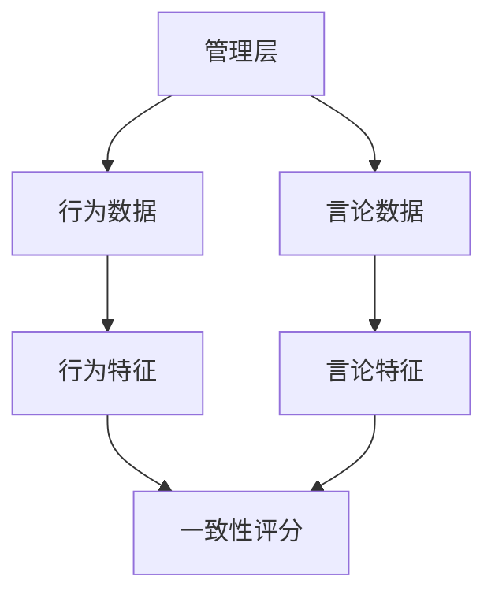
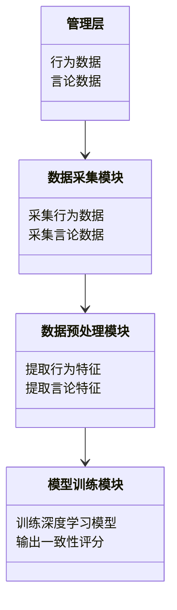
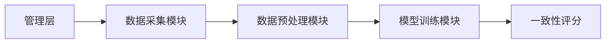
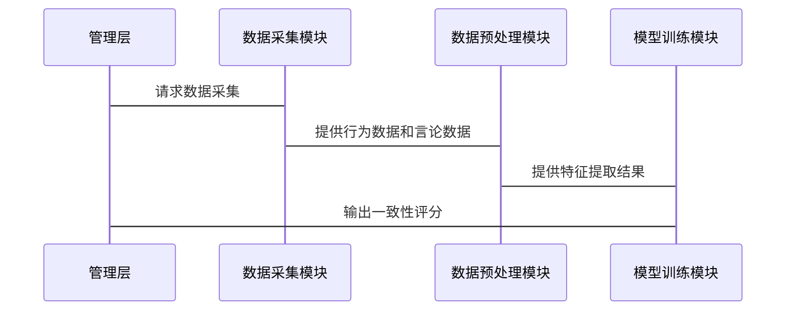

                 


# 深度学习分析管理层言行一致性

## 关键词：深度学习、管理层、言行一致性、自然语言处理、行为分析、管理优化

## 摘要：本文通过深度学习技术，分析管理层的言行一致性，探讨如何利用自然语言处理和行为数据分析的方法，建立数学模型，提取行为和言论特征，计算一致性评分，优化管理决策。文章从背景介绍、核心概念、算法原理、系统架构到项目实战，层层递进，详细阐述了深度学习在管理分析中的应用，旨在为企业管理优化提供新的思路和技术支持。

---

# 第一部分: 深度学习分析管理层言行一致性概述

## 第1章: 背景介绍

### 1.1 问题背景

#### 1.1.1 管理层言行一致性的定义

管理层言行一致性是指管理层在言论和行为上保持一致的能力。具体来说，是指管理层在做出决策时，其言论和实际行为是否一致，是否能够兑现承诺，是否能够在复杂环境中保持言行一致。

#### 1.1.2 管理层言行不一致对企业的影响

- 降低员工信任度
- 影响团队士气
- 影响企业决策的稳定性
- 削弱企业的执行力

#### 1.1.3 深度学习技术在管理分析中的应用潜力

- 自然语言处理（NLP）技术可以分析管理层的言论
- 行为数据挖掘技术可以分析管理层的行为
- 深度学习模型可以建立复杂的数学模型，分析言论和行为之间的关系

### 1.2 问题描述

#### 1.2.1 管理层言行一致性问题的复杂性

- 管理层的言论和行为受到多种因素影响，例如外部环境、内部政策、个人性格等
- 行为和言论的数据类型多样，难以统一处理
- 行为和言论的关联性较弱，难以找到明确的因果关系

#### 1.2.2 深度学习技术在管理分析中的优势

- 深度学习技术可以处理非结构化数据，例如文本和行为数据
- 深度学习模型可以自动提取特征，减少人工干预
- 深度学习技术可以处理高维数据，建立复杂的数学模型

#### 1.2.3 当前管理分析中的技术瓶颈

- 数据采集困难
- 数据处理复杂
- 模型解释性差

### 1.3 问题解决思路

#### 1.3.1 深度学习技术的核心优势

- 数据驱动
- 自动学习
- 高维建模

#### 1.3.2 数据驱动的管理分析方法

- 数据采集
- 数据预处理
- 数据建模
- 数据可视化

#### 1.3.3 结合管理学理论的深度学习模型设计

- 管理学理论指导模型设计
- 深度学习技术实现模型优化

### 1.4 边界与外延

#### 1.4.1 管理层言行一致性的边界条件

- 数据范围
- 时间范围
- 人员范围

#### 1.4.2 深度学习技术的适用范围

- 数据类型
- 数据量
- 数据质量

#### 1.4.3 行为与言论数据的采集与处理

- 数据采集方式
- 数据预处理方法
- 数据存储方式

### 1.5 核心概念与联系

#### 1.5.1 核心概念的定义与属性特征对比

| 概念 | 定义 | 属性特征 |
|------|------|----------|
| 管理层 | 企业的决策者 | 权力、责任、影响力 |
| 行为数据 | 管理层的行动记录 | 具体性、可测量性 |
| 言论数据 | 管理层的言论记录 | 可解释性、可量化性 |
| 行为特征 | 行为数据的特征 | 时间性、空间性、关联性 |
| 言论特征 | 言论数据的特征 | 语义性、情感性、逻辑性 |

#### 1.5.2 ER实体关系图架构



---

## 第2章: 核心概念与联系

### 2.1 深度学习模型原理

#### 2.1.1 神经网络的基本原理

神经网络是一种模仿人脑结构和功能的数学模型，由多个层次的神经元组成，通过权重和激活函数进行信息处理。

#### 2.1.2 RNN、LSTM、BERT等模型的优缺点对比

| 模型 | 优点 | 缺点 |
|------|------|------|
| RNN | 处理序列数据能力强 | 长期依赖问题 |
| LSTM | 解决了RNN的长期依赖问题 | 复杂性较高 |
| BERT | 预训练效果好 | 需要大量数据 |

#### 2.1.3 深度学习模型的可解释性问题

- 模型的黑箱特性
- 解释性差
- 可解释性提升方法

### 2.2 管理层言行一致性分析的数学模型

#### 2.2.1 行为与言论数据的特征提取

- 行为数据的特征提取方法
- 言论数据的特征提取方法
- 行为和言论数据的特征融合方法

#### 2.2.2 基于深度学习的相似度计算公式

$$\text{一致性评分} = f(\text{行为特征}, \text{言论特征})$$

其中，\( f \) 是深度学习模型，用于计算行为特征和言论特征之间的相似度。

#### 2.2.3 模型训练与优化的数学表达

$$\text{损失函数} = \text{交叉熵损失函数}$$

$$\text{优化目标} = \min \text{损失函数}$$

---

## 第3章: 算法原理讲解

### 3.1 RNN与LSTM模型

#### 3.1.1 RNN模型的工作原理

- RNN的结构
- RNN的前向传播
- RNN的反向传播

#### 3.1.2 LSTM模型的结构与优势

- LSTM的门控机制
- LSTM的遗忘门
- LSTM的输入门
- LSTM的输出门

#### 3.1.3 模型的训练与优化

- 模型训练的步骤
- 模型优化的方法
- 模型调参的技巧

### 3.2 BERT模型的适用性分析

#### 3.2.1 BERT模型的基本原理

- BERT的预训练目标
- BERT的训练流程
- BERT的模型结构

#### 3.2.2 BERT模型在管理分析中的应用

- BERT在文本分类中的应用
- BERT在情感分析中的应用
- BERT在意图识别中的应用

#### 3.2.3 模型的调参

- 参数调整的方法
- 超参数优化的技巧
- 模型评估的指标

---

## 第4章: 系统分析与架构设计方案

### 4.1 问题场景介绍

- 系统目标
- 系统功能
- 系统边界

### 4.2 系统功能设计

- 数据采集模块
- 数据预处理模块
- 模型训练模块
- 模型评估模块

### 4.3 系统架构设计

#### 4.3.1 领域模型mermaid类图



#### 4.3.2 系统架构图



#### 4.3.3 系统接口设计

- 接口1：数据采集接口
- 接口2：数据预处理接口
- 接口3：模型训练接口
- 接口4：一致性评分输出接口

#### 4.3.4 系统交互mermaid序列图



---

## 第5章: 项目实战

### 5.1 环境安装

- 安装Python
- 安装深度学习框架（如TensorFlow、Keras）
- 安装NLP处理库（如NLTK、spaCy）
- 安装可视化工具（如Matplotlib、Seaborn）

### 5.2 系统核心实现源代码

```python
import tensorflow as tf
from tensorflow.keras import layers

# 定义LSTM模型
def lstm_model():
    model = tf.keras.Sequential()
    model.add(layers.Embedding(input_dim=10000, output_dim=64))
    model.add(layers.LSTM(64, return_sequences=True))
    model.add(layers.LSTM(32))
    model.add(layers.Dense(1, activation='sigmoid'))
    return model

# 定义训练数据
# ...

# 编译模型
model = lstm_model()
model.compile(loss='binary_crossentropy', optimizer='adam', metrics=['accuracy'])

# 训练模型
model.fit(x_train, y_train, epochs=10, batch_size=32)
```

### 5.3 案例分析与详细解读

- 数据采集与处理
- 模型训练与优化
- 模型评估与分析

### 5.4 项目总结

- 项目成果
- 经验总结
- 改进建议

---

## 第6章: 最佳实践

### 6.1 小结

- 项目回顾
- 技术总结

### 6.2 注意事项

- 数据质量的重要性
- 模型调参的注意事项
- 模型的可解释性问题

### 6.3 拓展阅读

- 深度学习经典论文
- 管理学相关书籍
- 行为分析技术资料

---

## 作者：AI天才研究院/AI Genius Institute & 禅与计算机程序设计艺术 /Zen And The Art of Computer Programming

