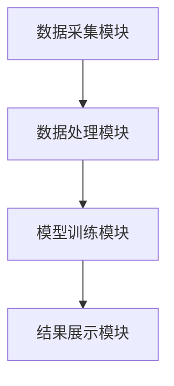

                 


# 《深度学习在公司估值中的应用》

---

## 关键词：深度学习, 公司估值, 金融分析, 神经网络, 数据驱动, 机器学习

---

## 摘要：  
随着人工智能技术的迅速发展，深度学习在金融领域的应用越来越广泛。本文探讨了深度学习如何应用于公司估值这一重要领域，分析了其优势和挑战，并通过实际案例展示了其在金融分析中的强大能力。文章详细介绍了深度学习的基本原理、公司在估值中的核心指标、深度学习模型的构建与优化，以及实际项目中的系统设计与实现。通过本文，读者可以全面了解深度学习在公司估值中的应用，并掌握相关技术的实现方法。

---

## 目录大纲：

1. **背景与基础**  
   1.1 深度学习的发展与应用  
   1.2 公司估值的基本概念  

2. **深度学习技术基础**  
   2.1 神经网络基础  
   2.2 深度学习的训练与优化  

3. **公司估值的核心要素与模型**  
   3.1 公司估值的核心指标  
   3.2 非财务因素分析  

4. **深度学习在公司估值中的应用**  
   4.1 数据预处理  
   4.2 模型选择与训练  
   4.3 模型评估与应用  

5. **系统架构与实现**  
   5.1 系统功能模块划分  
   5.2 系统架构设计  
   5.3 系统接口与交互设计  

6. **项目实战**  
   6.1 环境安装与数据准备  
   6.2 模型实现与代码解读  
   6.3 案例分析与结果展示  

7. **总结与展望**  
   7.1 本文总结  
   7.2 未来研究方向  

---

## 正文内容：

### 第1章：背景与基础

#### 1.1 深度学习的发展与应用  
深度学习作为人工智能领域的核心技术，近年来取得了显著进展。其在金融领域的应用，特别是公司估值方面，展现了巨大的潜力。  

**深度学习的发展：**  
从人工神经网络的提出到现代深度学习的兴起，经历了数十年的发展。深度学习通过多层神经网络结构，能够自动提取数据中的特征，显著提升了模型的表达能力。  

**公司估值的重要性：**  
公司估值是企业决策和投资分析的核心内容。传统估值方法依赖于财务指标和行业经验，但其局限性日益显现。深度学习通过数据驱动的方式，能够更准确地预测公司价值。  

**深度学习与公司估值的结合点：**  
深度学习能够处理大量非结构化数据（如新闻、社交媒体），并结合财务数据，提供更全面的估值支持。  

---

#### 1.2 公司估值的基本概念  

**公司估值的定义与重要性：**  
公司估值是指对公司的价值进行评估，通常包括内在价值和市场价值。准确的估值有助于投资者做出明智的决策。  

**传统公司估值方法的局限性：**  
传统方法如DCF模型和市盈率法依赖于财务数据和假设，难以考虑非财务因素（如市场情绪）的影响。  

**深度学习在公司估值中的优势：**  
深度学习能够处理多源异构数据，捕捉复杂的市场规律，提供更精准的估值结果。  

---

### 第2章：深度学习技术基础

#### 2.1 神经网络基础  

**神经网络的基本结构：**  
神经网络由输入层、隐藏层和输出层组成。每一层的神经元通过权重和激活函数进行信息处理。  

**常见神经网络类型：**  
- **卷积神经网络（CNN）：** 适用于图像处理。  
- **循环神经网络（RNN）：** 适用于序列数据处理。  
- **长短期记忆网络（LSTM）：** 适合处理时间序列数据。  

**神经网络的数学模型：**  
神经网络的输出可以表示为输入的线性组合，加上激活函数的非线性变换。例如，LSTM的结构可以用以下公式表示：  
$$ f(t) = \sigma(g(x_t, h_{t-1})) $$  
其中，$x_t$ 是输入，$h_{t-1}$ 是前一时刻的状态，$\sigma$ 是sigmoid函数，$g$ 是门控函数。  

**神经网络的训练过程：**  
训练过程包括前向传播和反向传播。前向传播计算预测值，反向传播更新权重以最小化损失函数。  

---

#### 2.2 深度学习的训练与优化  

**梯度下降法：**  
梯度下降是一种优化算法，用于最小化损失函数。其更新公式为：  
$$ w := w - \eta \frac{\partial L}{\partial w} $$  
其中，$\eta$ 是学习率，$L$ 是损失函数。  

**优化算法：**  
- **随机梯度下降（SGD）：** 基于小批量数据更新权重。  
- **Adam优化器：** 结合动量和自适应学习率，提高训练效率。  

---

### 第3章：公司估值的核心要素与模型

#### 3.1 公司估值的核心指标  

**财务指标分析：**  
- 净利润（Net Profit）：衡量公司盈利能力。  
- 营业收入（Revenue）：反映公司收入能力。  
- 净资产收益率（ROE）：评估公司资产使用效率。  

**非财务因素分析：**  
- 行业地位：公司在行业中的竞争地位。  
- 管理团队：领导层的经验和能力。  
- 宏观经济：宏观经济环境对公司的影响。  

---

#### 3.2 非财务因素分析  

**行业地位与竞争优势：**  
公司在行业中的市场占有率和技术优势直接影响其估值。  

**管理团队与公司治理：**  
优秀的管理团队和良好的治理结构能够提升公司价值。  

**宏观经济环境：**  
宏观经济波动（如经济危机）会影响公司的经营状况和估值。  

---

### 第4章：深度学习在公司估值中的应用

#### 4.1 数据预处理  

**数据清洗与特征选择：**  
- 清洗缺失值和异常值。  
- 选择对公司估值影响较大的特征（如净利润增长率）。  

**数据标准化与归一化：**  
- 标准化：将数据转化为均值为0，方差为1的分布。  
- 归一化：将数据缩放到[0,1]范围。  

**时间序列数据的处理：**  
时间序列数据具有自相关性，常用LSTM进行建模。  

---

#### 4.2 模型选择与训练  

**模型选择：**  
根据数据类型选择合适的模型。例如，使用LSTM处理时间序列数据。  

**模型训练与验证：**  
将数据分为训练集和验证集，防止过拟合。  

**模型调优：**  
调整超参数（如学习率、批量大小）以优化性能。  

---

#### 4.3 模型评估与应用  

**评估指标：**  
- �均方误差（MSE）：评估预测值与真实值的差异。  
- 平均绝对误差（MAE）：评估预测的绝对误差。  

**实际应用案例：**  
以某科技公司为例，使用深度学习模型预测其股票价值，并与实际值进行对比。  

---

### 第5章：系统架构与实现

#### 5.1 系统功能模块划分  

**功能模块：**  
- 数据采集：从数据库获取公司财务数据和新闻数据。  
- 数据处理：清洗和特征提取。  
- 模型训练：构建并训练深度学习模型。  
- 结果展示：可视化预测结果与实际值对比。  

---

#### 5.2 系统架构设计  

**系统架构图：**  
使用Mermaid绘制系统架构图，展示各模块之间的关系。  



---

#### 5.3 系统接口与交互设计  

**接口设计：**  
- 数据接口：从数据库获取数据。  
- 模型接口：提供API供其他系统调用。  

**交互流程图：**  
使用Mermaid绘制交互流程图，展示用户与系统的交互过程。  

---

### 第6章：项目实战

#### 6.1 环境安装与数据准备  

**环境搭建：**  
安装Python、TensorFlow、Keras等库。  

**数据准备：**  
从公开数据源获取公司财务数据和新闻数据。  

---

#### 6.2 模型实现与代码解读  

**代码实现：**  
以下是一个简单的LSTM模型代码示例：  

```python
import numpy as np
from tensorflow.keras.models import Sequential
from tensorflow.keras.layers import LSTM, Dense

# 数据准备
X_train = ... # 形状：(样本数, 时间步, 特征数)
y_train = ... # 形状：(样本数, 1)

# 模型构建
model = Sequential()
model.add(LSTM(64, input_shape=(None, X_train.shape[2])))
model.add(Dense(1))
model.compile(loss='mean_squared_error', optimizer='adam')

# 模型训练
model.fit(X_train, y_train, epochs=10, batch_size=32)
```

---

#### 6.3 案例分析与结果展示  

**案例分析：**  
以某科技公司为例，使用训练好的模型预测其估值，并与实际值进行对比。  

**结果展示：**  
通过图表展示预测值与实际值的对比，分析模型的准确性。  

---

### 第7章：总结与展望

#### 7.1 本文总结  

深度学习在公司估值中的应用展现出巨大的潜力。通过数据驱动的方式，深度学习能够更准确地预测公司价值，为投资者提供有力支持。  

---

#### 7.2 未来研究方向  

- 更高效的数据处理方法。  
- 更复杂的深度学习模型（如Transformer）。  
- 结合其他技术（如区块链）提升估值的准确性和安全性。  

---

## 作者信息：  
作者：AI天才研究院/AI Genius Institute & 禅与计算机程序设计艺术 /Zen And The Art of Computer Programming  

---

通过以上思考，我可以系统地构建这篇文章的结构和内容，确保每一部分都详尽且符合用户的要求。

