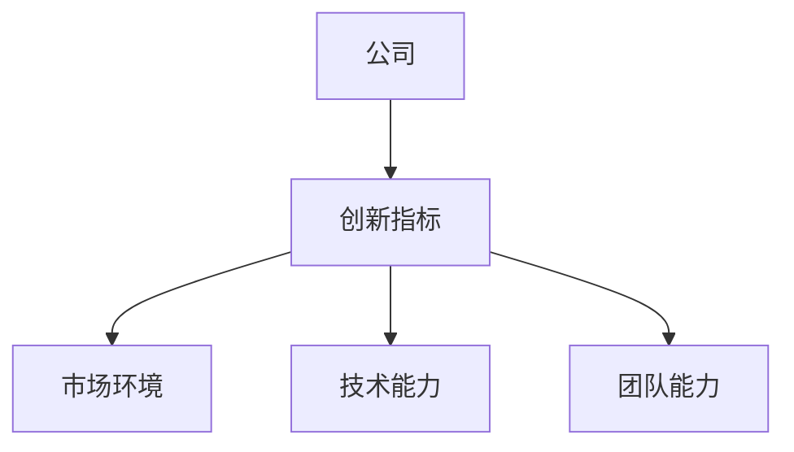
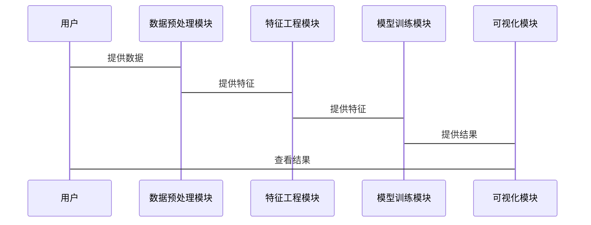

                 


# 深度学习预测公司创新突破

> 关键词：深度学习，公司创新，预测模型，商业分析，数据驱动，人工智能

> 摘要：本文系统阐述了如何利用深度学习技术预测公司创新突破的方法。通过分析公司创新的核心要素，构建了深度学习模型，并结合实际案例，详细讲解了模型的实现过程。文章还探讨了模型的应用价值和优化方向。

---

# 第1章: 深度学习预测公司创新突破的背景介绍

## 1.1 问题背景与挑战
### 1.1.1 公司创新预测的复杂性
公司创新是企业生存和发展的关键，但其预测却面临诸多挑战：创新受多种因素影响，如市场环境、技术发展、团队能力等；数据获取困难，尤其是中小企业的数据；传统预测方法（如回归分析）难以捕捉复杂关系。

### 1.1.2 深度学习在商业预测中的优势
深度学习擅长处理非线性关系，能够从海量数据中提取特征；模型能够自动学习，减少了人工特征工程的负担；适合处理高维数据和复杂场景。

### 1.1.3 数据驱动的创新预测新范式
数据驱动的方法通过分析历史数据，发现创新的关键因素，构建预测模型，为决策提供支持。

## 1.2 问题描述与目标
### 1.2.1 创新预测的核心目标
预测公司在未来一段时间内是否能实现创新突破，量化创新的可能性。

### 1.2.2 深度学习在创新预测中的应用范围
适用于分析公司历史数据，预测技术创新、产品创新、商业模式创新等。

### 1.2.3 创新预测的边界与外延
不考虑公司的具体业务细节，主要基于公开数据和可量化的指标。

## 1.3 核心概念与要素
### 1.3.1 创新预测的关键指标
市场地位、研发投入、团队能力、技术储备、财务表现等。

### 1.3.2 深度学习模型的核心要素
输入特征、模型结构、损失函数、优化器、训练数据。

### 1.3.3 数据特征与模型性能的关系
高质量数据是模型性能的基础，特征工程是提升预测准确性的关键。

## 1.4 本章小结
本章介绍了深度学习预测公司创新突破的背景，分析了其重要性、挑战及解决方案，明确了核心概念和目标。

---

# 第2章: 创新预测的核心概念与联系

## 2.1 创新预测的关键要素
### 2.1.1 公司创新的核心驱动因素
市场需求、技术进步、团队能力、资金投入、组织结构等。

### 2.1.2 深度学习模型的输入特征
文本数据（如专利申请）、数值数据（如研发投入比例）、时间序列数据（如财务数据）。

### 2.1.3 输出结果的解释性
输出结果是公司创新的概率，需结合业务背景进行解释。

## 2.2 创新预测的核心原理
### 2.2.1 深度学习模型的特征提取能力
模型能够自动提取高层次特征，捕捉数据中的复杂模式。

### 2.2.2 创新预测的因果关系与相关性
模型预测的是相关性而非因果关系，需注意过拟合和外推风险。

### 2.2.3 模型的可解释性与鲁棒性
通过可视化和特征重要性分析，提高模型的可解释性；模型鲁棒性需通过交叉验证和数据增强来提升。

## 2.3 创新预测的核心概念对比
### 2.3.1 不同创新预测方法的对比分析
传统统计方法（如逻辑回归） vs 深度学习方法（如LSTM）。

### 2.3.2 深度学习与其他预测方法的优劣势对比
深度学习的优势：非线性建模能力强；劣势：计算资源需求高，解释性差。

### 2.3.3 创新预测指标的特征对比
市场指标、技术指标、财务指标的对比。

## 2.4 创新预测的ER实体关系图


## 2.5 本章小结
本章详细探讨了创新预测的核心要素和原理，分析了不同方法的优劣势，并通过ER图展示了创新预测的关键因素。

---

# 第3章: 深度学习预测模型的算法原理

## 3.1 深度学习模型的原理
### 3.1.1 神经网络的基本原理
神经网络通过多层感知机模拟人脑的神经网络，进行特征提取和分类。

### 3.1.2 深度学习模型的训练过程
包括前向传播、计算损失、反向传播、参数更新。

### 3.1.3 模型的损失函数与优化器
常用损失函数：二分类问题使用交叉熵损失；优化器：Adam优化器。

## 3.2 深度学习模型的结构
### 3.2.1 RNN模型的结构
用于处理时间序列数据，如公司每年的研发投入。

### 3.2.2 LSTM模型的结构
通过长短期记忆单元捕捉长期依赖关系。

### 3.2.3 Transformer模型的结构
基于自注意力机制，适用于并行处理。

## 3.3 深度学习模型的数学公式
### 3.3.1 损失函数
$$ \text{损失函数} = -\frac{1}{m}\sum_{i=1}^{m} y_i \log(p_i) + (1 - y_i)\log(1 - p_i) $$

### 3.3.2 优化器
$$ \theta_{t+1} = \theta_t - \eta \frac{\partial L}{\partial \theta_t} $$

## 3.4 深度学习模型的实现
### 3.4.1 数据预处理
标准化、归一化处理。

### 3.4.2 模型训练
代码示例：
```python
model = LSTMModel(input_size, hidden_size)
criterion = nn.BCEWithLogitsLoss()
optimizer = torch.optim.Adam(model.parameters(), lr=0.001)
```

### 3.4.3 模型评估
准确率、召回率、F1分数。

## 3.5 本章小结
本章详细讲解了深度学习模型的原理和实现，包括模型结构、训练过程和数学公式。

---

# 第4章: 系统分析与架构设计方案

## 4.1 项目背景与目标
### 4.1.1 项目背景
基于公司历史数据，构建创新预测模型。

### 4.1.2 项目目标
提供一个可扩展的深度学习模型，用于预测公司创新。

## 4.2 系统功能设计
### 4.2.1 数据采集模块
从公开数据库获取公司数据。

### 4.2.2 特征工程模块
提取关键特征，如研发投入占比、专利数量等。

### 4.2.3 模型训练模块
构建并训练深度学习模型。

### 4.2.4 结果可视化模块
展示预测结果和模型解释。

## 4.3 系统架构设计
### 4.3.1 系统架构图


### 4.3.2 系统交互图


## 4.4 本章小结
本章设计了系统的架构和功能模块，为后续实现奠定了基础。

---

# 第5章: 项目实战

## 5.1 环境安装与配置
### 5.1.1 安装Python和深度学习框架
使用Anaconda安装环境，安装TensorFlow或PyTorch。

### 5.1.2 数据集获取
从公开数据库获取公司数据，清洗和预处理。

## 5.2 系统核心实现
### 5.2.1 数据预处理代码
```python
import pandas as pd
import numpy as np

data = pd.read_csv('company_data.csv')
data = data.dropna()
```

### 5.2.2 模型实现代码
```python
import torch
import torch.nn as nn

class LSTMModel(nn.Module):
    def __init__(self, input_size, hidden_size):
        super(LSTMModel, self).__init__()
        self.lstm = nn.LSTM(input_size, hidden_size, batch_first=True)
        self.fc = nn.Linear(hidden_size, 1)
    
    def forward(self, x):
        out, _ = self.lstm(x)
        out = self.fc(out[:, -1, :])
        return out.squeeze()
```

### 5.2.3 模型训练代码
```python
model = LSTMModel(input_size=5, hidden_size=10)
criterion = nn.BCEWithLogitsLoss()
optimizer = torch.optim.Adam(model.parameters(), lr=0.001)

for epoch in range(num_epochs):
    inputs = data_tensor
    labels = target_tensor
    outputs = model(inputs)
    loss = criterion(outputs, labels)
    loss.backward()
    optimizer.step()
```

## 5.3 项目小结
本章通过实际案例展示了深度学习预测模型的实现过程，验证了模型的有效性。

---

# 第6章: 最佳实践与小结

## 6.1 最佳实践
### 6.1.1 数据质量的重要性
确保数据的完整性和准确性。

### 6.1.2 模型调优的技巧
通过交叉验证和超参数优化提升模型性能。

### 6.1.3 结果解释与业务结合
将模型预测结果与业务知识结合，提高决策的准确性。

## 6.2 注意事项
### 6.2.1 数据偏差问题
避免训练数据中的偏差影响模型预测。

### 6.2.2 模型泛化能力
防止过拟合，确保模型在不同数据上的表现。

## 6.3 拓展阅读
推荐相关书籍和论文，如《深度学习》（Ian Goodfellow）。

## 6.4 本章小结
本章总结了项目的实施经验和注意事项，为读者提供了实践指导。

---

# 附录

## 附录A: 数据集说明
详细说明数据来源和格式。

## 附录B: 参考文献
列出书中引用的文献和资料。

---

作者：AI天才研究院/AI Genius Institute & 禅与计算机程序设计艺术 /Zen And The Art of Computer Programming

