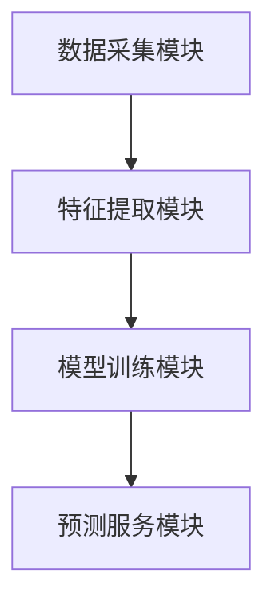
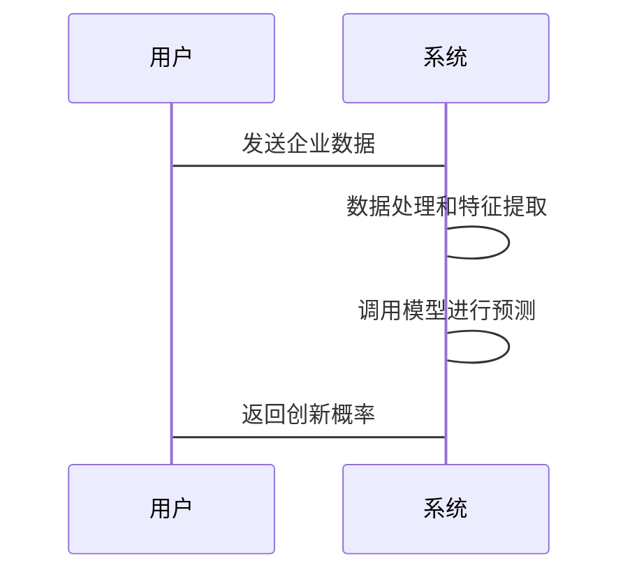

                 


# 深度学习预测公司创新突破概率

---

## 关键词：深度学习，创新预测，概率模型，企业创新，技术分析

---

## 摘要：  
本文探讨了如何利用深度学习技术预测公司创新突破的概率。通过分析企业的历史数据和创新特征，结合深度学习模型（如LSTM、BERT等）的强大学习能力，构建概率预测模型。文章从背景、核心概念、算法原理、系统架构到项目实战，详细介绍了实现这一目标的全过程，为读者提供理论与实践相结合的深度解析。

---

# 第1章: 深度学习与企业创新预测概述

## 1.1 深度学习的背景与应用
### 1.1.1 深度学习的定义与发展  
深度学习（Deep Learning）是人工智能（AI）的一个分支，通过多层神经网络模拟人脑的神经网络，以实现对数据的高层次抽象和特征提取。近年来，深度学习在图像识别、自然语言处理等领域取得了突破性进展。

### 1.1.2 深度学习在企业分析中的应用  
在企业分析中，深度学习可以用于预测企业业绩、风险评估、市场趋势分析等。创新预测是其中的重要方向，旨在通过分析企业的历史创新表现、研发投入、团队能力等因素，预测其未来是否可能实现创新突破。

### 1.1.3 企业创新预测的核心问题  
企业创新预测的核心问题是：如何量化企业的创新能力，并将其转化为可预测的概率值。深度学习通过处理非结构化数据（如文本、图像）的能力，为这一问题提供了新的解决方案。

---

## 1.2 企业创新突破的概率预测
### 1.2.1 创新突破的定义与特征  
创新突破指的是企业在产品、技术、商业模式等方面实现重大创新的能力。其特征包括创新能力、研发投入、团队素质、市场环境等。

### 1.2.2 概率预测的核心问题  
概率预测的目标是将企业创新突破的可能性转化为一个概率值（0到1之间）。通过深度学习模型，我们可以基于企业的历史数据，预测其在未来一定时间内实现创新突破的概率。

### 1.2.3 深度学习在概率预测中的优势  
深度学习能够处理高维、非线性的数据关系，适合处理企业创新预测中复杂的因果关系。

---

## 1.3 本文的核心目标与结构  
本文的核心目标是构建一个基于深度学习的企业创新突破概率预测模型。文章结构包括：  
- 背景介绍  
- 核心概念与理论基础  
- 深度学习模型的算法原理  
- 系统架构设计  
- 项目实战与案例分析  

---

# 第2章: 创新突破概率预测的核心概念与理论基础

## 2.1 创新突破的概率模型  
### 2.1.1 概率预测的基本概念  
概率预测是将企业的创新可能性转化为一个概率值。例如，我们可以预测某企业在未来一年内实现创新突破的概率为70%。

### 2.1.2 创新突破的概率模型构建  
模型构建的核心是将企业数据（如研发投入、专利数量、团队规模等）输入模型，输出创新突破的概率。

### 2.1.3 深度学习在概率预测中的应用  
深度学习模型（如LSTM、BERT）适合处理时间序列数据和文本数据，能够捕捉企业的动态变化。

---

## 2.2 深度学习模型的核心原理  
### 2.2.1 神经网络的基本原理  
神经网络通过多层非线性变换，将输入数据映射到输出结果。深度学习通过增加网络深度，进一步提升模型的表达能力。

### 2.2.2 深度学习模型的特征提取能力  
深度学习模型能够自动提取数据的高层次特征，无需手动设计特征。

### 2.2.3 概率预测的数学基础  
概率预测基于贝叶斯定理，结合深度学习模型的输出，计算企业的创新概率。

---

## 2.3 创新因素与数据特征分析  
### 2.3.1 创新因素的分类与特征  
创新因素包括技术能力、研发投入、团队素质、市场环境等。每个因素都有其独特的特征和权重。

### 2.3.2 数据特征的提取与处理  
需要将企业的文本数据（如专利描述）和结构化数据（如研发投入）进行预处理，提取有用的特征。

### 2.3.3 创新突破概率的影响因素分析  
通过分析历史数据，确定哪些因素对创新概率的影响最大。

---

## 2.4 本章小结  
本章介绍了创新突破概率预测的核心概念和理论基础，为后续的模型构建奠定了基础。

---

# 第3章: 深度学习模型的算法原理

## 3.1 常见深度学习模型概述  
### 3.1.1 RNN与LSTM网络  
RNN（循环神经网络）适合处理时间序列数据。LSTM（长短期记忆网络）通过引入记忆单元，解决了RNN的梯度消失问题。

### 3.1.2 Transformer模型  
Transformer模型通过自注意力机制，能够捕捉数据中的全局关系，适合处理长文本数据。

### 3.1.3 BERT模型及其变体  
BERT模型通过预训练和微调，能够处理多种任务，适合文本数据的特征提取。

---

## 3.2 概率预测的数学模型  
### 3.2.1 概率分布的基本概念  
概率分布描述了随机变量可能取值及其概率。在创新预测中，我们可以使用贝叶斯分布来建模。

### 3.2.2 深度学习中的概率建模  
通过深度学习模型，我们可以学习数据的分布，并输出创新概率。

### 3.2.3 概率预测的损失函数  
常用的损失函数包括二元交叉熵损失函数（Binary Cross-Entropy Loss）。

---

## 3.3 深度学习模型的训练与优化  
### 3.3.1 模型训练的基本流程  
包括数据预处理、模型初始化、前向传播、损失计算、反向传播和参数更新。

### 3.3.2 模型调优与超参数优化  
通过调整学习率、批量大小等超参数，优化模型性能。

### 3.3.3 模型评估与验证  
使用验证集评估模型性能，避免过拟合。

---

## 3.4 案例分析: 使用LSTM进行时间序列预测  
### 3.4.1 LSTM网络的结构与特点  
LSTM通过记忆单元（Cell）和 gates（输入门、遗忘门、输出门）实现对时间序列数据的建模。

### 3.4.2 LSTM在创新预测中的应用  
假设我们有一家企业的专利申请数量时间序列数据，我们可以使用LSTM模型预测其未来的创新概率。

---

## 3.5 本章小结  
本章详细介绍了深度学习模型的算法原理，并通过案例分析展示了如何使用LSTM进行创新概率预测。

---

# 第4章: 系统架构设计

## 4.1 问题场景介绍  
我们构建一个企业创新概率预测系统，输入企业的历史数据，输出创新概率。

## 4.2 系统功能设计  
### 4.2.1 数据采集模块  
从企业数据库中采集企业数据，包括研发投入、专利数量、团队规模等。

### 4.2.2 特征提取模块  
对文本数据（如专利描述）进行特征提取，生成向量表示。

### 4.2.3 模型训练模块  
使用深度学习模型对特征数据进行训练，生成创新概率预测模型。

### 4.2.4 预测服务模块  
提供API接口，接收企业数据，返回创新概率。

---

## 4.3 系统架构设计  
### 4.3.1 系统架构图  


### 4.3.2 系统接口设计  
预测服务模块提供一个REST接口：  
`POST /predict`  
输入：企业数据  
输出：创新概率

### 4.3.3 系统交互流程图  


---

## 4.4 本章小结  
本章介绍了系统架构设计，包括功能模块、架构图和交互流程图。

---

# 第5章: 项目实战

## 5.1 环境安装与数据准备  
### 5.1.1 安装深度学习框架  
使用TensorFlow或PyTorch框架。

### 5.1.2 数据集获取  
从企业数据库中获取企业的历史数据。

---

## 5.2 系统核心实现  
### 5.2.1 特征提取代码  
```python
import tensorflow as tf
from tensorflow.keras import layers

def feature_extractor(text_data):
    # 文本预处理
    text_data = text_data.lower()
    # 使用BERT模型提取特征
    model = tf.keras.Model(inputs=model.input, outputs=model.layers[-2].output)
    features = model.predict(text_data)
    return features
```

### 5.2.2 模型训练代码  
```python
from tensorflow.keras import layers

def build_model(input_shape):
    model = tf.keras.Sequential()
    model.add(layers.LSTM(64, return_sequences=True, input_shape=input_shape))
    model.add(layers.LSTM(32, return_sequences=False))
    model.add(layers.Dense(1, activation='sigmoid'))
    model.compile(loss='binary_crossentropy', optimizer='adam', metrics=['accuracy'])
    return model
```

---

## 5.3 案例分析与结果解读  
假设我们训练了一个LSTM模型，输入企业的专利数据，预测其创新概率。

---

## 5.4 本章小结  
本章通过项目实战，详细介绍了系统的实现过程，包括环境安装、数据准备、特征提取和模型训练。

---

# 第6章: 最佳实践与注意事项

## 6.1 项目总结  
通过本项目，我们展示了如何利用深度学习技术预测企业创新突破的概率。

## 6.2 最佳实践 tips  
- 数据预处理是关键，尤其是文本数据的处理。  
- 模型选择要根据数据类型和任务需求。  
- 需要定期更新模型，以适应数据的变化。

## 6.3 小结  
本文从理论到实践，详细介绍了如何利用深度学习预测企业创新突破的概率。

## 6.4 注意事项  
- 数据隐私和安全问题需要重视。  
- 模型的解释性需要进一步提高。

---

## 6.5 拓展阅读  
推荐阅读《Deep Learning》（Ian Goodfellow等著）和《Python深度学习》（ Aurélien Géron 著）。

---

# 作者：AI天才研究院 & 禅与计算机程序设计艺术

---

本文通过系统的理论分析和实践指导，帮助读者理解如何利用深度学习技术预测企业创新突破的概率。从背景介绍到系统实现，再到项目实战，本文为读者提供了全面的知识体系和实践指南。

