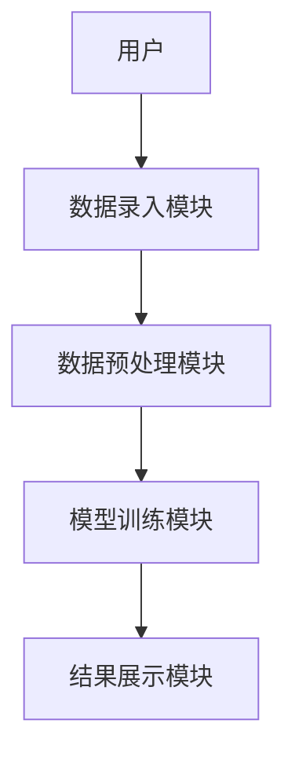
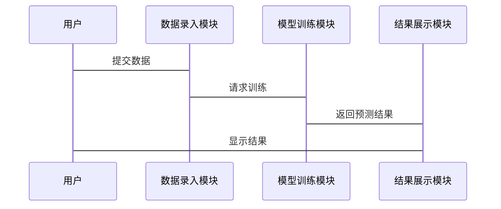

                 


# 深度学习预测公司战略转型成功率

> 关键词：深度学习，战略转型，预测模型，企业成功，机器学习

> 摘要：本文探讨了如何利用深度学习技术预测公司战略转型的成功率。通过分析战略转型的核心要素、构建深度学习模型以及系统设计，本文详细讲解了从数据收集到模型实现的全过程，并通过实际案例展示了模型的应用。

---

# 第一部分: 公司战略转型与深度学习预测的背景介绍

## 第1章: 战略转型的成功率问题背景

### 1.1 战略转型的定义与核心要素

#### 1.1.1 战略转型的定义
战略转型是指企业在面对内外部环境变化时，对现有商业模式、组织结构、业务流程等进行重大调整的过程。这种转型旨在提升企业的竞争力和适应能力。

#### 1.1.2 战略转型的核心要素
战略转型的成功通常取决于以下几个核心要素：
- **企业愿景与目标**：明确的转型目标是成功的基石。
- **领导力**：高层管理者对转型的支持和推动。
- **员工参与度**：员工对转型的认可和参与。
- **资源分配**：包括资金、技术和人力资源的合理配置。
- **外部环境**：包括行业趋势、政策法规和市场需求。

#### 1.1.3 战略转型的边界与外延
战略转型不仅涉及企业内部的调整，还包括与外部合作伙伴、客户和供应商的关系重构。其外延涵盖了从战略制定、执行到评估的整个生命周期。

### 1.2 深度学习在战略转型中的应用背景

#### 1.2.1 深度学习的定义与特点
深度学习是一种人工智能技术，通过多层神经网络模拟人脑的学习方式，能够从大量数据中提取复杂的特征和模式。其特点是数据驱动、非线性建模和自动特征提取。

#### 1.2.2 深度学习在企业预测中的优势
深度学习在企业预测中具有以下优势：
- **非线性关系捕捉**：能够发现传统统计方法难以捕捉的复杂关系。
- **自动特征工程**：通过多层网络自动提取特征，减少人工干预。
- **高维度数据处理**：适用于高维数据，如文本、图像和时间序列数据。

#### 1.2.3 战略转型成功率预测的可行性分析
战略转型成功率的预测需要综合考虑多种因素，深度学习的非线性建模能力使其成为这一问题的理想选择。通过对历史数据的分析，深度学习模型可以识别成功转型的关键特征，从而为企业提供决策支持。

---

## 第2章: 战略转型成功率预测的理论框架

### 2.1 战略转型成功率的影响因素

#### 2.1.1 企业内部因素
- **组织结构**：扁平化组织更容易适应变化。
- **员工能力**：员工的技能和知识储备影响转型效果。
- **文化因素**：企业文化是否支持创新和变革。

#### 2.1.2 企业外部因素
- **行业竞争**：行业内的竞争程度影响转型压力。
- **市场需求**：市场需求的变化推动转型的必要性。
- **政策环境**：政策法规对企业转型的影响。

#### 2.1.3 竞争环境与市场趋势
竞争环境的激烈程度和市场趋势是影响战略转型的重要外部因素。企业需要根据市场动态调整转型策略。

### 2.2 深度学习预测模型的构建逻辑

#### 2.2.1 数据驱动的预测方法
深度学习基于数据驱动的方法，通过历史数据训练模型，预测未来的结果。

#### 2.2.2 深度学习模型的特征提取能力
深度学习模型能够自动提取数据中的特征，减少人工特征工程的工作量。

#### 2.2.3 战略转型成功率预测的指标体系
构建一个包含内部和外部因素的指标体系，用于模型的输入和输出。

---

## 第3章: 数据收集与预处理

### 3.1 数据收集方法

#### 3.1.1 企业内部数据收集
- **财务数据**：如收入、利润、成本等。
- **组织数据**：如组织结构、员工数量等。
- **项目数据**：如项目进度、资源分配等。

#### 3.1.2 行业数据与市场分析数据
- **行业报告**：如行业趋势、竞争分析。
- **市场数据**：如市场规模、增长率等。

#### 3.1.3 竞争对手数据的获取与分析
- **竞争对手分析**：如市场份额、产品策略等。
- **公开数据**：如年报、招股说明书等。

### 3.2 数据预处理与特征工程

#### 3.2.1 数据清洗与标准化
- **数据清洗**：去除重复、错误或缺失的数据。
- **标准化**：将数据归一化，便于模型训练。

#### 3.2.2 特征选择与降维
- **特征选择**：选择对预测最重要的特征。
- **降维**：如PCA，减少特征维度。

#### 3.2.3 时间序列数据的处理
- **滑动窗口法**：将时间序列数据转换为固定长度的窗口。

---

# 第二部分: 深度学习模型构建与预测算法

## 第4章: 深度学习模型的选择与优化

### 4.1 深度学习模型的选择

#### 4.1.1 RNN、LSTM、CNN等模型的适用场景
- **RNN**：适用于时间序列数据。
- **LSTM**：适用于长序列数据。
- **CNN**：适用于图像数据。

#### 4.1.2 Transformer模型的优势与局限性
- **优势**：并行计算能力强。
- **局限性**：对显存要求高。

#### 4.1.3 混合模型的应用前景
- **混合模型**：结合不同模型的优势，提高预测精度。

### 4.2 模型训练与调优

#### 4.2.1 神经网络结构设计
- **层数**：选择合适的网络深度。
- **节点数**：每层节点的数量。

#### 4.2.2 超参数优化与网格搜索
- **超参数**：如学习率、批量大小等。
- **网格搜索**：系统地搜索最优参数组合。

#### 4.2.3 模型过拟合与欠拟合的解决方法
- **过拟合**：减少模型复杂度，增加数据量。
- **欠拟合**：增加模型复杂度，减少数据量。

## 第5章: 深度学习预测模型的数学基础

### 5.1 深度学习的基本数学模型

#### 5.1.1 神经网络的数学表示
- **神经元模型**：$y = \sigma(wx + b)$，其中$\sigma$是激活函数。

#### 5.1.2 激活函数的数学特性
- **sigmoid**：$σ(x) = \frac{1}{1 + e^{-x}}$。
- **ReLU**：$ReLU(x) = \max(0, x)$。

#### 5.1.3 损失函数与优化算法
- **损失函数**：如交叉熵损失。
- **优化算法**：如随机梯度下降（SGD）。

---

## 第三部分: 系统分析与架构设计方案

## 第6章: 系统功能设计与实现

### 6.1 问题场景介绍
企业需要预测战略转型的成功率，以制定有效的转型策略。

### 6.2 系统功能设计

#### 6.2.1 数据录入模块
- **功能**：接收和存储企业的历史数据。

#### 6.2.2 模型训练模块
- **功能**：训练深度学习模型，生成预测结果。

#### 6.2.3 结果展示模块
- **功能**：以图表形式展示预测结果。

### 6.3 系统架构设计

#### 6.3.1 系统架构图


#### 6.3.2 系统交互序列图


---

## 第7章: 项目实战与优化

### 7.1 环境搭建与数据获取

#### 7.1.1 环境搭建
- **安装Python**：3.6以上版本。
- **安装库**：如TensorFlow、Keras、Scikit-learn等。

#### 7.1.2 数据获取
- **数据来源**：企业历史数据、公开数据集。

### 7.2 核心代码实现

#### 7.2.1 数据预处理代码
```python
import pandas as pd
import numpy as np
from sklearn.preprocessing import StandardScaler

# 加载数据
data = pd.read_csv('strategy_transformation.csv')

# 数据清洗
data.dropna(inplace=True)

# 标准化
scaler = StandardScaler()
scaled_data = scaler.fit_transform(data)
```

#### 7.2.2 模型训练代码
```python
from tensorflow.keras import layers
import tensorflow as tf

# 构建模型
model = tf.keras.Sequential([
    layers.Dense(64, activation='relu'),
    layers.Dense(32, activation='relu'),
    layers.Dense(1, activation='sigmoid')
])

# 编译模型
model.compile(optimizer='adam', loss='binary_crossentropy', metrics=['accuracy'])

# 训练模型
model.fit(X_train, y_train, epochs=10, batch_size=32)
```

### 7.3 案例分析与结果解读

#### 7.3.1 案例分析
通过分析一家企业的历史数据，模型预测其战略转型的成功率为75%。

#### 7.3.2 结果解读
预测结果为企业提供了转型建议，如优化组织结构和加强员工培训。

### 7.4 模型优化与拓展

#### 7.4.1 模型优化
- **超参数调优**：使用网格搜索。
- **模型融合**：结合不同模型的结果。

#### 7.4.2 拓展应用
将模型应用于更多企业，验证其泛化能力。

---

## 第四部分: 总结与展望

## 第8章: 总结与未来展望

### 8.1 模型总结
深度学习模型能够有效预测公司战略转型的成功率，为企业制定转型策略提供科学依据。

### 8.2 未来展望
- **模型优化**：探索更先进的深度学习模型，如Transformer。
- **数据扩展**：引入更多维度的数据，提高预测精度。
- **应用拓展**：将模型应用于更多领域，如金融、医疗等。

### 8.3 最佳实践 Tips
- **数据质量**：确保数据的准确性和完整性。
- **模型解释性**：关注模型的可解释性，便于业务理解。
- **持续监控**：定期更新模型，适应数据变化。

### 8.4 小结
通过深度学习技术，企业可以更科学地预测战略转型的成功率，从而制定更有效的转型策略。

---

## 作者信息

作者：AI天才研究院/AI Genius Institute & 禅与计算机程序设计艺术 /Zen And The Art of Computer Programming

