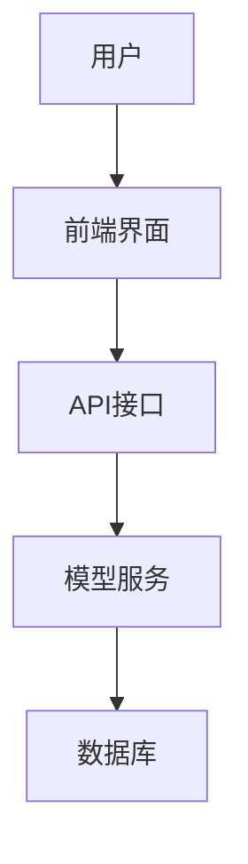
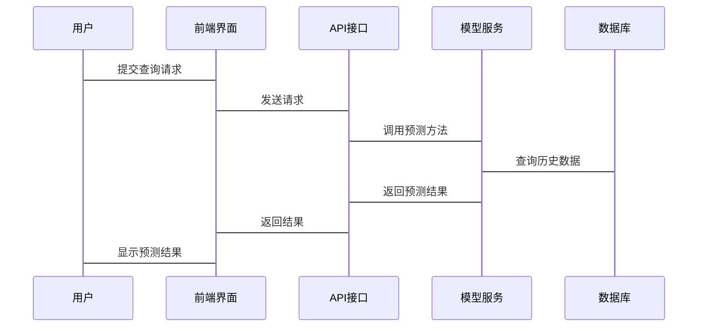

                 


# 深度学习预测公司破产风险

## 关键词：深度学习，公司破产，风险预测，神经网络，算法

## 摘要

随着企业竞争的加剧，预测公司破产风险变得至关重要。深度学习通过其强大的特征学习能力，能够从复杂的财务数据中提取有价值的信息，从而提高破产预测的准确性。本文将详细介绍深度学习在公司破产预测中的应用，包括基本原理、算法选择、系统架构以及实际案例分析。通过逐步推理和详细的技术分析，我们将展示如何利用深度学习技术构建一个高效的破产风险预测模型。

---

## 第一部分: 深度学习预测公司破产风险的背景与基础

### 第1章: 公司破产风险预测的背景与重要性

#### 1.1 公司破产的定义与影响

公司破产是指企业在无法偿还债务时，依法宣告终止其营业状态的过程。破产不仅影响公司本身，还会影响其债权人、股东以及员工。对于投资者而言，准确预测公司破产风险可以避免重大损失；对于企业而言，提前识别风险有助于采取有效措施避免破产。因此，研究公司破产预测具有重要的现实意义。

#### 1.2 传统破产预测方法的局限性

传统的破产预测方法主要依赖于财务指标分析，如Z-score模型。这些方法虽然在一定程度上能够预测破产，但存在以下局限性：
- **数据依赖性**：传统方法仅依赖于财务数据，忽略了非财务因素（如市场环境、管理团队等）。
- **线性假设**：传统方法假设变量之间的关系是线性的，无法捕捉复杂的非线性关系。
- **静态性**：传统方法难以动态更新模型，无法适应快速变化的市场环境。

#### 1.3 深度学习在破产预测中的优势

深度学习是一种基于人工神经网络的机器学习方法，具有以下显著优势：
- **非线性建模能力**：深度学习能够自动学习数据的非线性关系，无需手动特征工程。
- **特征学习能力**：深度学习能够从原始数据中提取高层次特征，捕捉复杂的模式。
- **适应性与泛化能力**：深度学习模型能够适应数据分布的变化，具有较强的泛化能力。

#### 1.4 本书的目标与结构

本书旨在通过深度学习技术，构建一个高效、准确的公司破产风险预测模型。内容结构如下：
1. **背景与基础**：介绍公司破产的定义、传统预测方法及其局限性，以及深度学习的优势。
2. **深度学习的核心概念与原理**：详细讲解深度学习的基本原理及其在金融领域的应用。
3. **深度学习预测算法的原理与实现**：介绍常用的深度学习算法及其在破产预测中的应用。
4. **系统架构与设计**：从系统角度分析破产预测模型的构建过程。
5. **项目实战与案例分析**：通过实际案例展示深度学习在破产预测中的应用。
6. **总结与展望**：总结全文并展望未来研究方向。

---

## 第二部分: 深度学习预测公司破产风险的核心概念与联系

### 第2章: 深度学习的核心概念与原理

#### 2.1 深度学习的基本原理

深度学习基于人工神经网络，通过多层非线性变换，从输入数据中提取高层次特征。神经网络的基本结构包括输入层、隐藏层和输出层。通过反向传播算法和梯度下降优化，模型能够自动调整权重以最小化预测误差。

#### 2.2 深度学习的关键技术

- **卷积神经网络（CNN）**：适用于图像数据，通过卷积操作提取局部特征。
- **循环神经网络（RNN）**：适用于时间序列数据，通过循环结构捕捉序列依赖性。
- **长短期记忆网络（LSTM）**：一种改进的RNN，能够更好地捕捉长期依赖性。
- **图神经网络（GNN）**：适用于图结构数据，通过节点间的关系进行建模。

#### 2.3 深度学习在金融领域的应用

- **金融时间序列分析**：利用LSTM预测股票价格、汇率等。
- **信用风险评估**：通过深度学习模型评估客户的信用风险。
- **破产预测**：深度学习能够从复杂的财务和非财务数据中提取特征，提高预测准确率。

---

## 第三部分: 深度学习预测公司破产风险的算法原理

### 第3章: 基于LSTM的公司破产预测模型

#### 3.1 LSTM网络的基本原理

LSTM通过引入记忆单元和遗忘门，能够有效捕捉时间序列中的长期依赖关系。其结构包括输入门、遗忘门和输出门。

- **输入门**：决定当前时刻的信息输入量。
- **遗忘门**：决定遗忘哪些长期信息。
- **输出门**：决定输出什么信息。

#### 3.2 LSTM网络的优缺点

- **优点**：能够捕捉长期依赖关系，适合时间序列数据。
- **缺点**：计算复杂，训练时间较长。

#### 3.3 LSTM网络在破产预测中的应用

- **数据准备**：将财务数据转换为时间序列格式。
- **模型构建**：设计LSTM网络结构，包括输入层、LSTM层和输出层。
- **训练与评估**：使用历史数据训练模型，并通过准确率、召回率等指标评估性能。

---

## 第四部分: 深度学习预测公司破产风险的系统架构与设计

### 第4章: 系统架构设计

#### 4.1 系统功能设计

- **数据预处理**：清洗、归一化、特征提取。
- **模型训练**：选择算法、调整参数、训练模型。
- **模型评估**：测试准确率、召回率、F1分数。
- **部署与应用**：将模型部署到生产环境，提供预测服务。

#### 4.2 系统架构图



#### 4.3 接口设计

- **输入接口**：接收公司财务数据。
- **输出接口**：返回破产风险预测结果。

#### 4.4 交互流程图



---

## 第五部分: 深度学习预测公司破产风险的项目实战

### 第5章: 项目实战

#### 5.1 环境安装

- **Python**：安装Python 3.8及以上版本。
- **深度学习框架**：安装TensorFlow或Keras。
- **数据处理工具**：安装Pandas、NumPy。

#### 5.2 数据预处理

```python
import pandas as pd
import numpy as np

# 加载数据
data = pd.read_csv('company_financial_data.csv')

# 数据清洗
data.dropna(inplace=True)
data = data.drop_duplicates()

# 特征提取
features = data[['revenue', 'profit', 'debt', 'cash']]
labels = data[' bankruptcy']
```

#### 5.3 模型实现

```python
from tensorflow.keras.models import Sequential
from tensorflow.keras.layers import LSTM, Dense, Dropout

# 模型构建
model = Sequential()
model.add(LSTM(64, input_shape=(timesteps, features)))
model.add(Dropout(0.5))
model.add(Dense(1, activation='sigmoid'))

# 编译模型
model.compile(loss='binary_crossentropy', optimizer='adam', metrics=['accuracy'])
```

#### 5.4 模型训练与评估

```python
# 训练模型
model.fit(X_train, y_train, epochs=10, batch_size=32, validation_split=0.2)

# 评估模型
loss, accuracy = model.evaluate(X_test, y_test)
print(f'Loss: {loss}, Accuracy: {accuracy}')
```

#### 5.5 案例分析

通过实际数据训练模型，并分析预测结果。例如，某公司财务数据输入模型后，预测其破产概率为85%，说明其破产风险较高。

---

## 第六部分: 总结与展望

### 第6章: 总结与展望

#### 6.1 总结

本文详细介绍了深度学习在公司破产预测中的应用，从基本原理到算法实现，再到系统设计，均进行了深入探讨。通过实际案例分析，展示了深度学习在破产预测中的强大能力。

#### 6.2 展望

未来，随着深度学习技术的不断发展，破产预测模型将更加准确和高效。同时，结合其他技术如强化学习和图神经网络，将进一步提升模型的预测能力。

---

## 作者

作者：AI天才研究院/AI Genius Institute & 禅与计算机程序设计艺术/Zen And The Art of Computer Programming

