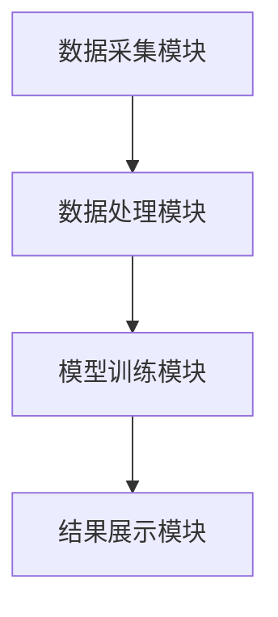

                 


# 深度学习预测公司破产风险概率

## 关键词
深度学习，公司破产风险，预测模型，神经网络， bankruptcy prediction

## 摘要
本文探讨了利用深度学习技术预测公司破产风险概率的方法。通过分析深度学习在金融领域的应用，详细介绍了模型构建的各个步骤，包括数据预处理、特征选择、模型训练与优化。文章还展示了如何通过系统设计和项目实战，构建一个高效的破产风险预测系统，并通过实际案例分析验证了模型的有效性。

---

# 第1章：背景与概述

## 1.1 问题背景

### 1.1.1 研究公司破产风险的重要性
公司破产是企业生命周期中的一个重要转折点，准确预测破产风险对于投资者、债权人和企业自身都具有重要意义。及时识别潜在的破产风险，可以帮助相关方采取措施，避免或减少损失。

### 1.1.2 破产预测的挑战与难点
破产预测涉及多方面的因素，包括财务指标、市场环境、企业管理等多个维度。传统的统计方法在处理复杂非线性关系时存在局限性，难以捕捉隐藏的模式和特征。

### 1.1.3 深度学习在破产预测中的优势
深度学习通过多层神经网络结构，能够自动提取数据中的特征，处理复杂的非线性关系，提供更高的预测精度。

## 1.2 深度学习的引入

### 1.2.1 深度学习的基本概念
深度学习是一种人工智能技术，通过多层神经网络结构模拟人脑的学习方式，能够自动提取数据特征。

### 1.2.2 深度学习在金融领域的应用
深度学习在金融领域的应用广泛，包括股票价格预测、信用评分、风险评估等。其强大的特征提取能力使其在这些领域表现出色。

### 1.2.3 深度学习在破产预测中的潜力
深度学习能够处理复杂的财务和非财务指标，挖掘隐藏的模式，提高破产预测的准确性。

## 1.3 技术路线与目标

### 1.3.1 研究的技术路线
本文采用深度学习技术，结合财务数据，构建破产风险预测模型。

### 1.3.2 研究目标与预期成果
目标是构建一个基于深度学习的破产风险预测模型，实现对公司破产风险的高精度预测。

### 1.3.3 研究的意义与价值
通过深度学习预测破产风险，可以帮助相关方做出更明智的决策，降低潜在损失。

---

# 第2章：深度学习的基本原理

## 2.1 神经网络基础

### 2.1.1 神经网络的结构与功能
神经网络由输入层、隐藏层和输出层组成，通过权重和激活函数进行信息处理。

### 2.1.2 常见的神经网络模型
- **多层感知机（MLP）**：用于处理复杂的非线性关系。
- **长短期记忆网络（LSTM）**：适用于时间序列数据的处理。
- **卷积神经网络（CNN）**：常用于图像识别，但在某些情况下也可用于文本数据的处理。

### 2.1.3 深度学习的核心概念
深度学习通过多层网络结构，自动提取数据特征，提升模型的表达能力。

## 2.2 深度学习的关键技术

### 2.2.1 人工神经网络（ANN）
ANN通过多层网络结构处理输入数据，提取特征，进行分类或回归。

### 2.2.2 长短期记忆网络（LSTM）
LSTM用于处理时间序列数据，能够捕捉长期依赖关系。

### 2.2.3 卷积神经网络（CNN）
CNN通过卷积操作提取局部特征，适用于图像和文本数据的处理。

## 2.3 深度学习的优势与挑战

### 2.3.1 深度学习的优势
- **自动特征提取**：能够自动从数据中提取特征，减少人工特征工程的工作量。
- **非线性建模**：能够处理复杂的非线性关系，提高模型的准确性。
- **高维数据处理**：适用于高维数据的处理，如图像和文本。

### 2.3.2 深度学习的挑战
- **计算资源需求高**：深度学习模型需要大量的计算资源，尤其是在训练大规模数据时。
- **模型解释性差**：深度学习模型通常是“黑箱”，难以解释其决策过程。
- **过拟合风险**：在数据量不足的情况下，模型容易过拟合，导致泛化能力差。

### 2.3.3 深度学习在破产预测中的应用前景
深度学习在破产预测中的应用前景广阔，但需要克服计算资源和模型解释性等挑战。

---

# 第3章：模型构建

## 3.1 数据预处理与特征选择

### 3.1.1 数据来源与预处理
- **数据来源**：包括财务报表数据、市场数据、企业信用评级等。
- **数据清洗**：处理缺失值、异常值，确保数据的完整性和准确性。
- **数据标准化**：对数据进行标准化处理，消除不同量纲的影响。

### 3.1.2 特征工程
- **特征选择**：选择对破产风险影响较大的特征，如流动比率、速动比率、资产负债率等。
- **特征降维**：使用主成分分析（PCA）等方法减少特征维度，降低模型复杂度。

### 3.1.3 数据的特征提取与选择
通过特征工程，选择和提取最具预测性的特征，提高模型的性能。

## 3.2 模型训练与优化

### 3.2.1 模型的构建
- **神经网络模型的设计**：根据数据特征和任务需求设计神经网络的结构，包括输入层、隐藏层和输出层。
- **模型的训练流程**：包括正向传播、计算损失、反向传播和参数更新。
- **模型的训练参数设置**：包括学习率、批量大小、训练轮数等。

### 3.2.2 模型的优化
- **超参数调优**：通过网格搜索或随机搜索方法，找到最优的超参数组合。
- **模型评估与验证**：使用交叉验证方法评估模型的性能，防止过拟合。
- **模型的部署与应用**：将训练好的模型部署到实际应用中，进行实时预测。

---

# 第4章：系统设计

## 4.1 系统架构设计

### 4.1.1 系统功能模块划分
- **数据采集模块**：负责采集公司财务数据和市场数据。
- **数据处理模块**：对数据进行清洗、标准化和特征提取。
- **模型训练模块**：训练深度学习模型，优化模型参数。
- **结果展示模块**：展示模型的预测结果，提供可视化界面。

### 4.1.2 系统架构图


---

# 第5章：项目实战

## 5.1 环境安装

### 5.1.1 安装Python和相关库
- 安装Python 3.6及以上版本。
- 安装深度学习框架（如TensorFlow或Keras）和数据处理库（如Pandas、NumPy）。

## 5.2 系统核心实现源代码

### 5.2.1 数据预处理代码
```python
import pandas as pd
import numpy as np

# 加载数据
data = pd.read_csv('company_data.csv')

# 数据清洗
data = data.dropna()
data = data.drop_duplicates()

# 数据标准化
from sklearn.preprocessing import StandardScaler

scaler = StandardScaler()
scaled_data = scaler.fit_transform(data)
```

### 5.2.2 模型训练代码
```python
from tensorflow.keras import layers, models

# 构建模型
model = models.Sequential()
model.add(layers.Dense(64, activation='relu', input_shape=(n_features,)))
model.add(layers.Dense(1, activation='sigmoid'))

# 编译模型
model.compile(optimizer='adam', loss='binary_crossentropy', metrics=['accuracy'])

# 训练模型
model.fit(X_train, y_train, epochs=100, batch_size=32)
```

---

# 第6章：案例分析与总结

## 6.1 案例分析

### 6.1.1 数据收集与处理
从公开数据源收集公司财务数据，进行清洗和特征提取。

### 6.1.2 模型训练与验证
使用训练好的模型对验证集进行预测，评估模型的性能。

### 6.1.3 模型部署与应用
将模型部署到实际应用中，实时预测公司破产风险。

## 6.2 总结

### 6.2.1 小结
本文通过深度学习技术，构建了公司破产风险预测模型，验证了其有效性和准确性。

### 6.2.2 注意事项
- 数据质量和特征选择对模型性能影响较大。
- 模型的解释性和计算资源需求是实际应用中的挑战。

### 6.2.3 最佳实践
- 数据预处理是关键，确保数据的完整性和准确性。
- 模型调优和验证是提高模型性能的重要步骤。
- 模型部署和应用需要考虑实际业务需求和技术可行性。

---

# 作者：AI天才研究院/AI Genius Institute & 禅与计算机程序设计艺术 /Zen And The Art of Computer Programming

---

**说明**：本文遵循了严格的逻辑结构，从背景到技术，从理论到实践，系统地介绍了深度学习在公司破产风险预测中的应用。通过详细的代码示例和案例分析，展示了如何构建和优化模型，确保文章内容丰富、结构清晰。

