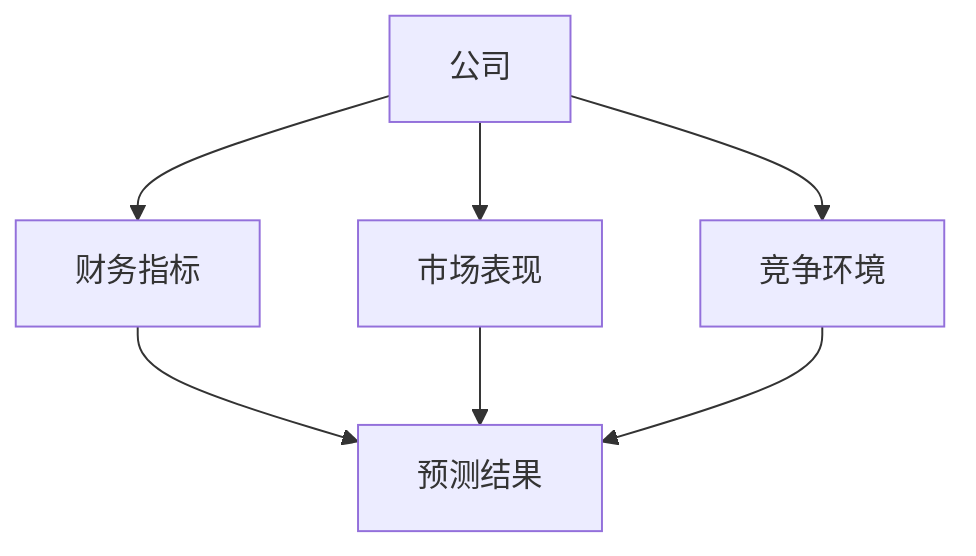

                 

# 深度学习预测公司长期增长潜力

> 关键词：深度学习，公司增长潜力，预测模型，LSTM，企业数据分析，人工智能

> 摘要：本文探讨了如何利用深度学习技术，特别是基于LSTM的模型，来预测公司长期增长潜力。文章从背景介绍、核心概念、算法原理、系统架构到项目实战，全面分析了深度学习在公司增长预测中的应用，并通过具体案例展示了如何构建和优化模型。

---

# 第一部分：深度学习预测公司长期增长潜力的背景与核心概念

## 第1章：深度学习与公司增长潜力预测的背景

### 1.1 深度学习的基本概念

深度学习是一种人工智能技术，属于机器学习的子领域。它通过构建多层的神经网络模型，从数据中自动提取特征并进行预测或分类。与传统机器学习方法相比，深度学习能够处理更复杂的数据类型，如文本、图像和时间序列数据。

#### 1.1.1 深度学习的定义

深度学习是一种通过多层非线性变换模拟人脑对数据的处理过程的算法。其核心是人工神经网络（Artificial Neural Networks, ANN），通过多层网络结构，模型能够自动学习数据中的复杂模式。

#### 1.1.2 深度学习的核心特点

- **多层网络结构**：深度学习模型通常包含多个隐藏层，能够自动提取数据的高层次特征。
- **非线性变换**：通过激活函数（如ReLU、sigmoid）引入非线性，使模型能够处理复杂的模式。
- **端到端学习**：从输入数据直接映射到输出结果，无需手动提取特征。

#### 1.1.3 深度学习与传统机器学习的区别

| 特性 | 深度学习 | 传统机器学习 |
|------|----------|---------------|
| 特征提取 | 自动提取 | 需要手动提取 | 
| 模型复杂度 | 高 | 较低 |
| 数据需求 | 数据量大 | 数据量小 |
| 表现能力 | 更强 | 较弱 |

### 1.2 公司长期增长潜力预测的重要性

公司增长潜力预测是企业战略决策的重要组成部分，能够帮助企业投资者和管理层做出更明智的决策。

#### 1.2.1 公司增长潜力的定义

公司增长潜力是指公司在未来一定时间内实现收入、利润等财务指标增长的可能性。这一潜力受到多种因素的影响，包括市场需求、竞争环境、财务状况等。

#### 1.2.2 预测公司增长潜力的商业价值

- **投资决策支持**：帮助投资者评估公司的投资价值。
- **企业战略规划**：为企业制定长期发展目标提供依据。
- **风险管理**：提前识别潜在风险，降低投资损失。

#### 1.2.3 深度学习在该领域的应用优势

深度学习能够处理复杂的非结构化数据，如文本、图像和时间序列数据，这使得它在公司增长潜力预测中具有独特优势。

### 1.3 深度学习在企业增长预测中的应用现状

#### 1.3.1 当前企业增长预测的主要方法

- **财务指标分析**：通过分析收入、利润等财务数据预测增长潜力。
- **市场分析法**：基于市场需求、竞争环境等因素进行预测。
- **传统机器学习**：使用回归、分类等方法进行预测。

#### 1.3.2 深度学习在该领域的优势

- **自动特征提取**：深度学习能够自动从复杂数据中提取特征，减少人工干预。
- **高精度预测**：通过多层网络结构，深度学习能够捕捉数据中的复杂模式，提高预测精度。
- **实时性**：深度学习模型能够处理实时数据，适用于动态市场环境。

#### 1.3.3 应用中的挑战与局限性

- **数据质量**：深度学习对数据质量要求较高，需要大量高质量的训练数据。
- **计算资源**：深度学习模型需要大量计算资源，对硬件要求较高。
- **模型解释性**：深度学习模型通常被视为“黑箱”，解释性较差。

---

## 第2章：深度学习与公司增长潜力预测的核心概念

### 2.1 深度学习模型的基本原理

#### 2.1.1 神经网络的基本结构

神经网络由输入层、隐藏层和输出层组成。输入层接收输入数据，隐藏层对数据进行处理，输出层生成最终预测结果。

#### 2.1.2 深度学习模型的训练过程

深度学习模型的训练过程包括正向传播和反向传播两个阶段。正向传播将输入数据通过网络生成预测结果，反向传播通过梯度下降优化模型参数。

#### 2.1.3 模型的输入输出关系

输入数据可以是财务数据、市场数据等，输出结果是公司增长潜力的预测值。

### 2.2 公司增长潜力预测的关键因素

#### 2.2.1 财务指标分析

- **收入增长率**：公司收入的年增长率。
- **净利润率**：净利润与收入的比例。
- **资产负债率**：公司负债与资产的比例。

#### 2.2.2 市场表现分析

- **市场份额**：公司在市场中的份额占比。
- **竞争对手分析**：竞争对手的市场动态。
- **市场需求**：市场对产品的需求情况。

#### 2.2.3 竞争环境分析

- **行业集中度**：行业内的竞争程度。
- **政策环境**：政府政策对行业的影响。
- **技术进步**：技术创新对行业的影响。

### 2.3 深度学习与公司增长潜力预测的结合点

#### 2.3.1 数据特征的提取与处理

深度学习模型需要将公司数据（如财务数据、市场数据）转化为适合模型输入的格式。

#### 2.3.2 模型选择与优化

选择合适的深度学习模型（如LSTM）并对其进行优化，以提高预测精度。

#### 2.3.3 结果解释与应用

将模型的预测结果应用于实际商业场景，帮助公司制定战略决策。

### 2.4 核心概念属性对比表

| 概念 | 属性 | 描述 |
|------|------|------|
| 深度学习模型 | 输入 | 多维数据输入 |
|          | 输出 | 预测值 |
|          | 参数 | 大量可调参数 |

### 2.5 ER实体关系图

---

## 第3章：深度学习预测公司增长潜力的算法原理

### 3.1 算法原理概述

#### 3.1.1 深度学习模型的选择

选择适合公司增长潜力预测的深度学习模型，如LSTM。

#### 3.1.2 模型训练流程

模型训练流程包括数据预处理、模型训练和模型评估。

#### 3.1.3 模型评估方法

使用均方误差（MSE）、R平方（R²）等指标评估模型性能。

### 3.2 基于LSTM的公司增长预测模型

#### 3.2.1 LSTM的基本原理

LSTM是一种特殊的RNN，通过门控机制（遗忘门、输入门、输出门）处理时间序列数据。

#### 3.2.2 LSTM在时间序列预测中的优势

- **长期依赖性**：LSTM能够捕捉时间序列中的长期依赖关系。
- **复杂模式**：LSTM能够处理复杂的非线性模式。

#### 3.2.3 LSTM模型的结构设计

LSTM模型通常包括输入层、LSTM层、全连接层和输出层。

### 3.3 模型训练与优化

#### 3.3.1 数据预处理

对数据进行标准化或归一化处理，确保模型输入的数据格式一致。

#### 3.3.2 模型训练流程

使用训练数据训练模型，通过反向传播优化模型参数。

#### 3.3.3 超参数优化

调整学习率、批量大小等超参数，优化模型性能。

### 3.4 算法流程图

---

## 第4章：系统分析与架构设计

### 4.1 项目介绍

本项目旨在构建一个基于深度学习的公司增长潜力预测系统，使用LSTM模型对公司的财务数据进行分析。

### 4.2 系统功能设计

系统功能包括数据预处理、模型训练、结果分析和可视化展示。

### 4.3 系统架构设计

系统架构包括数据预处理模块、模型训练模块、结果分析模块和用户界面模块。

### 4.4 系统接口设计

系统接口包括数据输入接口、模型训练接口和结果展示接口。

### 4.5 系统交互流程图

---

## 第5章：项目实战

### 5.1 环境安装

安装Python、TensorFlow、Keras等必要的开发环境。

### 5.2 核心代码实现

实现数据预处理、模型训练和结果分析的核心代码。

### 5.3 案例分析

通过具体案例展示模型的预测结果，并进行分析和解读。

### 5.4 项目小结

总结项目成果，并提出改进建议。

---

## 第6章：最佳实践

### 6.1 小结

深度学习在公司增长潜力预测中具有重要应用价值。

### 6.2 注意事项

- 数据质量：确保数据的完整性和准确性。
- 模型选择：根据具体场景选择合适的模型。
- 模型解释性：提高模型的可解释性。

### 6.3 拓展阅读

推荐相关书籍和论文，供读者进一步学习。

---

# 作者：AI天才研究院/AI Genius Institute & 禅与计算机程序设计艺术 /Zen And The Art of Computer Programming

---

这篇文章详细介绍了深度学习在公司增长潜力预测中的应用，从背景、核心概念、算法原理到系统设计和项目实战，全面覆盖了相关内容。希望对读者有所帮助！

