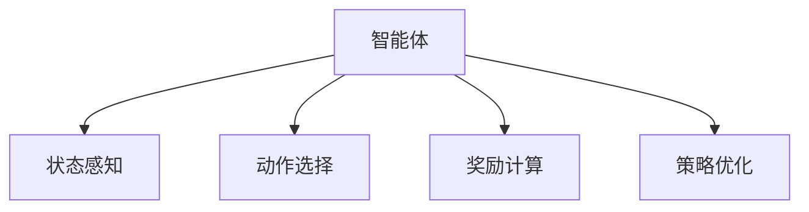

                 


# 深度强化学习在AI Agent决策优化中的应用

> 关键词：深度强化学习，AI代理，决策优化，算法原理，系统架构，项目实战

> 摘要：深度强化学习（Deep Reinforcement Learning，DRL）是一种结合了深度学习和强化学习的机器学习方法，近年来在AI Agent的决策优化中取得了显著进展。本文将从基本概念、核心算法、系统架构到实际应用，全面解析深度强化学习在AI Agent决策优化中的应用。通过案例分析和代码实现，深入探讨深度强化学习的技术细节和实际应用场景。

---

## 第一部分：深度强化学习概述

### 第1章：深度强化学习的基本概念

#### 1.1 强化学习的基本原理

强化学习是一种通过智能体与环境交互来学习最优策略的机器学习方法。智能体通过执行动作来影响环境状态，并根据环境返回的奖励信号来调整自己的行为，最终目标是最大化累计奖励。

#### 1.2 深度学习与强化学习的结合

深度学习通过神经网络提取高维状态空间的特征，而强化学习通过奖励机制优化智能体的决策。两者的结合使得智能体能够处理复杂的非结构化数据，并在动态环境中做出更优决策。

#### 1.3 深度强化学习的核心要素

- **状态（State）**：智能体所处环境的特征描述。
- **动作（Action）**：智能体可以执行的操作。
- **奖励（Reward）**：智能体行为的评价指标。
- **策略（Policy）**：智能体选择动作的规则。
- **价值函数（Value Function）**：预测未来累计奖励的函数。

### 第2章：深度强化学习的发展历程

#### 2.1 强化学习的起源

强化学习的概念最早可以追溯到20世纪50年代，但真正的发展始于马尔可夫决策过程（MDP）的提出。

#### 2.2 深度学习对强化学习的推动

深度学习的兴起为强化学习提供了强大的特征提取能力，使得智能体能够处理高维复杂状态。

#### 2.3 当前研究热点

当前，深度强化学习在游戏AI、自动驾驶、机器人控制等领域取得了显著进展，同时也在理论研究上不断深入，例如多智能体协作、实时决策等。

### 第3章：深度强化学习的应用场景

#### 3.1 游戏AI

深度强化学习在游戏AI中的应用最为广泛，例如AlphaGo和OpenAI的Dota AI。

#### 3.2 机器人控制

通过深度强化学习，机器人可以在复杂环境中自主学习最优控制策略。

#### 3.3 自动驾驶

深度强化学习在自动驾驶中的路径规划和决策优化中发挥重要作用。

#### 3.4 财经交易

深度强化学习也被应用于股票交易策略的优化。

---

## 第二部分：深度强化学习的核心概念

### 第4章：智能体与环境的交互

#### 4.1 智能体的定义与角色

智能体是决策的核心，负责根据当前状态选择最优动作。

#### 4.2 环境的定义与分类

环境是智能体所处的外部世界，可以是物理环境或虚拟环境。

#### 4.3 智能体与环境的交互过程

智能体通过感知环境状态，选择动作，执行动作，获得奖励，不断优化策略。

### 第5章：状态、动作与奖励

#### 5.1 状态空间的定义

状态空间是智能体所有可能的状态的集合，可以是连续的或离散的。

#### 5.2 动作空间的定义

动作空间是智能体所有可能的动作的集合，同样可以是连续的或离散的。

#### 5.3 奖励机制的设计

奖励机制是强化学习的核心，设计合理的奖励函数对算法性能至关重要。

### 第6章：策略与价值函数

#### 6.1 策略的定义与分类

策略是智能体选择动作的规则，分为确定性策略和随机性策略。

#### 6.2 价值函数的定义与作用

价值函数用于预测当前状态下智能体的累计奖励。

#### 6.3 策略与价值函数的关系

策略和价值函数相辅相成，策略指导动作选择，价值函数评估决策优劣。

---

## 第三部分：深度强化学习的算法原理

### 第7章：核心算法解析

#### 7.1 Q-learning算法

Q-learning是一种经典的强化学习算法，通过更新Q值函数来学习最优策略。

- **算法流程**：
  1. 初始化Q表。
  2. 选择动作。
  3. 执行动作，获得奖励。
  4. 更新Q值函数。
  5. 重复上述步骤。

- **数学公式**：
  $$ Q(s, a) \leftarrow Q(s, a) + \alpha [r + \gamma \max Q(s', a') - Q(s, a)] $$

#### 7.2 Deep Q-Network（DQN）算法

DQN通过神经网络近似Q值函数，扩展了Q-learning的应用范围。

- **算法流程**：
  1. 初始化神经网络。
  2. 选择动作。
  3. 执行动作，获得奖励。
  4. 更新神经网络权重。
  5. 重复上述步骤。

- **网络结构**：
  - 输入层：接收状态信息。
  - 隐藏层：提取特征。
  - 输出层：输出Q值。

#### 7.3 Policy Gradient（PG）算法

PG算法通过优化策略直接更新智能体的行为策略。

- **算法流程**：
  1. 初始化策略参数。
  2. 采样动作。
  3. 计算策略梯度。
  4. 更新策略参数。
  5. 重复上述步骤。

- **数学公式**：
  $$ \nabla \theta \leftarrow \frac{1}{N} \sum_{i=1}^N \nabla \log \pi_{\theta}(a_i|s_i) Q(s_i, a_i) $$

---

## 第四部分：系统分析与架构设计

### 第8章：系统架构设计

#### 8.1 问题场景介绍

以游戏AI为例，设计一个基于深度强化学习的决策优化系统。

#### 8.2 系统功能设计

- 状态感知模块：接收游戏状态。
- 动作选择模块：选择最优动作。
- 奖励计算模块：计算累计奖励。
- 策略优化模块：更新策略参数。

#### 8.3 系统架构图



#### 8.4 系统接口设计

- 输入接口：接收环境状态。
- 输出接口：输出选择动作。
- 交互接口：与环境进行交互。

---

## 第五部分：项目实战

### 第9章：深度强化学习的项目实现

#### 9.1 环境安装

- 安装Python和相关库（如TensorFlow、Keras）。
- 安装游戏环境（如OpenAI Gym）。

#### 9.2 核心代码实现

```python
import numpy as np
import gym
from tensorflow.keras import layers

# 初始化环境
env = gym.make('CartPole-v1')
env.seed(123)

# 定义神经网络模型
model = keras.Sequential([
    layers.Dense(24, activation='relu', input_shape=(4,)),
    layers.Dense(24, activation='relu'),
    layers.Dense(1, activation='linear')
])

# 编译模型
model.compile(optimizer='adam', loss='mean_squared_error')

# 训练过程
for _ in range(1000):
    state = env.reset()
    done = False
    while not done:
        # 预测动作
        q = model.predict(np.array([state]))
        action = np.argmax(q[0])
        # 执行动作
        next_state, reward, done, _ = env.step(action)
        # 更新Q值
        target = q[0][action] + reward + (0.99 * np.max(q.predict(np.array([next_state]))[0]))
        target_q = q.copy()
        target_q[0][action] = target
        # 更新模型
        model.fit(np.array([state]), target_q, epochs=1, verbose=0)
```

#### 9.3 代码解读与分析

上述代码实现了一个简单的DQN算法，用于解决CartPole问题。模型通过不断预测和更新Q值，逐步优化智能体的决策。

#### 9.4 实际案例分析

通过训练，智能体能够在CartPole环境中保持平衡，证明了深度强化学习的有效性。

---

## 第六部分：最佳实践与总结

### 第10章：深度强化学习的最佳实践

#### 10.1 经验总结

- 合理设计奖励机制。
- 选择合适的算法和网络结构。
- 优化超参数。

#### 10.2 小结

深度强化学习是一种强大的决策优化工具，通过不断学习和优化，智能体能够在复杂环境中做出最优决策。

#### 10.3 注意事项

- 确保数据质量和多样性。
- 避免过拟合。
- 考虑计算资源的限制。

#### 10.4 拓展阅读

建议深入学习多智能体协作、实时决策优化等前沿领域。

---

## 作者信息

作者：AI天才研究院/AI Genius Institute & 禅与计算机程序设计艺术 /Zen And The Art of Computer Programming

---

本文通过系统化的讲解和实际案例分析，全面介绍了深度强化学习在AI Agent决策优化中的应用。从理论到实践，帮助读者掌握这一前沿技术的核心原理和实际应用。

