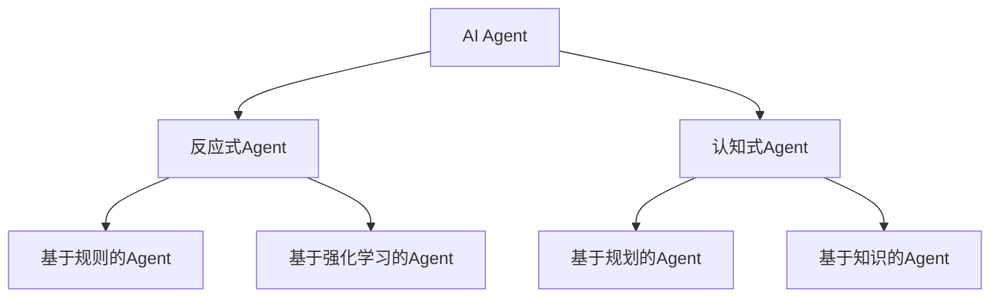
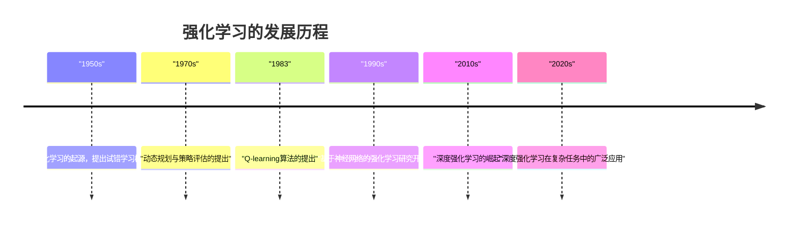
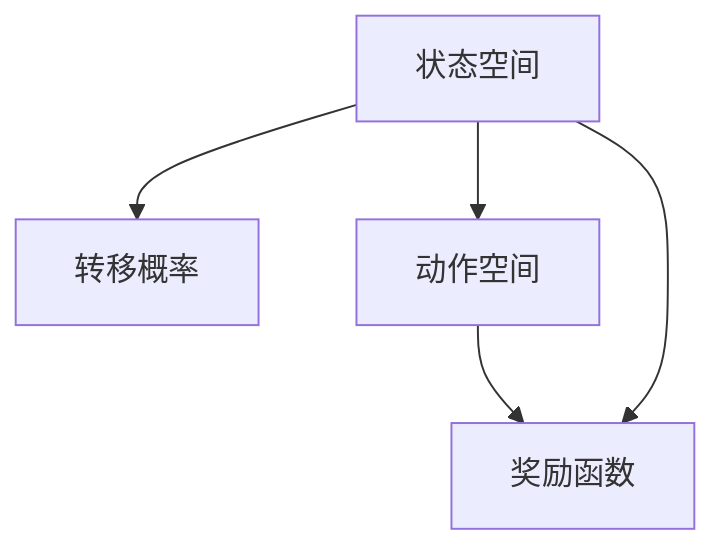
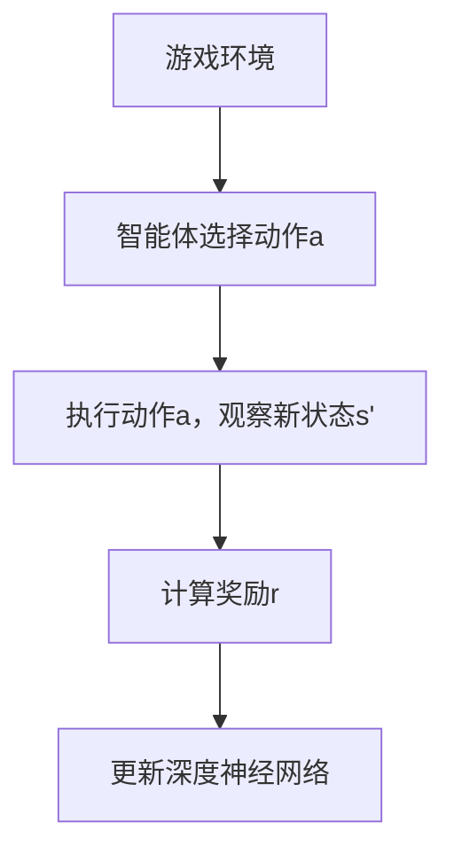

                 


# 深度强化学习在AI Agent策略优化中的应用

---

## 关键词  
深度强化学习、AI Agent、策略优化、强化学习算法、马尔可夫决策过程

---

## 摘要  
深度强化学习（Deep Reinforcement Learning，DRL）作为一种结合了深度学习与强化学习的技术，近年来在AI Agent的策略优化中取得了显著进展。本文将从基础概念出发，详细分析深度强化学习的核心算法、数学模型及其在AI Agent中的应用，并通过实际案例展示如何通过深度强化学习优化AI Agent的策略。

---

## 第1章: 深度强化学习的基本概念

### 1.1 强化学习的定义与特点  
强化学习（Reinforcement Learning，RL）是一种机器学习范式，通过智能体与环境的交互，逐步学习最优策略。与监督学习和无监督学习不同，强化学习通过奖励机制引导智能体学习最优行为。其特点包括：  
1. **目标导向**：智能体的目标是通过最大化累积奖励来优化策略。  
2. **在线学习**：智能体在与环境的实时交互中学习。  
3. **延迟反馈**：奖励通常在多个步骤后才给出，增加了学习的挑战性。  

#### 表1-1: 强化学习与其他学习范式的对比  
| 学习范式 | 数据类型 | 是否需要标签 | 是否在线学习 |  
|----------|----------|--------------|-------------|  
| 监督学习 | 结构化数据 | 需要          | 不需要       |  
| 无监督学习 | 非结构化数据 | 不需要        | 不需要       |  
| 强化学习 | 状态-动作-奖励 | 不需要        | 需要         |  

---

### 1.2 AI Agent的定义与分类  
AI Agent（人工智能代理）是指能够感知环境并采取行动以实现目标的智能实体。AI Agent可以分为以下几类：  
1. **反应式Agent**：基于当前感知做出反应，不依赖历史信息。  
2. **认知式Agent**：具备复杂推理和规划能力，能够处理长期目标。  

#### 图1-1: AI Agent的分类层次结构  


---

## 第2章: 深度强化学习的发展历程  

### 2.1 强化学习的历史回顾  
强化学习的起源可以追溯到20世纪50年代，但真正的发展始于20世纪90年代。早期的经典算法包括Q-learning（1983）和策略评估（Policy Evaluation，1970年代）。  

#### 图2-1: 强化学习的时间线  


---

## 第3章: Q-learning与Deep Q-Networks  

### 3.1 Q-learning算法  
Q-learning是一种经典的强化学习算法，通过学习Q值函数（Q(s,a)）来选择最优动作。  

#### 图3-1: Q-learning的算法流程  
```mermaid
graph TD  
I[初始化Q表] --> L[选择动作a]  
L --> E[执行动作a，观察新状态s']  
E --> J[计算奖励r]  
J --> K[更新Q(s,a) = r + γ * max(Q(s',a'))]  
K --> I[循环]
```

#### 表3-1: Q-learning算法的核心公式  
| 公式         | 描述               |  
|--------------|--------------------|  
| Q(s,a) ← r + γ * max(Q(s',a')) | Q值更新公式，γ为折扣因子，r为奖励。 |  

---

## 第4章: Policy Gradient Methods  

### 4.1 Policy Gradient的基本原理  
Policy Gradient方法通过直接优化策略π(a|s)来最大化累积奖励。  

#### 图4-1: Policy Gradient的优化流程  
```mermaid
graph TD  
I[初始化策略π] --> L[选择动作a]  
L --> E[执行动作a，观察新状态s']  
E --> J[计算奖励r]  
J --> K[计算梯度∇θJ(π)]  
K --> I[更新参数θ]
```

#### 表4-1: Policy Gradient的数学推导  
$$ J(π) = \mathbb{E}_{s,a}[r(s,a)] $$  
$$ \nabla_\theta J(π) = \mathbb{E}_{s,a}[r(s,a) \cdot \nabla_\theta \log π(a|s)] $$  

---

## 第5章: 马尔可夫决策过程（MDP）  

### 5.1 MDP的基本概念  
马尔可夫决策过程（Markov Decision Process，MDP）是强化学习的基本模型，由状态空间S、动作空间A、转移概率P和奖励函数R组成。  

#### 图5-1: MDP的实体关系图  


### 5.2 贝尔曼方程  
贝尔曼方程（Bellman Equation）是强化学习的核心方程，描述了状态的价值函数V(s)与后续状态价值的关系。  

#### 表5-1: 贝尔曼方程的数学形式  
$$ V(s) = \max_a \left[ R(s,a) + \gamma \sum_{s'} P(s'|s,a) V(s') \right] $$  
其中，γ为折扣因子，0 ≤ γ ≤ 1。

---

## 第6章: 深度强化学习在AI Agent中的应用  

### 6.1 游戏AI的优化  
深度强化学习在游戏AI中的应用最为人熟知，如AlphaGo和OpenAI的Dota AI。  

#### 图6-1: 游戏AI的强化学习框架  


---

## 第7章: 项目实战——基于深度强化学习的AI Agent优化  

### 7.1 环境安装与配置  
1. 安装Python和深度学习框架（如TensorFlow或PyTorch）。  
2. 安装OpenAI Gym库：`pip install gym`。  

### 7.2 核心代码实现  

#### 代码7-1: DQN算法的实现  
```python
import numpy as np
import gym
from collections import deque
import matplotlib.pyplot as plt

class DQN:
    def __init__(self, state_space, action_space, lr=0.01, gamma=0.99, epsilon=1.0):
        self.state_space = state_space
        self.action_space = action_space
        self.lr = lr
        self.gamma = gamma
        self.epsilon = epsilon
        self.memory = deque(maxlen=1000)
        self.model = self.build_model()

    def build_model(self):
        import tensorflow as tf
        model = tf.keras.Sequential([
            tf.keras.layers.Dense(24, activation='relu', input_dim=self.state_space),
            tf.keras.layers.Dense(self.action_space, activation='linear')
        ])
        model.compile(optimizer=tf.keras.optimizers.Adam(lr=self.lr), loss='mse')
        return model

    def remember(self, state, action, reward, next_state):
        self.memory.append((state, action, reward, next_state))

    def choose_action(self, state):
        if np.random.random() < self.epsilon:
            return np.random.randint(self.action_space)
        q_values = self.model.predict(state[np.newaxis,:])
        return np.argmax(q_values[0])

    def learn(self):
        if len(self.memory) < 1:
            return
        batch = np.random.random_sample((16,4), dtype=np.int32)
        X = []
        y = []
        for sample in batch:
            state, action, reward, next_state = sample
            q_next = self.model.predict(next_state[np.newaxis,:])
            q_target = reward + self.gamma * np.max(q_next[0])
            current_q = self.model.predict(state[np.newaxis,:])[0][action]
            X.append(state)
            y.append(q_target)
        self.model.fit(np.array(X), np.array(y), epochs=1, verbose=0)
        self.epsilon = max(0.01, self.epsilon * 0.99)
```

---

## 第8章: 总结与展望  

### 8.1 总结  
深度强化学习通过结合深度学习与强化学习，为AI Agent的策略优化提供了强大的工具。从基础算法到实际应用，深度强化学习展示了其在复杂任务中的巨大潜力。  

### 8.2 展望  
未来，深度强化学习将与多智能体系统、元学习（Meta-Learning）等领域结合，进一步推动AI Agent的发展。  

---

## 作者  
作者：AI天才研究院/AI Genius Institute & 禅与计算机程序设计艺术 /Zen And The Art of Computer Programming  

---

这篇博客文章从理论到实践，系统地介绍了深度强化学习在AI Agent策略优化中的应用，适合希望深入了解该领域的技术读者阅读。

