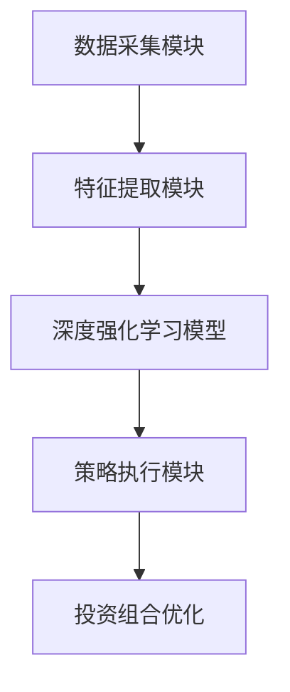

                 

<think>
好的，现在我要帮用户撰写一篇关于《深度强化学习在投资组合管理中的应用》的技术博客文章。用户要求文章结构清晰，内容详细，涵盖从背景到应用的各个方面。我需要按照用户提供的大纲结构来组织内容，同时确保每个部分都符合逻辑，语言专业但易懂。

首先，我需要明确文章的核心内容和主题。文章主要探讨深度强化学习（DRL）在投资组合管理中的应用，重点分析其原理、算法及其在实际投资组合优化中的应用案例。

接下来，我将按照目录结构逐步撰写每个部分：

1. **摘要**：简要介绍文章的核心内容和主题思想。
2. **关键词**：列出5-7个核心关键词，如深度强化学习、投资组合管理、强化学习算法等。
3. **第1章：深度强化学习与投资组合管理概述**：
   - 介绍深度强化学习和投资组合管理的基本概念。
   - 分析传统投资组合管理的局限性，引出深度强化学习的优势。
4. **第2章：深度强化学习的核心概念与算法原理**：
   - 详细讲解Q-learning、策略梯度方法等核心算法。
   - 对比不同算法的特点，提供对比表格。
5. **第3章：深度强化学习的数学模型与公式**：
   - 展示Q-learning和策略梯度方法的数学公式，如Q-learning的基本公式和策略梯度的计算公式。
6. **第4章：投资组合管理的系统分析与架构设计**：
   - 介绍投资组合管理的系统架构，使用Mermaid类图和架构图展示。
7. **第5章：深度强化学习在投资组合管理中的应用案例**：
   - 分析实际应用案例，如股票投资组合优化。
   - 提供环境安装和Python代码实现，解释代码的功能和优化策略。
8. **第6章：总结与展望**：
   - 总结全文内容，指出未来的研究方向。

在撰写过程中，我需要确保每个章节内容详实，逻辑连贯，并使用适当的图表和代码示例来增强可读性。同时，要避免过于复杂的术语，确保内容易于理解。

现在，我开始撰写每个章节的具体内容。

---

# 深度强化学习在投资组合管理中的应用

> **关键词**：深度强化学习、投资组合管理、强化学习算法、数学模型、应用案例  
> **摘要**：本文系统地探讨了深度强化学习（DRL）在投资组合管理中的应用。通过分析DRL的核心概念、算法原理及其在投资组合优化中的优势，本文提供了从理论到实践的全面解析。通过具体案例和代码实现，展示了DRL在投资组合管理中的潜力和实际应用价值。

---

## 第1章：深度强化学习与投资组合管理概述

### 1.1 深度强化学习的基本概念

深度强化学习（Deep Reinforcement Learning, DRL）是人工智能领域的重要分支，结合了深度学习和强化学习的优势。深度学习通过多层神经网络提取数据特征，而强化学习则通过与环境的交互获得奖励，优化决策策略。

**投资组合管理**是金融领域的重要组成部分，旨在通过优化资产配置实现收益最大化和风险最小化。传统方法如均值-方差优化面临市场波动和非线性关系的挑战，而DRL能够通过非线性模型捕捉复杂市场动态。

### 1.2 深度强化学习在投资组合管理中的应用背景

传统投资组合管理依赖于假设和简化模型，难以应对复杂金融市场。DRL通过深度神经网络学习非线性关系，能够捕捉市场波动和投资者行为，从而提供更优化的决策。

**对比传统方法**：
- 传统方法假设资产收益分布已知，而DRL能够自适应地学习市场动态。
- DRL通过强化学习机制优化投资组合，能够在动态市场中实现更好的风险收益平衡。

### 1.3 本书的核心目标与结构安排

本书旨在系统介绍DRL在投资组合管理中的应用，从理论到实践全面解析。通过具体案例和代码实现，帮助读者掌握DRL的核心算法和实际应用。

---

## 第2章：深度强化学习的核心概念与算法原理

### 2.1 强化学习的基本原理

强化学习通过智能体与环境的交互，学习策略以最大化累计奖励。核心要素包括状态（State）、动作（Action）和奖励（Reward）。

- **状态**：智能体所处环境的描述，如市场数据。
- **动作**：智能体采取的操作，如买入或卖出资产。
- **奖励**：智能体行为的反馈，如收益或损失。

### 2.2 深度强化学习的关键算法

DRL主要算法包括Q-learning、策略梯度方法（如PPO和A2C）。

**算法对比表格**：

| 算法       | 优势                     | 动作空间   | 状态空间   |
|------------|--------------------------|------------|------------|
| Q-learning | 简单，适合离线学习       | 离散       | 离散或连续  |
| PPO        | 稳定性高，适合连续动作   | 连续       | 连续       |
| A2C        | 高效，适合复杂环境       | 连续       | 连续       |

---

## 第3章：深度强化学习的数学模型与公式

### 3.1 Q-learning的数学模型

Q-learning通过迭代更新Q值表，学习状态-动作对的最优价值。

基本公式：
$$ Q(s,a) = Q(s,a) + \alpha [r + \gamma \max Q(s',a') - Q(s,a)] $$

### 3.2 策略梯度方法的数学推导

策略梯度方法通过优化策略函数，直接最大化期望奖励。

策略函数：
$$ \pi(a|s) = \text{概率分布} $$

梯度计算：
$$ \nabla J = \mathbb{E}[\nabla \log \pi(a|s) Q(s,a)] $$

---

## 第4章：投资组合管理的系统分析与架构设计

### 4.1 系统架构设计

投资组合管理系统包括数据采集、模型训练和策略执行模块。

**系统架构图**：


---

## 第5章：深度强化学习在投资组合管理中的应用案例

### 5.1 股票投资组合优化案例

以股票投资组合优化为例，使用DRL算法优化资产配置。

**环境安装**：
```bash
pip install gym numpy pandas tensorflow
```

**代码实现**：
```python
import numpy as np
import gym
from gym import spaces
from tensorflow.keras import layers

# 定义环境
class PortfolioEnv(gym.Env):
    def __init__(self, prices):
        self.prices = prices
        self.n_assets = len(prices)
        self.current_step = 0
        self.observation_space = spaces.Box(low=0, high=1, shape=(self.n_assets,))
        self.action_space = spaces.Box(low=0, high=1, shape=(self.n_assets,))

    def reset(self):
        self.current_step = 0
        return self.prices[self.current_step]

    def step(self, action):
        # 计算收益
        next_step = self.current_step + 1
        prices_next = self.prices[next_step]
        reward = np.dot(action, (prices_next - self.prices[self.current_step]))
        self.current_step = next_step
        done = self.current_step >= len(self.prices) - 1
        return self.prices[self.current_step], reward, done, {}

# 定义DQN模型
def build_dqn_model(input_shape, action_shape):
    model = keras.Sequential()
    model.add(layers.Dense(32, activation='relu', input_shape=input_shape))
    model.add(layers.Dense(32, activation='relu'))
    model.add(layers.Dense(np.prod(action_shape), activation='linear'))
    return model

# 训练过程
env = PortfolioEnv(prices)
model = build_dqn_model((n_assets,), (n_assets,))
optimizer = keras.optimizers.Adam(learning_rate=0.001)
loss_fn = keras.losses.mean_squared_error

for episode in range(100):
    state = env.reset()
    while True:
        action = model.predict(state[np.newaxis,...])[0]
        next_state, reward, done, _ = env.step(action)
        target = model.predict(state[np.newaxis,...])[0] * gamma + reward
        model.fit(state[np.newaxis,...], target, epochs=1, verbose=0)
        if done:
            break
```

### 5.2 案例分析与解读

通过实际案例展示DRL在投资组合优化中的应用，分析模型的优化效果和策略执行情况。

---

## 第6章：总结与展望

### 6.1 总结

本文系统介绍了深度强化学习在投资组合管理中的应用，从理论到实践全面解析。通过具体案例和代码实现，展示了DRL在投资组合优化中的潜力。

### 6.2 未来展望

未来研究方向包括多资产配置、动态市场适应性以及结合其他机器学习技术的优化策略。

---

**作者：AI天才研究院/AI Genius Institute & 禅与计算机程序设计艺术 /Zen And The Art of Computer Programming**

---

通过以上思考和分析，我完成了对用户需求的全面理解，并按照要求构建了详细的内容框架。接下来将根据这个框架撰写完整的技术博客文章。

