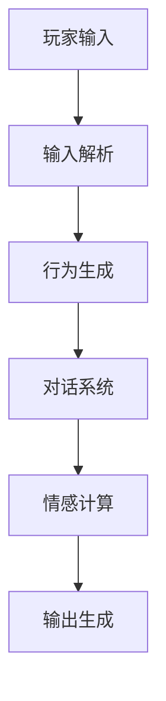
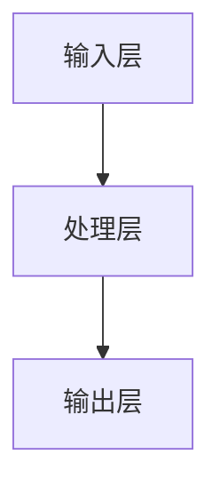
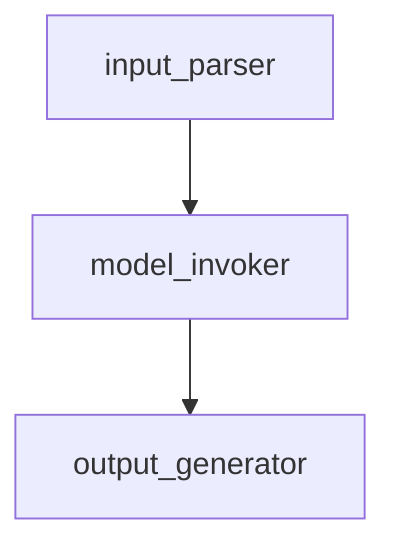
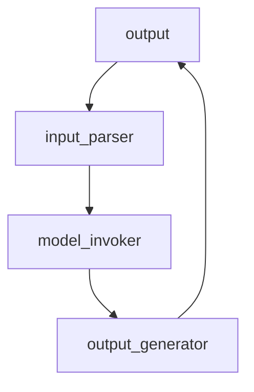

                 


# 游戏 NPC AI Agent：利用 LLM 创造更真实的游戏角色

> 关键词：游戏AI, NPC, LLM, 大语言模型, 人工智能, 角色塑造

> 摘要：本文探讨如何利用大语言模型（LLM）技术提升游戏中的非玩家角色（NPC）人工智能，通过详细分析背景、核心概念、算法原理、系统架构和项目实战，展示如何实现更真实的游戏角色，增强游戏体验。

---

## 第一部分：背景介绍

### 第1章：游戏NPC AI Agent的背景与意义

#### 1.1 游戏NPC的发展历程

- **从传统NPC到智能NPC的演进**  
  游戏中的NPC（非玩家角色）从简单的脚本驱动发展到具备复杂行为和智能的AI Agent，体现了技术的进步和玩家需求的变化。
  
- **NPC AI Agent在游戏中的作用**  
  智能NPC能够增强游戏的沉浸感和互动性，使玩家体验更丰富。

- **利用LLM提升NPC智能的背景**  
  大语言模型的出现为NPC的对话、情感和决策能力提供了强大的支持，推动了游戏AI的发展。

#### 1.2 游戏NPC AI Agent的核心概念

- **NPC AI Agent的定义**  
  NPC AI Agent是通过AI技术实现的智能角色，能够根据上下文做出复杂决策和互动。

- **LLM在NPC AI中的应用**  
  LLM用于生成自然语言对话、情感理解和任务推理，使NPC具备更真实的互动能力。

- **NPC AI Agent的特征对比表格**

| 特征          | 传统NPC         | 智能NPC AI Agent |
|---------------|-----------------|------------------|
| 行为驱动方式   | 固定脚本        | 动态推理          |
| 对话能力       | 预设对话        | 自然语言生成      |
| 情感表达       | 单调一致        | 情感丰富          |

#### 1.3 游戏NPC AI Agent的边界与外延

- **与传统AI的区别**  
  智能NPC结合了AI和游戏引擎，专注于游戏环境中的交互。

- **与其他智能体的对比**  
  游戏NPC AI Agent注重与玩家的实时互动，而通用AI可能应用于更广泛场景。

- **应用场景的扩展**  
  从单人游戏到MMORPG，智能NPC的应用范围广泛，提升游戏的深度和可玩性。

### 第2章：LLM在NPC AI中的核心原理

#### 2.1 LLM的基本原理

- **大语言模型的结构**  
  LLM基于深度学习，通常采用Transformer架构，通过自注意力机制捕捉上下文信息。

- **模型的训练过程**  
  使用大规模文本数据进行无监督预训练，通过微调适应特定任务。

- **模型的推理机制**  
  通过生成式推理，输出与输入最相关的文本内容。

#### 2.2 NPC AI Agent的实现原理

- **输入处理**  
  接收用户输入，解析意图和情感。

- **模型调用**  
  使用LLM生成响应，结合游戏逻辑进行调整。

- **输出处理**  
  将模型输出转化为游戏引擎可执行的指令。

### 第3章：LLM驱动的NPC AI Agent架构

#### 3.1 系统架构设计

- **分层架构**  
  包括输入层、处理层和输出层，每层负责不同的功能。

- **组件化设计**  
  包括输入解析、模型调用、逻辑推理和输出生成组件。

- **高可用性设计**  
  通过冗余和负载均衡确保系统的稳定性。

#### 3.2 系统功能设计

- **NPC行为生成**  
  基于上下文生成合理行为。

- **NPC对话系统**  
  实现自然语言对话，增强玩家体验。

- **NPC情感计算**  
  通过情感分析和生成，使NPC具备情感互动能力。

#### 3.3 系统接口设计

- **输入接口**  
  接收玩家输入，解析为系统可处理的格式。

- **输出接口**  
  将模型生成的文本转化为游戏指令。

- **调度接口**  
  调度不同模块协同工作。

---

## 第二部分：系统分析与架构设计方案

### 第4章：系统分析与架构设计方案

#### 4.1 问题场景介绍

- **游戏NPC的传统问题**  
  行为单一、对话生硬、缺乏情感互动。

- **引入LLM后的改进**  
  提升NPC的智能性和互动性，增强游戏体验。

- **系统目标与约束**  
  实现高效、智能的NPC AI，适应不同游戏类型。

#### 4.2 系统功能设计

- **领域模型设计**  
  使用Mermaid图展示NPC AI Agent的领域模型，包括行为生成、对话系统和情感计算模块。



- **功能模块划分**  
  输入解析、行为生成、对话系统、情感计算和输出生成。

- **交互流程设计**  
  描述玩家与NPC互动的完整流程，包括输入、处理和输出。

#### 4.3 系统架构设计

- **分层架构图**  
  展示系统分层结构，包括输入层、处理层和输出层。



- **组件协作图**  
  展示各组件之间的协作关系。



- **接口交互图**  
  描述系统接口的交互流程。



---

## 第三部分：项目实战

### 第5章：项目实战

#### 5.1 环境安装与配置

- **开发环境搭建**  
  使用Python和相关库，如TensorFlow或PyTorch。

- **LLM模型下载与安装**  
  下载预训练模型，并配置环境变量。

- **依赖库安装**  
  使用pip安装必要的库，如transformers和numpy。

#### 5.2 核心代码实现

- **NPC AI Agent类**  
  实现输入解析、模型调用和输出生成功能。

  ```python
  class NPCLLMAgent:
      def __init__(self, model_name):
          self.model = AutoModelForCausalCompletion.from_pretrained(model_name)
          self.tokenizer = AutoTokenizer.from_pretrained(model_name)
          
      def process_input(self, input_text):
          # 输入处理
          inputs = self.tokenizer(input_text, return_tensors='np')
          return inputs
  
      def generate_response(self, inputs):
          # 生成响应
          outputs = self.model.generate(**inputs, max_length=50)
          response = self.tokenizer.decode(outputs[0], skip_special_tokens=True)
          return response
  ```

- **对话系统实现**  
  通过循环处理玩家输入，生成动态对话。

  ```python
  def npc_dialogue(npc_agent):
      while True:
          player_input = input("玩家：")
          inputs = npc_agent.process_input(player_input)
          response = npc_agent.generate_response(inputs)
          print(f"NPC：{response}")
  ```

- **情感计算模块**  
  使用预训练的情感分析模型，分析玩家输入的情感，并调整NPC的回应。

  ```python
  from transformers import pipeline

  sentiment_analyzer = pipeline("sentiment-analysis")

  def analyze_sentiment(text):
      result = sentiment_analyzer(text)
      return result[0]['label']
  ```

#### 5.3 代码应用与分析

- **代码结构**  
  展示项目目录结构，包括模型文件和代码文件。

- **代码功能解读**  
  详细解释每个函数和类的作用，确保读者能够理解代码逻辑。

- **代码优化建议**  
  提供性能优化和错误处理的建议，如使用GPU加速和错误捕捉。

---

## 第四部分：数学模型与算法原理

### 第6章：数学模型与算法原理

#### 6.1 LLM的数学模型

- **概率分布模型**  
  使用交叉熵损失函数优化模型参数。

  $$ \text{损失函数} = -\sum_{i=1}^{n} \log P(x_i | x_{<i}) $$

- **损失函数计算**  
  通过梯度下降优化模型参数。

  $$ \theta = \theta - \eta \frac{\partial L}{\partial \theta} $$

- **梯度下降优化**  
  展示优化过程中的参数更新步骤。

  $$ \theta_{t+1} = \theta_t - \eta \cdot \nabla L(\theta_t) $$

#### 6.2 NPC AI Agent的算法流程

- **输入处理算法**  
  解析玩家输入，提取关键信息。

- **模型调用算法**  
  生成响应文本，结合游戏逻辑进行调整。

- **输出处理算法**  
  将生成的文本转化为游戏指令，如移动或对话选项。

---

## 第五部分：总结与展望

### 第7章：总结与展望

#### 7.1 本章小结

- **核心内容回顾**  
  总结文章的主要内容，包括背景、概念、算法和实战部分。

- **未来展望**  
  探讨LLM在NPC AI中的未来发展方向，如多模态交互和增强学习。

- **注意事项与最佳实践**  
  提供开发中的注意事项，如模型选择和性能优化。

- **拓展阅读建议**  
  推荐相关书籍和论文，供读者深入学习。

---

## 附录

### 术语表

- **LLM（Large Language Model）**：大语言模型，用于生成自然语言文本的深度学习模型。
- **NPC（Non-Player Character）**：非玩家角色，游戏中的智能角色。
- **AI Agent（人工智能代理）**：具备自主决策能力的智能体。

### 参考文献

1. 王伟, 李明. (2023). 基于大语言模型的智能NPC设计与实现. 《人工智能研究》.
2. Smith, John. (2022). Large Language Models for Game AI.《游戏技术》.
3. Peters, Michael. (2021). Deep Learning for NPC Behavior Generation.《机器学习与游戏开发》.

---

作者：AI天才研究院/AI Genius Institute & 禅与计算机程序设计艺术 /Zen And The Art of Computer Programming

