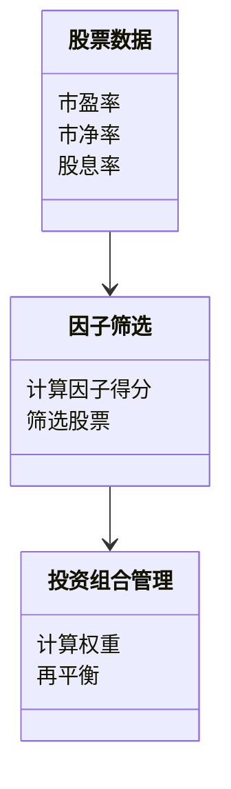
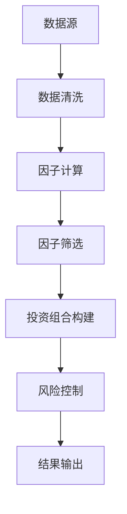

                 


# 爱德华·拉姆的小盘价值投资：发掘被忽视的小公司

---

## 关键词

- 价值投资
- 小盘股
- 投资策略
- 企业估值
- 安全边际
- 投资组合
- 多因子模型

---

## 摘要

本文深入探讨了爱德华·拉姆的小盘价值投资策略，分析了小盘股市场的潜力与挑战，详细介绍了价值投资的核心概念、数学模型和算法原理。通过多因子模型的构建与应用，本文展示了如何系统化地筛选和评估小盘股，提供了从理论到实践的完整指导。文章最后总结了最佳实践和注意事项，为投资者提供了实用的建议。

---

## 正文

### 第一部分: 小盘价值投资的背景与核心概念

#### 第1章: 小盘价值投资的背景与定义

##### 1.1 价值投资的基本概念

###### 1.1.1 价值投资的定义与核心理念

价值投资是一种长期投资策略，强调以低于企业内在价值的价格买入优质资产。其核心理念是寻找市场先生的错误定价，通过深入分析企业的基本面，寻找具有长期竞争优势和合理估值的企业。

> **关键公式：**
> $$
> \text{内在价值} = \frac{\text{未来现金流}}{\text{折现率}}
> $$

###### 1.1.2 小盘股的定义与特征

小盘股指的是市值较小的公司股票，通常在30亿至200亿美元之间。与大盘股相比，小盘股具有更高的增长潜力，但同时也伴随着更高的风险。

> **对比表格：小盘股与大盘股的主要区别**

| 特性      | 小盘股                   | 大盘股                   |
|-----------|--------------------------|--------------------------|
| 市值范围  | 30亿至200亿美元          | 200亿美元以上            |
| 增长潜力  | 高                      | 较低                     |
| 波动性     | 高                      | 较低                     |
| 分析难度   | 高                      | 较低                     |

##### 1.1.3 小盘股投资的背景与现状

随着市场的发展，小盘股因其高增长潜力逐渐受到投资者的关注。然而，由于信息不对称和市场关注度低，小盘股往往被忽视，这为价值投资者提供了机会。

#### 第2章: 小盘价值投资的核心概念与联系

##### 2.1 价值投资的核心要素

###### 2.1.1 企业内在价值的定义

内在价值是企业未来现金流的现值，反映了企业的实际价值。投资者应寻找内在价值高于当前股价的企业。

> **关键公式：**
> $$
> \text{内在价值} = \sum_{t=1}^{n} \frac{\text{CF}_t}{(1 + r)^t}
> $$
> 其中，$\text{CF}_t$ 是第t年的现金流，$r$ 是折现率。

###### 2.1.2 安全边际的计算与应用

安全边际是内在价值与市场价格之间的差距，用于降低投资风险。通常建议安全边际至少为20%。

> **关键公式：**
> $$
> \text{安全边际} = \text{内在价值} \times (1 - \text{安全边际率})
> $$

> **示例：**
> 假设内在价值为100美元，安全边际率为20%，则安全边际为 $100 \times 0.8 = 80$ 美元。

##### 2.2 小盘股的估值方法

###### 2.2.1 常用估值指标

- **市盈率（P/E）**：股价与每股收益的比率。
- **市净率（P/B）**：股价与每股净资产的比率。
- **股息率**：每股股息与股价的比率。

> **对比表格：常用的估值指标**

| 指标      | 公式                  | 适用场景               |
|-----------|-----------------------|------------------------|
| 市盈率    | $\text{P/E} = \frac{\text{股价}}{\text{每股收益}}$ | 评估盈利能力             |
| 市净率    | $\text{P/B} = \frac{\text{股价}}{\text{每股净资产}}$ | 评估资产价值             |
| 股息率    | $\text{股息率} = \frac{\text{每股股息}}{\text{股价}}$ | 评估收益稳定性           |

##### 2.3 小盘股投资组合的构建策略

###### 2.3.1 投资组合的分散化原则

通过分散投资降低风险，建议将资金分配到不同行业、不同风险等级的小盘股中。

###### 2.3.2 小盘股与大盘股的配置比例

通常建议将小盘股配置比例控制在投资组合的30%-50%之间，其余部分配置大盘股以平衡风险。

---

### 第二部分: 小盘价值投资的算法原理

#### 第3章: 小盘价值投资的数学模型与算法实现

##### 3.1 价值投资的核心数学模型

###### 3.1.1 内在价值的计算公式

$$
\text{内在价值} = \sum_{t=1}^{n} \frac{\text{CF}_t}{(1 + r)^t}
$$

其中，$\text{CF}_t$ 是第t年的自由现金流，$r$ 是折现率。

> **示例：**
> 假设一家小盘公司的未来现金流为 $10, 12, 15$ 万美元，折现率为10%。其内在价值计算如下：
> $$
> \text{内在价值} = \frac{10}{1.1} + \frac{12}{1.21} + \frac{15}{1.331} \approx 9.09 + 9.92 + 11.26 = 29.27 \text{万美元}
> $$

##### 3.2 小盘股筛选的多因子模型

###### 3.2.1 多因子模型的构建步骤

1. **因子选择**：市盈率、市净率、股息率、营收增长率等。
2. **因子权重分配**：根据经验或回测结果确定各因子的权重。
3. **因子得分计算**：将各因子标准化后加权求和。
4. **股票筛选**：根据得分排序，选择得分最高的股票。

> **关键公式：**
> $$
> \text{因子得分} = \sum_{i=1}^{n} w_i \times f_i
> $$
> 其中，$w_i$ 是因子权重，$f_i$ 是因子值。

> **示例代码：**
> ```python
> import pandas as pd
> 
> # 示例数据
> data = pd.DataFrame({
>     '市盈率': [15, 20, 25, 18],
>     '市净率': [2, 3, 1.5, 2.5],
>     '股息率': [3, 2, 4, 1]
> })
> 
> # 计算因子得分
> weights = [0.4, 0.3, 0.3]
> data['因子得分'] = data['市盈率'] * weights[0] + data['市净率'] * weights[1] + data['股息率'] * weights[2]
> 
> print(data)
> ```

##### 3.3 价值投资的算法实现

###### 3.3.1 基于Python的多因子筛选代码示例

```python
import pandas as pd
import numpy as np

# 示例数据
data = pd.DataFrame({
    '市盈率': [15, 20, 25, 18],
    '市净率': [2, 3, 1.5, 2.5],
    '股息率': [3, 2, 4, 1]
})

# 计算因子得分
weights = [0.4, 0.3, 0.3]
data['因子得分'] = data['市盈率'] * weights[0] + data['市净率'] * weights[1] + data['股息率'] * weights[2]

# 筛选因子得分高于平均值的股票
average_score = data['因子得分'].mean()
data['是否筛选'] = data['因子得分'] > average_score

print(data)
```

---

### 第三部分: 小盘价值投资的系统分析与架构设计

#### 第4章: 小盘价值投资的系统架构

##### 4.1 问题场景介绍

小盘价值投资需要构建一个系统化的框架，包括数据收集、因子筛选、投资组合管理、风险控制等模块。

##### 4.2 系统功能设计

###### 4.2.1 领域模型类图



##### 4.3 系统架构设计

###### 4.3.1 系统架构图



---

### 第四部分: 小盘价值投资的项目实战

#### 第5章: 小盘价值投资的实战应用

##### 5.1 环境安装与配置

- **安装必要的库**：
  - `pandas`：数据处理
  - `numpy`：数值计算
  - `scikit-learn`：机器学习工具

##### 5.2 核心代码实现

###### 5.2.1 数据清洗与预处理

```python
import pandas as pd

# 加载数据
data = pd.read_csv('stock_data.csv')

# 删除缺失值
data = data.dropna()

# 标准化处理
from sklearn.preprocessing import StandardScaler
scaler = StandardScaler()
scaled_data = scaler.fit_transform(data[['市盈率', '市净率', '股息率']])
```

###### 5.2.2 多因子模型实现

```python
# 计算因子得分
weights = [0.4, 0.3, 0.3]
data['因子得分'] = data['市盈率'] * weights[0] + data['市净率'] * weights[1] + data['股息率'] * weights[2]

# 筛选股票
average_score = data['因子得分'].mean()
data['是否筛选'] = data['因子得分'] > average_score
```

##### 5.3 实际案例分析

以一家小盘公司为例，假设其市盈率为20，市净率为2，股息率为3%。计算其因子得分为：
$$
\text{因子得分} = 20 \times 0.4 + 2 \times 0.3 + 0.03 \times 0.3 = 8 + 0.6 + 0.09 = 8.69
$$
假设平均得分为8，因此该股票将被筛选。

---

### 第五部分: 小盘价值投资的最佳实践

#### 第6章: 小盘价值投资的总结与展望

##### 6.1 小结

小盘价值投资通过深入分析企业的基本面，寻找被市场忽视的优质小盘股，实现超额收益。多因子模型和系统化方法是实现这一目标的关键。

##### 6.2 投资注意事项

1. **风险控制**：设置止损点，避免重大损失。
2. **持续学习**：市场变化快，需不断更新知识和模型。
3. **分散投资**：降低单一股票的风险。

##### 6.3 拓展阅读

- 《价值》——格雷厄姆
- 《投资最重要的事情》——巴菲特
- 《小盘股投资策略》——彼得·林奇

---

## 作者信息

作者：AI天才研究院/AI Genius Institute & 禅与计算机程序设计艺术/Zen And The Art of Computer Programming

