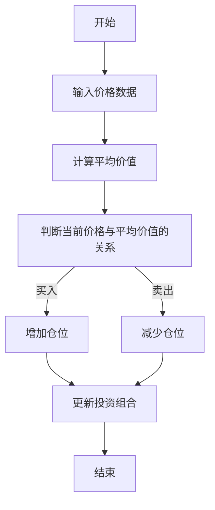
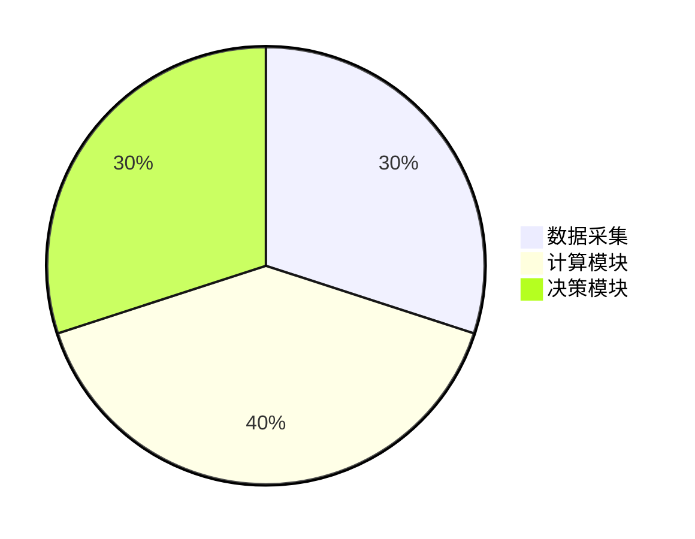
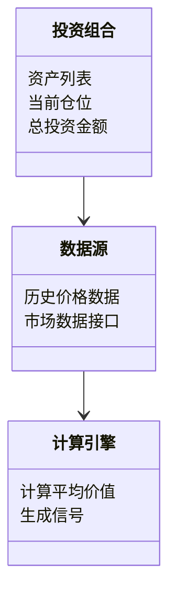
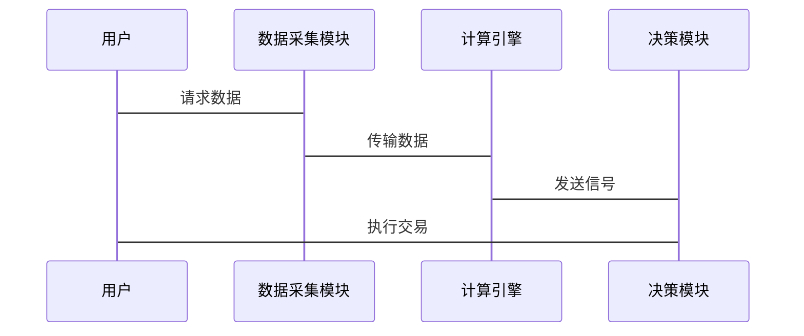

                 


# 爱德华·索普的价值平均投资法

> 关键词：价值平均投资法，爱德华·索普，投资策略，算法原理，系统架构，Python实现

> 摘要：本文深入探讨了爱德华·索普提出的价值平均投资法，从其背景、核心概念、数学模型到实际应用，详细分析了该投资策略的算法原理、系统架构设计及项目实现。通过技术化的分析和系统化的实现，本文为投资者提供了一种优化投资决策的系统化方法。

---

## 第1章: 价值平均投资法的背景与起源

### 1.1 价值平均投资法的起源
1.1.1 爱德华·索普的学术背景  
- 爱德华·索普的学术成就与投资理论研究的渊源。  
- 价值平均投资法的提出背景与动机。  

1.1.2 价值平均投资法的提出背景  
- 传统投资理论的局限性。  
- 市场波动与资产价值的关系。  

1.1.3 价值平均投资法的核心思想  
- 基于平均价值的投资策略。  
- 市场低估时买入，高估时卖出的思路。

---

### 1.2 投资学基础
1.2.1 投资的基本概念  
- 资产、投资、风险、收益等基本术语的定义。  

1.2.2 传统投资理论与方法  
- 基本分析与技术分析的区别。  
- 均值回归与随机游走理论的对比。  

1.2.3 现代投资组合理论的局限性  
- 传统投资组合理论的假设与实际市场的差异。  
- 价值平均投资法的创新点。

---

### 1.3 价值平均投资法的基本概念
1.3.1 价值平均法的定义  
- 通过计算资产的平均价值来指导投资决策。  

1.3.2 价值平均法的核心假设  
- 市场价格围绕平均价值波动。  
- 市场参与者的行为导致价格偏离平均价值。  

1.3.3 价值平均法与传统投资方法的区别  
- 与价值投资、趋势投资的对比。  

---

## 第2章: 价值平均投资法的核心概念与联系

### 2.1 价值平均法的数学模型
2.1.1 价值平均法的数学表达式  
- 平均价值的计算公式：$$ \text{平均价值} = \frac{\text{历史价格的总和}}{\text{时间跨度}} $$  
- 投资决策的条件判断：  
  - 如果当前价格 < 平均价值，买入。  
  - 如果当前价格 > 平均价值，卖出。  

2.1.2 价值平均法的计算公式  
- 动态调整平均价值的计算方法。  
- 市场价格与平均价值的偏离程度分析。  

2.1.3 价值平均法的变量与参数  
- 历史价格数据、时间窗口、调整因子等。  

---

### 2.2 核心概念对比分析
2.2.1 价值平均法与均值回归的对比  
- 均值回归的核心思想与价值平均法的相似性。  
- 两者的区别与应用场景。  

2.2.2 价值平均法与趋势投资的对比  
- 趋势投资的理论基础与价值平均法的差异。  
- 两种方法的优缺点对比。  

2.2.3 价值平均法与价值投资的对比  
- 价值投资的核心理念与价值平均法的联系。  
- 两者的区别与互补性。

---

### 2.3 价值平均法的实体关系图
2.3.1 投资组合的实体关系  
- 投资组合、资产、价格数据等实体的定义与关系。  

2.3.2 价值平均法的流程图  


2.3.3 价值平均法的系统架构图  


---

## 第3章: 价值平均投资法的算法原理

### 3.1 价值平均法的算法流程
3.1.1 数据输入  
- 获取历史价格数据的时间范围和频率。  

3.1.2 计算平均价值  
- 滑动窗口法计算平均价值：$$ \text{平均价值}_t = \frac{1}{n}\sum_{i=t-n}^{t-1} P_i $$  
- 动态调整平均价值的计算方式。  

3.1.3 投资决策  
- 判断当前价格与平均价值的关系，决定买入或卖出。  

3.1.4 交易执行  
- 执行交易指令，调整投资组合。  

---

### 3.2 价值平均法的数学模型
3.2.1 计算平均价值的公式  
- 简单平均法与加权平均法的对比。  
- 动态调整的权重系数设计。  

3.2.2 投资决策的条件判断  
- 买入条件：$$ P_t < \text{平均价值}_t $$  
- 卖出条件：$$ P_t > \text{平均价值}_t $$  

3.2.3 交易执行的规则  
- 仓位调整的百分比计算。  
- 成本与滑点的考虑。  

---

### 3.3 价值平均法的Python实现
3.3.1 环境安装与配置  
- 安装Python和相关库（numpy, pandas, matplotlib）。  

3.3.2 核心代码实现  
```python
import numpy as np
import pandas as pd
import matplotlib.pyplot as plt

def value_average Strategy(prices, window=20):
    # 计算滑动平均价值
    avg_price = prices.rolling(window=window).mean()
    # 判断买入和卖出信号
    buy_signal = (prices < avg_price)
    sell_signal = (prices > avg_price)
    return buy_signal, sell_signal

# 示例数据
prices = pd.DataFrame({
    '价格': [100, 105, 98, 102, 104, 101]
})
buy, sell = value_averageStrategy(prices, window=3)
print("买入信号:", buy)
print("卖出信号:", sell)
```

3.3.3 代码功能解读与分析  
- 数据输入与处理。  
- 平均价值的计算。  
- 信号生成与策略执行。  

---

## 第4章: 价值平均投资法的系统分析与架构设计

### 4.1 系统应用场景
4.1.1 价值平均投资系统的使用场景  
- 股票投资、基金投资、商品期货等。  

4.1.2 系统的主要功能模块  
- 数据采集模块。  
- 计算模块。  
- 决策模块。  

---

### 4.2 系统功能设计
4.2.1 领域模型（领域模型类图）  


4.2.2 系统架构设计（系统架构图）  
```mermaid
container 投资系统 {
    数据采集模块
    计算引擎
    决策模块
}
```

4.2.3 系统接口设计  
- 数据接口：从数据库或API获取价格数据。  
- 计算接口：调用计算引擎的平均价值计算功能。  
- 决策接口：根据信号执行交易。  

---

### 4.3 系统交互设计（系统交互流程图）  


---

## 第5章: 价值平均投资法的项目实战

### 5.1 环境安装与配置
5.1.1 安装Python环境  
- 安装Anaconda或Python 3.x。  

5.1.2 安装相关库  
- 使用pip安装numpy、pandas、matplotlib。  

---

### 5.2 核心代码实现
5.2.1 数据采集模块  
```python
import pandas_datareader as pdr

# 下载股票数据
data = pdr.get_data_yahoo('AAPL', start='2020-01-01', end='2023-12-31')
print(data.head())
```

5.2.2 计算模块  
```python
def calculate_value_average(prices, window=20):
    return prices.rolling(window).mean()

avg_price = calculate_value_average(data['Adj Close'])
print(avg_price)
```

5.2.3 决策模块  
```python
def generate_signals(prices, avg_price):
    buy = prices < avg_price
    sell = prices > avg_price
    return buy, sell

buy, sell = generate_signals(data['Adj Close'], avg_price)
print(buy, sell)
```

---

### 5.3 案例分析与策略实现
5.3.1 实际案例分析  
- 使用苹果股票（AAPL）作为示例，展示价值平均策略的实际应用。  

5.3.2 策略回测与分析  
- 计算策略的收益与回撤。  
- 对比其他投资策略的表现。  

---

## 第6章: 价值平均投资法的最佳实践与总结

### 6.1 小结
- 价值平均投资法的核心思想与实际应用。  
- 系统化投资策略的优势。

---

### 6.2 注意事项
- 数据质量与来源的可靠性。  
- 系统实现中的成本与滑点问题。  
- 市场波动与策略的有效性。

---

### 6.3 拓展阅读
- 推荐的相关书籍与论文。  
- 进一步的研究方向与优化点。

---

## 作者：AI天才研究院 & 禅与计算机程序设计艺术

---

通过以上目录和内容安排，读者可以系统地理解爱德华·索普的价值平均投资法，并通过实际案例和代码实现，掌握如何将这一策略应用到实际投资中。

