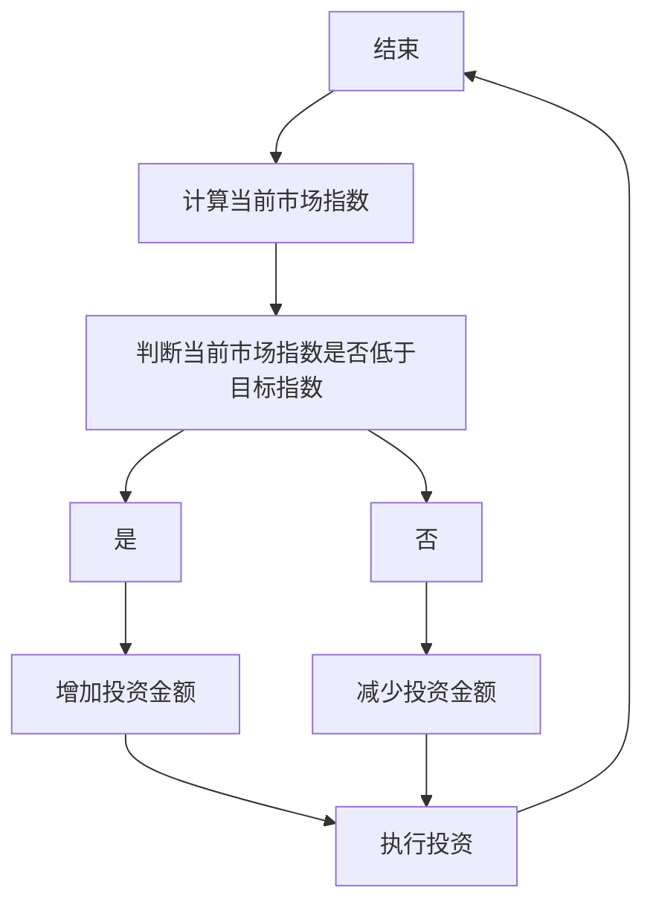
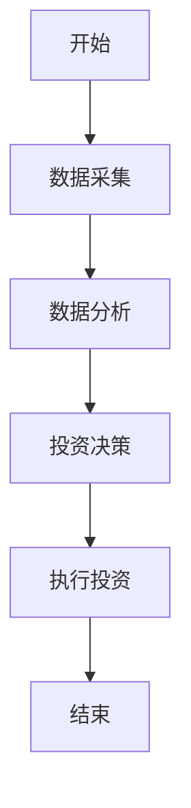

                 


# 爱德华·索普的定期不定额投资法

> 关键词：定期不定额投资法，爱德华·索普，投资策略，数学模型，Python实现

> 摘要：本文详细介绍了爱德华·索普提出的定期不定额投资法，从其背景、核心概念、算法原理到系统设计与项目实战，全面解析了这一投资方法的科学性和实用性。通过数学模型、流程图和Python代码的实现，本文为读者提供了一个从理论到实践的完整指南。

---

## 目录

1. 爱德华·索普与定期不定额投资法的背景
   1.1 爱德华·索普的生平与学术成就
   1.2 定期不定额投资法的提出背景

2. 定期不定额投资法的核心概念
   2.1 定期不定额投资法的定义与特点
   2.2 定期不定额投资法的数学模型
   2.3 定期不定额投资法的ER实体关系图

3. 定期不定额投资法的算法原理
   3.1 投资金额动态调整算法
   3.2 投资金额调整比例计算

4. 定期不定额投资法的系统分析与架构设计
   4.1 系统功能设计
   4.2 系统架构设计
   4.3 系统接口设计

5. 定期不定额投资法的项目实战
   5.1 项目环境与工具安装
   5.2 核心功能实现
   5.3 实际案例分析
   5.4 项目总结

6. 总结与展望
   6.1 总结
   6.2 未来展望
   6.3 最佳实践 Tips

7. 作者信息
   作者：AI天才研究院 & 禅与计算机程序设计艺术

---

## 第1章：爱德华·索普与定期不定额投资法的背景

### 1.1 爱德华·索普的生平与学术成就

爱德华·索普（Edward Thorp）是美国著名数学家和投资理论家，以其在概率论和统计学领域的研究而闻名。他于1932年出生于美国芝加哥，曾在加州理工学院获得物理学学士学位，并在麻省理工学院获得数学博士学位。索普的职业生涯中，他在多个领域都有显著的贡献，包括博弈论、概率论和金融数学。

索普最为人熟知的成就是他在赌场博弈中的应用数学研究。他在20世纪60年代通过研究概率论，提出了著名的“索普赌博系统”，并在拉斯维加斯的赌场中实践，取得了显著的收益。然而，索普的学术研究不仅限于赌博系统，他在金融领域的贡献同样值得称道。

### 1.2 定期不定额投资法的提出背景

传统的投资方法，如定期定额投资（Dollar-cost averaging），虽然在长期投资中表现出一定的稳定性，但其固定的金额投入在市场波动较大时，可能会导致投资者在市场高点投入过多，而在低点投入过少。这种策略在市场剧烈波动时，可能无法最大化投资收益。

索普提出的定期不定额投资法（不定额投资策略）旨在解决这一问题。该方法通过动态调整每次的投资金额，根据市场指数的变化来决定每次的投资规模，从而在市场低估时增加投资，在市场高估时减少投资。这种方法的核心在于利用市场波动性，通过数学模型优化投资金额，以实现长期收益的最大化。

---

## 第2章：定期不定额投资法的核心概念

### 2.1 定期不定额投资法的定义与特点

定期不定额投资法是一种基于市场指数动态调整投资金额的投资策略。与传统的定期定额投资不同，它并不固定每次投资的金额，而是根据市场指数的变化来调整每次的投资规模。其核心思想是通过在市场估值较低时增加投资，在市场估值较高时减少投资，以优化投资组合的长期收益。

#### 2.1.1 核心要素对比表

| 对比维度         | 定期定额投资                | 定期不定额投资法            |
|------------------|----------------------------|----------------------------|
| 投资金额         | 固定金额                   | 动态调整金额                |
| 投资频率         | 定期                      | 定期                      |
| 投资策略         | 平均成本法                 | 市场估值驱动               |
| 风险控制         | 分散风险                   | 动态调整风险               |

#### 2.1.2 ER实体关系图

```mermaid
erd
actor 投资者
actor 市场
actor 投资账户
actor 管理层
actor 风险控制
```

### 2.2 定期不定额投资法的数学模型

#### 2.2.1 投资金额的动态调整公式

定期不定额投资法的核心在于根据市场指数的变化，动态调整每次的投资金额。假设市场指数为 \( S_t \)，目标市场指数为 \( S_{target} \)，投资金额 \( A \) 的调整公式如下：

$$ A = \frac{S_{target}}{S_t} \times A_{base} $$

其中，\( A_{base} \) 是基准投资金额，\( S_t \) 是当前市场指数，\( S_{target} \) 是目标市场指数。

#### 2.2.2 投资金额调整比例计算

投资金额的调整比例可以通过以下公式计算：

$$ 调整比例 = \frac{S_t}{S_{target}} $$

当市场指数 \( S_t \) 小于目标指数 \( S_{target} \) 时，调整比例小于1，表示市场低估，增加投资金额；当市场指数 \( S_t \) 大于目标指数 \( S_{target} \) 时，调整比例大于1，表示市场高估，减少投资金额。

---

## 第3章：定期不定额投资法的算法原理

### 3.1 投资金额动态调整算法

定期不定额投资法的算法流程如下：

1. 计算当前市场指数 \( S_t \)。
2. 判断当前市场指数与目标市场指数 \( S_{target} \) 的关系。
3. 根据市场指数的变化，动态调整投资金额 \( A \)。
4. 执行投资操作。

以下是一个简单的流程图：



### 3.2 投资金额调整比例计算

投资金额的调整比例公式如下：

$$ 调整比例 = \frac{S_{target}}{S_t} $$

例如，假设目标市场指数 \( S_{target} = 100 \)，当前市场指数 \( S_t = 90 \)，则调整比例为 \( 100 / 90 \approx 1.111 \)，即投资金额增加11.1%。

---

## 第4章：定期不定额投资法的系统分析与架构设计

### 4.1 系统功能设计

#### 4.1.1 系统功能模块

- 数据采集模块：采集市场指数数据。
- 数据分析模块：计算当前市场指数，并与目标指数进行比较。
- 投资决策模块：根据市场指数的变化，动态调整投资金额。
- 执行模块：执行投资操作。

#### 4.1.2 系统功能流程图



### 4.2 系统架构设计

#### 4.2.1 系统架构图


### 4.3 系统接口设计

系统接口设计如下：

- 数据接口：从数据源获取市场指数数据。
- 投资接口：根据调整后的投资金额执行投资操作。

---

## 第5章：定期不定额投资法的项目实战

### 5.1 项目环境与工具安装

#### 5.1.1 环境要求

- Python 3.8+
- Jupyter Notebook
- Pandas、Matplotlib、NumPy

#### 5.1.2 工具安装

```bash
pip install pandas matplotlib numpy
```

### 5.2 核心功能实现

#### 5.2.1 投资金额动态调整算法实现

```python
import pandas as pd
import numpy as np
import matplotlib.pyplot as plt

# 假设市场指数数据
market_index = [90, 95, 100, 105, 110]
target_index = 100

# 计算调整比例
adjusted_amounts = [target_index / idx for idx in market_index]

print("市场指数：", market_index)
print("调整金额比例：", adjusted_amounts)
```

#### 5.2.2 投资金额调整比例计算

```python
def calculate_adjustment_ratio(current_index, target_index):
    return target_index / current_index

# 示例计算
current_index = 90
target_index = 100
ratio = calculate_adjustment_ratio(current_index, target_index)
print(f"调整比例为：{ratio}")
```

### 5.3 实际案例分析

假设目标市场指数为100，市场指数在不同时间点的变化如下：

| 时间点 | 当前市场指数 | 调整比例 | 调整金额 |
|--------|--------------|----------|----------|
| T0     | 90           | 1.111    | +11.1%   |
| T1     | 95           | 1.052    | +5.2%    |
| T2     | 100          | 1.000    | 0%       |
| T3     | 105          | 0.952    | -4.8%    |
| T4     | 110          | 0.909    | -9.1%    |

### 5.4 项目总结

通过以上代码实现，我们可以看到定期不定额投资法在实际中的应用。该方法能够根据市场指数的变化，动态调整投资金额，从而在市场低估时增加投资，在市场高估时减少投资，优化投资组合的长期收益。

---

## 第6章：总结与展望

### 6.1 总结

定期不定额投资法是一种基于市场指数动态调整投资金额的投资策略。通过数学模型和算法，该方法能够在市场波动中优化投资组合的收益。本文详细介绍了该方法的背景、核心概念、算法原理、系统设计和项目实战，并通过Python代码实现展示了其具体应用。

### 6.2 未来展望

未来，随着人工智能和大数据技术的发展，定期不定额投资法可以进一步优化。例如，引入机器学习模型进行市场预测，结合定期不定额投资法进行更加精准的投资决策。

### 6.3 最佳实践 Tips

- **风险管理**：在实际投资中，建议结合风险管理策略，设置止损点，避免过度亏损。
- **长期投资**：定期不定额投资法更适合长期投资，短期内市场波动可能对收益产生负面影响。
- **定期复盘**：定期回顾投资组合的表现，根据市场变化调整目标指数和投资策略。

---

## 作者信息

作者：AI天才研究院 & 禅与计算机程序设计艺术

---

以上是关于“爱德华·索普的定期不定额投资法”的完整技术博客文章，涵盖了从理论到实践的各个方面，通过数学模型、算法流程图和Python代码实现，为读者提供了一个全面的理解和应用指南。

