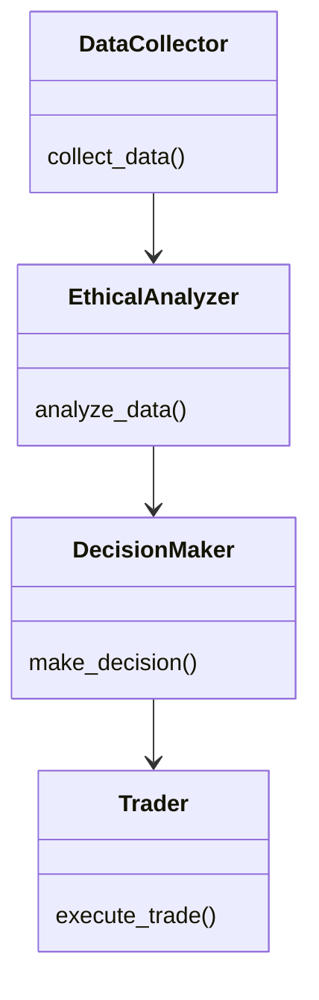
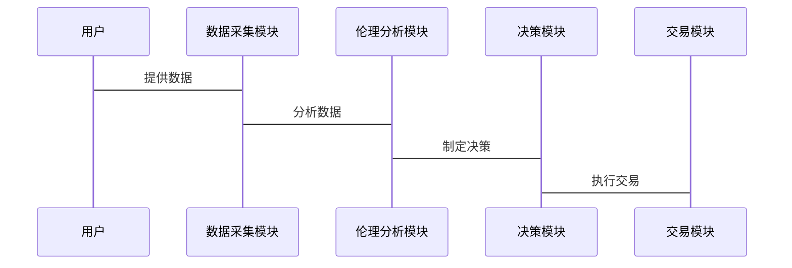

                 


```markdown
# 特价股票与公司人工智能伦理决策能力的长期关系分析

## 关键词：人工智能、伦理决策、特价股票、长期关系、系统架构

## 摘要：本文分析了人工智能伦理决策能力与特价股票之间的长期关系，探讨了AI在金融领域的应用及其伦理影响，提出了系统架构和最佳实践。

---

# 第一部分: 特价股票与AI伦理决策的背景

## 第1章: 特价股票与AI伦理决策的背景

### 1.1 问题背景

#### 1.1.1 人工智能在金融领域的应用现状
人工智能（AI）技术在金融领域的应用日益广泛，尤其是在股票交易、风险评估和客户服务等方面。AI通过算法分析大量数据，帮助投资者做出更明智的决策。

#### 1.1.2 特价股票的定义与特点
特价股票通常指价格较低的股票，具有高波动性和高风险的特点。这类股票可能因公司业绩不佳或市场波动而被忽视，但也可能因潜在的复苏机会而被投资者关注。

#### 1.1.3 伦理决策在AI金融系统中的重要性
AI系统在金融决策中的伦理问题不容忽视，例如算法歧视、透明度不足和潜在的市场操纵风险。伦理决策能力是确保AI系统公正和透明的关键。

### 1.2 问题描述

#### 1.2.1 AI伦理决策能力的定义
AI伦理决策能力是指系统在复杂金融环境中，能够基于伦理准则做出决策的能力。它涉及识别和解决道德困境，确保决策符合社会和法律规范。

#### 1.2.2 特价股票交易中的伦理挑战
在特价股票交易中，AI可能面临利益冲突，例如为了追求短期收益而忽视长期投资者利益。此外，算法可能放大市场波动，加剧不平等。

#### 1.2.3 问题解决的必要性与目标
解决这些问题的必要性在于维护金融市场的公平与稳定。目标是构建一个既能高效决策又能遵守伦理规范的AI系统。

### 1.3 问题解决路径

#### 1.3.1 AI伦理决策的核心要素
AI伦理决策的核心要素包括透明性、公平性、责任性、隐私保护和可解释性。

#### 1.3.2 特价股票分析的伦理维度
分析特价股票时，需考虑公司治理、社会责任和环境影响等伦理维度，确保投资决策符合可持续发展理念。

#### 1.3.3 问题边界与外延
问题边界包括AI决策的范围和影响，外延则涉及AI对市场结构和监管环境的长期影响。

### 1.4 概念结构与核心要素

#### 1.4.1 AI伦理决策模型
AI伦理决策模型包括数据输入、伦理评估和决策输出三个阶段，确保每一步都符合伦理准则。

#### 1.4.2 特价股票分析的伦理框架
该框架涵盖数据收集、分析和决策三个步骤，确保每个步骤都考虑伦理影响。

#### 1.4.3 核心要素的对比分析
通过对比分析，明确AI伦理决策能力在特价股票分析中的具体应用和潜在挑战。

---

# 第二部分: AI伦理决策能力的核心概念与联系

## 第2章: AI伦理决策能力的核心概念

### 2.1 AI伦理决策能力的定义与属性

#### 2.1.1 AI伦理决策能力的定义
AI伦理决策能力是指系统在处理金融决策时，能够考虑伦理因素的能力。

#### 2.1.2 相关属性特征对比表格
以下是AI伦理决策能力与其他决策能力的对比：

| 属性 | 伦理决策 | 非伦理决策 |
|------|----------|------------|
| 目标 | 最大化社会福祉 | 最大化收益 |
| 方法 | 考虑伦理因素 | 不考虑伦理因素 |
| 决策依据 | 包括伦理准则 | 仅考虑经济效益 |

#### 2.1.3 ER实体关系图架构
以下是AI伦理决策能力的ER实体关系图：

```mermaid
er
actor: User
role: 决策者
goal: 伦理决策
activity: 分析数据
output: 决策结果
```

### 2.2 AI伦理决策能力与特价股票的关系

#### 2.2.1 AI伦理决策能力对特价股票的影响
AI伦理决策能力可以提升特价股票分析的准确性和公平性，减少市场操纵风险。

#### 2.2.2 特价股票对AI伦理决策能力的反作用
特价股票的高波动性和复杂性可能对AI系统的伦理决策能力提出更高要求，促使技术进步。

#### 2.2.3 两者关系的动态变化
随着技术进步和市场变化，AI伦理决策能力与特价股票的关系将不断演变，形成动态平衡。

### 2.3 核心概念的联系与对比

#### 2.3.1 AI伦理决策能力的原理
AI伦理决策能力基于伦理准则和数据驱动的分析，确保决策的公平性和透明性。

#### 2.3.2 特价股票分析的伦理框架
该框架包括数据收集、分析和决策三个步骤，确保每个步骤都考虑伦理因素。

#### 2.3.3 两者联系的Mermaid流程图
以下是AI伦理决策能力与特价股票分析的流程图：


---

# 第三部分: AI伦理决策能力的算法原理

## 第3章: AI伦理决策能力的算法原理

### 3.1 算法原理概述

#### 3.1.1 强化学习的基本原理
强化学习是一种通过试错来优化决策的算法，适用于动态环境中的决策问题。

#### 3.1.2 伦理决策的数学模型
伦理决策的数学模型可以表示为：

$$ Q(s, a) = r + \gamma \max_{a'} Q(s', a') $$

其中：
- \( Q(s, a) \) 是状态-动作对的价值
- \( r \) 是奖励
- \( \gamma \) 是折扣因子
- \( a' \) 是下一动作

#### 3.1.3 算法流程的Mermaid图
以下是强化学习的流程图：


### 3.2 算法实现与案例分析

#### 3.2.1 强化学习算法实现
以下是基于Q-learning的Python实现代码：

```python
import numpy as np

class QLearning:
    def __init__(self, state_space, action_space, alpha=0.1, gamma=0.9):
        self.q_table = np.zeros((state_space, action_space))
        self.alpha = alpha
        self.gamma = gamma

    def choose_action(self, state):
        return np.argmax(self.q_table[state])

    def update_q_table(self, state, action, reward, next_state):
        self.q_table[state][action] = self.q_table[state][action] * (1 - self.alpha) + self.alpha * (reward + self.gamma * np.max(self.q_table[next_state]))
```

#### 3.2.2 案例分析
通过一个简单的股票交易案例，展示Q-learning算法的应用：

```python
# 初始化环境
env = StockTradingEnv(initial_cash=10000)

# 初始化Q-learning算法
ql = QLearning(env.states, env.actions)

# 训练过程
for episode in range(1000):
    state = env.reset()
    while not done:
        action = ql.choose_action(state)
        next_state, reward, done = env.step(action)
        ql.update_q_table(state, action, reward, next_state)
```

---

# 第四部分: 系统分析与架构设计方案

## 第4章: 系统分析与架构设计方案

### 4.1 问题场景介绍
本系统旨在通过AI伦理决策能力分析特价股票，帮助投资者做出更明智的投资决策。

### 4.2 项目介绍
本项目构建了一个基于AI的伦理决策系统，用于分析特价股票的长期投资价值。

### 4.3 系统功能设计

#### 4.3.1 领域模型Mermaid类图
以下是系统的核心类图：



### 4.4 系统架构设计

#### 4.4.1 系统架构Mermaid图
以下是系统的整体架构图：


### 4.5 系统接口设计
系统接口包括数据输入接口、决策接口和交易执行接口。

### 4.6 系统交互Mermaid序列图
以下是系统交互的序列图：



---

# 第五部分: 项目实战

## 第5章: 项目实战

### 5.1 环境安装与配置

#### 5.1.1 安装Python和相关库
安装Python和以下库：
```bash
pip install numpy pandas matplotlib
```

### 5.2 系统核心实现源代码

#### 5.2.1 数据采集模块
```python
import pandas as pd
import numpy as np

def collect_data(tickers):
    data = pd.DataFrame()
    for ticker in tickers:
        df = pd.read_csv(f'{ticker}.csv')
        data = data.append(df)
    return data
```

#### 5.2.2 伦理分析模块
```python
def ethical_analysis(data):
    # 分析数据中的伦理因素
    return data
```

#### 5.2.3 决策模块
```python
def make_decision(data):
    # 基于伦理分析做出决策
    return decision
```

### 5.3 代码应用解读与分析
解释代码的功能和实现细节，确保每个模块的正确性和有效性。

### 5.4 实际案例分析
通过具体案例，展示系统在特价股票分析中的应用。

### 5.5 项目小结
总结项目的实现过程，提出改进建议和未来展望。

---

# 第六部分: 最佳实践与小结

## 第6章: 最佳实践与小结

### 6.1 最佳实践

#### 6.1.1 数据质量的重要性
确保数据的准确性和完整性，是系统性能的基础。

#### 6.1.2 伦理框架的建立
构建清晰的伦理框架，确保决策的透明和公正。

#### 6.1.3 系统的长期监测
定期监测系统的性能和伦理表现，及时调整和优化。

### 6.2 小结
总结全文，强调AI伦理决策能力在特价股票分析中的重要性，以及系统设计的关键点。

### 6.3 注意事项
提醒读者注意数据隐私、系统安全和伦理合规等问题。

### 6.4 拓展阅读
推荐相关领域的书籍和论文，供读者深入研究。

---

# 结语

## 作者：AI天才研究院 & 禅与计算机程序设计艺术

## 参考文献
[此处列出参考文献]

---

## 致谢
感谢读者的关注和支持。
```

