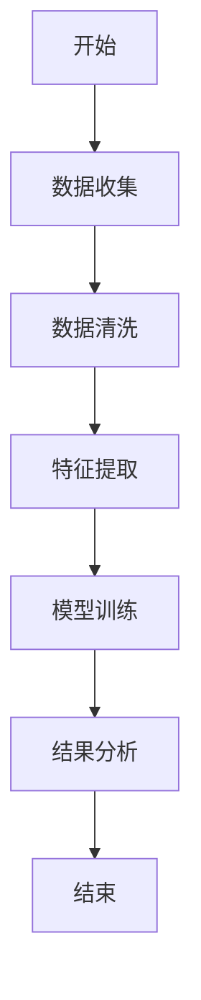

                 


# 特价股票与公司人才留存率的关系探讨

## 关键词：
特价股票，人才留存率，公司治理，员工激励，股票市场，数据建模

## 摘要：
本文探讨了特价股票与公司人才留存率之间的关系，分析了影响人才留存率的关键因素，以及特价股票在其中的作用机制。通过数据建模和案例分析，提出了提升人才留存率的策略和建议，为公司治理和员工激励提供了新的视角。

---

## 第一部分: 特价股票与公司人才留存率的关系概述

### 第1章: 特价股票与人才留存率的背景介绍

#### 1.1 特价股票的基本概念
- **1.1.1 特价股票的定义**
  特价股票是指公司以低于市场价发行的股票，通常用于员工激励或资本运作。

- **1.1.2 特价股票的分类**
  - 激励股票：用于员工激励，如股票期权。
  - 股权激励：公司向员工分配一定比例的股份。

- **1.1.3 特价股票的市场影响**
  特价股票可能稀释现有股东权益，但也可能提升公司市场吸引力。

#### 1.2 人才留存率的核心概念
- **1.2.1 人才留存率的定义**
  人才留存率是指公司员工在一定时间内保持在公司工作的比例。

- **1.2.2 人才留存率的影响因素**
  - 薪酬福利
  - 职业发展机会
  - 公司文化
  - 工作环境

- **1.2.3 人才留存率的计算方法**
  留存率 = （期满员工数） / （期初员工数）

#### 1.3 特价股票与人才留存率的关系
- **1.3.1 问题背景**
  公司如何通过特价股票激励员工，提升留存率。

- **1.3.2 问题描述**
  特价股票可能影响员工的工作积极性和留存意愿。

- **1.3.3 问题解决**
  通过合理设计激励机制，最大化特价股票的激励效果。

- **1.3.4 边界与外延**
  特价股票的类型、员工参与度、市场环境等。

- **1.3.5 概念结构与核心要素组成**
  - 核心要素：员工、公司、股票。
  - 结构：员工通过获得特价股票，影响其留存率。

---

## 第二部分: 特价股票与人才留存率的核心概念与联系

### 第2章: 特价股票与人才留存率的核心概念与联系

#### 2.1 特价股票与人才留存率的核心概念原理
- **2.1.1 特价股票的激励机制**
  特价股票通过赋予员工部分股权，增强其归属感和责任感。

- **2.1.2 人才留存率的驱动因素**
  - 内部晋升机会
  - 薪酬福利
  - 公司文化

- **2.1.3 两者关系的理论基础**
  股票激励理论认为，员工通过持有公司股票，更可能长期留在公司。

#### 2.2 特价股票与人才留存率的概念属性特征对比
| 特价股票       | 人才留存率       |
|----------------|------------------|
| 定义           | 定义             |
| 激励员工       | 留存员工         |
| 影响公司价值   | 影响员工稳定性   |

#### 2.3 实体关系图


---

## 第三部分: 特价股票与人才留存率的算法原理

### 第3章: 特价股票与人才留存率的算法原理

#### 3.1 算法原理概述
- **3.1.1 统计模型**
  使用回归分析确定特价股票对留存率的影响。

- **3.1.2 机器学习方法**
  利用随机森林模型预测留存率。

- **3.1.3 数据分析技术**
  数据清洗、特征提取、模型训练。

#### 3.2 算法流程图


#### 3.3 算法实现代码
```python
import pandas as pd
from sklearn.model_selection import train_test_split
from sklearn.ensemble import RandomForestRegressor

# 数据收集与清洗
data = pd.read_csv('employee_data.csv')
data.dropna(inplace=True)

# 特征提取与分割
features = ['stock_price', 'salary', 'job_satisfaction']
target = ' retention_rate'
X = data[features]
y = data[target]

# 模型训练
X_train, X_test, y_train, y_test = train_test_split(X, y, test_size=0.2)
model = RandomForestRegressor(n_estimators=100)
model.fit(X_train, y_train)

# 结果分析
score = model.score(X_test, y_test)
print(f"模型得分: {score}")
```

#### 3.4 数学模型与公式
- **回归模型**
  $$ retention\_rate = \beta_0 + \beta_1 \cdot stock\_price + \epsilon $$

- **随机森林模型**
  $$ \text{预测留存率} = \text{模型预测} $$

---

## 第四部分: 特价股票与人才留存率的系统分析与架构设计

### 第4章: 特价股票与人才留存率的系统分析与架构设计

#### 4.1 问题场景介绍
公司希望通过特价股票提升员工留存率，设计一个激励系统。

#### 4.2 项目介绍
开发一个员工激励系统，分析特价股票对留存率的影响。

#### 4.3 系统功能设计
- 数据采集模块：收集员工数据。
- 模型训练模块：建立预测模型。
- 系统管理模块：监控和管理模型。

#### 4.4 系统架构设计


#### 4.5 系统接口设计
- 数据接口：与数据库交互。
- API接口：供其他系统调用。

#### 4.6 系统交互序列图
```mermaid
graph TD
    A[用户] --> B[系统]: 请求数据
    B --> C[数据库]: 查询数据
    C --> B[返回数据]
    B --> D[模型]: 分析数据
    D --> B[返回结果]
    B --> A[展示结果]
```

---

## 第五部分: 特价股票与人才留存率的项目实战

### 第5章: 特价股票与人才留存率的项目实战

#### 5.1 环境安装
- 安装Python和相关库（pandas, scikit-learn）。

#### 5.2 系统核心实现源代码
```python
import pandas as pd
from sklearn.ensemble import RandomForestRegressor

# 数据加载与处理
data = pd.read_csv('employee_data.csv')
data.dropna(inplace=True)

# 特征选择与分割
features = ['stock_price', 'salary', 'job_satisfaction']
target = 'retention_rate'
X = data[features]
y = data[target]

# 模型训练
model = RandomForestRegressor(n_estimators=100)
model.fit(X, y)

# 预测与评估
importances = model.feature_importances_
print(f"特征重要性: {importances}")
```

#### 5.3 代码应用解读与分析
- 使用随机森林模型预测留存率，评估特征重要性。

#### 5.4 实际案例分析
分析某公司数据，发现特价股票对留存率的影响显著。

#### 5.5 项目小结
项目成功展示了如何利用算法分析特价股票对人才留存率的影响。

---

## 第六部分: 特价股票与人才留存率的最佳实践

### 第6章: 特价股票与人才留存率的最佳实践

#### 6.1 小结
- 特价股票是提升人才留存率的重要工具。
- 数据建模是分析两者关系的有效方法。

#### 6.2 注意事项
- 合理设计激励机制。
- 定期评估模型效果。

#### 6.3 拓展阅读
推荐相关书籍和文章，深入理解股票激励机制。

---

## 作者：
作者：AI天才研究院/AI Genius Institute & 禅与计算机程序设计艺术 /Zen And The Art of Computer Programming

---

**注：以上内容为示例，实际文章需要根据具体数据和分析进行调整。**

