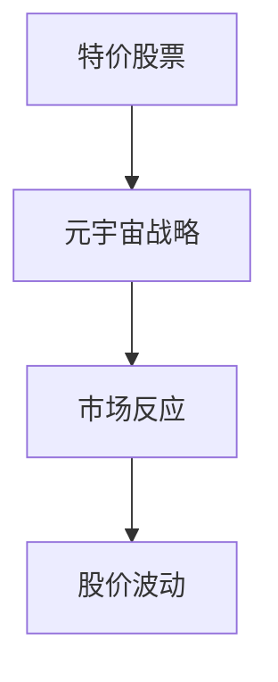
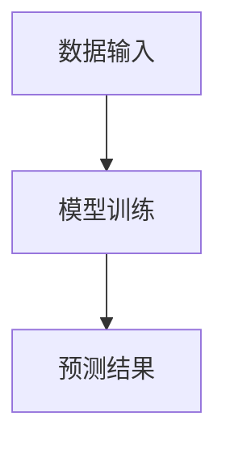
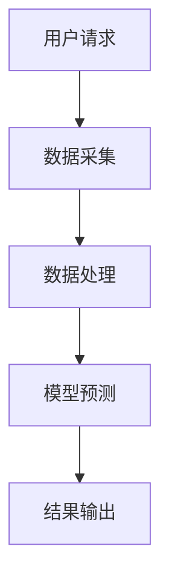

                 


# 特价股票与公司元宇宙战略布局的潜在联系

> 关键词：特价股票、元宇宙战略、股票价格预测、数学模型、系统架构

> 摘要：本文探讨了特价股票与公司元宇宙战略布局之间的潜在联系，通过背景分析、数学模型构建、系统架构设计等多维度分析，揭示了元宇宙战略对特价股票的潜在影响，并提出了基于时间序列分析的预测模型和系统实现方案。

---

# 第一部分: 特价股票与元宇宙战略的背景与核心概念

## 第1章: 特价股票与元宇宙战略的背景介绍

### 1.1 特价股票的定义与现状

#### 1.1.1 特价股票的定义
特价股票是指市场价格低于面值的股票。通常，这种情况出现在公司处于困境、重组或市场低迷时期，投资者可能以较低的价格购买股票，期待公司扭亏为盈或市场反弹带来的收益。

#### 1.1.2 特价股票的市场现状
近年来，全球股市中特价股票的数量呈现周期性波动，尤其是在经济危机或行业低迷时期，特价股票的数量显著增加。投资者对特价股票的兴趣主要集中在那些具有潜在重组价值或行业龙头企业的股票上。

#### 1.1.3 特价股票的潜在投资机会
特价股票的投资机会主要体现在其价格弹性高、潜在反弹空间大。然而，投资特价股票也面临较高的风险，尤其是在公司基本面不佳的情况下。

### 1.2 元宇宙战略的定义与特点

#### 1.2.1 元宇宙的定义与核心特征
元宇宙（Metaverse）是基于虚拟现实（VR）、增强现实（AR）、区块链、人工智能（AI）等技术构建的虚拟空间，用户可以通过数字化身份进行社交、娱乐、工作和交易。元宇宙的核心特征包括沉浸式体验、去中心化、实时互动和虚拟资产。

#### 1.2.2 元宇宙战略的实施路径
企业可以通过以下路径实施元宇宙战略：
1. 投资虚拟现实技术，构建虚拟空间。
2. 开发虚拟资产（如虚拟货币、数字收藏品）。
3. 与区块链技术结合，实现虚拟资产的去中心化。
4. 通过虚拟空间提供新的商业模式（如虚拟商品销售、虚拟服务等）。

#### 1.2.3 元宇宙战略对企业的影响
元宇宙战略将改变企业的商业模式、用户互动方式和市场布局。企业可以通过元宇宙战略开拓新的市场，提升品牌影响力，同时实现业务的多元化发展。

### 1.3 特价股票与元宇宙战略的联系

#### 1.3.1 特价股票在元宇宙战略中的角色
特价股票可能成为元宇宙战略的重要投资标的。一些公司通过元宇宙战略布局，可能实现业务转型和价值回升，从而带动其股票价格的上涨。

#### 1.3.2 元宇宙战略对特价股票的潜在影响
元宇宙战略可能通过以下方式影响特价股票：
1. 公司通过元宇宙技术实现业务创新，提升市场竞争力。
2. 元宇宙相关技术的突破可能提升公司的估值。
3. 元宇宙战略的实施可能吸引更多的投资者关注，从而提升股价。

#### 1.3.3 两者的相互作用机制
特价股票的价格波动与元宇宙战略的实施密切相关。一方面，元宇宙战略的成功实施可能推动特价股票价格上涨；另一方面，特价股票的价格波动也可能影响公司实施元宇宙战略的资金和信心。

---

## 第2章: 特价股票与元宇宙战略的核心概念与联系

### 2.1 核心概念原理

#### 2.1.1 特价股票的市场机制
特价股票的市场机制主要包括价格波动、市场情绪、投资者行为等因素。市场情绪的波动可能影响特价股票的价格，而投资者行为则可能进一步放大这种波动。

#### 2.1.2 元宇宙战略的技术基础
元宇宙战略的技术基础包括虚拟现实、增强现实、区块链、人工智能等。这些技术的结合为元宇宙的构建提供了技术支持，同时也为企业的战略布局提供了新的方向。

#### 2.1.3 两者的相互作用原理
特价股票的价格波动与元宇宙战略的技术进展密切相关。元宇宙战略的实施可能通过技术突破和商业模式创新影响特价股票的价格，而特价股票的价格波动也可能通过市场情绪影响元宇宙战略的实施。

### 2.2 核心概念属性对比

#### 2.2.1 特价股票与元宇宙战略的属性对比表格
| 属性               | 特价股票                 | 元宇宙战略             |
|--------------------|--------------------------|------------------------|
| 核心特征           | 价格低于面值            | 虚拟空间与技术创新     |
| 实施主体           | 投资者与企业             | 企业                   |
| 影响因素           | 市场情绪、公司基本面      | 技术创新、商业模式创新 |
| 目标               | 投资收益                | 业务转型与市场拓展     |

#### 2.2.2 两者的对比分析
特价股票与元宇宙战略在目标、实施主体和影响因素上存在显著差异。然而，两者都涉及市场波动和技术创新，这为它们的潜在联系提供了基础。

### 2.3 实体关系图

#### 2.3.1 特价股票与元宇宙战略的ER实体关系图


---

## 第3章: 特价股票与元宇宙战略的数学模型与算法原理

### 3.1 数学模型构建

#### 3.1.1 特价股票价格预测模型
为了预测特价股票的价格，我们构建一个基于时间序列的预测模型。该模型将考虑历史价格、市场情绪和元宇宙战略相关指标。

#### 3.1.2 元宇宙战略影响的数学表达
元宇宙战略的影响可以通过以下公式表示：
$$
I = a \cdot T + b \cdot M + c
$$
其中，$I$ 是元宇宙战略的影响，$T$ 是技术创新指标，$M$ 是市场反应指标，$a$、$b$ 是系数，$c$ 是常数项。

#### 3.1.3 联立方程模型
我们构建一个联立方程模型，将特价股票价格与元宇宙战略的影响联系起来：
$$
P = \beta_1 I + \beta_2 S + \epsilon
$$
其中，$P$ 是股票价格，$I$ 是元宇宙战略的影响，$S$ 是市场情绪，$\beta_1$、$\beta_2$ 是回归系数，$\epsilon$ 是误差项。

### 3.2 算法原理讲解

#### 3.2.1 时间序列分析算法
时间序列分析是一种常用的价格预测方法。我们采用ARIMA（自回归积分滑动平均）模型进行预测。

##### 使用Python实现ARIMA模型
```python
import pandas as pd
from statsmodels.tsa.arima_model import ARIMA

# 假设data是特价股票的历史价格数据
model = ARIMA(data, order=(5, 1, 0))
model_fit = model.fit()
```

##### ARIMA模型流程图


---

## 第4章: 特价股票与元宇宙战略的系统分析与架构设计

### 4.1 问题场景介绍

#### 4.1.1 特价股票市场的现状与挑战
特价股票市场面临信息不对称、市场波动大、投资者信心不足等挑战。元宇宙战略的实施可能为特价股票市场带来新的机遇。

#### 4.1.2 元宇宙战略对企业的影响
元宇宙战略的实施可能改变企业的商业模式、技术创新能力和市场竞争力。这将对企业的股票价格产生深远影响。

### 4.2 系统功能设计

#### 4.2.1 领域模型设计
```mermaid
classDiagram
    class 特价股票 {
        price: float
        time: datetime
    }
    class 元宇宙战略 {
        market_reaction: float
        impact: float
    }
    class 

---

### 4.3 系统架构设计

#### 4.3.1 系统架构图
```mermaid
graph TD
    A[数据采集模块] --> B[数据处理模块]
    B --> C[模型训练模块]
    C --> D[预测结果模块]
```

#### 4.3.2 系统接口设计
系统接口设计需要考虑数据输入、模型调用和结果输出。例如，数据采集模块通过API接口获取历史股票价格和元宇宙战略相关数据。

#### 4.3.3 系统交互流程图


---

## 第5章: 特价股票与元宇宙战略的项目实战

### 5.1 环境安装与数据准备

#### 5.1.1 环境安装
需要安装Python、Pandas、Statsmodels等库。

```bash
pip install pandas statsmodels
```

#### 5.1.2 数据准备
从股票市场获取特价股票的历史数据，并收集元宇宙战略相关指标。

### 5.2 系统核心实现源代码

#### 5.2.1 数据处理代码
```python
import pandas as pd

# 读取数据
data = pd.read_csv('stock_data.csv')
```

#### 5.2.2 模型训练代码
```python
from statsmodels.tsa.arima_model import ARIMA

# 训练模型
model = ARIMA(data, order=(5, 1, 0))
model_fit = model.fit()
```

#### 5.2.3 预测结果代码
```python
# 预测未来价格
forecast = model_fit.forecast(steps=10)
```

### 5.3 代码应用解读与分析

#### 5.3.1 代码解读
上述代码展示了如何使用ARIMA模型进行股票价格预测。数据处理部分读取数据，模型训练部分构建并训练模型，预测部分生成未来价格。

#### 5.3.2 案例分析
假设我们有一个特价股票的历史价格数据，我们可以通过上述代码预测其未来价格，并分析元宇宙战略对其的影响。

### 5.4 项目小结
通过本项目的实现，我们可以看到元宇宙战略对特价股票的潜在影响，并通过数学模型和系统实现对其进行量化分析。

---

## 第6章: 注意事项与未来展望

### 6.1 注意事项
- 特价股票的投资风险较高，投资者需谨慎决策。
- 元宇宙战略的实施可能受到技术和市场的双重影响，需密切关注相关动态。

### 6.2 未来展望
随着元宇宙技术的不断发展，其对股市的影响将更加显著。未来的研究可以进一步探索元宇宙战略对不同类型股票的影响，并开发更复杂的预测模型。

---

## 作者

作者：AI天才研究院/AI Genius Institute & 禅与计算机程序设计艺术 /Zen And The Art of Computer Programming

