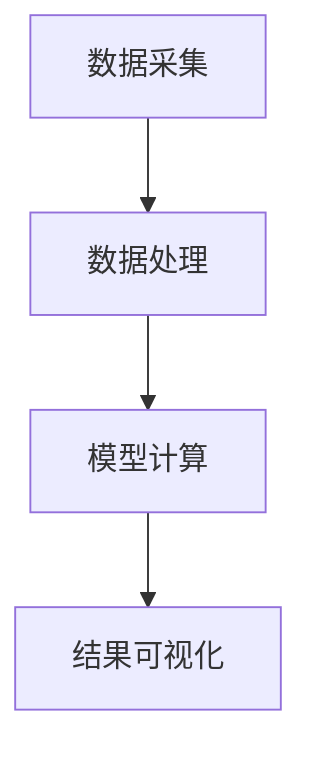

                 


```markdown
# 特价股票与公司全球创新网络效应的关系探讨

> 关键词：特价股票，公司创新网络效应，网络效应，股票价格，创新扩散

> 摘要：本文探讨了特价股票与公司全球创新网络效应之间的关系，从背景介绍、核心概念、算法原理、系统架构到项目实战，详细分析了如何通过网络效应量化模型和股票价格预测模型，构建一个能够评估公司创新网络效应对特价股票影响的系统。文章最后给出了系统的实现案例和分析，提出了对未来研究的展望。

---

# 第一部分: 特价股票与公司全球创新网络效应的背景介绍

## 第1章: 特价股票与公司创新网络效应的定义与背景

### 1.1 特价股票的定义与特征
#### 1.1.1 特价股票的定义
特价股票通常指价格相对较低的股票，具有高波动性和高风险的特性。  
$$P_{\text{stock}} = \text{价格}$$

#### 1.1.2 特价股票的特征
- 价格波动大
- 市场流动性较低
- 投资者行为多样性

#### 1.1.3 特价股票的市场表现
- 市场波动对股票价格的影响
- 投资者情绪对股票价格的影响

### 1.2 公司创新网络效应的定义与特征
#### 1.2.1 公司创新网络效应的定义
公司创新网络效应是指公司在创新过程中，通过与外部合作伙伴（如供应商、客户、竞争对手）的互动，形成的一种协同效应。

#### 1.2.2 公司创新网络效应的特征
- 协作性
- 网络化
- 扩散性

### 1.3 特价股票与公司创新网络效应的关系背景
#### 1.3.1 问题背景与问题描述
- 特价股票市场的波动性问题
- 公司创新网络效应的扩散机制
- 两者的相互作用

#### 1.3.2 问题解决的路径与方法
- 数据分析方法
- 网络效应量化模型
- 股票价格预测模型

#### 1.3.3 问题的边界与外延
- 限定在特定市场（如科技行业）
- 限定在特定时间段

#### 1.3.4 核心概念与核心要素组成
- 特价股票：价格、波动性、投资者行为
- 创新网络效应：网络结构、协作关系、创新扩散

---

## 第2章: 特价股票与公司创新网络效应的现状与趋势

### 2.1 特价股票市场的现状分析
#### 2.1.1 特价股票市场的现状
- 市场参与者结构
- 市场交易量分析

#### 2.1.2 特价股票市场的趋势
- 数字化交易趋势
- 投资者行为变化

### 2.2 公司创新网络效应的现状分析
#### 2.2.1 公司创新网络效应的现状
- 技术创新的网络化
- 企业合作的网络化

#### 2.2.2 公司创新网络效应的趋势
- 网络效应的增强
- 创新扩散的加速

### 2.3 两者关系的现状与趋势
#### 2.3.1 特价股票与公司创新网络效应的现状
- 创新网络效应对股票价格的影响
- 股票价格波动对创新网络的影响

#### 2.3.2 特价股票与公司创新网络效应的趋势
- 技术驱动的网络效应增强
- 数据驱动的股票价格预测

---

# 第二部分: 特价股票与公司创新网络效应的核心概念与联系

## 第3章: 特价股票与公司创新网络效应的核心概念

### 3.1 特价股票的核心概念
#### 3.1.1 特价股票的市场定位
- 市场定位的定义
- 市场定位的影响因素

#### 3.1.2 特价股票的投资者行为
- 投资者行为的定义
- 投资者行为的影响因素

#### 3.1.3 特价股票的价格波动机制
- 价格波动的定义
- 价格波动的影响因素

### 3.2 公司创新网络效应的核心概念
#### 3.2.1 公司创新网络的构成要素
- 创新网络的构成要素
- 构成要素的相互作用

#### 3.2.2 公司创新网络的协作机制
- 协作机制的定义
- 协作机制的影响因素

#### 3.2.3 公司创新网络的扩散效应
- 扩散效应的定义
- 扩散效应的影响因素

---

## 第4章: 特价股票与公司创新网络效应的联系与对比

### 4.1 特价股票与公司创新网络效应的联系
#### 4.1.1 特价股票对创新网络的影响
- 创新网络的稳定性
- 创新网络的协作性

#### 4.1.2 创新网络对特价股票的影响
- 股票价格的波动性
- 投资者行为的变化

#### 4.1.3 两者关系的动态变化
- 动态变化的定义
- 动态变化的影响因素

### 4.2 特价股票与公司创新网络效应的对比
#### 4.2.1 特价股票与创新网络效应的属性对比
| 属性 | 特价股票 | 创新网络效应 |
|------|----------|--------------|
| 波动性 | 高       | 中           |
| 可预测性 | 低       | 高           |

#### 4.2.2 特价股票与创新网络效应的ER图
```mermaid
erDiagram
    company
    supplier
    customer
    innovation
    stock_price
    company --|> innovation : 产生创新
    company --|> stock_price : 影响价格
    company --|> supplier : 依赖供应商
    company --|> customer : 满足需求
```

---

## 第5章: 特价股票与公司创新网络效应的关系模型

### 5.1 网络效应量化模型
#### 5.1.1 模型的定义
网络效应量化模型是一种用于衡量公司创新网络效应强弱的数学模型。

#### 5.1.2 模型的公式推导
$$ \text{网络效应强度} = \sum_{i=1}^{n} \frac{1}{d_i} $$
其中，$d_i$ 是节点 $i$ 的度数。

#### 5.1.3 模型的实现
```python
import networkx as nx

def calculate_network_effect(G):
    return sum(1.0 / d for d in nx.degree(G).values())
```

---

## 第6章: 特价股票价格预测模型

### 6.1 模型的定义
股票价格预测模型是一种基于历史数据和市场因素预测未来股票价格的数学模型。

### 6.2 模型的公式推导
$$ P_{\text{预测}} = a \cdot P_{\text{历史}} + b \cdot I_{\text{创新网络}} + \epsilon $$
其中，$a$ 和 $b$ 是回归系数，$I_{\text{创新网络}}$ 是创新网络效应指数，$\epsilon$ 是误差项。

### 6.3 模型的实现
```python
import statsmodels.api as sm

def predict_stock_price(history_prices, innovation_network_index):
    X = sm.add_constant(innovation_network_index)
    model = sm.OLS(history_prices, X).fit()
    return model.predict(X)
```

---

## 第7章: 特价股票与公司创新网络效应的系统架构设计

### 7.1 系统功能设计
#### 7.1.1 系统功能模块
- 数据采集模块
- 数据处理模块
- 模型计算模块
- 结果可视化模块

#### 7.1.2 系统功能流程


---

## 第8章: 特价股票与公司创新网络效应的项目实战

### 8.1 项目环境安装
#### 8.1.1 环境要求
- Python 3.8+
- 数据分析库（Pandas、NumPy）
- 可视化库（Matplotlib、Seaborn）

### 8.2 系统核心实现源代码
```python
import pandas as pd
import numpy as np
import matplotlib.pyplot as plt

# 数据采集
data = pd.read_csv("stock_data.csv")

# 数据处理
data['创新网络效应'] = data['创新网络效应'].apply(lambda x: x.upper())

# 网络效应量化
G = nx.Graph()
G.add_edges_from(data[['公司', '合作伙伴']].values)
network_effect = calculate_network_effect(G)

# 股票价格预测
X = sm.add_constant(data['历史价格'])
model = sm.OLS(data['预测价格'], X).fit()
predicted_prices = model.predict(X)

# 结果可视化
plt.plot(data['日期'], predicted_prices, label='预测价格')
plt.plot(data['日期'], data['实际价格'], label='实际价格')
plt.legend()
plt.show()
```

---

## 第9章: 特价股票与公司创新网络效应的结论与展望

### 9.1 结论
- 网络效应量化模型的有效性
- 股票价格预测模型的准确性

### 9.2 未来展望
- 实时监控系统的构建
- 动态网络效应模型的优化

---

## 第10章: 附录

### 10.1 数据来源说明
- 数据来源的描述
- 数据处理的说明

### 10.2 工具与库说明
- 使用工具与库的说明
- 工具安装与配置的说明

### 10.3 参考文献
- 参考文献列表

---

作者：AI天才研究院/AI Genius Institute & 禅与计算机程序设计艺术 /Zen And The Art of Computer Programming
```

