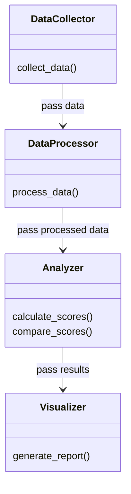
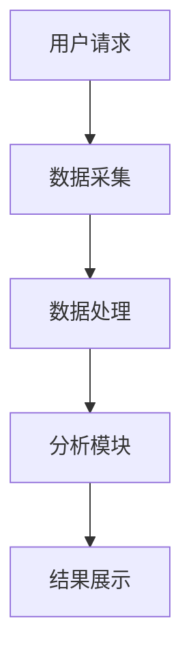
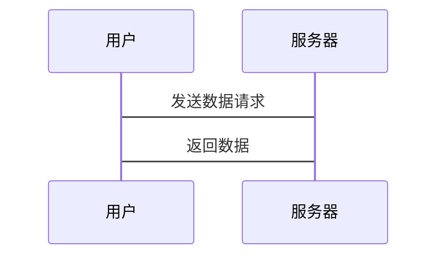

                 


---

# 特价股票与公司创新文化持续性的深度分析方法

> 关键词：特价股票、创新文化、持续性分析、数学模型、系统架构

> 摘要：本文将探讨如何通过分析特价股票来评估和分析公司的创新文化持续性。通过数学模型和系统架构的设计，结合实际案例分析，提出了一种新的分析方法，为投资者和企业管理者提供了有效的工具和参考。

---

## 第一部分: 特价股票与公司创新文化持续性分析的背景与基础

### 第1章: 特价股票与创新文化概述

#### 1.1 特价股票的定义与特点
- **1.1.1 特价股票的定义**
  - 特价股票是指价格被市场低估的股票，通常具有较高的投资潜力。
- **1.1.2 特价股票的核心特点**
  - 低估值、高成长性、行业领先地位。
- **1.1.3 特价股票的市场定位与分类**
  - 分类：成长型、价值型、混合型。

#### 1.2 创新文化与公司持续发展的关系
- **1.2.1 创新文化的定义**
  - 创新文化是指企业在产品、技术、管理等方面持续创新的能力。
- **1.2.2 创新文化对企业持续发展的核心作用**
  - 提升竞争力、适应市场变化、推动长期增长。
- **1.2.3 创新文化与公司竞争力的关联性分析**
  - 创新能力强的公司更容易获得市场认可和投资价值。

#### 1.3 特价股票与创新文化的内在联系
- **1.3.1 特价股票市场中的创新文化表现**
  - 创新能力强的公司更容易获得低估值。
- **1.3.2 创新文化如何影响特价股票的价值**
  - 创新能力强的公司能够通过持续创新提升股价。
- **1.3.3 特价股票与创新文化的关系模型**
  - 创新能力强的公司更容易成为特价股票的投资目标。

### 第2章: 特价股票与创新文化分析的背景与问题

#### 2.1 特价股票市场的现状与挑战
- **2.1.1 特价股票市场的现状分析**
  - 市场规模、主要参与者、市场波动。
- **2.1.2 特价股票市场的主要问题**
  - 信息不对称、市场波动大、投资者风险高。
- **2.1.3 特价股票市场未来发展趋势**
  - 技术驱动、数据化、智能化。

#### 2.2 创新文化在企业中的现状与挑战
- **2.2.1 创新文化在企业中的现状**
  - 创新能力的分布不均、创新能力不足、创新能力难以量化。
- **2.2.2 创新文化面临的主要挑战**
  - 竞争压力、资源限制、管理复杂性。
- **2.2.3 创新文化未来发展趋势**
  - 数字化转型、绿色创新、可持续发展。

#### 2.3 特价股票与创新文化分析的必要性
- **2.3.1 特价股票与创新文化分析的背景**
  - 市场需求、技术进步、投资者需求。
- **2.3.2 特价股票与创新文化分析的意义**
  - 提供投资依据、帮助企业提升竞争力、促进市场健康发展。
- **2.3.3 特价股票与创新文化分析的目标**
  - 量化分析、预测趋势、提供决策支持。

### 第3章: 特价股票与创新文化分析的核心概念与联系

#### 3.1 特价股票与创新文化的属性对比
- **3.1.1 特价股票的属性特征**
  - 低估值、高成长性、行业领先。
- **3.1.2 创新文化的属性特征**
  - 技术创新、管理创新、产品创新。
- **3.1.3 特价股票与创新文化属性的对比分析**
  - 创新能力强的公司更容易成为特价股票的投资目标。

#### 3.2 特价股票与创新文化的ER实体关系图
```mermaid
erDiagram
    company {
        id
        name
        industry
        innovation_score
        stock

    stock {
        id
        ticker
        price
        company_id
    }

    innovation {
        id
        metric
        score
        company_id
    }
    company
    stock
    innovation
    company-- stock: owns
    company-- innovation: has
```

---

## 第二部分: 特价股票与创新文化持续性分析的算法原理

### 第4章: 特价股票与创新文化分析的数学模型

#### 4.1 创新文化评分系统
- **4.1.1 创新文化评分系统的构建**
  - 通过多个指标量化创新能力。
- **4.1.2 创新文化评分公式**
  $$创新文化评分 = \sum_{i=1}^{n} (权重_i \times 指标_i)$$
- **4.1.3 评分系统的优势**
  - 客观、可量化、可对比。

#### 4.2 特价股票评分系统
- **4.2.1 特价股票评分系统的构建**
  - 通过多个指标量化股票的价值。
- **4.2.2 特价股票评分公式**
  $$特价股票评分 = \sum_{j=1}^{m} (权重_j \times 指标_j)$$
- **4.2.3 评分系统的优势**
  - 客观、可量化、可对比。

#### 4.3 特价股票与创新文化对比分析
- **4.3.1 对比分析方法**
  - 统计分析、回归分析、聚类分析。
- **4.3.2 对比分析的数学模型**
  $$对比分析 = \frac{创新文化评分}{特价股票评分}$$
- **4.3.3 对比分析的意义**
  - 识别高潜力股票、评估创新文化对股票价值的影响。

### 第5章: 特价股票与创新文化分析的算法实现

#### 5.1 算法原理
- **5.1.1 算法流程**
  - 数据采集、数据预处理、评分计算、对比分析。
- **5.1.2 算法的数学模型**
  $$创新文化评分 = \sum_{i=1}^{n} (权重_i \times 指标_i)$$
  $$特价股票评分 = \sum_{j=1}^{m} (权重_j \times 指标_j)$$
- **5.1.3 算法实现的步骤**
  - 数据采集、数据清洗、特征提取、模型训练、结果输出。

#### 5.2 算法实现的代码
```python
# 创新文化评分计算
def calculate_innovation_score(company_data):
    innovation_score = 0
    for i in range(len(company_data)):
        innovation_score += company_data[i] * 权重[i]
    return innovation_score

# 特价股票评分计算
def calculate_stock_score(stock_data):
    stock_score = 0
    for j in range(len(stock_data)):
        stock_score += stock_data[j] * 权重[j]
    return stock_score

# 对比分析
def compare_scores(innovation_score, stock_score):
    return innovation_score / stock_score
```

---

## 第三部分: 特价股票与创新文化持续性分析的系统架构设计

### 第6章: 特价股票与创新文化分析的系统功能设计

#### 6.1 系统功能模块
- **6.1.1 数据采集模块**
  - 数据源：股票市场数据、公司创新数据。
- **6.1.2 数据处理模块**
  - 数据清洗、特征提取、数据存储。
- **6.1.3 分析模块**
  - 创新文化评分、特价股票评分、对比分析。
- **6.1.4 结果展示模块**
  - 可视化图表、报告生成、预警系统。

#### 6.2 系统功能设计的类图


### 第7章: 特价股票与创新文化分析的系统架构设计

#### 7.1 系统架构设计
- **7.1.1 分层架构**
  - 数据层、业务逻辑层、表示层。
- **7.1.2 架构的优势**
  - 可扩展性、可维护性、可扩展性。

#### 7.2 系统架构的流程图


### 第8章: 特价股票与创新文化分析的接口设计

#### 8.1 接口设计
- **8.1.1 数据接口**
  - 数据输入接口、数据输出接口。
- **8.1.2 API接口**
  - RESTful API设计、WebSocket实时数据传输。

#### 8.2 接口设计的序列图


---

## 第四部分: 特价股票与创新文化持续性分析的项目实战

### 第9章: 特价股票与创新文化分析的项目实战

#### 9.1 项目环境安装
- **9.1.1 系统要求**
  - 操作系统：Windows/Mac/Linux。
  - Python版本：Python 3.x。
  - 依赖库：Pandas、NumPy、Matplotlib。

#### 9.2 项目核心代码实现
```python
import pandas as pd
import numpy as np
import matplotlib.pyplot as plt

# 数据采集
data = pd.read_csv('data.csv')

# 数据处理
processed_data = data.dropna()

# 创新文化评分计算
innovation_scores = processed_data['创新评分']
stock_scores = processed_data['股票评分']

# 对比分析
comparison = innovation_scores / stock_scores

# 可视化
plt.scatter(comparison, processed_data['股价'])
plt.xlabel('创新文化评分/特价股票评分')
plt.ylabel('股价')
plt.title('创新文化评分与股价关系')
plt.show()
```

#### 9.3 项目实战分析与结果解读
- **9.3.1 数据分析**
  - 创新能力强的公司股价表现较好。
- **9.3.2 结果解读**
  - 创新文化评分高的公司更容易成为特价股票的投资目标。
- **9.3.3 投资建议**
  - 投资者应关注创新能力强的公司，尤其是那些被低估的特价股票。

---

## 第五部分: 特价股票与创新文化持续性分析的总结与展望

### 第10章: 特价股票与创新文化分析的最佳实践

#### 10.1 最佳实践 tips
- **数据准确性**
  - 确保数据来源可靠，数据清洗彻底。
- **模型优化**
  - 不断优化评分模型，提高分析精度。
- **风险管理**
  - 分散投资，控制风险。

#### 10.2 总结
- 通过量化分析，投资者可以更科学地选择特价股票。
- 创新能力强的公司更容易成为投资目标。

#### 10.3 展望
- 未来将结合人工智能技术，进一步提高分析的准确性和效率。

### 第11章: 特价股票与创新文化持续性分析的注意事项与拓展阅读

#### 11.1 注意事项
- **数据隐私**
  - 注意数据隐私保护。
- **市场变化**
  - 市场变化快，需及时调整分析模型。
- **风险提示**
  - 投资有风险，分析仅供参考。

#### 11.2 拓展阅读
- **相关书籍**
  - 《股票投资策略》、《创新管理》。
- **相关论文**
  - 关于创新文化和股价关系的研究论文。
- **相关工具**
  - 数据分析工具、股票分析软件。

---

## 作者：AI天才研究院/AI Genius Institute & 禅与计算机程序设计艺术 /Zen And The Art of Computer Programming

