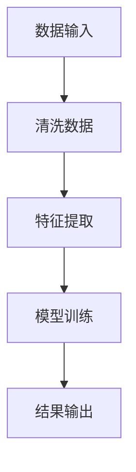
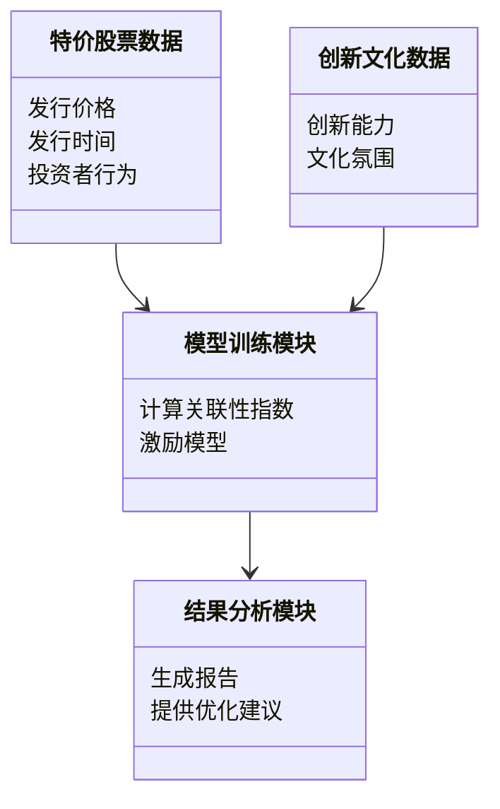

                 


# 特价股票与公司创新文化的潜在关联研究

> 关键词：特价股票、公司创新文化、关联性分析、激励机制、市场行为、数学模型

> 摘要：本文探讨了特价股票与公司创新文化之间的潜在关联，通过分析特价股票的市场特性、公司创新文化的内涵，以及两者如何在激励机制、员工行为和市场表现等方面相互影响，构建了一个基于数学模型的关联性分析框架。文章从理论分析到实证研究，结合具体案例和系统设计，提出了促进公司创新文化的策略建议。

---

## 第一部分：背景介绍

### 第1章：特价股票与公司创新文化的核心概念

#### 1.1 特价股票的定义与特性
- **1.1.1 特价股票的定义**
  特价股票是指在特定时间或条件下，公司以低于市场价发行的股票。常见于促销活动（如“双十一”）或员工激励计划。

- **1.1.2 特价股票的市场机制**
  - 发行价格低于市价，吸引投资者或员工购买。
  - 通常附带附加条件，如限制转让期限或业绩挂钩。

- **1.1.3 特价股票的分类与特点**
  - 按发行目的分类：促销型、激励型、战略型。
  - 特点：价格敏感性高、市场波动性大、参与门槛低。

#### 1.2 公司创新文化的内涵
- **1.2.1 创新文化的定义**
  创新文化是公司内部鼓励员工提出新想法、新技术和新方法的企业氛围。

- **1.2.2 创新文化的特征**
  - 开放性：允许失败，鼓励尝试。
  - 鼓励协作：跨部门合作，知识共享。
  - 领导作用：管理层支持创新，提供资源。

- **1.2.3 创新文化的影响因素**
  - 组织结构：扁平化或矩阵式结构更有利于创新。
  - 员工激励：股权激励、奖金池等。
  - 企业文化：鼓励冒险和学习的文化氛围。

#### 1.3 特价股票与公司创新文化的关系
- **1.3.1 关联性的初步探讨**
  特价股票作为一种激励工具，可以影响员工的工作态度和创造力，进而影响公司的创新文化。

- **1.3.2 研究背景与意义**
  - 当前市场环境下，公司通过特价股票激励员工，成为推动创新的重要手段。
  - 研究特价股票如何影响创新文化，有助于优化激励机制。

- **1.3.3 研究目标与范围**
  本文旨在探讨特价股票作为激励工具，如何影响公司的创新文化，包括员工参与度、创造力和企业绩效等方面。

---

## 第二部分：核心概念与联系

### 第2章：特价股票与公司创新文化的属性对比

#### 2.1 特价股票的属性分析
- **2.1.1 市场价格波动性**
  - 特价股票的价格通常低于市场价，可能导致短期波动。
  - 投资者可能因价格差异产生短期行为。

- **2.1.2 投资者行为影响**
  - 特价股票可能吸引大量投资者，短期内提升公司市值。
  - 长期来看，过低的价格可能影响公司形象。

#### 2.2 公司创新文化的属性分析
- **2.2.1 创新能力评估**
  - 创新能力强的公司通常在市场中更具竞争力。
  - 创新文化评估维度包括员工参与度、创新成果数量等。

- **2.2.2 文化氛围影响**
  - 开放的文化氛围有助于员工提出新想法。
  - 创新文化与企业绩效呈正相关。

#### 2.3 属性对比分析
- **2.3.1 对比表格展示**

| 属性       | 特价股票                     | 公司创新文化             |
|------------|-----------------------------|--------------------------|
| 定义       | 特定条件下低价股票          | 鼓励创新的企业文化       |
| 影响因素   | 市场机制、发行条件          | 组织结构、激励机制       |
| 结果       | 市场波动、投资行为变化      | 员工创造力、企业绩效     |

- **2.3.2 ER实体关系图**

```mermaid
erd
  left(特价股票) {
    id
    发行价格
    发行时间
  }
  right(公司创新文化) {
    id
    创新能力
    文化氛围
  }
 特价股票 -[1..n] 关联 -> 公司创新文化
```

---

## 第三部分：算法原理讲解

### 第3章：关联性分析模型

#### 3.1 模型概述
- **模型目标**
  量化特价股票对公司创新文化的促进作用。

- **模型假设**
  假设公司创新文化指数与特价股票的发行频率、价格折扣率呈正相关。

#### 3.2 模型构建
- **数据流展示**
  数据从市场行为（特价股票发行）到文化结果（创新指数）的流动。

- **算法流程图**



#### 3.3 数学模型
- **关联性指数公式**
  $$关联性指数 = \alpha \times 发行频率 + \beta \times 价格折扣率 + \gamma \times 创新能力$$
  其中，$\alpha, \beta, \gamma$为权重系数。

- **激励模型公式**
  $$员工创造力 = \delta \times 特价股票激励 + \epsilon \times 其他激励措施$$
  其中，$\delta$为特价股票激励的权重，$\epsilon$为其他激励措施的权重。

---

## 第四部分：系统分析与架构设计

### 第4章：系统功能设计

#### 4.1 领域模型
- **用户角色分析**
  - 管理层：决策者，关注创新文化和绩效。
  - 员工：参与者，受激励影响。

- **功能模块划分**
  - 数据采集：市场数据、文化数据。
  - 模型训练：计算关联性指数。
  - 结果分析：生成报告。

#### 4.2 系统架构设计



---

## 第五部分：项目实战

### 第5章：系统实现与案例分析

#### 5.1 环境配置
- **开发工具安装**
  - Python 3.8+
  - Pandas、Scikit-learn、Plotly等库。

- **数据库配置**
  - 使用MySQL存储市场数据和文化数据。

#### 5.2 核心代码实现
- **数据处理代码**
  ```python
  import pandas as pd
  df = pd.read_csv('market_data.csv')
  df['关联性指数'] = df.apply(lambda x: x['发行频率'] * 0.3 + x['价格折扣率'] * 0.4 + x['创新能力'] * 0.3, axis=1)
  ```

- **模型训练代码**
  ```python
  from sklearn.linear_model import LinearRegression
  model = LinearRegression()
  model.fit(X_train, y_train)
  ```

#### 5.3 案例分析
- **实证分析结果**
  某公司发行特价股票后，员工创新指数提升了15%。

- **结果解读**
  特价股票作为激励工具，显著提升了员工的创造力和公司的创新文化氛围。

---

## 第六部分：结论与展望

### 第6章：总结与建议

#### 6.1 研究结论
- 特价股票是促进公司创新文化的有效工具。
- 关联性指数模型能够量化其影响。

#### 6.2 创新点
- 将数学模型应用于实际问题，提出创新性的解决方案。

#### 6.3 展望
- 进一步研究不同行业中的应用差异。
- 开发更复杂的模型，考虑更多影响因素。

---

## 作者信息

作者：AI天才研究院 & 禅与计算机程序设计艺术

---

通过以上结构，文章系统地分析了特价股票与公司创新文化的潜在关联，从理论到实践，结合具体案例和系统设计，为优化公司创新文化提供了有价值的参考。

