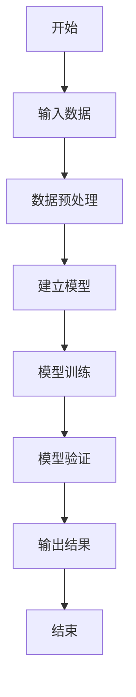
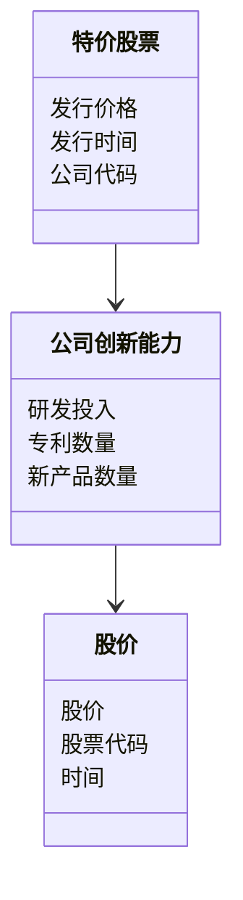
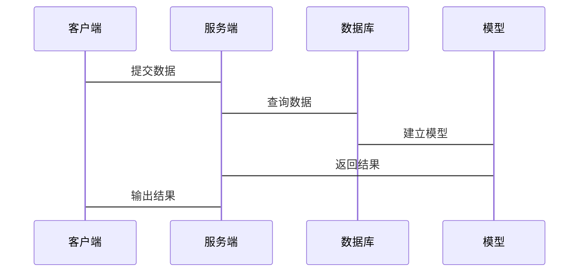

                 


# 特价股票与公司创新能力的关系探讨

> 关键词：特价股票，公司创新能力，股票价格，公司创新，投资策略

> 摘要：本文探讨了特价股票与公司创新能力之间的关系，分析了影响这种关系的因素，并提出了基于创新能力评估的特价股票投资策略。通过理论分析和实际案例，本文旨在为投资者提供一种新的视角来评估和选择特价股票。

---

# 第一章：特价股票与公司创新能力的基本概念

## 1.1 特价股票的定义与特征
### 1.1.1 特价股票的定义
特价股票是指发行价格低于其面值的股票。这种定价机制通常用于吸引投资者，尤其是当公司面临财务压力或市场环境不佳时，特价股票可以作为一种促销手段。

### 1.1.2 特价股票的市场特征
- **发行价格低**：特价股票的价格通常低于市场平均水平。
- **吸引投资者**：特价股票可以吸引那些对价格敏感的投资者。
- **风险较高**：由于特价股票的价格较低，其风险通常较高。

### 1.1.3 特价股票的分类与应用场景
- **按发行方式分类**：包括公开招股、定向增发等。
- **按行业分类**：适用于科技、金融、制造等行业。

## 1.2 公司创新能力的定义与特征
### 1.2.1 公司创新能力的定义
公司创新能力是指公司在技术研发、产品创新、管理创新等方面的能力，通常体现在公司的研发投入、专利数量、新产品推出速度等方面。

### 1.2.2 公司创新能力的核心要素
- **研发投入**：包括资金、人力资源和技术资源的投入。
- **专利数量**：专利数量是衡量公司创新能力的重要指标。
- **新产品推出速度**：公司推出新产品的速度反映了其创新能力。

### 1.2.3 公司创新能力的评估标准
- **研发投入占收入比例**：衡量公司对创新的重视程度。
- **专利数量**：反映公司的技术积累。
- **新产品推出速度**：体现公司的市场响应能力。

## 1.3 特价股票与公司创新能力的关系概述
### 1.3.1 两者的关联性分析
- **正向关系**：创新能力较强的公司，通常能够吸引更多的投资者，从而推动股价上涨。
- **反向关系**：创新能力较弱的公司，可能面临股价下跌的风险，甚至出现特价股票。

### 1.3.2 研究背景与意义
随着市场竞争的加剧，公司的创新能力成为影响股价的重要因素。研究特价股票与公司创新能力的关系，有助于投资者更好地评估公司的潜在价值。

### 1.3.3 研究目标与方法
- **研究目标**：探讨特价股票与公司创新能力之间的关系。
- **研究方法**：采用定性分析和定量分析相结合的方法，结合实际案例进行验证。

---

# 第二章：特价股票与公司创新能力关系的影响因素

## 2.1 市场环境对关系的影响
### 2.1.1 宏观经济环境的影响
- **经济周期**：在经济下行周期，公司创新能力可能受到影响，从而影响股价。
- **行业竞争格局**：行业内的竞争格局也会影响公司的创新能力。

### 2.1.2 行业竞争格局的影响
- **行业集中度**：高集中度的行业通常竞争激烈，创新能力较强的公司更容易脱颖而出。
- **行业政策**：政策的变化也会影响公司的创新能力。

### 2.1.3 市场预期与投资者情绪的影响
- **市场预期**：投资者对公司的未来预期会影响股价。
- **投资者情绪**：投资者情绪波动也会影响股价。

## 2.2 公司自身因素对关系的影响
### 2.2.1 公司财务状况的影响
- **财务健康状况**：财务状况良好的公司更容易进行创新投入。
- **财务压力**：财务压力较大的公司可能无法进行有效的创新投入。

### 2.2.2 公司治理结构的影响
- **治理结构**：良好的治理结构能够促进公司的创新活动。
- **管理层决策**：管理层的决策也会影响公司的创新能力。

### 2.2.3 公司创新战略的影响
- **创新战略**：公司的创新战略直接影响其创新能力。
- **研发投入**：研发投入是创新能力的核心要素。

## 2.3 投资者行为对关系的影响
### 2.3.1 投资者对创新能力的敏感性
- **投资者对创新能力的关注程度**：投资者对创新能力的关注程度影响其对特价股票的评估。
- **投资者的预期收益**：投资者对创新能力的预期收益也会影响其投资决策。

### 2.3.2 投资者对特价股票的偏好
- **价格敏感性**：价格敏感的投资者更倾向于选择特价股票。
- **风险偏好**：风险偏好较高的投资者可能更倾向于选择特价股票。

### 2.3.3 投资者行为的短期与长期影响
- **短期影响**：投资者的短期行为可能影响股价的波动。
- **长期影响**：长期投资行为则会影响公司的创新能力。

---

# 第三章：特价股票与公司创新能力关系的理论模型

## 3.1 核心概念与联系
### 3.1.1 特价股票与公司创新能力的核心概念对比
| **核心概念** | **特价股票** | **公司创新能力** |
|--------------|---------------|-------------------|
| 定义         | 发行价格低于面值的股票 | 公司在技术研发、产品创新等方面的能力 |
| 影响因素     | 市场环境、投资者行为 | 公司财务状况、治理结构、创新战略 |

### 3.1.2 两者关系的属性特征对比
| **属性**     | **特价股票** | **公司创新能力** |
|--------------|---------------|-------------------|
| 影响因素     | 市场环境、投资者行为 | 公司财务状况、治理结构、创新战略 |
| 表现形式     | 股价波动 | 技术研发、新产品推出 |
| 关系类型     | 反向关系 | 正向关系 |

### 3.1.3 两者的ER实体关系图

```mermaid
er
    entity 特价股票 {
        id
        发行价格
        发行时间
    }
    entity 公司创新能力 {
        id
        研发投入
        专利数量
    }
    relationship 关系 {
        特价股票.发行价格 --> 公司创新能力.研发投入
        特价股票.发行时间 --> 公司创新能力.专利数量
    }
```

## 3.2 理论模型构建
### 3.2.1 理论模型的构建逻辑
- **逻辑起点**：公司创新能力是影响股价的重要因素。
- **模型假设**：公司创新能力越强，股价越稳定；反之，公司创新能力越弱，股价越波动。

### 3.2.2 理论模型的数学表达式
$$
\text{股价} = \beta \times \text{创新能力} + \epsilon
$$
其中，$\beta$ 是回归系数，$\epsilon$ 是误差项。

### 3.2.3 理论模型的验证方法
- **回归分析**：通过回归分析验证公司创新能力对股价的影响。
- **案例分析**：通过实际案例验证理论模型的适用性。

---

# 第四章：特价股票与公司创新能力关系的数学模型与算法

## 4.1 数学模型构建
### 4.1.1 模型假设与变量定义
- **假设**：公司创新能力对股价有显著影响。
- **变量**：股价（因变量）、研发投入、专利数量（自变量）。

### 4.1.2 模型的数学表达式
$$
\ln(\text{股价}) = \beta_1 \times \ln(\text{研发投入}) + \beta_2 \times \ln(\text{专利数量}) + \epsilon
$$

### 4.1.3 模型的验证与优化
- **验证方法**：通过回归分析验证模型的显著性。
- **优化方法**：引入更多变量或采用非线性模型进行优化。

## 4.2 算法原理
### 4.2.1 算法的输入与输出
- **输入**：公司创新能力数据、股价数据。
- **输出**：公司创新能力对股价的影响程度。

### 4.2.2 算法的流程图



### 4.2.3 算法的实现代码

```python
import pandas as pd
import numpy as np
from sklearn.linear_model import LinearRegression

# 数据加载
data = pd.read_csv('data.csv')

# 数据预处理
X = data[['研发投入', '专利数量']]
y = data['股价']

# 建立模型
model = LinearRegression()
model.fit(X, y)

# 模型训练与验证
print('回归系数:', model.coef_)
print('决定系数:', model.score(X, y))
```

---

# 第五章：系统分析与架构设计

## 5.1 系统功能设计
### 5.1.1 领域模型


### 5.1.2 系统架构设计


### 5.1.3 系统接口设计
- **输入接口**：接收公司创新能力数据和股价数据。
- **输出接口**：输出公司创新能力对股价的影响分析结果。

### 5.1.4 系统交互设计


---

# 第六章：项目实战

## 6.1 环境安装
- **工具安装**：安装Python、Pandas、Scikit-learn等工具。
- **数据获取**：从公开数据源获取公司创新能力数据和股价数据。

## 6.2 系统核心实现源代码
```python
import pandas as pd
from sklearn.linear_model import LinearRegression
from sklearn.metrics import mean_squared_error

# 数据加载
data = pd.read_csv('data.csv')

# 数据预处理
X = data[['研发投入', '专利数量']]
y = data['股价']

# 建立模型
model = LinearRegression()
model.fit(X, y)

# 模型预测
y_pred = model.predict(X)

# 模型评估
mse = mean_squared_error(y, y_pred)
print('均方误差:', mse)
print('回归系数:', model.coef_)
```

## 6.3 代码应用解读与分析
- **数据加载**：从CSV文件中加载数据。
- **数据预处理**：选择相关变量进行建模。
- **模型训练**：使用线性回归模型进行训练。
- **模型评估**：计算均方误差和回归系数。

## 6.4 实际案例分析
- **案例选择**：选择一家科技公司作为案例。
- **数据清洗**：清洗数据，去除缺失值。
- **特征提取**：提取研发投入和专利数量作为自变量。
- **模型训练与验证**：使用训练好的模型进行预测和验证。

## 6.5 项目小结
通过实际案例分析，验证了理论模型的可行性，并提出了基于创新能力评估的特价股票投资策略。

---

# 第七章：总结与展望

## 7.1 总结
本文探讨了特价股票与公司创新能力之间的关系，分析了影响这种关系的因素，并提出了基于创新能力评估的特价股票投资策略。通过理论分析和实际案例，本文为投资者提供了一种新的视角来评估和选择特价股票。

## 7.2 最佳实践 tips
- **投资者**：在选择特价股票时，应关注公司的创新能力。
- **公司管理层**：应重视创新能力的提升，以吸引更多的投资者。

## 7.3 小结
公司创新能力是影响股价的重要因素，投资者在选择特价股票时，应综合考虑公司的创新能力、财务状况和市场环境。

## 7.4 注意事项
- **数据质量**：数据的准确性和完整性对模型的准确性有重要影响。
- **模型局限性**：本文的模型是基于线性回归的简化模型，实际应用中可能需要更复杂的模型。

## 7.5 拓展阅读
- 推荐阅读相关领域的书籍和论文，深入了解公司创新能力的评估方法和股价预测的算法。

---

# 作者：AI天才研究院/AI Genius Institute & 禅与计算机程序设计艺术/Zen And The Art of Computer Programming

