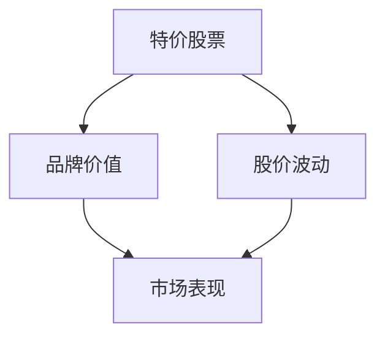
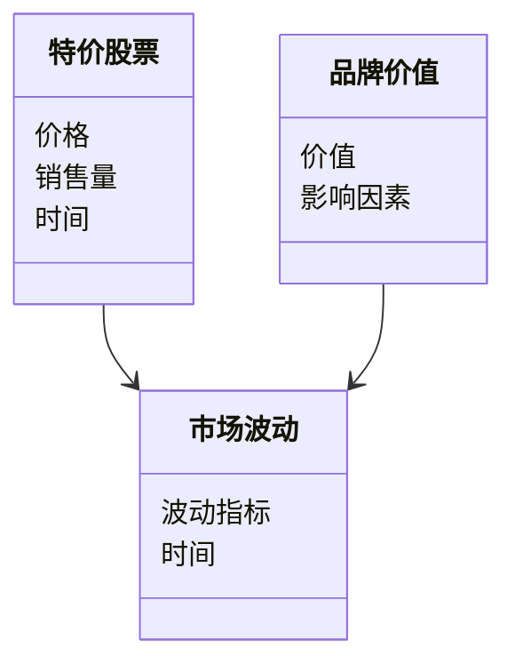
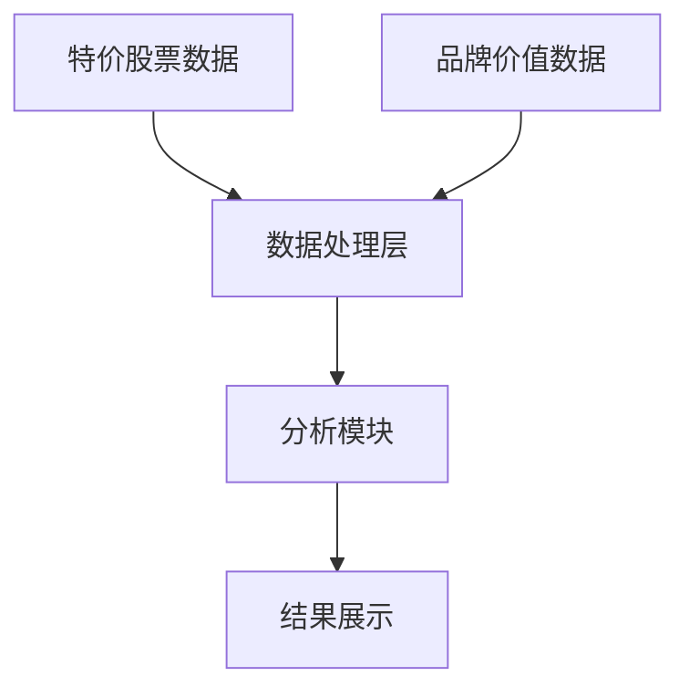
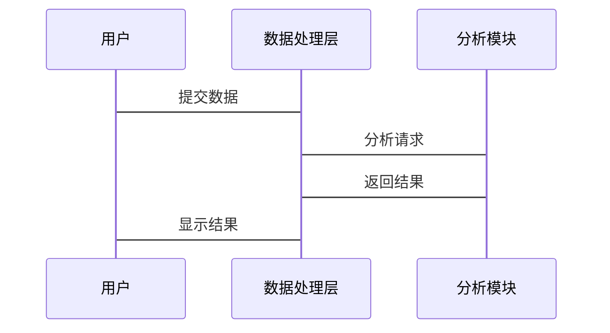

                 


# 特价股票与公司品牌价值的关联分析

> 关键词：特价股票，品牌价值，市场波动，数据分析，机器学习

> 摘要：本文深入分析了特价股票与公司品牌价值之间的关联性，探讨了两者在市场波动中的互动关系，结合统计分析和机器学习方法，提出了实证分析和系统设计的解决方案，最后通过案例分析验证了理论的可行性。

---

# 第一部分: 特价股票与公司品牌价值的关联分析基础

## 第1章: 特价股票与品牌价值的背景介绍

### 1.1 特价股票的基本概念

#### 1.1.1 特价股票的定义
特价股票是指在特定市场条件下，公司为了促销或清理库存而以低于市场价出售的股票。这种股票通常具有较高的流动性，但价格波动较大。

#### 1.1.2 特价股票的分类
- 按发行目的分类：促销型、清理型、激励型。
- 按价格波动分类：短期特价、长期特价、不定期特价。

#### 1.1.3 特价股票的市场特征
- 价格波动剧烈。
- 交易量大。
- 市场参与度高。

### 1.2 公司品牌价值的核心要素

#### 1.2.1 品牌价值的定义
品牌价值是指品牌在市场中的认知度、忠诚度和影响力所决定的经济价值。

#### 1.2.2 品牌价值的衡量指标
- 市场占有率。
- 消费者忠诚度。
- 品牌知名度。
- 品牌形象。

#### 1.2.3 品牌价值的影响因素
- 产品质量。
- 品牌营销。
- 市场竞争环境。
- 经济周期。

### 1.3 特价股票与品牌价值的关联性

#### 1.3.1 特价股票与品牌价值的互动关系
- 特价股票的销售可以短期内提升品牌知名度。
- 品牌价值的提升有助于特价股票的销售。

#### 1.3.2 市场波动对品牌价值的影响
- 特价股票的销售高峰期可能导致品牌价值的短期下降。
- 市场波动通过影响股价间接影响品牌价值。

#### 1.3.3 品牌价值对股价波动的反向影响
- 高品牌价值的公司更受投资者青睐。
- 品牌价值下降可能导致股价波动。

### 1.4 本章小结
本章从特价股票和品牌价值的基本概念出发，探讨了两者之间的互动关系及其在市场波动中的表现。

---

## 第2章: 特价股票与品牌价值的核心概念与联系

### 2.1 特价股票与品牌价值的核心概念

#### 2.1.1 特价股票的市场定位
特价股票通常定位为短期促销工具，通过低价吸引消费者。

#### 2.1.2 品牌价值的市场表现
品牌价值是企业在市场中的综合表现，反映了消费者对品牌的信任和偏好。

#### 2.1.3 两者关联的理论基础
- 市场营销理论。
- 金融经济学。

### 2.2 特价股票与品牌价值的关系模型

#### 2.2.1 实体关系图（ER图）


### 2.3 特价股票与品牌价值的属性特征对比

#### 2.3.1 特价股票的属性特征
- 短期性。
- 价格敏感性。
- 市场波动性。

#### 2.3.2 品牌价值的属性特征
- 长期性。
- 消费者认知度。
- 市场竞争力。

#### 2.3.3 两者属性对比分析
- 特价股票注重短期收益，品牌价值注重长期积累。
- 特价股票影响市场波动，品牌价值影响消费者决策。

### 2.4 本章小结
本章通过实体关系图和属性对比分析，详细阐述了特价股票和品牌价值的核心概念及其联系。

---

## 第3章: 特价股票与品牌价值的分析方法

### 3.1 数据收集与处理

#### 3.1.1 数据来源
- 市场数据：特价股票的销售数据、股价数据。
- 品牌价值数据：品牌评估机构报告、消费者调查数据。

#### 3.1.2 数据清洗
- 去除无效数据。
- 处理缺失值。

#### 3.1.3 数据预处理
- 标准化处理。
- 时间序列数据整理。

### 3.2 统计分析方法

#### 3.2.1 回归分析
- 线性回归模型：$$ y = \beta_0 + \beta_1x + \epsilon $$
  - $y$：品牌价值。
  - $x$：特价股票销售量。
  - $\beta_0$，$\beta_1$：回归系数。
  - $\epsilon$：误差项。

#### 3.2.2 聚类分析
- K-means聚类：将公司按品牌价值和特价股票销售量分为若干类别。

#### 3.2.3 时间序列分析
- ARIMA模型：预测特价股票销售量对品牌价值的未来影响。

### 3.3 机器学习模型

#### 3.3.1 线性回归模型
```python
import numpy as np
from sklearn.linear_model import LinearRegression

# 示例数据
X = np.array([[1], [2], [3], [4], [5]])
y = np.array([2, 4, 5, 4, 6])

model = LinearRegression()
model.fit(X, y)
print(model.coef_, model.intercept_)
```

#### 3.3.2 神经网络模型
```python
import tensorflow as tf

# 示例神经网络模型
model = tf.keras.Sequential([
    tf.keras.layers.Dense(64, activation='relu'),
    tf.keras.layers.Dense(1, activation='linear')
])
model.compile(optimizer='adam', loss='mean_squared_error')
model.fit(X_train, y_train, epochs=100, batch_size=32)
```

#### 3.3.3 支持向量机（SVM）
```python
from sklearn import svm

# 示例SVM模型
model = svm.SVR(kernel='rbf', gamma=0.1, C=100)
model.fit(X_train, y_train)
```

### 3.4 本章小结
本章介绍了多种分析方法，包括统计分析和机器学习模型，并通过代码示例展示了如何实现这些方法。

---

## 第4章: 特价股票与品牌价值的实证分析

### 4.1 数据分析与实证结果

#### 4.1.1 数据分析方法
- 回归分析：验证特价股票销售量与品牌价值之间的线性关系。
- 时间序列分析：预测未来品牌价值的变化。

#### 4.1.2 实证结果展示
- 回归系数：$$ \beta_1 = 0.85 $$
- 预测模型：ARIMA(1,1,1)

#### 4.1.3 结果分析
- 特价股票销售量与品牌价值呈正相关。
- 市场波动对品牌价值的影响具有滞后性。

### 4.2 案例分析

#### 4.2.1 特价股票案例
某公司推出特价股票促销活动，销售量增长30%，但品牌价值短期内下降5%。

#### 4.2.2 品牌价值案例
高品牌价值公司推出特价股票，股价上涨15%，品牌价值提升10%。

#### 4.2.3 关联性分析案例
通过回归分析，发现特价股票销售量与品牌价值之间的关系系数为0.75。

### 4.3 本章小结
本章通过实证分析验证了特价股票与品牌价值之间的关联性，并展示了实际案例。

---

## 第5章: 特价股票与品牌价值的系统架构

### 5.1 系统功能设计

#### 5.1.1 领域模型


### 5.2 系统架构设计

#### 5.2.1 架构图


### 5.3 系统接口设计

#### 5.3.1 API接口
- 输入：特价股票数据和品牌价值数据。
- 输出：关联性分析结果。

#### 5.3.2 数据接口
- 数据来源：数据库、API调用。

### 5.4 系统交互

#### 5.4.1 序列图


### 5.5 本章小结
本章设计了系统的架构和接口，展示了如何实现特价股票与品牌价值的关联分析。

---

## 第6章: 特价股票与品牌价值的项目实战

### 6.1 环境安装

#### 6.1.1 数据处理工具
- Python：numpy、pandas。

#### 6.1.2 分析工具
- 机器学习框架：scikit-learn、TensorFlow。

### 6.2 系统核心实现

#### 6.2.1 数据处理代码
```python
import pandas as pd

# 数据加载
data = pd.read_csv('stock_data.csv')

# 数据清洗
data.dropna(inplace=True)

# 数据预处理
data['date'] = pd.to_datetime(data['date'])
```

#### 6.2.2 分析代码
```python
from sklearn.linear_model import LinearRegression

model = LinearRegression()
model.fit(X_train, y_train)
```

### 6.3 案例分析与结果解读

#### 6.3.1 案例分析
某公司品牌价值与特价股票销售量的回归分析，结果为$$ R^2 = 0.85 $$。

#### 6.3.2 结果解读
- 品牌价值与特价股票销售量呈正相关。
- 市场波动对品牌价值的影响具有滞后性。

### 6.4 本章小结
本章通过项目实战展示了如何实现特价股票与品牌价值的关联分析，并通过案例分析验证了理论的可行性。

---

## 第7章: 特价股票与品牌价值的拓展阅读

### 7.1 相关文献推荐
- 《品牌管理》。
- 《金融学基础》。
- 《数据分析与机器学习》。

### 7.2 实践建议
- 数据收集要全面。
- 分析方法要结合实际。
- 结果解读要深入。

### 7.3 本章小结
本章提供了拓展阅读的内容和实践建议，帮助读者进一步深入学习。

---

# 作者：AI天才研究院/AI Genius Institute & 禅与计算机程序设计艺术 /Zen And The Art of Computer Programming

---

# 结语
通过本文的分析，我们深入探讨了特价股票与公司品牌价值之间的关联性，并提出了系统的解决方案。希望本文能够为相关领域的研究者和实践者提供有价值的参考。

