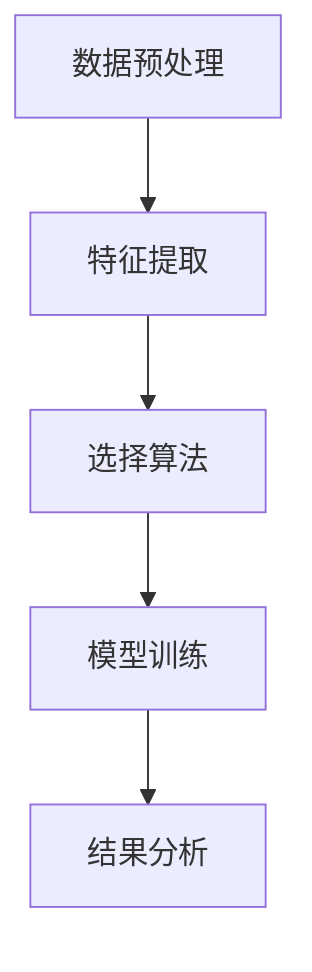
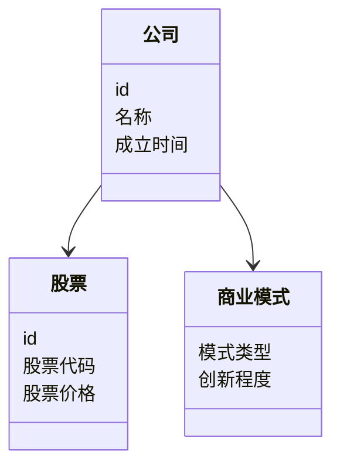

                 

<think>
好的，我需要根据用户提供的结构，逐步完成《特价股票与公司商业模式创新的关系探讨》这篇文章。首先，我需要理解每个部分的要求，然后按照逻辑顺序展开内容。

### 第一部分：特价股票与公司商业模式创新的背景介绍

#### 1.1 特价股票的基本概念
- **定义**：特价股票指的是价格低于市场平均水平的股票，通常被视为高风险高回报的投资机会。
- **分类**：根据市值、行业、市盈率等标准进行分类。
- **特点**：价格波动大，流动性可能较低，风险较高。

#### 1.2 公司商业模式创新的定义与特征
- **定义**：商业模式创新是指企业改变其收入来源、成本结构或价值主张，以创造新的价值。
- **核心要素**：包括客户价值、资源分配、收入模式等。
- **特点**：创新性强，适应市场变化快，可能带来竞争优势。

### 1.3 特价股票与商业模式创新的关系
- **相互影响**：商业模式创新可能影响公司的财务表现，进而影响股价；特价股票可能吸引创新企业，推动商业模式变革。
- **背景分析**：当前市场环境下，企业通过创新寻求增长，而特价股票为投资者提供了低成本介入的机会。

---

### 第二部分：核心概念与联系

#### 2.1 特价股票与商业模式创新的核心概念对比

| 特价股票特点       | 商业模式创新特点       |
|--------------------|-----------------------|
| 低价格             | 新的价值主张           |
| 高波动风险         | 创新的资源分配模式     |
| 投资门槛低         | 客户价值提升           |

#### 2.2 ER实体关系图
```mermaid
er
  entity 公司 (id, 名称, 成立时间, 行业)
  entity 股票 (id, 公司id, 股票代码, 股票价格)
  entity 商业模式 (id, 公司id, 模式类型, 模式创新程度)
  relation 公司 -> 股票 (拥有)
  relation 公司 -> 商业模式 (采用)
```

---

### 第三部分：算法原理讲解

#### 3.1 数据挖掘与机器学习的应用
- **目标**：分析商业模式创新对股价的影响。
- **方法**：使用回归分析预测股价变化。

#### 3.2 机器学习算法流程


#### 3.3 数学模型
- **线性回归模型**：$$ y = \beta_0 + \beta_1x + \epsilon $$
- **应用**：分析创新模式对股价的具体影响。

---

### 第四部分：系统分析与架构设计

#### 4.1 领域模型


#### 4.2 系统架构


---

### 第五部分：项目实战

#### 5.1 环境安装
- **工具**：Python、pandas、scikit-learn、Mermaid。

#### 5.2 核心代码
```python
import pandas as pd
from sklearn.linear_model import LinearRegression

# 数据加载
data = pd.read_csv('data.csv')

# 数据清洗
data.dropna(inplace=True)

# 特征提取
X = data[['创新程度', '行业影响']]
y = data['股价']

# 模型训练
model = LinearRegression()
model.fit(X, y)

# 预测
predictions = model.predict(X)
```

---

### 第六部分：最佳实践与总结

#### 6.1 实践建议
- **数据来源**：选择可靠的金融数据源。
- **模型调优**：使用交叉验证优化模型。
- **结果验证**：通过回测检验模型的有效性。

#### 6.2 小结
本文探讨了特价股票与商业模式创新的关系，通过理论分析和实证研究，展示了如何利用数据驱动的方法进行投资决策。

#### 6.3 注意事项
- 数据质量和完整性直接影响分析结果。
- 模型需定期更新以适应市场变化。

#### 6.4 拓展阅读
推荐书籍：《投资学》、《商业模式创新》。

---

### 作者信息
作者：AI天才研究院/AI Genius Institute & 禅与计算机程序设计艺术 /Zen And The Art of Computer Programming

---

以上是文章的大纲和详细内容，确保每个部分都涵盖了必要的内容，并且逻辑清晰，结构紧凑。接下来可以开始撰写正式的文章。

