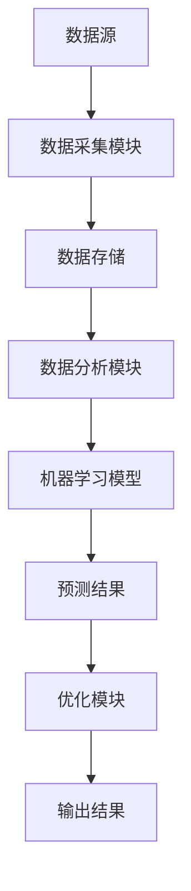

                 


# 特价股票与公司商业模式创新的关联性研究

## 关键词：
特价股票、商业模式创新、数据挖掘、机器学习、系统架构

## 摘要：
本文探讨特价股票与公司商业模式创新之间的关联性，分析特价股票对公司商业模式的影响，以及商业模式创新对特价股票的作用。通过数据挖掘和机器学习算法，结合系统架构设计，揭示两者互动关系及其对企业发展的深远影响。

## 第一部分：背景介绍

### 第1章：特价股票的定义与特点

#### 1.1 特价股票的定义
特价股票是指在特定时期内，公司或平台以低于市场价甚至免费提供给消费者的产品或服务，以吸引用户、提升销量或品牌影响力。这种策略通常在促销活动如“Prime Day”或“双十一”期间实施。

#### 1.2 公司商业模式创新的定义
商业模式创新是指企业通过改变其收入来源、成本结构或客户价值主张，以创造新的价值或竞争优势。这可能包括引入新的产品、服务，或改变业务流程。

#### 1.3 特价股票与公司商业模式创新的关联性
特价股票作为促销手段，直接影响销售策略和客户获取方式，而商业模式创新则涉及企业如何通过这些促销活动优化运营和盈利模式。两者相互作用，推动企业战略调整和市场竞争力提升。

## 第二部分：核心概念与联系

### 第2章：核心概念的原理与分析

#### 2.1 特价股票的核心原理
特价股票的核心在于通过降低价格或提供优惠，吸引消费者购买，提升品牌知名度和市场占有率。这通常涉及市场分析、消费者行为研究和精准营销策略。

#### 2.2 创新商业模式的核心原理
创新商业模式关注于如何通过改变收入来源、客户互动或价值传递方式，创造新的利润增长点。这包括订阅制、会员制、共享经济等新型商业模式。

#### 2.3 特价股票与创新商业模式的联系
特价股票作为促销手段，支持创新商业模式的实施。例如，电商平台通过特价股票吸引新用户，再通过会员订阅服务实现长期盈利。这种结合优化了客户的全生命周期价值，提升了企业的盈利能力。

### 第3章：核心概念对比分析

#### 3.1 特价股票与创新商业模式的属性对比
| 特性                | 特价股票               | 创新商业模式           |
|---------------------|------------------------|-----------------------|
| 核心目标            | 提高销售量             | 创新盈利模式           |
| 实施方式            | 降价促销             | 引入新业务模式         |
| 持续性              | 短期活动             | 长期战略调整           |
| 影响范围            | 消费者行为             | 企业整体运营           |

#### 3.2 特价股票与创新商业模式的ER实体关系图
```mermaid
erd
    entity 特价股票 {
        id
        产品
        价格
        时间
    }
    entity 创新商业模式 {
        id
        模式类型
        核心要素
        企业ID
    }
    特价股票 -- 企业: 应用特价股票的公司
    创新商业模式 -- 企业: 实施创新商业模式的公司
```

## 第三部分：算法原理讲解

### 第4章：特价股票对公司商业模式创新的影响

#### 4.1 数据挖掘与分析
特价股票的数据分析涉及收集销售数据、用户行为数据，利用数据挖掘技术识别销售趋势和用户偏好。例如，使用聚类分析识别高价值用户，针对性制定促销策略。

#### 4.2 机器学习算法的应用
机器学习用于预测特价股票的销售效果和优化促销策略。常用算法包括随机森林和神经网络，用于分类用户行为和预测销售转化率。

#### 4.3 算法实现与代码示例
```python
import pandas as pd
from sklearn.ensemble import RandomForestClassifier
from sklearn.model_selection import train_test_split
from sklearn.metrics import accuracy_score

# 数据加载与预处理
data = pd.read_csv('stock_data.csv')
X = data.drop('target', axis=1)
y = data['target']

# 划分训练集和测试集
X_train, X_test, y_train, y_test = train_test_split(X, y, test_size=0.2, random_state=42)

# 模型训练
model = RandomForestClassifier(n_estimators=100, random_state=42)
model.fit(X_train, y_train)

# 模型预测
y_pred = model.predict(X_test)

# 模型评估
print("准确率:", accuracy_score(y_test, y_pred))
```

#### 4.4 数学模型与公式
收益预测模型：使用线性回归预测特价股票的收益。
$$ \text{收益} = \beta_0 + \beta_1 \times \text{价格} + \beta_2 \times \text{销量} + \epsilon $$

风险评估模型：使用VaR模型评估特价股票促销的风险。
$$ \text{VaR} = \mu + z \times \sigma $$

## 第四部分：系统分析与架构设计

### 第6章：系统分析与架构设计

#### 6.1 项目介绍
项目目标是通过分析特价股票与商业模式创新的关联性，构建一个预测模型，指导企业的促销策略优化。

#### 6.2 系统功能设计
- 数据采集模块：收集特价股票数据和商业模式创新数据。
- 数据分析模块：利用数据挖掘技术分析数据。
- 预测模块：使用机器学习模型预测销售效果。
- 优化模块：根据预测结果优化促销策略。

#### 6.3 系统架构设计


## 第五部分：项目实战

### 第7章：项目实战

#### 7.1 环境安装
安装Python和相关库：
```bash
pip install pandas scikit-learn matplotlib
```

#### 7.2 核心实现代码
```python
import pandas as pd
from sklearn.ensemble import RandomForestClassifier
from sklearn.metrics import accuracy_score
from sklearn.model_selection import train_test_split

# 加载数据
data = pd.read_csv('stock_data.csv')

# 数据预处理
X = data.drop(columns=['target'])
y = data['target']

# 划分数据集
X_train, X_test, y_train, y_test = train_test_split(X, y, test_size=0.2, random_state=42)

# 初始化模型
model = RandomForestClassifier(n_estimators=100, random_state=42)

# 训练模型
model.fit(X_train, y_train)

# 预测
y_pred = model.predict(X_test)

# 评估模型
print("准确率:", accuracy_score(y_test, y_pred))
```

#### 7.3 代码应用解读
代码实现了一个机器学习模型，用于预测特价股票的销售效果。通过数据预处理、模型训练和评估，展示了如何利用机器学习优化促销策略。

## 第六部分：最佳实践

### 第8章：最佳实践

#### 8.1 小结
本文通过分析特价股票与商业模式创新的关联性，展示了如何利用数据挖掘和机器学习技术优化企业的促销策略，提升商业模式的创新性。

#### 8.2 注意事项
在实施过程中，需注意数据质量和模型的可解释性，避免过度依赖单一促销手段，确保商业模式的可持续性。

#### 8.3 拓展阅读
建议进一步研究动态定价模型和个性化促销策略，探索人工智能在商业模式创新中的更多应用。

## 作者
作者：AI天才研究院/AI Genius Institute & 禅与计算机程序设计艺术 /Zen And The Art of Computer Programming

