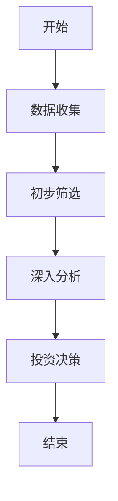
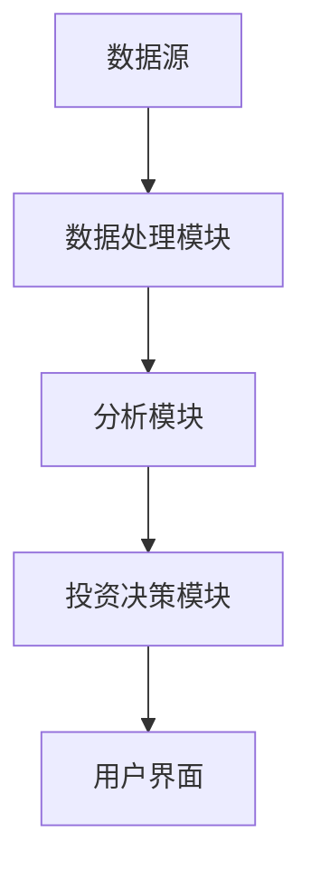

                 


# 特价股票与公司基本面分析的结合

> 关键词：特价股票，公司基本面，投资分析，股票筛选，价值评估

> 摘要：本文详细探讨了如何将特价股票与公司基本面分析相结合，帮助投资者识别具有潜在增长潜力的低价股票。通过分析公司财务数据、行业地位和管理团队等基本面因素，结合股票价格和估值指标，投资者可以更有效地筛选出具备投资价值的特价股票。

---

# 第一部分: 特价股票与公司基本面分析的背景介绍

## 第1章: 特价股票与公司基本面分析的背景

### 1.1 特价股票的基本概念

#### 1.1.1 特价股票的定义
特价股票是指市场价格相对较低的股票，通常低于行业平均水平或历史平均水平。这些股票可能因市场波动、公司暂时困境或市场忽视而被低估。

#### 1.1.2 特价股票的分类
- **超跌股票**：由于市场下跌或公司业绩不佳，股价远低于其内在价值。
- **低价股票**：股价绝对值较低，通常在特定市场中表现。
- **价值股票**：市盈率、市净率等估值指标低于市场平均水平。

#### 1.1.3 特价股票的投资价值
特价股票可能隐藏着被市场忽视的优质公司，具备较高的潜在回报。通过基本面分析，投资者可以识别出那些暂时被低估但具备长期增长潜力的公司。

### 1.2 公司基本面分析的基本概念

#### 1.2.1 公司基本面的定义
公司基本面是指影响公司长期价值的内在因素，包括财务状况、行业地位、管理团队和竞争优势等。

#### 1.2.2 公司基本面分析的主要指标
- **财务指标**：收入、利润、资产负债率、现金流。
- **估值指标**：市盈率（P/E）、市净率（P/B）、股息率。
- **行业地位**：市场占有率、行业排名。
- **管理团队**：管理层的经验和稳定性。

#### 1.2.3 公司基本面分析的重要性
通过基本面分析，投资者可以评估公司的盈利能力和成长潜力，从而做出更明智的投资决策。

### 1.3 特价股票与公司基本面分析的结合

#### 1.3.1 结合的必要性
- 特价股票的价格优势可能掩盖了公司基本面的劣势。
- 公司基本面分析可以帮助投资者识别那些价格低廉但具备长期增长潜力的公司。

#### 1.3.2 结合的方法与步骤
- 数据收集：收集公司的财务报表、行业数据和市场数据。
- 初步筛选：通过估值指标筛选出价格低于市场平均水平的股票。
- 深入分析：评估公司的财务状况、行业地位和管理团队。
- 投资决策：根据分析结果，决定是否投资。

#### 1.3.3 结合的实际意义
- 提高投资效率：通过基本面分析，投资者可以避免盲目投资于低价股票。
- 降低投资风险：识别出那些价格低廉但基本面不佳的公司，避免潜在损失。

### 1.4 本章小结
本章介绍了特价股票和公司基本面分析的基本概念，并阐述了两者结合的必要性和实际意义。通过结合分析，投资者可以更有效地识别出具备投资价值的特价股票。

---

# 第二部分: 特价股票与公司基本面分析的核心概念与联系

## 第2章: 特价股票与公司基本面分析的核心概念与联系

### 2.1 特价股票的核心要素

#### 2.1.1 特价股票的市场定位
- 特价股票通常出现在市场低迷时期，或在某些特定行业中。

#### 2.1.2 特价股票的流动性分析
- 流动性是指股票的交易量和买卖价差。流动性差的股票可能难以快速变现，影响投资策略。

#### 2.1.3 特价股票的估值方法
- 相对估值法：市盈率、市净率等指标。
- 绝对估值法：现金流折现法、股息贴现法。

### 2.2 公司基本面分析的核心要素

#### 2.2.1 公司财务状况分析
- 收入和利润：评估公司的盈利能力和增长潜力。
- 资产负债表：评估公司的资产结构和财务健康状况。
- 现金流：评估公司的资金流动性和盈利质量。

#### 2.2.2 公司行业地位分析
- 市场占有率：公司在行业中的地位和竞争力。
- 行业发展趋势：行业增长潜力和周期性。

#### 2.2.3 公司管理团队分析
- 管理层的经验和稳定性：管理层的背景和决策能力。
- 公司治理结构：董事会结构和公司治理的透明度。

### 2.3 特价股票与公司基本面分析的联系

#### 2.3.1 特价股票与公司财务状况的关系
- 低股价可能反映公司财务状况不佳，但基本面分析可以帮助识别潜在的转机。

#### 2.3.2 特价股票与公司行业地位的关系
- 公司在行业中地位较低可能导致股价被低估，但行业地位分析可以帮助识别具备增长潜力的公司。

#### 2.3.3 特价股票与公司管理团队的关系
- 管理团队的素质直接影响公司的长期发展，基本面分析可以帮助识别具备优秀管理团队的公司。

### 2.4 本章小结
本章详细探讨了特价股票和公司基本面分析的核心概念，并分析了两者之间的联系。通过结合分析，投资者可以更全面地评估公司的投资价值。

---

# 第三部分: 特价股票与公司基本面分析的算法原理

## 第3章: 特价股票与公司基本面分析的算法原理

### 3.1 特价股票筛选算法

#### 3.1.1 数据收集
- 收集目标公司的财务数据、行业数据和市场数据。

#### 3.1.2 初步筛选
- 通过市盈率、市净率等估值指标筛选出价格低于市场平均水平的股票。

#### 3.1.3 深入分析
- 分析公司的财务状况、行业地位和管理团队。
- 评估公司的盈利能力和成长潜力。

#### 3.1.4 投资决策
- 根据分析结果，决定是否投资。

### 3.2 公司基本面分析的算法

#### 3.2.1 财务指标分析
- 计算市盈率（P/E）= 价格/每股收益
- 计算市净率（P/B）= 价格/每股净资产
- 计算股息率 = 每股股息/股价

#### 3.2.2 行业地位分析
- 评估公司在行业中的市场占有率和竞争能力。

#### 3.2.3 管理团队分析
- 评估管理层的经验和稳定性。

### 3.3 算法流程图



### 3.4 本章小结
本章详细介绍了特价股票筛选和公司基本面分析的算法原理，并通过流程图展示了整个分析过程。通过算法分析，投资者可以更系统地评估公司的投资价值。

---

# 第四部分: 特价股票与公司基本面分析的系统设计

## 第4章: 特价股票与公司基本面分析的系统设计

### 4.1 系统功能设计

#### 4.1.1 数据收集模块
- 收集目标公司的财务数据、行业数据和市场数据。

#### 4.1.2 数据处理模块
- 清洗和整理数据，计算估值指标。

#### 4.1.3 分析模块
- 分析公司的财务状况、行业地位和管理团队。

#### 4.1.4 投资决策模块
- 根据分析结果，生成投资建议。

### 4.2 系统架构设计



### 4.3 接口设计

#### 4.3.1 数据接口
- 数据输入接口：接收目标公司的数据。
- 数据输出接口：输出分析结果。

#### 4.3.2 用户接口
- 用户输入接口：接收用户的输入指令。
- 用户输出接口：显示分析结果和投资建议。

### 4.4 本章小结
本章详细探讨了特价股票与公司基本面分析的系统设计，包括功能模块、架构设计和接口设计。通过系统设计，投资者可以更高效地进行股票筛选和分析。

---

# 第五部分: 特价股票与公司基本面分析的项目实战

## 第5章: 特价股票与公司基本面分析的项目实战

### 5.1 项目环境安装

#### 5.1.1 数据库安装
- 安装MySQL或其他关系型数据库。

#### 5.1.2 数据分析工具安装
- 安装Python、Pandas、NumPy等数据分析工具。

### 5.2 核心代码实现

#### 5.2.1 数据收集与处理
```python
import pandas as pd

# 从数据库中提取数据
data = pd.read_sql_query("SELECT * FROM company_data", db)

# 清洗数据
data = data.dropna()
data = data[数据有效条件]
```

#### 5.2.2 基本面分析
```python
# 计算市盈率
data['P/E'] = data['价格'] / data['每股收益']

# 计算市净率
data['P/B'] = data['价格'] / data['每股净资产']

# 计算股息率
data['股息率'] = data['每股股息'] / data['价格']
```

#### 5.2.3 投资决策
```python
# 筛选P/E低于市场平均水平的公司
筛选条件 = data['P/E'] < 市场平均P/E

# 筛选P/B低于市场平均水平的公司
筛选条件2 = data['P/B'] < 市场平均P/B

# 最终筛选条件
最终筛选条件 = 筛选条件 & 筛选条件2
```

### 5.3 项目小结
本章通过实际案例展示了如何将特价股票与公司基本面分析相结合，帮助投资者识别具备投资价值的股票。

---

# 第六部分: 特价股票与公司基本面分析的最佳实践

## 第6章: 特价股票与公司基本面分析的最佳实践

### 6.1 投资建议
- 选择具备长期增长潜力的公司。
- 关注公司的财务状况和行业地位。
- 考虑管理团队的素质和稳定性。

### 6.2 注意事项
- 避免盲目跟风，进行深入分析。
- 保持对市场的敏感性，及时调整投资策略。
- 分散投资，降低风险。

### 6.3 拓展阅读
- 推荐阅读《投资学》、《股票技术分析》等书籍。
- 关注行业动态和市场趋势，提升分析能力。

### 6.4 本章小结
本章提供了特价股票与公司基本面分析的最佳实践建议，帮助投资者更好地进行投资决策。

---

# 第七部分: 总结与展望

## 第7章: 总结与展望

### 7.1 总结
本文详细探讨了特价股票与公司基本面分析的结合，通过理论分析、算法设计和项目实战，帮助投资者识别具备投资价值的特价股票。

### 7.2 展望
未来，随着人工智能和大数据技术的发展，特价股票与公司基本面分析的结合将更加智能化和精准化。投资者可以利用更多的数据和技术工具，进一步提升投资决策的效率和准确性。

---

# 作者

作者：AI天才研究院/AI Genius Institute & 禅与计算机程序设计艺术 /Zen And The Art of Computer Programming

