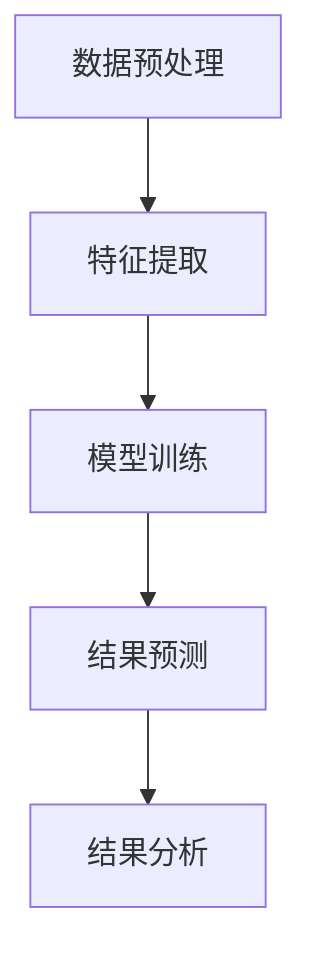
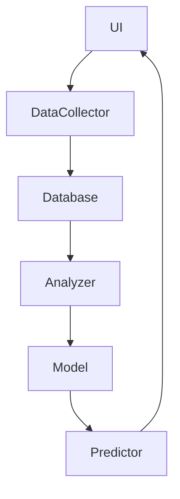
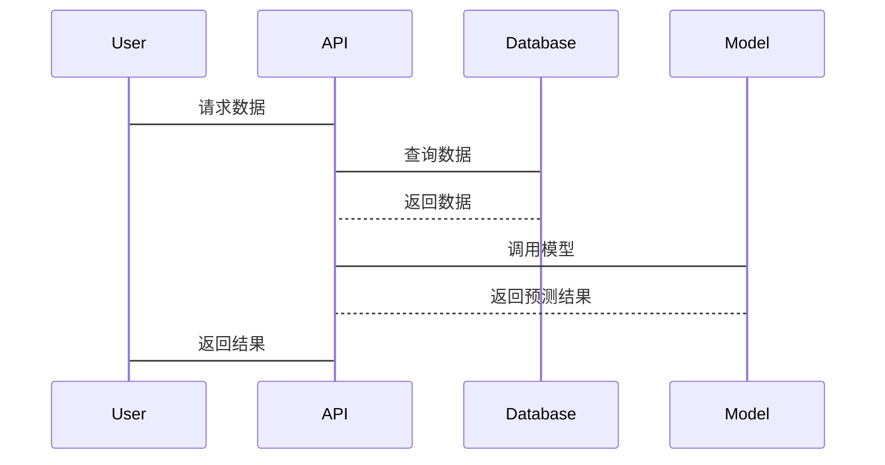

                 


# 特价股票与公司平台化与数字化转型能力的关联性研究

---

## 关键词：特价股票、公司平台化、数字化转型、关联性分析、系统架构设计

---

## 摘要

本文旨在研究特价股票与公司平台化与数字化转型能力之间的关联性。通过分析特价股票公司的特征、平台化与数字化转型能力的构建及其对绩效的影响，结合实际案例和系统架构设计，探讨如何通过数字化手段提升公司竞争力，从而影响其股价表现。本文采用统计分析和机器学习方法，构建数学模型，量化两者之间的关系，并提出实践建议。

---

## 第一部分：背景介绍

### 第1章：特价股票与公司平台化与数字化转型概述

#### 1.1 特价股票的定义与特征

特价股票是指价格低于行业平均水平或历史价格的股票，通常具有较高的投资潜力。其特征包括低市盈率、低市净率和高股息率。这些股票往往来自财务状况不佳或处于转型期的公司。

#### 1.2 公司平台化与数字化转型的定义与特点

平台化是指公司通过构建平台生态系统，整合资源，实现业务协同。数字化转型是指利用数字技术优化业务流程、提升效率和创新商业模式。两者的结合可以显著增强公司的竞争力。

#### 1.3 研究背景与问题提出

随着数字化转型的深入，许多公司通过平台化和数字化手段提升业绩，从而影响股价。然而，特价股票公司如何通过这些手段提升竞争力仍需进一步研究。

#### 1.4 研究方法与框架

采用定性与定量结合的方法，包括案例分析、统计分析和机器学习模型。研究框架包括背景分析、特征分析、能力构建、绩效影响、案例分析和关联性量化。

---

## 第二部分：核心概念与联系

### 第2章：特价股票公司的特征分析

#### 2.1 特价股票公司的财务与市场表现

- 低市盈率和低市净率是其财务特征。
- 市场表现通常不佳，但具备增长潜力。

#### 2.2 平台化与数字化转型能力的构建

- 平台化战略：整合资源，构建生态系统。
- 数字化转型能力：优化流程，创新模式。

#### 2.3 特价股票公司平台化与数字化能力的关联性

通过构建实体关系图，展示公司、平台化能力和数字化能力三者的关系。

```mermaid
erDiagram
    company {
        id
        name
        industry
    }
    platformCapability {
        id
        name
        description
    }
    digitalTransformationCapability {
        id
        name
        description
    }
    company --> platformCapability : 拥有
    company --> digitalTransformationCapability : 拥有
    platformCapability --> digitalTransformationCapability : 促进
```

---

## 第三部分：算法原理讲解

### 第3章：关联性分析算法

#### 3.1 算法选择与原理

选择线性回归模型，用于量化平台化和数字化能力对股价的影响。

#### 3.2 算法流程



#### 3.3 数学模型与公式

线性回归模型：

$$ y = \beta_0 + \beta_1 x_1 + \beta_2 x_2 + \epsilon $$

其中，$y$ 是股价表现，$x_1$ 和 $x_2$ 分别是平台化和数字化能力的指标，$\beta$ 是回归系数。

#### 3.4 代码实现

```python
import pandas as pd
import numpy as np
from sklearn.linear_model import LinearRegression
from sklearn.metrics import r2_score

# 数据加载
data = pd.read_csv('stock_data.csv')

# 特征提取
X = data[['platform_capability', 'digital_capability']]
y = data['stock_price']

# 模型训练
model = LinearRegression()
model.fit(X, y)

# 预测结果
y_pred = model.predict(X)

# 模型评估
print(r2_score(y, y_pred))
```

---

## 第四部分：系统分析与架构设计

### 第4章：系统架构设计

#### 4.1 系统功能模块设计

- 数据采集模块：收集公司数据。
- 数据分析模块：提取特征，构建模型。
- 预测模块：预测股价。

#### 4.2 系统架构图



#### 4.3 接口与交互设计

接口：RESTful API，用于数据传输和模型调用。

交互流程：



---

## 第五部分：项目实战

### 第5章：案例分析与实现

#### 5.1 环境配置

安装Python和相关库：

```bash
pip install pandas numpy scikit-learn
```

#### 5.2 核心代码实现

```python
import pandas as pd
import numpy as np
from sklearn.linear_model import LinearRegression
from sklearn.metrics import r2_score

# 数据加载
data = pd.read_csv('stock_data.csv')

# 特征提取
X = data[['platform_capability', 'digital_capability']]
y = data['stock_price']

# 模型训练
model = LinearRegression()
model.fit(X, y)

# 预测结果
y_pred = model.predict(X)

# 模型评估
print(r2_score(y, y_pred))
```

#### 5.3 案例分析与解读

通过具体案例分析，展示如何通过平台化和数字化转型提升股价表现。

---

## 第六部分：总结与展望

### 第6章：总结与展望

#### 6.1 研究总结

本文通过理论分析和案例研究，探讨了特价股票公司如何通过平台化和数字化转型提升竞争力。

#### 6.2 未来研究方向

进一步研究更复杂的模型，如神经网络，以提高预测精度。

#### 6.3 实践建议

建议公司加强平台化和数字化能力，以提升股价表现。

---

## 参考文献

（此处列出相关文献）

---

## 附录

（此处列出附录内容）

---

作者：AI天才研究院/AI Genius Institute & 禅与计算机程序设计艺术 /Zen And The Art of Computer Programming

