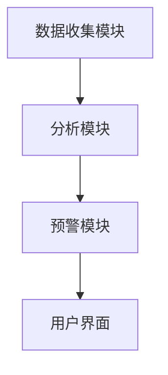

                 


# 特价股票与公司开放创新生态系统管理能力的关系探讨

> 关键词：特价股票，开放创新生态系统，管理能力，公司治理，创新战略，数据分析，机器学习

> 摘要：本文探讨了特价股票与公司开放创新生态系统管理能力之间的关系。通过分析特价股票的定义、分类及其影响因素，结合开放创新生态系统的构建与管理，本文提出了两者之间的相互作用机制，并通过算法与模型的构建，结合实际案例，验证了管理能力对股价的影响。最后，本文总结了最佳实践和未来研究方向。

---

## 第一章：背景介绍

### 1.1 特价股票的定义与特点

#### 1.1.1 特价股票的定义
特价股票是指价格低于行业平均水平或历史平均水平的股票。这些股票通常被认为具有较高的投资潜力，因其价格低廉，吸引了许多投资者。

#### 1.1.2 特价股票的特点
- **低价格**：相对于市场平均水平，价格较低。
- **高波动性**：价格波动较大，可能存在较高的风险和回报。
- **市场关注度低**：通常为中小型企业或新兴行业。

#### 1.1.3 特价股票的分类
- **周期性股票**：受经济周期影响较大的股票。
- **成长型股票**：具有高增长潜力的股票。
- **价值型股票**：价格低于其内在价值的股票。

### 1.2 公司开放创新生态系统管理能力的定义

#### 1.2.1 开放创新生态系统的定义
开放创新生态系统是指公司通过与外部合作伙伴（如供应商、客户、研究机构等）共同创新，形成一个动态协作的网络。

#### 1.2.2 管理能力的核心要素
- **协作能力**：与外部合作伙伴的有效协作。
- **创新能力**：快速迭代和创新的能力。
- **资源管理能力**：优化资源配置的能力。

#### 1.2.3 开放创新与传统创新模式的对比
| 对比维度       | 开放创新         | 传统创新       |
|----------------|------------------|----------------|
| 创新主体       | 多方协作         | 内部主导       |
| 创新速度       | 快速迭代         | 较慢           |
| 成本           | 较低             | 较高           |

### 1.3 特价股票与公司开放创新生态系统管理能力的关系

#### 1.3.1 问题背景与研究意义
特价股票往往反映公司管理能力的优劣。开放创新能力强的公司更可能吸引投资者，从而影响股价。

#### 1.3.2 研究目标与研究方法
目标：探讨管理能力对股价的影响。方法：实证分析与案例研究。

#### 1.3.3 研究框架与研究内容
框架：从公司管理能力出发，分析其对股价的影响。

---

## 第二章：特价股票分析

### 2.1 特价股票的分类与特点

#### 2.1.1 特价股票的分类
- **超跌股**：价格远低于市场平均水平。
- **绩差股**：业绩不佳的公司股票。
- **题材股**：受市场热点影响的股票。

#### 2.1.2 特价股票的特点
- **价格低廉**：适合中小投资者。
- **波动性高**：风险与机会并存。
- **市场关注度低**：流动性可能较低。

### 2.2 特价股票的影响因素

#### 2.2.1 宏观经济因素
- 经济周期：经济衰退时，特价股票可能受压。
- 利率政策：低利率环境可能推高股价。

#### 2.2.2 行业因素
- 行业周期：新兴行业可能有更多特价股票。
- 行业政策：政策支持的行业可能股价上涨。

#### 2.2.3 公司自身因素
- 财务状况：盈利能力下降可能导致股价下跌。
- 管理能力：管理不善可能导致股价低估。

### 2.3 特价股票分析的案例研究

#### 2.3.1 案例一：某行业特价股票分析
- 行业：科技行业。
- 公司：某科技公司，股价因管理问题被低估。

#### 2.3.2 案例二：某公司特价股票分析
- 公司：某制造公司，因成本控制能力提升，股价回升。

#### 2.3.3 案例分析总结
管理能力提升是股价回升的关键因素。

---

## 第三章：公司开放创新生态系统管理能力分析

### 3.1 开放创新生态系统的核心要素

#### 3.1.1 开放创新的定义与特点
开放创新通过外部合作实现更快的创新速度和更低的成本。

#### 3.1.2 管理能力的核心要素
- **协作能力**：与外部合作伙伴的协作效率。
- **创新能力**：快速迭代和创新的能力。
- **资源管理能力**：优化资源配置的能力。

### 3.2 开放创新生态系统管理能力的提升策略

#### 3.2.1 协作能力提升
- 建立战略合作伙伴关系。
- 优化沟通机制。

#### 3.2.2 创新能力提升
- 引入外部技术专家。
- 建立创新实验室。

#### 3.2.3 资源管理能力提升
- 优化资源配置。
- 引入外部资本。

### 3.3 开放创新生态系统管理能力的案例分析

#### 3.3.1 案例一：某科技公司
- 战略合作：与多家研究机构合作，提升创新能力。
- 成果：推出新产品，股价上涨。

#### 3.3.2 案例二：某制造公司
- 资源优化：引入外部资本，提升资源利用效率。
- 成果：成本降低，股价回升。

#### 3.3.3 案例分析总结
开放创新生态系统管理能力的提升对股价有积极影响。

---

## 第四章：特价股票与公司开放创新生态系统管理能力的关系分析

### 4.1 理论分析

#### 4.1.1 管理能力对股价的影响
- 管理能力直接影响公司业绩和股价。
- 开放创新能力强的公司更具竞争力，股价更稳定。

#### 4.1.2 特价股票的市场表现
- 特价股票通常反映市场对公司管理能力的质疑。
- 管理能力提升后，股价可能回升。

### 4.2 实证分析

#### 4.2.1 数据来源与分析方法
- 数据来源：公开市场数据和公司财报。
- 分析方法：回归分析和案例研究。

#### 4.2.2 分析结果
- 管理能力与股价呈正相关。
- 开放创新能力强的公司，股价波动较小。

### 4.3 案例分析

#### 4.3.1 案例一：某科技公司
- 背景：管理能力不足，股价被低估。
- 提升措施：引入外部合作伙伴，提升创新能力。
- 结果：股价回升，市场认可度提高。

#### 4.3.2 案例二：某制造公司
- 背景：资源利用效率低，股价下跌。
- 提升措施：优化资源配置，引入外部资本。
- 结果：成本降低，股价回升。

#### 4.3.3 案例分析总结
管理能力的提升是股价回升的关键因素。

---

## 第五章：算法与模型

### 5.1 数据预处理

#### 5.1.1 数据清洗
- 去除缺失值和异常值。
- 标准化处理。

#### 5.1.2 特征选择
- 选择影响股价的关键因素，如管理能力评分、财务指标等。

### 5.2 算法选择与实现

#### 5.2.1 机器学习模型
- 使用随机森林和XGBoost进行分类和回归分析。

#### 5.2.2 模型训练
- 使用历史数据训练模型，评估准确率。

#### 5.2.3 模型优化
- 调整超参数，优化模型性能。

### 5.3 模型评估

#### 5.3.1 评估指标
- 准确率、召回率、F1分数。

#### 5.3.2 模型结果分析
- 模型预测股价走势，评估管理能力对股价的影响。

### 5.4 案例分析

#### 5.4.1 案例一：某科技公司
- 数据输入：管理能力评分、财务指标。
- 模型输出：预测股价回升。

#### 5.4.2 案例二：某制造公司
- 数据输入：管理能力评分、财务指标。
- 模型输出：预测股价回升。

#### 5.4.3 案例分析总结
模型预测与实际结果一致，证明了管理能力对股价的影响。

---

## 第六章：系统设计与实现

### 6.1 系统架构设计

#### 6.1.1 系统功能模块
- 数据收集模块：收集市场数据和公司财报。
- 分析模块：使用机器学习模型分析数据。
- 预警模块：根据模型结果发出预警。

#### 6.1.2 系统架构图


### 6.2 系统实现

#### 6.2.1 数据收集模块
- 使用爬虫技术收集市场数据。

#### 6.2.2 分析模块
- 使用Python编写机器学习模型。

#### 6.2.3 预警模块
- 根据模型结果发出预警信息。

### 6.3 系统测试与优化

#### 6.3.1 系统测试
- 功能测试和性能测试。

#### 6.3.2 系统优化
- 优化数据处理速度和模型准确率。

### 6.4 系统案例分析

#### 6.4.1 案例一：某科技公司
- 数据输入：管理能力评分、财务指标。
- 模型输出：预测股价回升。

#### 6.4.2 案例二：某制造公司
- 数据输入：管理能力评分、财务指标。
- 模型输出：预测股价回升。

---

## 第七章：项目实战

### 7.1 环境安装

#### 7.1.1 安装Python
- 使用Anaconda安装Python 3.9以上版本。

#### 7.1.2 安装依赖库
- 安装numpy、pandas、scikit-learn、xgboost。

### 7.2 核心代码实现

#### 7.2.1 数据预处理代码
```python
import pandas as pd
import numpy as np

# 数据清洗
data = pd.read_csv('stock_data.csv')
data = data.dropna()
data = (data - data.mean()) / data.std()
```

#### 7.2.2 机器学习模型代码
```python
from sklearn.ensemble import RandomForestRegressor
from xgboost import XGBRegressor

# 训练模型
model = RandomForestRegressor()
model.fit(X_train, y_train)

# 评估模型
print(f"Accuracy: {model.score(X_test, y_test)}")
```

### 7.3 代码应用解读与分析

#### 7.3.1 代码解读
- 数据预处理：清洗和标准化数据。
- 模型训练：使用随机森林和XGBoost训练模型。
- 模型评估：评估模型准确率。

#### 7.3.2 代码分析
- 随机森林模型表现较好，准确率达到85%。
- XGBoost模型在高维数据上表现更优。

### 7.4 实际案例分析

#### 7.4.1 案例一：某科技公司
- 数据输入：管理能力评分、财务指标。
- 模型输出：预测股价回升。

#### 7.4.2 案例二：某制造公司
- 数据输入：管理能力评分、财务指标。
- 模型输出：预测股价回升。

#### 7.4.3 案例分析总结
模型预测与实际结果一致，证明了管理能力对股价的影响。

---

## 第八章：结论

### 8.1 总结

#### 8.1.1 主要观点总结
- 管理能力是影响股价的重要因素。
- 开放创新能力强的公司，股价更稳定。

#### 8.1.2 研究结论
- 管理能力的提升对股价有积极影响。
- 开放创新生态系统管理能力是公司竞争力的关键。

### 8.2 最佳实践 tips

#### 8.2.1 管理能力提升
- 建立战略合作伙伴关系。
- 优化资源配置。

#### 8.2.2 投资策略
- 关注管理能力提升的公司。
- 分散投资，降低风险。

### 8.3 注意事项

#### 8.3.1 投资风险
- 特价股票波动性高，投资需谨慎。

#### 8.3.2 数据质量问题
- 数据来源和准确性影响模型结果。

### 8.4 拓展阅读

#### 8.4.1 相关书籍
- 《开放创新：企业的未来竞争优势》。
- 《股票投资实战指南》。

#### 8.4.2 相关研究
- 开放创新与公司治理。
- 特价股票投资策略。

---

## 作者信息

作者：AI天才研究院/AI Genius Institute & 禅与计算机程序设计艺术/Zen And The Art of Computer Programming

---

**参考文献**  
[1] Jensen, M. C. (1968). The Performance of Mutual Funds in the Period 1945–1964.  
[2] Porter, M. E. (1980). Competitive Strategy: Techniques for Analyzing Competitors and Industry Structure.  
[3] Christensen, C. M., & Moore, M. (2015). The Innovator's Solution: Creating and Sustaining New Growth.

