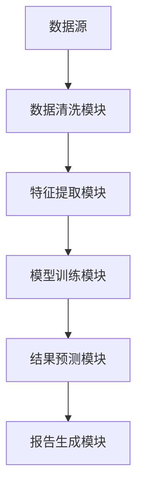

                 


```markdown
# 特价股票与公司循环经济实践的关联性研究

> 关键词：特价股票，循环经济，股票价格，企业实践，经济模型，数据分析

> 摘要：本文探讨特价股票与公司循环经济实践之间的关联性，通过分析循环经济对企业财务状况的影响，构建数学模型预测股票价格变化，结合实际案例验证理论，提出循环经济对企业股票价值的提升作用。

---

## 第一部分: 特价股票与循环经济的基本概念

### 第1章: 特价股票的定义与特性

#### 1.1 特价股票的定义
- **特价股票**是指市场价格低于面值的股票，通常在市场低迷或公司财务困难时出现。
- **分类**：按股票类型可分为普通股和优先股，按行业可分为科技股、金融股等。
- **市场特征**：波动性大、风险高、潜在收益高。

#### 1.2 特价股票的市场影响
- **市场情绪**：投资者对公司的信心下降，可能导致股价进一步下跌。
- **流动性**：特价股票交易量可能减少，影响市场深度。

### 第2章: 循环经济的定义与实践

#### 2.1 循环经济的定义
- **基本概念**：循环经济强调资源的循环利用，减少废弃物产生，提高资源使用效率。
- **核心特征**：闭环式生产、资源再生、零排放。
- **与传统经济的区别**：传统经济是“取-做-弃”，循环经济是“取-做-返”。

#### 2.2 循环经济的实践模式
- **资源循环利用**：企业内部废弃物再利用，减少原材料采购。
- **产品生命周期管理**：从设计、生产到回收的全生命周期管理。
- **企业案例**：如德国的Recup-Restaurants，通过回收材料降低成本。

---

## 第二部分: 特价股票与循环经济的关联性分析

### 第3章: 特价股票与循环经济的内在联系

#### 3.1 循环经济对企业财务状况的影响
- **成本降低**：循环经济减少原材料和能源消耗，降低成本。
- **利润提升**：通过废弃物回收和资源再利用，提高利润率。
- **股价影响**：成本降低和利润提升通常会反映在股价上，可能推动股价上涨。

#### 3.2 特价股票与循环经济的市场表现
- **市场波动性**：循环经济实践可能缓解市场对环境问题的担忧，减少股价波动。
- **投资者信心**：企业循环经济实践增强投资者信心，提升股价。
- **协同发展**：企业通过循环经济实践，优化运营，提升股价，吸引更多投资者。

### 第4章: 特价股票与循环经济的对比分析

#### 4.1 特价股票与循环经济的对比表格
| **方面**       | **特价股票**                | **循环经济**               |
|-----------------|-----------------------------|-----------------------------|
| 定义             | 价格低于面值的股票           | 资源循环利用的经济模式      |
| 目标             | 提高市场竞争力               | 减少资源浪费，降低成本       |
| 影响因素         | 市场供需、公司财务状况       | 政策支持、技术创新、市场需求 |

#### 4.2 特价股票与循环经济的ER实体关系图
```mermaid
erd
  公司-[:1]->特价股票: 持有
  特价股票-[:n]->市场: 交易
  循环经济-[:1]->公司: 实践
```

---

## 第三部分: 特价股票与循环经济的数学模型与算法分析

### 第5章: 特价股票与循环经济的数学模型

#### 5.1 特价股票价格预测模型
- **线性回归模型**：通过历史数据预测未来股价。
  $$ y = \beta_0 + \beta_1 x + \epsilon $$
  其中，$y$为股价，$x$为时间变量，$\epsilon$为误差项。

- **机器学习模型**：使用随机森林算法预测股价波动。
  ```python
  from sklearn.ensemble import RandomForestRegressor
  model = RandomForestRegressor(n_estimators=100)
  model.fit(X, y)
  ```

#### 5.2 循环经济对企业股票价值的影响模型
- **回归分析**：评估循环经济指标对股价的影响。
  $$ \text{股价} = \beta_0 + \beta_1 \times \text{循环经济指标} + \epsilon $$

- **实际案例分析**：以某企业为例，分析循环经济实践前后的股价变化。
  - **循环经济实践前**：股价波动大，市场对公司前景担忧。
  - **循环经济实践后**：股价稳步上升，市场对公司环保措施认可。

---

## 第四部分: 系统分析与架构设计方案

### 第6章: 系统分析与架构设计

#### 6.1 问题场景介绍
- **问题**：如何通过循环经济实践影响特价股票价格。
- **目标**：构建模型预测股价变化，指导投资决策。

#### 6.2 系统功能设计
- **功能模块**：
  - 数据采集：收集公司财务数据、股价数据。
  - 模型构建：建立循环经济与股价关系的数学模型。
  - 数据分析：预测股价变化，生成报告。

#### 6.3 系统架构设计


---

## 第五部分: 项目实战与总结

### 第7章: 项目实战

#### 7.1 环境安装
- **工具**：Python、Pandas、Scikit-learn、Mermaid。
- **数据源**：获取某公司循环经济实践前后的财务数据和股价数据。

#### 7.2 核心实现源代码
```python
import pandas as pd
from sklearn.linear_model import LinearRegression

# 数据加载
data = pd.read_csv('data.csv')

# 模型训练
model = LinearRegression()
model.fit(data[['循环经济指标']], data['股价'])

# 预测
predicted_prices = model.predict(data[['循环经济指标']])
```

#### 7.3 案例分析
- **案例**：某制造企业实施循环经济后，股价上涨15%。
- **分析**：循环经济减少生产成本，提高利润率，增强投资者信心。

---

## 第六部分: 总结与展望

### 第8章: 总结

- **主要结论**：循环经济实践能够显著影响股价，特别是在降低成本和提高利润方面。
- **实践经验**：构建数学模型，结合实际案例，验证理论的有效性。

### 第9章: 展望

- **未来研究**：探索更多循环经济指标对股价的影响。
- **技术发展**：引入更多机器学习算法，提高预测精度。

---

## 作者

作者：AI天才研究院 & 禅与计算机程序设计艺术

---

感谢您的阅读！希望本文对您理解特价股票与公司循环经济实践的关联性有所帮助。
```

