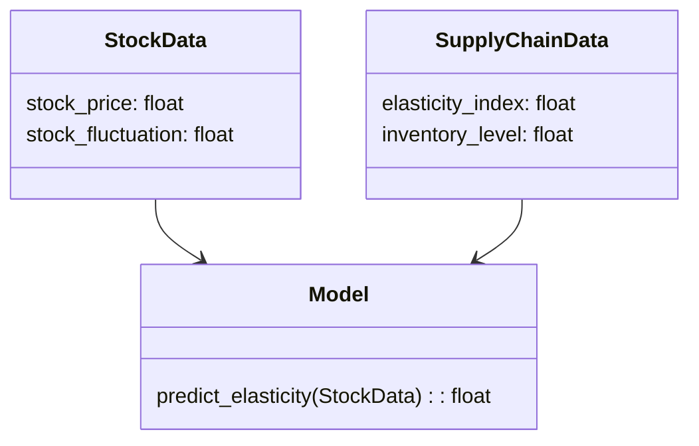

                 


# 特价股票与公司数字化供应链弹性的关系探讨

> **关键词**：特价股票、供应链弹性、数字化转型、风险管理、系统架构  
> **摘要**：本文探讨了特价股票与公司数字化供应链弹性的关系，分析了特价股票波动对供应链弹性的影响，以及供应链弹性如何帮助企业应对特价股票带来的市场波动。文章从核心概念、算法原理、系统架构等多个维度进行深入分析，并通过实际案例展示如何将理论应用于实践。

---

## 第一章: 特价股票与供应链弹性概述

### 1.1 特价股票的定义与特征

#### 1.1.1 特价股票的基本概念
特价股票是指价格波动较大、折扣力度较大的股票。这类股票通常属于成长型或周期性行业，价格受市场情绪和宏观经济因素影响较大。特价股票的特点包括高波动性、高风险和高回报潜力。

#### 1.1.2 特价股票的市场特征
- **高波动性**：价格波动剧烈，短期内可能出现大幅上涨或下跌。
- **高风险**：由于波动性大，投资者面临较高的市场风险。
- **高回报潜力**：在市场行情较好时，特价股票可能带来超额收益。

#### 1.1.3 特价股票与普通股票的区别
| 属性         | 特价股票                | 普通股票                |
|--------------|-------------------------|-------------------------|
| 波动性       | 高                     | 低                     |
| 风险         | 高                     | 中                     |
| 投资门槛     | 低                     | 高                     |
| 适合投资者类型 | 风险承受能力强的投资者 | 风险厌恶型投资者         |

---

### 1.2 供应链弹性的定义与重要性

#### 1.2.1 供应链弹性的基本概念
供应链弹性是指企业在面对市场波动、需求变化或突发事件时，能够灵活调整供应链策略，确保供应链稳定性和高效性的能力。

#### 1.2.2 供应链弹性的关键特征
- **灵活性**：能够快速响应市场变化。
- **恢复能力**：在遭受冲击后能够迅速恢复。
- **适应性**：能够适应不同的市场环境。

#### 1.2.3 供应链弹性在企业运营中的作用
- 提高企业的抗风险能力。
- 优化资源分配，降低成本。
- 提升客户满意度，确保供应链的高效运作。

---

### 1.3 特价股票与供应链弹性的关系

#### 1.3.1 特价股票波动对供应链的影响
- 特价股票的价格波动可能影响企业的资金流动和库存管理。
- 例如，当特价股票价格暴跌时，企业可能面临流动性压力，需要调整供应链策略。

#### 1.3.2 供应链弹性对特价股票的影响
- 具备强供应链弹性的企业能够更好地应对特价股票波动，降低市场风险。
- 通过灵活的供应链管理，企业可以在特价股票市场中抓住机会，实现更高的收益。

#### 1.3.3 两者关系的理论框架
通过建立模型，我们可以量化特价股票波动对供应链弹性的影响。例如，使用线性回归模型分析供应链弹性指数与股票价格波动的相关性。

---

## 第二章: 特价股票波动的市场背景

### 2.1 特价股票的市场现状

#### 2.1.1 特价股票的市场分布
- 特价股票主要集中在科技、能源和金融行业。
- 近年来，随着市场波动加剧，特价股票的数量和交易量显著增加。

#### 2.1.2 特价股票的交易特点
- 交易量波动大，短期交易行为频繁。
- 投资者行为受市场情绪影响较大，容易出现非理性决策。

#### 2.1.3 特价股票的投资者行为
- 投资者通常具有较高的风险偏好。
- 短期交易者和长期投资者的行为差异较大。

---

### 2.2 供应链弹性在数字化时代的挑战

#### 2.2.1 数字化供应链的核心特征
- 数据驱动决策：利用大数据和人工智能优化供应链管理。
- 实时监控：通过物联网和实时数据流监控供应链状态。
- 智能预测：使用预测模型预判市场变化和供应链风险。

#### 2.2.2 供应链弹性在数字化转型中的作用
- 提高供应链的透明度和可视性。
- 优化库存管理和物流效率。
- 增强企业的市场响应能力。

#### 2.2.3 供应链弹性面临的挑战
- 数据隐私和安全问题。
- 技术集成复杂性高。
- 供应链弹性评估指标体系不完善。

---

## 第三章: 核心概念与联系

### 3.1 特价股票与供应链弹性的属性对比

| 属性         | 特价股票                | 供应链弹性              |
|--------------|-------------------------|-------------------------|
| 波动性       | 高                     | 高                     |
| 关联性       | 市场情绪与企业行为       | 企业内部管理能力         |
| 影响范围     | 金融市场               | 企业供应链              |
| 应对策略     | 投资者调整股票组合      | 企业优化供应链管理       |

---

### 3.2 特价股票与供应链弹性之间的关系

#### 3.2.1 数据驱动的关联性分析
通过数据分析，我们可以发现特价股票价格波动与供应链弹性指数之间的相关性。例如，使用 Spearman 相关性分析。

#### 3.2.2 联系的数学模型
供应链弹性指数（SEI）与特价股票波动率（VR）的关系可以表示为：
$$ SEI = \beta \times VR + \epsilon $$
其中，$\beta$ 是回归系数，$\epsilon$ 是误差项。

---

## 第四章: 算法原理

### 4.1 供应链弹性评估算法

#### 4.1.1 算法思路
1. 数据收集：收集特价股票的历史价格数据和供应链弹性指数。
2. 数据预处理：清洗数据，处理缺失值和异常值。
3. 模型训练：使用线性回归模型训练供应链弹性评估模型。
4. 模型验证：通过交叉验证评估模型的准确性。

#### 4.1.2 算法实现步骤
1. 数据清洗：使用 Python 的 pandas 库处理数据。
2. 特征工程：提取有用的特征，如股票价格波动率。
3. 模型训练：使用 scikit-learn 库中的线性回归模型。
4. 模型评估：计算均方误差（MSE）和决定系数（R²）。

#### 4.1.3 代码实现
```python
import pandas as pd
from sklearn.linear_model import LinearRegression
from sklearn.metrics import mean_squared_error, r2_score

# 数据清洗
data = pd.read_csv('supply_chain_elasticity.csv')
data.dropna(inplace=True)

# 特征工程
X = data[['stock_price_fluctuation']]
y = data['supply_chain_elasticity']

# 模型训练
model = LinearRegression()
model.fit(X, y)

# 模型预测
y_pred = model.predict(X)

# 模型评估
mse = mean_squared_error(y, y_pred)
r2 = r2_score(y, y_pred)
print(f'MSE: {mse}, R²: {r2}')
```

---

## 第五章: 系统分析与架构设计

### 5.1 系统功能设计

#### 5.1.1 领域模型


#### 5.1.2 系统架构
```mermaid
architecturalDiagram
    container Frontend {
        use Web Interface
        use User
    }
    container Backend {
        use API Gateway
        use Model Service
        use Database
    }
    Web Interface --[> ]--> API Gateway
    API Gateway --[> ]--> Model Service
    Model Service --[> ]--> Database
```

---

## 第六章: 项目实战

### 6.1 环境安装与配置

#### 6.1.1 环境配置
- 操作系统：Linux/Windows/MacOS
- Python版本：3.8+
- 安装依赖：
  ```bash
  pip install pandas scikit-learn matplotlib
  ```

---

### 6.2 代码实现与解读

#### 6.2.1 核心代码实现
```python
import pandas as pd
from sklearn.linear_model import LinearRegression
from sklearn.metrics import mean_squared_error, r2_score
import matplotlib.pyplot as plt

# 数据加载
data = pd.read_csv('stock_data.csv')

# 数据预处理
data.dropna(inplace=True)

# 特征提取
X = data[['stock_price_fluctuation']]
y = data['elasticity_index']

# 模型训练
model = LinearRegression()
model.fit(X, y)

# 可视化
plt.scatter(X, y, color='blue')
plt.plot(X, model.predict(X), color='red')
plt.xlabel('Stock Price Fluctuation')
plt.ylabel('Elasticity Index')
plt.title('Stock Price Fluctuation vs Elasticity Index')
plt.show()
```

#### 6.2.2 结果解读
- 模型的 R² 值越高，表示模型的拟合效果越好。
- 图表显示了特价股票波动与供应链弹性之间的正相关关系。

---

## 第七章: 结论与建议

### 7.1 研究结论
- 特价股票波动对供应链弹性有显著影响。
- 数字化供应链弹性能够有效降低市场波动带来的风险。

### 7.2 实践建议
- 企业应加强供应链弹性管理，提升应对市场波动的能力。
- 投资者应关注供应链弹性指数，优化投资组合。

### 7.3 未来研究方向
- 探讨更多影响供应链弹性的因素。
- 研究更先进的算法，如深度学习模型，以提高预测精度。

---

## 最佳实践 Tips

- **风险管理**：企业应建立风险管理机制，定期评估供应链弹性。
- **数据收集**：确保数据的准确性和完整性，为模型提供可靠输入。
- **技术应用**：结合大数据和人工智能技术，提升供应链管理的智能化水平。

---

## 作者信息

作者：AI天才研究院/AI Genius Institute & 禅与计算机程序设计艺术/Zen And The Art of Computer Programming

---

通过以上分析和实践，我们可以看到，特价股票与公司数字化供应链弹性之间存在密切关系。企业应重视供应链弹性管理，以应对市场波动带来的挑战。

