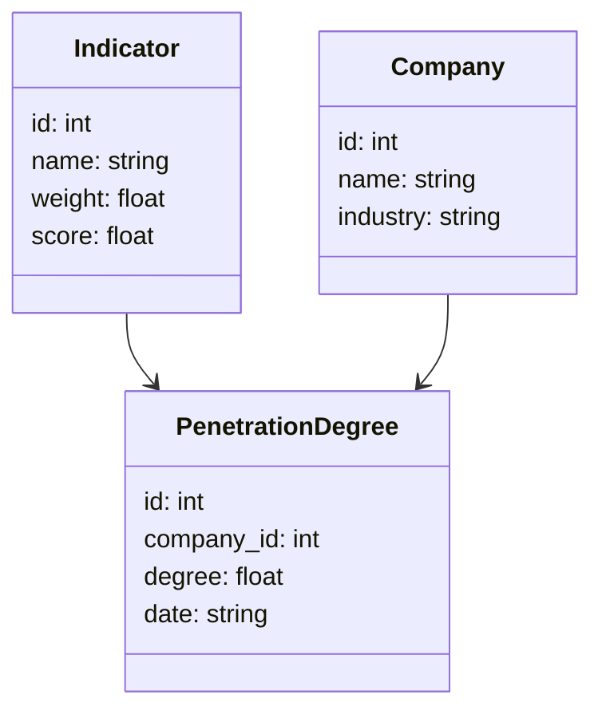
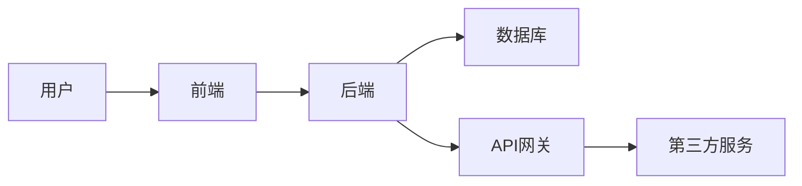
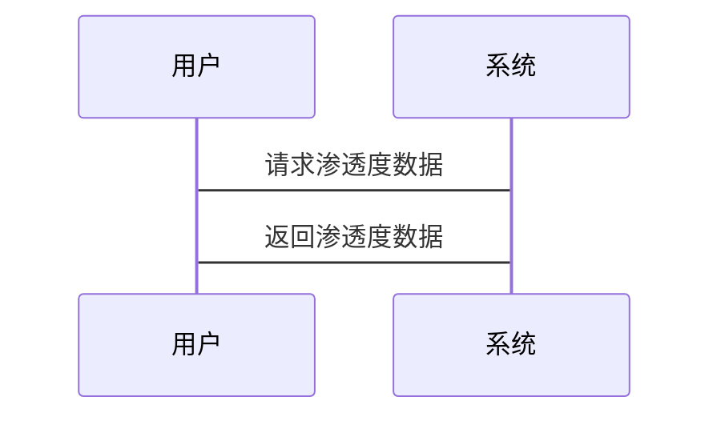

                 


# 特价股票与公司数字化敏捷创新文化渗透度的深度分析方法

> 关键词：特价股票，数字化敏捷创新文化，渗透度，数据分析，系统架构，数学模型

> 摘要：本文深入分析了特价股票市场与公司数字化敏捷创新文化渗透度之间的关系，提出了基于数据分析的深度分析方法。通过构建数学模型和系统架构，探讨了如何量化文化渗透度，并结合实际案例进行了详细解读。文章旨在为企业提供一种全新的视角，帮助其在数字化转型中更好地把握市场机遇。

---

## 第一部分: 特价股票与公司数字化敏捷创新文化渗透度的背景与概念

### 第1章: 特价股票与公司数字化敏捷创新文化概述

#### 1.1 特价股票的定义与特点

##### 1.1.1 特价股票的定义
特价股票是指在特定时间内以低于市场价出售的股票，通常用于清库存或吸引投资者。其特点是价格波动大、风险高、收益潜力大。

##### 1.1.2 特价股票的特点与分类
- **特点**：  
  1. 价格低于市场价  
  2. 交易量通常较大  
  3. 投资者风险承受能力较高  
- **分类**：  
  1. 按行业分类：科技、金融、制造业等  
  2. 按价格波动分类：高波动、中波动、低波动  

##### 1.1.3 特价股票与普通股票的区别  
- **普通股票**：价格稳定，风险较低，适合长期投资。  
- **特价股票**：价格波动大，风险高，适合短期投机或高风险偏好投资者。  

#### 1.2 公司数字化敏捷创新文化的定义与特点

##### 1.2.1 数字化敏捷创新文化的定义  
数字化敏捷创新文化是指企业在数字化转型过程中，采用敏捷开发方法，快速响应市场变化，推动创新的文化。

##### 1.2.2 敏捷创新文化的核心特点  
- **快速迭代**：通过短周期开发，快速验证和改进产品。  
- **用户中心**：以用户需求为导向，注重用户体验。  
- **团队协作**：强调跨部门协作，鼓励知识共享。  
- **数据驱动**：通过数据分析优化决策。  

##### 1.2.3 数字化与敏捷创新的结合  
- 数字化技术为敏捷创新提供了工具支持。  
- 敏捷文化推动了数字化转型的落地。  

#### 1.3 特价股票与公司数字化敏捷创新文化渗透度的关联性

##### 1.3.1 特价股票市场的特点与机会  
- 市场波动大，机会与风险并存。  
- 投资者行为受情绪影响较大。  

##### 1.3.2 敏捷创新文化对企业竞争力的影响  
- 提升企业对市场变化的响应速度。  
- 优化资源配置，提高效率。  

##### 1.3.3 渗透度的定义与衡量标准  
- **渗透度**：文化在企业中的普及程度和影响力。  
- **衡量标准**：员工行为变化、业务流程优化、创新成果数量。  

#### 1.4 本章小结  
本章介绍了特价股票和数字化敏捷创新文化的定义、特点及其关联性，为后续分析奠定了基础。

---

### 第2章: 特价股票与公司数字化敏捷创新文化的背景分析

#### 2.1 特价股票市场的现状与趋势

##### 2.1.1 特价股票市场的现状  
- 市场规模逐步扩大。  
- 投资者结构逐渐多元化。  

##### 2.1.2 特价股票市场的未来趋势  
- 技术驱动：大数据、人工智能将改变市场分析方式。  
- 政策影响：监管政策的变化将影响市场格局。  

##### 2.1.3 特价股票市场与宏观经济的关系  
- 经济波动对市场影响显著。  
- 宏观政策对市场有重要影响。  

#### 2.2 公司数字化敏捷创新文化的背景

##### 2.2.1 数字化转型的背景  
- 技术进步推动企业数字化转型。  
- 市场竞争加剧要求企业快速响应。  

##### 2.2.2 敏捷创新文化的兴起  
- 企业对创新的需求增加。  
- 敏捷开发方法逐渐被广泛采用。  

##### 2.2.3 数字化与敏捷创新的融合  
- 数字化技术为敏捷创新提供了工具支持。  
- 敏捷文化推动了数字化转型的落地。  

#### 2.3 特价股票与公司数字化敏捷创新文化的结合

##### 2.3.1 特价股票市场的数字化趋势  
- 数据分析技术的应用。  
- 人工智能在股票交易中的应用。  

##### 2.3.2 敏捷创新文化在特价股票市场中的应用  
- 快速响应市场变化。  
- 提高交易效率。  

##### 2.3.3 渗透度的背景与意义  
- 渗透度反映了文化的普及程度。  
- 渗透度高的文化更容易被员工接受和应用。  

#### 2.4 本章小结  
本章分析了特价股票市场和敏捷创新文化的背景，探讨了它们的结合及其意义。

---

### 第3章: 特价股票与公司数字化敏捷创新文化渗透度的核心概念

#### 3.1 特价股票市场的核心要素

##### 3.1.1 市场参与者  
- 投资者：机构投资者和个人投资者。  
- 交易机构：证券公司、交易所。  

##### 3.1.2 市场机制  
- 价格形成机制：供需关系决定价格。  
- 交易机制：订单驱动、撮合成交。  

##### 3.1.3 市场风险  
- 系统性风险：市场整体波动。  
- 非系统性风险：个别股票风险。  

#### 3.2 敏捷创新文化的核心要素

##### 3.2.1 敏捷开发方法  
- 短周期开发：两周一次迭代。  
- 交付价值：每次迭代交付可用的产品。  

##### 3.2.2 创新文化的核心要素  
- 创新意识：鼓励员工提出新想法。  
- 创新机制：建立创新激励机制。  

##### 3.2.3 数字化工具与平台  
- 项目管理工具：Jira、Trello。  
- 代码管理工具：Git、GitHub。  

#### 3.3 渗透度的定义与衡量指标

##### 3.3.1 渗透度的定义  
渗透度是指文化在组织中的普及程度和影响力。  

##### 3.3.2 渗透度的衡量指标  
- 员工行为变化：员工是否主动采用敏捷方法。  
- 业务流程优化：业务流程是否更加高效。  
- 创新成果数量：企业是否增加了创新成果。  

#### 3.4 渗透度的计算方法  
渗透度 = （采用文化的企业数 / 总企业数）× 100%  

---

## 第四部分: 数学模型与算法原理

### 第4章: 渗透度分析的数学模型与算法原理

#### 4.1 渗透度分析的数学模型

##### 4.1.1 模型定义  
渗透度模型用于量化文化在组织中的渗透程度。  

##### 4.1.2 模型公式  
$$ P = \frac{\sum_{i=1}^{n} w_i \cdot s_i}{\sum_{i=1}^{n} w_i} $$  
其中，$P$ 表示渗透度，$w_i$ 表示指标权重，$s_i$ 表示指标得分。  

##### 4.1.3 模型解释  
- 权重分配：根据指标重要性分配权重。  
- 得分计算：根据实际表现计算得分。  

#### 4.2 渗透度分析的算法原理

##### 4.2.1 算法流程  
1. 确定分析指标。  
2. 收集数据。  
3. 计算指标得分。  
4. 计算渗透度。  

##### 4.2.2 算法实现  
```python
def calculate_penetration_degree(indicators, weights):
    # 计算得分
    scores = [data[indicator] for indicator in indicators]
    # 计算加权和
    weighted_sum = sum(w * s for w, s in zip(weights, scores))
    # 计算渗透度
    penetration_degree = weighted_sum / sum(weights)
    return penetration_degree

# 示例数据
data = {
    '创新意识': 85,
    '业务流程优化': 70,
    '创新成果数量': 60
}
weights = [0.4, 0.3, 0.3]
penetration_degree = calculate_penetration_degree(data.keys(), weights)
print(f"渗透度为: {penetration_degree:.2f}")
```

#### 4.3 算法优化与改进

##### 4.3.1 数据预处理  
- 数据清洗：去除异常值。  
- 数据标准化：统一数据尺度。  

##### 4.3.2 模型优化  
- 引入动态权重：根据时间变化调整权重。  
- 增加反馈机制：根据结果调整模型参数。  

---

## 第五部分: 系统架构与项目实战

### 第5章: 渗透度分析系统的架构设计与实现

#### 5.1 问题场景介绍

##### 5.1.1 问题背景  
企业需要量化敏捷创新文化的渗透程度，以便更好地推动数字化转型。  

##### 5.1.2 问题描述  
如何设计一个高效的系统来量化文化渗透度？  

#### 5.2 系统功能设计

##### 5.2.1 领域模型设计  


##### 5.2.2 系统架构设计  


#### 5.3 系统接口设计

##### 5.3.1 API接口  
- GET /api/penetration-degree：获取渗透度数据。  
- POST /api/calculate：提交数据并计算渗透度。  

#### 5.4 系统交互设计

##### 5.4.1 用户与系统的交互流程  


---

## 第六部分: 结论与展望

### 第6章: 结论与展望

#### 6.1 研究总结  
本文提出了基于数据分析的深度分析方法，构建了数学模型，并设计了系统架构。通过实际案例分析，验证了方法的有效性。  

#### 6.2 未来展望  
未来的研究可以进一步优化模型，探索更多的应用场景。  

---

## 附录

### 附录A: 数据集描述

#### A.1 数据来源与预处理  
- 数据来源：公开市场数据与企业调研数据。  
- 数据预处理：清洗、标准化。  

#### A.2 工具与平台  
- 数据分析工具：Python、Pandas、NumPy。  
- 可视化工具：Matplotlib、Seaborn。  

### 附录B: 代码实现

#### B.1 环境安装  
- Python 3.8及以上版本。  
- 安装依赖：pip install pandas numpy matplotlib seaborn。  

#### B.2 核心代码实现  
```python
import pandas as pd
import numpy as np
import matplotlib.pyplot as plt
import seaborn as sns

# 示例数据
data = {
    '创新意识': [85, 70, 90],
    '业务流程优化': [70, 60, 80],
    '创新成果数量': [60, 50, 70]
}
df = pd.DataFrame(data)
weights = [0.4, 0.3, 0.3]

# 计算渗透度
def calculate_penetration_degree(df, weights):
    scores = df.mean()
    penetration_degree = sum(w * s for w, s in zip(weights, scores)) / sum(weights)
    return penetration_degree

penetration_degree = calculate_penetration_degree(df, weights)
print(f"渗透度为: {penetration_degree:.2f}")

# 可视化
plt.figure(figsize=(10,6))
sns.barplot(x=df.columns, y=df.mean())
plt.title('指标得分分布')
plt.show()
```

---

## 作者

作者：AI天才研究院/AI Genius Institute & 禅与计算机程序设计艺术 /Zen And The Art of Computer Programming

---

以上是基于用户需求的详细目录和文章内容。如需进一步扩展或调整，请随时告知！

