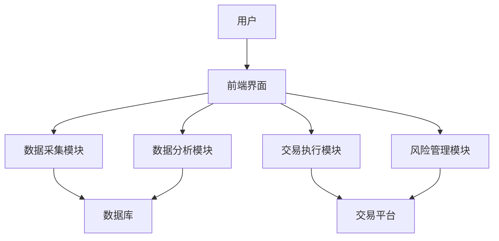

                 


# 特价股票与公司数字化敏捷创新文化的深度分析方法

## 关键词
特价股票、数字化创新、敏捷文化、技术分析、系统架构

## 摘要
本文将深入探讨特价股票与公司数字化敏捷创新文化之间的关系。首先，从特价股票的基本概念、市场分析和技术分析方法入手，结合公司数字化敏捷创新文化的构建与实施策略，分析两者如何相互影响。通过构建数学模型和算法，探讨如何利用数字化工具提升特价股票的价值。最后，通过实际案例分析和系统设计，总结最佳实践和未来发展方向。

---

# 第一部分：特价股票的基础分析

## 第1章：特价股票的定义与分类

### 1.1 特价股票的定义与特征

#### 1.1.1 特价股票的定义
- 特价股票是指价格相对较低的股票，通常具有较高的增长潜力。
- 从市场角度来看，特价股票可以是中小盘股，也可以是被市场低估的大盘股。

#### 1.1.2 特价股票的分类
- 按照市场资本化规模：大盘股、中盘股、小盘股。
- 按照行业特性：科技股、周期性股票、防御性股票。
- 按照股东结构：机构股、散户股。

#### 1.1.3 特价股票的市场定位与作用
- 特价股票通常具有较高的波动性，适合风险偏好较高的投资者。
- 在市场低迷时期，特价股票可能成为抄底资金的主要目标。

---

## 第2章：特价股票的技术分析方法

### 2.1 技术分析的基础原理

#### 2.1.1 技术分析的定义
- 技术分析是通过分析历史价格和成交量数据，预测未来股价走势的方法。
- 核心假设：市场行为反映所有信息、价格遵循趋势、历史会重复。

#### 2.1.2 技术分析与基本面分析的对比
- 技术分析侧重于价格走势，基本面分析侧重于公司财务状况。
- 技术分析适合短期交易，基本面分析适合长期投资。

#### 2.1.3 技术分析在股票投资中的作用
- 技术分析可以帮助投资者识别趋势、支撑位和阻力位。
- 技术分析可以辅助制定买卖决策。

---

### 2.2 常用技术指标解析

#### 2.2.1 移动平均线（MA）的计算与应用
- 移动平均线是将一定时期内的收盘价进行平均计算，形成价格趋势的指标。
- 常用的移动平均线包括：5日、10日、20日、50日、100日、200日均线。

#### 2.2.2 相对强弱指数（RSI）的计算与应用
- RSI 是衡量股票超买或超卖状态的指标，范围在0到100之间。
- 计算公式：$$RSI = \frac{100 - \frac{\sum \text{上涨幅度}}{\sum \text{下跌幅度}}}{1}$$
- 应用规则：RSI >70为超卖，RSI <30为超买。

#### 2.2.3 布林带（Bollinger Bands）的计算与应用
- 布林带由三条曲线组成：中线（MA）、上轨（MA + 标准差）和下轨（MA - 标准差）。
- 应用规则：价格突破上轨或下轨可能是趋势反转的信号。

---

# 第二部分：公司数字化敏捷创新文化的构建

## 第3章：数字化敏捷创新文化的核心要素

### 3.1 敏捷方法的定义与特点

#### 3.1.1 敏捷方法的定义
- 敏捷方法是一种以迭代、增量的方式开发产品的理念。
- 核心原则：用户参与、持续交付、拥抱变化、团队协作。

#### 3.1.2 敏捷方法与传统开发模式的对比
- 敏捷方法强调快速迭代和用户反馈，传统开发模式强调严格的计划和流程。

#### 3.1.3 敏捷方法在公司文化中的作用
- 提高团队协作效率。
- 增强对市场变化的响应能力。

---

## 第4章：数字化创新文化的塑造

### 4.1 数字化转型的策略与路径

#### 4.1.1 数字化转型的定义
- 数字化转型是指利用数字技术改造和优化企业业务模式的过程。
- 核心技术包括：大数据、人工智能、区块链、云计算。

#### 4.1.2 数字化转型的路径
- 重构业务流程。
- 优化组织结构。
- 培养数字人才。

---

### 4.2 创新文化的构建与实践

#### 4.2.1 创新文化的定义
- 创新文化是指鼓励员工提出新想法、新产品和新流程的企业文化。
- 核心特征：开放性、包容性、鼓励冒险。

#### 4.2.2 创新文化的实现路径
- 建立创新激励机制。
- 提供创新资源支持。
- 培养创新思维方式。

---

## 第5章：数字化敏捷创新文化与企业绩效的关系

### 5.1 数字化敏捷创新文化的绩效评估

#### 5.1.1 绩效评估的定义
- 绩效评估是指对企业文化对业务绩效的影响进行测量和分析。

#### 5.1.2 绩效评估的指标体系
- 创新成果数量。
- 员工满意度。
- 业务增长速度。

---

### 5.2 数字化敏捷创新文化的成功案例分析

#### 5.2.1 案例一：某科技公司的数字化转型
- 通过敏捷开发模式，快速推出新产品。
- 通过创新文化，提高员工积极性。

#### 5.2.2 案例二：某制造业的数字化创新
- 利用大数据分析优化生产流程。
- 通过区块链技术实现供应链透明化。

---

# 第三部分：特价股票与公司数字化敏捷创新文化的结合

## 第6章：数字化工具在特价股票分析中的应用

### 6.1 大数据分析在股票市场中的应用

#### 6.1.1 大数据分析的定义
- 大数据分析是指从海量、复杂的数据中提取有价值信息的过程。
- 核心技术包括：数据挖掘、机器学习、自然语言处理。

#### 6.1.2 大数据分析在股票市场中的应用场景
- 市场情绪分析。
- 股票价格预测。
- 风险管理。

---

## 第7章：敏捷开发在股票交易系统中的应用

### 7.1 敏捷开发在股票交易系统中的优势

#### 7.1.1 敏捷开发的优势
- 快速迭代，适应市场变化。
- 团队协作，提高开发效率。
- 用户参与，确保产品符合需求。

---

### 7.2 股票交易系统的敏捷开发实践

#### 7.2.1 系统设计
- 功能模块：数据采集、数据分析、交易执行、风险管理。
- 系统架构：微服务架构、分布式架构。

#### 7.2.2 开发流程
- 每个迭代周期：需求分析、设计、开发、测试。
- 团队协作：每日站会、代码审查、持续集成。

---

# 第四部分：系统架构与实现

## 第8章：特价股票分析系统的架构设计

### 8.1 系统功能设计

#### 8.1.1 功能模块划分
- 数据采集模块：实时采集股票数据。
- 数据分析模块：技术指标计算、市场情绪分析。
- 交易执行模块：自动交易、手动交易。
- 风险管理模块：风险评估、止损设置。

---

### 8.2 系统架构设计

#### 8.2.1 系统架构图


#### 8.2.2 数据流设计
- 数据采集模块从交易平台获取实时数据。
- 数据分析模块对数据进行处理和分析。
- 交易执行模块根据分析结果执行交易。
- 风险管理模块监控交易风险并进行干预。

---

## 第9章：股票交易系统的接口设计

### 9.1 系统接口设计

#### 9.1.1 接口设计原则
- 规范化：接口命名清晰，参数明确。
- 可扩展性：接口设计留有扩展空间。
- 安全性：接口需具备认证和加密功能。

---

### 9.2 接口实现

#### 9.2.1 数据接口
- 数据接口类型：RESTful API。
- 数据接口协议：JSON格式。

#### 9.2.2 交易接口
- 交易接口类型：WebSocket。
- 交易接口功能：订单提交、订单取消。

---

# 第五部分：项目实战与最佳实践

## 第10章：特价股票分析系统的实战案例

### 10.1 环境安装

#### 10.1.1 系统环境
- 操作系统：Linux或Windows。
- 开发工具：IDE（如PyCharm、VS Code）。
- 依赖库：Python（pandas、numpy、scikit-learn）。

---

### 10.2 系统核心实现

#### 10.2.1 数据采集模块
```python
import requests
import pandas as pd

def get_stock_data(symbol):
    url = f"https://api.example.com/stock/{symbol}"
    response = requests.get(url)
    data = response.json()
    return pd.DataFrame(data)
```

---

#### 10.2.2 数据分析模块
```python
from sklearn.linear_model import LinearRegression

def predict_price(data):
    model = LinearRegression()
    model.fit(data[['close', 'volume']], data['open'])
    return model.predict(data[['close', 'volume']])
```

---

## 第11章：最佳实践与注意事项

### 11.1 最佳实践

#### 11.1.1 数据分析的准确性
- 数据来源要可靠。
- 数据清洗要彻底。

#### 11.1.2 系统的安全性
- 接口要加密。
- 数据要备份。

---

### 11.2 注意事项

#### 11.2.1 风险控制
- 设置止损点。
- 监控市场波动。

#### 11.2.2 团队协作
- 定期举行团队会议。
- 及时沟通问题。

---

## 第12章：总结与展望

### 12.1 总结

- 特价股票分析需要结合技术分析和基本面分析。
- 数字化敏捷创新文化能够提升企业的竞争力。
- 系统架构设计要注重可扩展性和安全性。

---

### 12.2 展望

- 随着人工智能技术的发展，股票分析将更加智能化。
- 敏捷开发将成为企业数字化转型的主流模式。

---

## 作者：AI天才研究院/AI Genius Institute & 禅与计算机程序设计艺术 /Zen And The Art of Computer Programming

