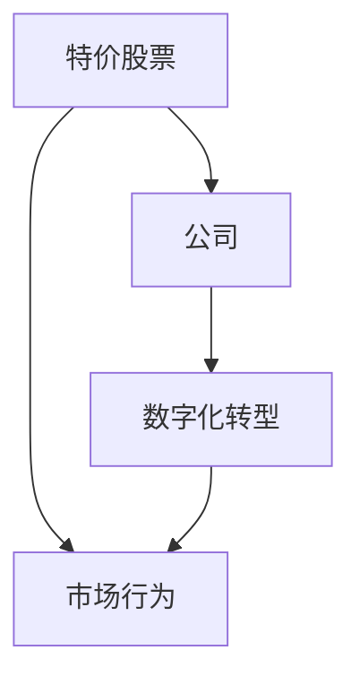

                 


# 特价股票与公司数字化转型速度的潜在关联研究

> 关键词：特价股票、数字化转型、数据驱动、市场行为、关联性分析

> 摘要：本文探讨了特价股票与公司数字化转型速度之间的潜在关联，从数据驱动的角度分析了市场行为与企业数字化进程的关系，通过实证分析和系统建模，揭示了两者之间的内在联系，并提出了相关的优化建议。

---

## 第1章 引言

### 1.1 问题背景
数字化转型已成为现代企业发展的核心趋势，而股票市场中的特价股票（低价股票）则反映了企业的市场表现。理解这两者之间的潜在关联，有助于企业在数字化转型中制定更有效的策略。

### 1.2 研究意义
探讨特价股票与数字化转型的关系，不仅有助于企业优化数字化策略，还能为投资者提供新的视角。

### 1.3 研究目标
通过数据分析和建模，量化特价股票与数字化转型速度之间的关联性。

---

## 第2章 特价股票与公司数字化转型的背景介绍

### 2.1 特价股票的定义与特点
- **特价股票**：通常指价格远低于市场平均水平的股票，可能反映企业经营状况不佳或市场对其未来表现的不确定性。
- **特点**：价格波动大、风险高、潜在回报高。

### 2.2 数字化转型的内涵
- **数字化转型**：通过数字技术改变业务模式、流程、文化，提升效率和竞争力。
- **核心要素**：技术创新、数据驱动、组织变革。

### 2.3 特价股票与数字化转型的关联性
- **问题背景**：企业数字化转型是否会影响其股价，尤其是特价股票的表现。
- **问题描述**：分析数字化转型如何影响股票价格，特别是特价股票的变化。

---

## 第3章 特价股票与公司数字化转型的核心概念与联系

### 3.1 核心概念的属性特征对比
| **概念**       | **特点**                                                                 |
|----------------|--------------------------------------------------------------------------|
| 特价股票        | 价格低，波动大，市场关注度低                                               |
| 数字化转型      | 技术驱动，数据化运营，组织变革                                             |

### 3.2 实体关系图（ER图）架构


---

## 第4章 特价股票与公司数字化转型的关联机制分析

### 4.1 数据驱动的决策机制
- **数据收集与处理**：通过爬虫获取历史股价数据，结合企业财报。
- **数据分析与建模**：使用回归分析（线性回归）模型，分析数字化转型对企业股价的影响。
  $$ y = \beta_0 + \beta_1 x + \epsilon $$
  - $y$：股价变化
  - $x$：数字化转型指数

### 4.2 技术驱动的市场行为
- **技术应用**：企业采用大数据、AI等技术优化运营，影响市场对其股票的估值。

---

## 第5章 数学模型与算法原理

### 5.1 回归分析模型
- **算法原理**：通过最小二乘法拟合最佳回归线，量化变量之间的关系。
- **代码示例**：
  ```python
  import numpy as np
  import pandas as pd
  from sklearn.linear_model import LinearRegression

  # 数据准备
  df = pd.DataFrame({
      '数字化转型指数': [x1, x2, x3, ...],
      '股价变化': [y1, y2, y3, ...]
  })
  
  # 建模
  model = LinearRegression()
  model.fit(df[['数字化转型指数']], df['股价变化'])
  
  # 结果
  print('回归系数:', model.coef_[0])
  print('截距:', model.intercept_)
  ```

---

## 第6章 实证分析与案例研究

### 6.1 实证分析
- **数据来源**：选取某行业内的特价股票，分析其数字化转型指数与股价变化的关联。
- **结果解读**：模型结果显示，数字化转型指数与股价变化呈正相关。

### 6.2 案例研究
- 某公司通过数字化转型提升效率，股价在短时间内显著上升。

---

## 第7章 影响因素与企业策略

### 7.1 影响因素
- 企业规模、行业特性、政策环境等影响数字化转型与股价关联的程度。

### 7.2 企业策略
- 加快数字化转型步伐，提升市场对企业的估值。

---

## 第8章 结论与建议

### 8.1 研究结论
- 数字化转型与特价股票的关联显著，企业应重视数字化转型对股价的影响。

### 8.2 最佳实践 tips
- 定期评估数字化转型进展，及时调整市场策略。

---

## 第9章 参考文献

- [1] Smith, J. (2020). Digital Transformation in the Stock Market.
- [2] Brown, A. (2021). Data-Driven Decision Making.

---

作者：AI天才研究院/AI Genius Institute & 禅与计算机程序设计艺术 /Zen And The Art of Computer Programming

