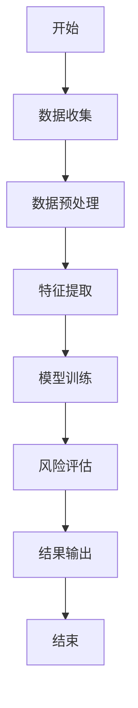

                 


# 特价股票与公司数据安全与隐私保护能力的关联性研究

## 关键词：
- 特价股票
- 数据安全
- 隐私保护
- 股价波动
- 企业风险管理

## 摘要：
本文探讨了特价股票市场与公司数据安全及隐私保护能力之间的关联性。通过分析数据安全对股价波动的影响，揭示了数据泄露事件如何影响公司价值和投资者信心，进而对特价股票市场产生深远影响。文章从数据安全的核心原理、评估算法、系统架构等多个维度展开，结合实际案例，深入剖析了数据安全能力与企业股价之间的关系，并提出了相应的风险管理策略。

---

## 第1章: 特价股票与数据安全的背景介绍

### 1.1 特价股票的基本概念

#### 1.1.1 特价股票的定义与分类
- 特价股票的定义：指价格低于市场平均价格的股票，通常被视为具有投资潜力的低价股。
- 分类：按行业、市值、市盈率等标准进行分类，常见于中小型企业或新兴行业。

#### 1.1.2 特价股票的市场特征
- 市场波动性高：低价股票受市场情绪影响较大，容易出现剧烈波动。
- 投资风险较高：由于公司基本面可能存在不确定性，投资者需承担较高的风险。

#### 1.1.3 特价股票与公司基本面的关系
- 公司基本面分析：包括盈利能力、财务状况、管理团队等，是决定股价的重要因素。
- 特价股票的估值差异：低价股票可能因市场忽视或低估而提供投资机会。

### 1.2 数据安全与隐私保护的基本概念

#### 1.2.1 数据安全的定义与范围
- 数据安全的定义：保护数据的机密性、完整性和可用性，防止未经授权的访问和泄露。
- 数据安全的范围：涵盖企业内部数据、客户数据、交易数据等。

#### 1.2.2 隐私保护的核心原则
- 隐私保护的原则：包括最小化数据收集、数据加密、用户同意等，确保个人隐私不被侵犯。
- 数据隐私的法律框架：如GDPR（通用数据保护条例）、CCPA（加州消费者隐私法案）等。

#### 1.2.3 数据安全与隐私保护的法律框架
- 全球数据保护法规：不同国家和地区对数据安全和隐私保护有不同的法律规定。
- 企业的合规要求：企业需遵守相关法规，否则可能面临罚款和声誉损失。

### 1.3 特价股票与数据安全的关联性背景

#### 1.3.1 特价股票市场的风险因素
- 市场波动风险：特价股票价格波动大，容易受市场情绪影响。
- 信息不对称风险：投资者可能因信息不全或不准确做出错误决策。

#### 1.3.2 数据安全对企业价值的影响
- 数据泄露的影响：企业数据泄露可能导致客户信任下降，进而影响股价。
- 数据安全能力的溢价：具备强大数据安全能力的公司可能获得更高的市场估值。

#### 1.3.3 数据泄露对股价波动的潜在影响
- 数据泄露事件的即时影响：如Facebook的数据泄露事件导致股价下跌。
- 长期影响：数据安全事件可能对公司的品牌和客户忠诚度造成长期影响。

---

## 第2章: 特价股票与数据安全的核心概念与联系

### 2.1 数据安全与隐私保护的核心原理

#### 2.1.1 数据安全的关键技术
- 数据加密：通过加密技术保护数据在传输和存储过程中的安全性。
- 访问控制：通过权限管理确保只有授权人员可以访问敏感数据。

#### 2.1.2 隐私保护的实现方法
- 数据匿名化：通过技术手段隐藏个人身份信息。
- 数据最小化：仅收集实现业务目标所需的数据。

#### 2.1.3 数据安全与隐私保护的对比分析
| **方面**       | **数据安全**          | **隐私保护**          |
|----------------|----------------------|-----------------------|
| 目标           | 防止数据泄露          | 保护个人隐私          |
| 实现方法       | 加密、访问控制        | 匿名化、最小化数据收集|
| 关注点         | 数据的机密性、完整性和可用性| 个人隐私不被侵犯      |

### 2.2 数据安全与隐私保护的ER实体关系图

```mermaid
er
  actor 公司
  actor 用户
  actor 攻击者
  database 数据
  database 用户隐私数据
  database 公司敏感数据
  公司 --> 数据: 生成和存储
  用户 --> 数据: 提供和访问
  攻击者 --> 数据: 攻击和泄露
```

---

## 第3章: 数据安全评估的算法原理

### 3.1 数据安全评估算法的流程



### 3.2 数据安全评估算法的Python实现

```python
# 数据安全评估算法实现
import pandas as pd
from sklearn.tree import DecisionTreeClassifier
from sklearn.metrics import accuracy_score

# 数据加载
data = pd.read_csv('data.csv')

# 特征提取
features = data[['profit_margin', 'debt_ratio', 'revenue_growth', 'market_cap']]
target = data['data_security_risk']

# 模型训练
model = DecisionTreeClassifier()
model.fit(features, target)

# 模型预测
 predictions = model.predict(features)
 print(f"模型准确率: {accuracy_score(target, predictions)}")
```

### 3.3 数据安全评估的数学模型

- 贝叶斯定理的应用：
  $$ P(A|B) = \frac{P(B|A) \cdot P(A)}{P(B)} $$
  用于计算数据泄露的概率。

---

## 第4章: 数据安全与隐私保护的系统分析

### 4.1 系统功能设计

#### 4.1.1 数据分类与分级
- 数据分类：根据敏感程度将数据分为公开、内部、机密等层级。
- 数据分级：确定不同数据的保护级别，制定相应的安全策略。

#### 4.1.2 访问控制
- 用户权限管理：通过RBAC（基于角色的访问控制）模型分配权限。
- 审计日志：记录用户操作，便于追溯和分析。

### 4.2 系统架构设计


---

## 第5章: 项目实战与案例分析

### 5.1 项目实战

#### 5.1.1 环境安装
```bash
pip install flask sklearn pandas
```

#### 5.1.2 核心代码实现
```python
from flask import Flask, request, jsonify

app = Flask(__name__)

@app.route('/api/v1/data_security_check', methods=['POST'])
def data_security_check():
    data = request.json
    # 数据处理逻辑
    return jsonify({'status': 'success', 'message': '数据安全检查完成'})
```

### 5.2 案例分析

#### 5.2.1 某公司数据泄露事件
- 事件描述：某公司因数据泄露导致股价下跌。
- 分析：数据泄露事件对公司股价的直接影响和长期影响。

---

## 第6章: 最佳实践与小结

### 6.1 最佳实践

#### 6.1.1 数据安全策略
- 定期进行安全演练和漏洞扫描。
- 建立数据泄露应急响应机制。

#### 6.1.2 隐私保护措施
- 加强员工数据安全培训。
- 使用加密通信技术保护数据传输。

### 6.2 小结
数据安全与隐私保护能力直接影响公司的市场价值和投资者信心，尤其是在特价股票市场中，数据泄露事件可能引发股价大幅波动。企业应重视数据安全建设，提升风险管理能力。

### 6.3 注意事项
- 数据安全是一个长期的过程，需要持续投入和改进。
- 隐私保护需遵守相关法律法规，避免法律风险。

### 6.4 拓展阅读
- 建议阅读《数据安全与隐私保护》（书籍名称）、《 cybersecurity in stock market》（书籍名称）等书籍，深入了解数据安全在金融领域的应用。

---

## 作者：AI天才研究院/AI Genius Institute & 禅与计算机程序设计艺术/Zen And The Art of Computer Programming

