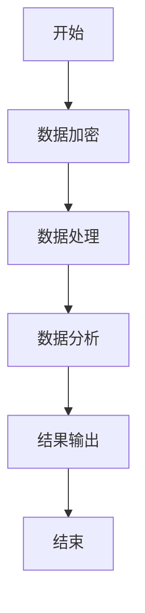

                 


# 特价股票与公司数据安全与隐私增强计算能力的关联性研究

## 关键词：特价股票，数据安全，隐私增强计算，关联性，数据隐私，增强计算能力

## 摘要：本文探讨了特价股票市场与公司数据安全及隐私增强计算能力之间的关联性。通过分析数据隐私对股价的影响、数据安全对竞争力的作用，以及隐私计算技术在保护股票数据中的应用，本文提出了一种增强数据隐私能力的方法，以提升公司在特价股票市场的竞争力。

---

## 第一部分：背景介绍

### 第1章：特价股票与公司数据安全的背景

#### 1.1 问题背景

- **1.1.1 特价股票市场的现状与挑战**
  特价股票市场是一个高度波动的市场，投资者通常寻求低价股票以期获得高回报。然而，这种市场的不稳定性带来了高风险，尤其是在数据隐私和安全方面。公司数据的泄露可能导致股价暴跌，影响投资者信心。

- **1.1.2 公司数据安全的重要性**
  公司数据，尤其是财务和战略数据，是吸引投资者的关键因素。数据泄露不仅会导致经济损失，还可能引发法律诉讼和声誉损失，进而影响股价。

- **1.1.3 增强计算能力对数据隐私的影响**
  随着数据隐私法规的严格，公司需要使用增强计算能力来保护数据，同时不影响数据分析的准确性。这在特价股票市场尤为重要，因为数据分析是投资决策的核心。

#### 1.2 问题描述

- **1.2.1 特价股票交易中的数据隐私风险**
  特价股票交易涉及大量敏感数据，如交易记录和投资者信息。这些数据若被泄露，可能导致股价波动和投资者损失。

- **1.2.2 数据安全对股价波动的影响**
  数据安全事件可能导致股价急剧下降，影响公司的市场地位。因此，确保数据安全是维持股价稳定的关键。

- **1.2.3 增强计算能力在数据隐私中的作用**
  增强计算能力通过加密和隐私保护技术，确保数据在分析和传输中的安全，从而保护公司的隐私和数据完整性。

#### 1.3 问题解决

- **1.3.1 数据隐私保护的必要性**
  数据隐私保护是维护投资者信任和公司声誉的关键。通过保护数据，公司可以防止数据泄露事件，减少股价波动。

- **1.3.2 增强计算能力的应用场景**
  增强计算能力在特价股票市场中的应用包括实时数据分析、预测模型构建和交易策略优化，同时保护数据隐私。

- **1.3.3 特价股票市场中的数据安全解决方案**
  公司应采用先进的数据加密技术和隐私保护措施，确保交易数据的安全，同时提高数据分析的效率。

#### 1.4 边界与外延

- **1.4.1 特价股票市场的边界**
  特价股票市场的边界包括交易数据、投资者信息和公司财务数据。保护这些数据是确保市场稳定的关键。

- **1.4.2 数据安全的外延**
  数据安全不仅涉及内部数据保护，还包括供应链和合作伙伴的数据安全，确保整个生态链的安全。

- **1.4.3 增强计算能力的扩展**
  增强计算能力的应用范围扩展到物联网、云计算和人工智能领域，提升数据处理的效率和安全性。

#### 1.5 核心要素组成

- **1.5.1 数据隐私的核心要素**
  数据隐私的核心要素包括数据加密、访问控制和数据匿名化，确保数据在各环节的安全。

- **1.5.2 增强计算能力的关键技术**
  关键技术包括同态加密、安全多方计算和零知识证明，这些技术在保护数据隐私的同时，支持复杂的数据分析。

- **1.5.3 特价股票市场的关联因素**
  关联因素包括市场波动、投资者行为和公司治理，这些因素共同影响股价和市场稳定性。

---

## 第二部分：核心概念与联系

### 第2章：核心概念与原理

#### 2.1 数据隐私与增强计算能力

- **2.1.1 数据隐私的定义与属性**
  数据隐私是指个人或公司在控制其数据的使用、分享和管理方面的权利。属性包括机密性、完整性、可用性和可追溯性。

- **2.1.2 增强计算能力的原理**
  增强计算能力通过结合传统计算和新兴技术（如区块链、AI），提升数据处理效率和安全性，同时保护数据隐私。

- **2.1.3 两者之间的关系**
  数据隐私是增强计算能力的目标，而增强计算能力是实现数据隐私的手段。两者相辅相成，共同保护数据安全。

#### 2.2 核心概念对比

- **2.2.1 数据隐私与数据安全的对比**
  | 属性 | 数据隐私 | 数据安全 |
  |------|----------|----------|
  | 定义 | 数据控制权 | 数据保护措施 |
  | 目标 | 隐私保护 | 防止数据泄露 |
  | 实施 | 加密、访问控制 | 防火墙、入侵检测 |

- **2.2.2 增强计算能力与传统计算能力的对比**
  | 属性 | 增强计算能力 | 传统计算能力 |
  |------|--------------|--------------|
  | 数据处理 | 高效、隐私保护 | 低效、无隐私保护 |
  | 技术基础 | 区块链、AI | CPU、存储 |
  | 应用场景 | 特价股票分析、隐私保护 | 数据库管理、简单分析 |

#### 2.3 ER实体关系图

```mermaid
er
  actor: 用户
  stock_data: 股票数据
  security_system: 数据安全系统
  relation: 关联
  actor -|读取| stock_data
  stock_data -|保护| security_system
```

---

## 第三部分：算法原理

### 第3章：数据隐私保护算法

#### 3.1 算法原理

- **3.1.1 加密算法**
  使用AES加密对股票数据进行加密，确保数据在传输中的安全性。

- **3.1.2 同态加密**
  同态加密允许在加密数据上进行计算，确保数据隐私的同时支持数据分析。

- **3.1.3 隐私计算框架**
  构建隐私计算框架，整合多种技术，实现数据隐私保护和高效分析。

#### 3.2 算法流程图



#### 3.3 Python代码实现

```python
import numpy as np
from cryptography.fernet import Fernet

# 生成密钥
key = Fernet.generate_key()
cipher = Fernet(key)

# 加密数据
data = np.array([123, 456, 789])
encrypted_data = cipher.encrypt(data.tobytes())

# 解密数据
decrypted_data = cipher.decrypt(encrypted_data)
print(decrypted_data)
```

#### 3.4 数学模型和公式

- **贝叶斯定理**：
  $$ P(A|B) = \frac{P(B|A)P(A)}{P(B)} $$
  用于数据分析中的条件概率计算。

- **隐私计算中的模型**：
  $$ f(x) = Encrypted(x) \oplus Encrypted(y) $$
  用于加密数据的计算。

---

## 第四部分：系统分析与架构设计

### 第4章：系统分析与架构设计方案

#### 4.1 问题场景介绍

- 特价股票市场中的数据隐私保护需求
- 公司数据安全面临的挑战
- 增强计算能力在数据保护中的应用

#### 4.2 系统功能设计

- 用户角色：投资者、交易员、数据分析师
- 数据流：数据采集、加密、分析、存储
- 系统架构图：
  ```mermaid
  box "系统架构"
    box "前端" {
      用户
    }
    box "后端" {
      数据处理
      分析模块
    }
    box "数据库" {
      加密数据
    }
  ```

#### 4.3 系统架构设计

- 分层架构：前端、后端、数据库
- 模块化设计：数据采集、加密、分析
- 接口设计：REST API
- 交互流程图：
  ```mermaid
  sequenceDiagram
    User -> API: 请求数据
    API -> DataLayer: 获取数据
    DataLayer -> Cipher: 加密数据
    Cipher -> API: 返回加密数据
    API -> User: 返回结果
  ```

---

## 第五部分：项目实战

### 第5章：项目实战

#### 5.1 环境安装

- 安装Python和相关库（如Cryptography、Pandas）
- 安装Jupyter Notebook进行数据分析

#### 5.2 核心代码实现

```python
from cryptography.fernet import Fernet

# 生成密钥
key = Fernet.generate_key()
cipher = Fernet(key)

# 加密股票数据
stock_data = np.array([100, 200, 300])
encrypted_stock = cipher.encrypt(stock_data.tobytes())

# 解密数据
decrypted_stock = cipher.decrypt(encrypted_stock)
print(decrypted_stock)
```

#### 5.3 代码解读与分析

- 使用Fernet加密库对股票数据进行加密
- 通过加密数据保护敏感信息
- 解密后进行数据分析，确保数据完整性

#### 5.4 案例分析

- **案例背景**：某公司股价因数据泄露暴跌
- **解决方案**：实施数据加密和隐私保护措施
- **结果**：股价回升，投资者信心恢复

#### 5.5 项目小结

- 成功实施数据隐私保护
- 提高数据分析效率
- 增强公司市场竞争力

---

## 第六部分：最佳实践

### 第6章：最佳实践

#### 6.1 小结

- 数据隐私保护是特价股票市场的关键
- 增强计算能力在数据保护中发挥重要作用
- 通过技术手段和管理措施，实现数据安全与股价稳定的双重目标

#### 6.2 注意事项

- 定期更新加密算法
- 培训员工提高数据安全意识
- 监测数据泄露风险

#### 6.3 拓展阅读

- 推荐书籍：《数据隐私与安全》
- 参考文献：隐私计算相关论文

---

## 作者：AI天才研究院 & 禅与计算机程序设计艺术

---

本文详细探讨了特价股票与公司数据安全及隐私增强计算能力的关联性，通过理论分析和实际案例，提出了增强数据隐私能力的方法，以提升公司在特价股票市场的竞争力。希望本文能为相关领域的研究和实践提供有价值的参考。

