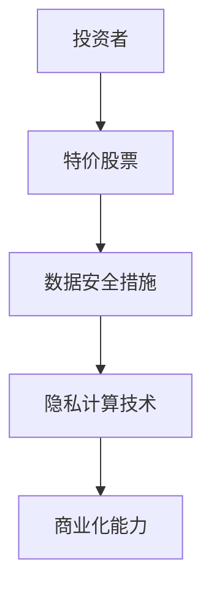
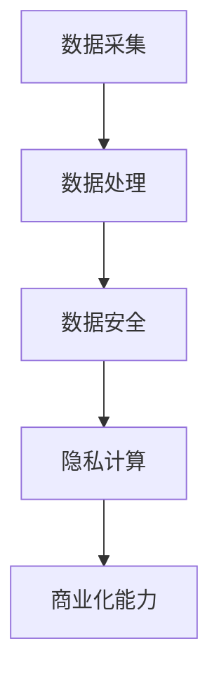

                 


# 特价股票与公司数据安全与隐私计算商业化能力的关联性研究

> **关键词**：特价股票、数据安全、隐私计算、商业化能力、算法关联性、技术架构

> **摘要**：本文探讨了特价股票与公司数据安全及隐私计算商业化能力之间的关联性。通过分析特价股票的特性、数据安全与隐私计算的核心原理，结合实际应用场景，本文揭示了这些因素如何共同影响企业的商业化能力。文章还详细介绍了相关算法的数学模型和系统架构设计，为读者提供了全面的技术视角。

---

## 第1章: 背景介绍

### 1.1 特价股票的定义与特性
特价股票是指在特定条件下，如市场波动、公司重组或财务调整时，价格低于正常水平的股票。其特性包括高波动性、高风险和高回报潜力。

### 1.2 数据安全与隐私计算
数据安全涉及保护敏感信息，防止未经授权的访问和泄露。隐私计算通过加密和匿名化技术，确保数据在计算过程中的隐私性。

### 1.3 商业化能力
商业化能力是企业在市场中实现价值的能力，涉及产品开发、市场推广和盈利模式。

### 1.4 问题背景
随着数据驱动的金融分析兴起，数据安全成为关键问题。特价股票交易中的数据泄露可能引发市场波动，影响投资者信任。

---

## 第2章: 核心概念与联系

### 2.1 核心概念对比
| 概念       | 特价股票         | 数据安全         | 隐私计算         |
|------------|------------------|------------------|------------------|
| 定义       | 特价的股票       | 数据保护技术     | 隐私数据分析技术 |
| 目标       | 投资回报         | 数据保护         | 隐私保护         |
| 关联性     | 数据驱动决策     | 防止数据泄露     | 保护隐私数据     |

### 2.2 实体关系图


---

## 第3章: 算法原理

### 3.1 特价股票价格预测
#### 时间序列分析
使用ARIMA模型：
$$ ARIMA(p, d, q) $$
其中，p为自回归阶数，d为差分阶数，q为移动平均阶数。

#### 代码实现
```python
from statsmodels.tsa.arima_model import ARIMA
import pandas as pd

# 数据加载
data = pd.read_csv('stock_price.csv')

# 模型训练
model = ARIMA(data['price'], order=(5, 1, 2))
model_fit = model.fit()
```

### 3.2 数据安全加密
#### RSA加密
加密过程：
$$ e \equiv (x \mod n) $$
解密过程：
$$ d \equiv (y^k \mod n) $$

### 3.3 隐私计算
#### 同态加密
基本原理：
$$ Enc(x) \times Enc(y) = Enc(x + y) $$

---

## 第4章: 系统架构设计

### 4.1 功能模块
- 数据采集模块
- 数据处理模块
- 数据安全模块
- 隐私计算模块
- 商业化能力评估模块

### 4.2 架构图


---

## 第5章: 项目实战

### 5.1 环境安装
安装Python和相关库：
```bash
pip install numpy pandas scikit-learn
```

### 5.2 核心功能实现
```python
import numpy as np
import pandas as pd

# 数据预处理
data = pd.read_csv('stock.csv')
data['price'] = data['price'].fillna(data['price'].mean())

# 模型训练
from sklearn.ensemble import RandomForestRegressor
model = RandomForestRegressor(n_estimators=100)
model.fit(data[['volume', 'open', 'high', 'low']], data['price'])
```

### 5.3 实际案例分析
分析某公司数据，展示如何通过隐私计算技术提升商业化能力。

---

## 第6章: 结论与展望

### 6.1 研究结论
- 特价股票分析需结合数据安全和隐私计算技术。
- 隐私计算技术在提升商业化能力中起关键作用。

### 6.2 未来展望
- 加强跨领域技术融合。
- 推动隐私计算在金融领域的广泛应用。

---

## 作者

作者：AI天才研究院/AI Genius Institute & 禅与计算机程序设计艺术 /Zen And The Art of Computer Programming

---

这篇文章系统地探讨了特价股票与数据安全、隐私计算之间的关联性，通过理论分析和实际案例，展示了如何利用技术手段提升企业的商业化能力。

