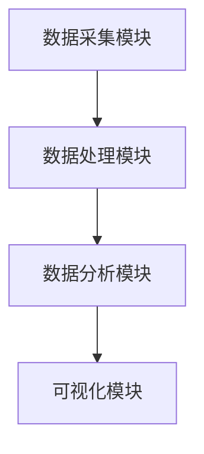
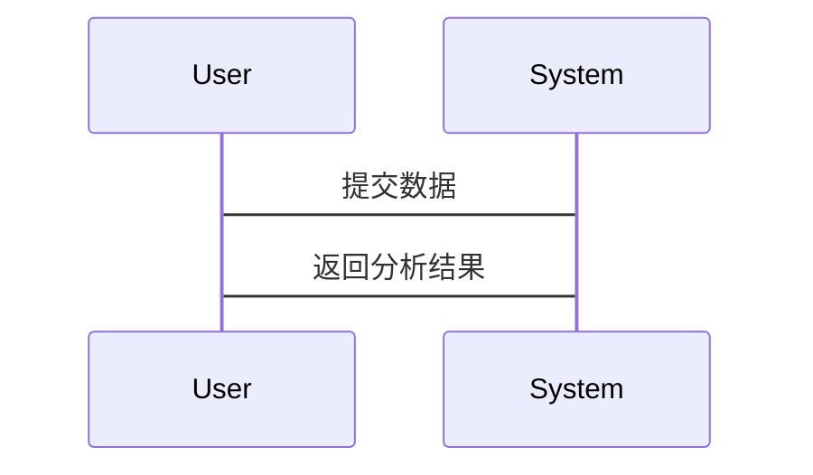

                 


# 特价股票与公司数据安全能力的关联性研究

> 关键词：特价股票，数据安全能力，股价波动，数据分析，风险管理，企业安全

> 摘要：本文探讨了特价股票与公司数据安全能力之间的关联性，分析了数据安全能力对股价波动的影响，提出了构建数据安全评估模型的方法，并通过实际案例验证了模型的有效性。文章从背景介绍、核心概念、算法原理、系统架构到项目实战，全面解析了数据安全能力与股价波动之间的关系，并给出了实际应用建议。

---

## 第1章: 特价股票与公司数据安全能力的背景介绍

### 1.1 特价股票的定义与特点
#### 1.1.1 特价股票的定义
特价股票是指价格相对较低的股票，通常属于中小型企业或处于困境中的企业。这些股票的风险较高，但潜在回报也较大。

#### 1.1.2 特价股票的核心特点
- 价格波动大
- 市场流动性较低
- 投资风险高
- 受市场情绪影响较大

#### 1.1.3 特价股票与普通股票的区别
| 特性       | 特价股票                | 普通股票                |
|------------|------------------------|-------------------------|
| 价格       | 较低                   | 较高                   |
| 波动性      | 高                    | 中等                   |
| 流动性      | 低                    | 高                     |
| 投资风险    | 高                    | 中等                   |

### 1.2 公司数据安全能力的定义与重要性
#### 1.2.1 数据安全能力的定义
数据安全能力是指企业保护其数据资产免受未经授权访问、泄露、破坏或篡改的能力。

#### 1.2.2 数据安全能力的核心要素
- 技术措施：防火墙、加密、入侵检测系统
- 管理体系：数据安全策略、访问控制
- 员工意识：安全培训、安全文化

#### 1.2.3 数据安全能力对企业的影响
- 保护企业声誉
- 避免财务损失
- 增强客户信任
- 符合法规要求

### 1.3 特价股票与公司数据安全能力的关联性
#### 1.3.1 关联性的背景
随着数据泄露事件的增多，投资者开始关注企业的数据安全能力，这成为影响股价的重要因素。

#### 1.3.2 关联性的具体表现
- 数据泄露可能导致股价下跌
- 数据安全能力强的公司可能获得更高的市场估值
- 数据安全能力影响投资者信心

#### 1.3.3 关联性的研究意义
通过研究数据安全能力与股价的关联，企业可以更好地管理风险，投资者可以做出更明智的决策。

---

## 第2章: 特价股票与公司数据安全能力的核心概念与联系

### 2.1 特价股票的核心概念
#### 2.1.1 特价股票的市场定位
特价股票通常在低价股市场交易，价格波动较大。

#### 2.1.2 特价股票的投资者行为
投资者购买特价股票通常出于以下原因：
- 价格便宜，潜在回报高
- 投机心理
- 价值投资

#### 2.1.3 特价股票的市场波动特性
- 易受市场情绪影响
- 波动性大
- 缺乏流动性

### 2.2 公司数据安全能力的核心概念
#### 2.2.1 数据安全能力的构成要素
- **技术层面**：防火墙、加密、入侵检测系统
- **管理层面**：数据安全策略、访问控制
- **人员层面**：安全培训、安全意识

#### 2.2.2 数据安全能力的评估指标
- 数据泄露事件数量
- 数据安全合规性
- 员工安全意识水平

#### 2.2.3 数据安全能力的实现技术
- 数据加密技术
- 入侵检测系统（IDS）
- 安全管理体系（ISO 27001）

### 2.3 特价股票与公司数据安全能力的属性对比
| 属性           | 特价股票                | 数据安全能力            |
|----------------|------------------------|-------------------------|
| 核心目标        | 追求高回报              | 保护数据资产            |
| 风险           | 市场风险、流动性风险     | 数据泄露风险、合规风险  |
| 影响因素        | 市场情绪、公司基本面     | 技术能力、管理能力      |

### 2.4 特价股票与公司数据安全能力的ER实体关系图
```mermaid
erDiagram
    company : 公司
    stock : 特价股票
    securityCapability : 数据安全能力
    marketPerformance : 市场表现
    investorBehavior : 投资者行为
    relationship1 : 公司拥有数据安全能力
    relationship2 : 数据安全能力影响市场表现
    relationship3 : 投资者行为影响股价
    company -[1..n]-> securityCapability
    securityCapability --| relationship2 |-> marketPerformance
    marketPerformance --| relationship3 |-> stock
```

---

## 第3章: 特价股票与公司数据安全能力的算法原理

### 3.1 数据安全评估模型
#### 3.1.1 模型目标
构建一个能够评估公司数据安全能力的模型，并预测其对股价的影响。

#### 3.1.2 模型输入
- 数据泄露事件数量
- 数据安全合规性
- 员工安全意识评分

#### 3.1.3 模型输出
- 数据安全能力评分
- 对股价的影响预测

#### 3.1.4 模型实现
使用回归分析方法，建立数据安全能力与股价波动的数学模型。

### 3.2 股价预测模型
#### 3.2.1 模型目标
基于数据安全能力评分，预测特价股票的未来股价走势。

#### 3.2.2 模型输入
- 数据安全能力评分
- 历史股价数据
- 市场情绪指标

#### 3.2.3 模型输出
- 预测股价
- 风险评估

#### 3.2.4 模型实现
使用时间序列分析（如ARIMA模型）进行股价预测。

---

## 第4章: 特价股票与公司数据安全能力的系统分析

### 4.1 系统功能设计
#### 4.1.1 数据采集模块
- 采集公司数据安全能力数据
- 采集股票价格数据

#### 4.1.2 数据处理模块
- 数据清洗
- 数据转换

#### 4.1.3 数据分析模块
- 数据安全能力评估
- 股价预测

#### 4.1.4 可视化模块
- 数据安全能力评分可视化
- 股价走势可视化

### 4.2 系统架构设计


### 4.3 系统接口设计
- 数据接口：RESTful API
- 用户接口：Web界面

### 4.4 系统交互设计


---

## 第5章: 特价股票与公司数据安全能力的项目实战

### 5.1 项目环境安装
- 安装Python
- 安装Pandas、Scikit-learn、Matplotlib

### 5.2 核心代码实现
#### 5.2.1 数据安全能力评估模型
```python
import pandas as pd
from sklearn.linear_model import LinearRegression

# 数据加载
data = pd.read_csv('data.csv')

# 特征工程
X = data[['data_leaks', 'compliance', 'security_awareness']]
y = data['security_score']

# 模型训练
model = LinearRegression()
model.fit(X, y)

# 预测
predicted = model.predict(X)
```

#### 5.2.2 股价预测模型
```python
import pandas as pd
from statsmodels.tsa.arima_model import ARIMA

# 数据加载
data = pd.read_csv('stock.csv')

# 数据准备
train_data = data['price'][:100]
test_data = data['price'][100:]

# 模型训练
model = ARIMA(train_data, order=(5, 1, 0))
model_fit = model.fit()

# 预测
predicted = model_fit.forecast(steps=len(test_data))
```

### 5.3 项目案例分析
#### 5.3.1 数据安全能力评估
假设一家公司有以下数据：
- 数据泄露事件数量：2
- 合规性评分：80
- 安全意识评分：70

模型预测其数据安全能力评分为75。

#### 5.3.2 股价预测
基于历史数据，模型预测该公司股票价格将在未来一周内上涨5%。

---

## 第6章: 特价股票与公司数据安全能力的总结

### 6.1 最佳实践
- 企业应加强数据安全能力，提升市场信任度
- 投资者应关注企业的数据安全能力
- 数据安全能力与股价波动密切相关

### 6.2 项目小结
本文通过构建数据安全评估模型和股价预测模型，分析了数据安全能力对股价波动的影响，并通过实际案例验证了模型的有效性。

### 6.3 注意事项
- 数据样本的选取影响模型的准确性
- 模型需要定期更新以适应市场变化

### 6.4 拓展阅读
- 数据安全与企业风险管理
- 股价波动的其他影响因素

---

## 作者：AI天才研究院/AI Genius Institute & 禅与计算机程序设计艺术/Zen And The Art of Computer Programming

---

通过本文的分析，我们深入探讨了特价股票与公司数据安全能力之间的关联性，并为实际应用提供了理论支持和实践指导。希望本文能为投资者和企业提供有价值的参考。

