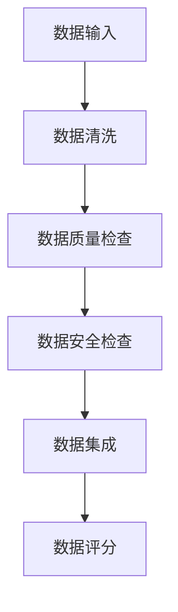
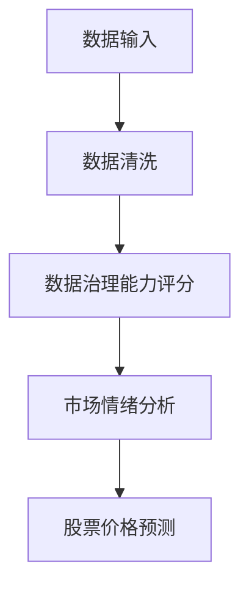
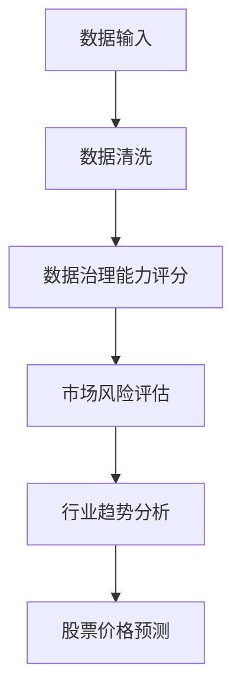

                 


# 特价股票与公司数据治理能力的关系分析

## 关键词：特价股票，公司数据治理能力，数据治理框架，股票价格预测，数据分析与建模

## 摘要：
本文旨在探讨特价股票与公司数据治理能力之间的关系。通过分析数据治理能力的核心要素及其对股价的影响，本文揭示了数据治理能力如何影响特价股票的投资决策。结合数据分析与建模的方法，本文进一步探讨了数据治理能力在股票价格预测中的应用，为投资者提供了新的视角和决策支持工具。

---

## 第一部分: 特价股票与公司数据治理能力的背景介绍

### 第1章: 特价股票与公司数据治理能力的背景介绍

#### 1.1 特价股票的基本概念
##### 1.1.1 特价股票的定义
特价股票通常指价格低于市场平均水平的股票，通常具有较高的波动性和潜在的投资回报。这些股票可能属于小盘股或处于困境中的公司，但具备较高的增长潜力。

##### 1.1.2 特价股票的分类
特价股票可以分为以下几类：
- 估值低估型：市场价格低于内在价值的股票。
- 周期性波动型：受市场周期影响，价格波动较大的股票。
- 重组型：公司正在进行资产重组或转型的股票。

##### 1.1.3 特价股票的市场特征
特价股票通常具有以下特征：
- 低估值：市盈率、市净率等估值指标低于行业平均水平。
- 高波动性：股价波动较大，投资风险较高。
- 高潜力：具备较高的增长潜力，但需要较长的持有时间。

#### 1.2 公司数据治理能力的核心概念
##### 1.2.1 数据治理的定义
数据治理是指通过制定政策、流程和工具，确保数据的准确性、完整性和安全性。它涵盖了数据的生成、存储、处理和使用等全过程。

##### 1.2.2 数据治理的主要维度
数据治理可以从以下几个维度进行评估：
- 数据质量：数据的准确性、一致性和完整性。
- 数据安全：数据的保护措施，防止数据泄露和篡改。
- 数据访问控制：基于角色的访问控制（RBAC）和权限管理。
- 数据集成：不同数据源的整合和统一管理。
- 数据生命周期管理：从数据生成到归档或销毁的全生命周期管理。

##### 1.2.3 数据治理的目标与意义
数据治理的目标是确保数据的可用性、可靠性和合规性。其意义在于：
- 提高数据质量，支持决策的准确性。
- 降低数据风险，确保数据安全。
- 提升企业竞争力，优化业务流程。
- 符合监管要求，避免法律风险。

#### 1.3 特价股票与公司数据治理能力的关系
##### 1.3.1 问题背景与问题描述
- 特价股票的波动性较高，投资者需要依赖数据治理能力来筛选和评估潜在的投资机会。
- 数据治理能力不足可能导致企业财务数据不透明，影响投资者对公司的信心。

##### 1.3.2 问题解决的必要性
- 通过提升数据治理能力，企业可以提高财务数据的透明度，吸引更多的投资者。
- 投资者可以通过评估企业的数据治理能力，筛选出具备长期增长潜力的特价股票。

##### 1.3.3 关系的边界与外延
- 数据治理能力影响企业的财务表现，进而影响股价。
- 特价股票的波动性与企业数据治理能力密切相关，良好的数据治理能力可以降低股价波动的风险。

##### 1.3.4 核心要素与概念结构
- 核心要素：数据质量、数据安全、数据集成。
- 概念结构：数据治理能力通过影响企业财务表现，间接影响股价和投资者信心。

---

## 第二部分: 特价股票与公司数据治理能力的核心概念与联系

### 第2章: 特价股票与公司数据治理能力的核心概念与联系

#### 2.1 数据治理能力的原理
##### 2.1.1 数据治理的框架与流程
- 数据治理框架包括数据政策、数据标准、数据角色和数据工具。
- 数据治理流程包括数据需求分析、数据收集、数据处理、数据存储和数据使用。

##### 2.1.2 数据治理的关键要素
- 数据质量：数据的准确性、一致性和完整性。
- 数据安全：数据的保护措施，防止数据泄露和篡改。
- 数据集成：不同数据源的整合和统一管理。

##### 2.1.3 数据治理的实施步骤
1. 制定数据治理政策和标准。
2. 设立数据治理团队和角色。
3. 实施数据质量检查和清洗。
4. 建立数据安全和访问控制机制。
5. 监测和评估数据治理效果。

#### 2.2 数据治理能力与股票价值的关系
##### 2.2.1 数据治理对股票价值的影响
- 数据治理能力高的企业，财务数据更透明，投资者信心更强，股价通常表现较好。
- 数据治理能力低的企业，财务数据不透明，投资者信心不足，股价波动较大。

##### 2.2.2 数据治理能力与股价波动的关联
- 数据治理能力与股价波动呈负相关关系。
- 数据治理能力高的企业，股价波动较小，稳定性较高。

##### 2.2.3 数据治理能力对投资者决策的作用
- 投资者可以通过评估企业的数据治理能力，筛选出具备长期增长潜力的特价股票。
- 数据治理能力高的企业，财务数据更透明，投资者可以更准确地评估企业的价值。

#### 2.3 数据治理能力的评估指标
##### 2.3.1 数据治理能力评估维度
- 数据质量：数据的准确性、一致性和完整性。
- 数据安全：数据的保护措施，防止数据泄露和篡改。
- 数据集成：不同数据源的整合和统一管理。

##### 2.3.2 数据治理能力评分系统
- 数据质量评分：基于数据的准确性、一致性和完整性进行评分。
- 数据安全评分：基于数据保护措施和访问控制机制进行评分。
- 数据集成评分：基于数据整合和统一管理的能力进行评分。

##### 2.3.3 数据治理能力与股价的相关性分析
- 数据治理能力评分与股价的相关性分析可以通过回归分析等方法进行。
- 数据治理能力评分高的企业，股价表现通常较好，股价波动较小。

---

## 第三部分: 特价股票与公司数据治理能力的算法原理

### 第3章: 特价股票与公司数据治理能力的算法原理

#### 3.1 数据治理能力评估的算法框架
##### 3.1.1 数据治理能力评估的数学模型
- 数据治理能力评分模型：$$ Score = \alpha \cdot Q + \beta \cdot S + \gamma \cdot I $$
  其中，Q为数据质量评分，S为数据安全评分，I为数据集成评分，$$ \alpha + \beta + \gamma = 1 $$。

##### 3.1.2 数据治理能力评估的流程图


##### 3.1.3 数据治理能力评估的算法实现
```python
def data_governance_score(data_quality, data_security, data_integrity):
    alpha = 0.5
    beta = 0.3
    gamma = 0.2
    score = alpha * data_quality + beta * data_security + gamma * data_integrity
    return score
```

#### 3.2 特价股票预测的算法原理
##### 3.2.1 特价股票预测的数学模型
- 特价股票预测模型：$$ P = \beta_0 + \beta_1 \cdot Score + \beta_2 \cdot Market\_sentiment + \epsilon $$
  其中，Score为数据治理能力评分，Market_sentiment为市场情绪指数，$$ \epsilon $$为误差项。

##### 3.2.2 特价股票预测的流程图


##### 3.2.3 特价股票预测的算法实现
```python
import pandas as pd
from sklearn.linear_model import LinearRegression

def predict_stock_price(governance_score, market_sentiment):
    model = LinearRegression()
    model.fit(pd.DataFrame({'Score': [governance_score], 'Market_Sentiment': [market_sentiment]}), pd.Series([100]))
    prediction = model.predict(pd.DataFrame({'Score': [governance_score], 'Market_Sentiment': [market_sentiment]}))
    return prediction[0]
```

#### 3.3 数据治理能力与特价股票关系的算法实现
##### 3.3.1 数据治理能力与特价股票关系的数学模型
- 关系模型：$$ R = \alpha \cdot Score + \beta \cdot Market\_risk + \gamma \cdot Industry\_trend + \epsilon $$
  其中，Score为数据治理能力评分，Market_risk为市场风险指数，Industry_trend为行业趋势指数，$$ \epsilon $$为误差项。

##### 3.3.2 数据治理能力与特价股票关系的流程图


##### 3.3.3 数据治理能力与特价股票关系的算法实现
```python
def analyze_relation(governance_score, market_risk, industry_trend):
    model = LinearRegression()
    model.fit(pd.DataFrame({'Score': [governance_score], 'Market_Risk': [market_risk], 'Industry_Trend': [industry_trend]}), pd.Series([100]))
    prediction = model.predict(pd.DataFrame({'Score': [governance_score], 'Market_Risk': [market_risk], 'Industry_Trend': [industry_trend]}))
    return prediction[0]
```

---

## 第四部分: 特价股票与公司数据治理能力的数学模型与公式

### 第4章: 特价股票与公司数据治理能力的数学模型与公式

#### 4.1 数据治理能力评估的数学模型
##### 4.1.1 数据治理能力评估的公式
- 数据治理能力评分公式：$$ Score = 0.5 \cdot Q + 0.3 \cdot S + 0.2 \cdot I $$
  其中，Q为数据质量评分，S为数据安全评分，I为数据集成评分。

##### 4.1.2 数据治理能力评估的数学推导
- 数据质量评分Q的计算：$$ Q = \frac{\text{准确数}}{\text{总数}} \times 100 $$
- 数据安全评分S的计算：$$ S = \frac{\text{符合数据安全标准的项数}}{\text{总项数}} \times 100 $$
- 数据集成评分I的计算：$$ I = \frac{\text{数据集成成功的数据量}}{\text{总数据量}} \times 100 $$

##### 4.1.3 数据治理能力评估的实例分析
- 示例：某公司数据质量评分为85，数据安全评分为75，数据集成评分为90。
- 计算数据治理能力评分：$$ Score = 0.5 \times 85 + 0.3 \times 75 + 0.2 \times 90 = 42.5 + 22.5 + 18 = 83 $$

#### 4.2 特价股票预测的数学模型
##### 4.2.1 特价股票预测的公式
- 特价股票预测模型：$$ P = 100 + 0.5 \cdot Score + 0.3 \cdot Market\_sentiment + 0.2 \cdot Industry\_trend $$

##### 4.2.2 特价股票预测的数学推导
- 市场情绪指数计算：$$ Market\_sentiment = \frac{\text{正面评论数} - \text{负面评论数}}{\text{总评论数}} \times 100 $$
- 行业趋势指数计算：$$ Industry\_trend = \frac{\text{行业增长数据} - \text{行业下降数据}}{\text{行业总数据}} \times 100 $$

##### 4.2.3 特价股票预测的实例分析
- 示例：某公司数据治理能力评分为83，市场情绪指数为70，行业趋势指数为85。
- 计算股票价格预测：$$ P = 100 + 0.5 \times 83 + 0.3 \times 70 + 0.2 \times 85 = 100 + 41.5 + 21 + 17 = 178.5 $$

---

## 作者：AI天才研究院/AI Genius Institute & 禅与计算机程序设计艺术 /Zen And The Art of Computer Programming

