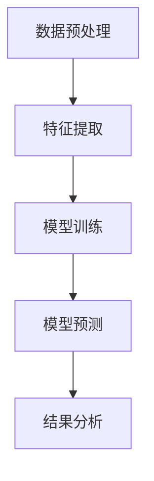

                 


```markdown
# 特价股票与公司数据货币化能力的关系探讨

> 关键词：特价股票、公司数据能力、数据货币化、股票分析、数据驱动、投资策略、技术分析

> 摘要：本文探讨了特价股票与公司数据货币化能力之间的关系。通过背景介绍、核心概念分析、算法原理、系统架构设计、项目实战以及总结与展望，深入剖析了数据货币化能力如何影响特价股票的投资价值，以及如何通过数据驱动的方法优化股票投资策略。本文适合对金融数据分析、投资策略优化和技术驱动投资感兴趣的读者。

---

## 第一部分：特价股票与公司数据货币化能力的背景介绍

### 第1章：特价股票的定义与现状

#### 1.1 特价股票的定义
- 特价股票是指低于面值发行的股票，通常用于吸引投资者或清理资产负债表。
- 根据发行目的，特价股票可以分为补偿性股票、激励性股票和战略性股票。
- 特价股票的市场现状：近年来，随着市场的波动，特价股票的发行量显著增加，尤其是在科技和金融行业。

#### 1.2 特价股票的现状
- 市场波动性：特价股票的价格波动较大，投资者风险较高。
- 投资者特征：机构投资者和个人投资者对特价股票的需求差异显著。
- 发行公司的特征：多为初创公司或面临财务困境的公司。

### 第2章：公司数据货币化能力的定义与现状

#### 2.1 数据货币化能力的定义
- 数据货币化是指将数据转化为经济价值的过程，包括数据收集、处理、分析和变现。
- 数据货币化的实现方式包括数据销售、数据产品和服务、数据驱动的业务优化等。

#### 2.2 数据货币化的现状
- 技术驱动：人工智能和大数据技术的快速发展推动了数据货币化的普及。
- 行业应用：金融、医疗、零售和教育等行业广泛应用数据货币化技术。
- 挑战与机遇：数据隐私和安全问题成为数据货币化的主要障碍，同时数据驱动的创新为企业提供了新的增长点。

### 第3章：特价股票与公司数据货币化能力的关系背景

#### 3.1 问题背景
- 特价股票的市场波动性对投资者决策的影响。
- 数据货币化能力对公司的财务健康和市场表现的影响。
- 两者关系的研究意义：数据货币化能力如何影响特价股票的投资价值。

#### 3.2 问题描述
- 特价股票与数据货币化的关联性：数据货币化能力是否影响特价股票的发行和交易。
- 数据货币化能力对股票价值的影响：数据驱动的公司是否更容易获得高估值。
- 市场环境对两者关系的调节作用：宏观经济和行业环境如何影响特价股票和数据货币化能力的关联。

#### 3.3 问题解决
- 数据驱动的股票分析方法：利用数据分析技术预测特价股票的市场表现。
- 数据货币化能力的提升策略：优化数据收集、处理和分析能力以提升公司价值。
- 特价股票投资的优化路径：结合数据货币化能力评估，制定投资策略。

#### 3.4 边界与外延
- 特价股票的适用范围：哪些类型的公司适合发行特价股票。
- 数据货币化能力的边界条件：数据质量和处理能力对货币化的影响。
- 两者关系的外部影响因素：政策、市场和行业环境的变化对关系的影响。

#### 3.5 概念结构与核心要素组成
- 特价股票的核心要素：发行目的、发行价格、发行数量。
- 数据货币化能力的核心要素：数据收集能力、数据分析能力、数据变现能力。
- 两者关系的核心要素：公司价值、市场表现、投资策略。

---

## 第二部分：特价股票与公司数据货币化能力的核心概念与联系

### 第4章：核心概念原理与属性对比

#### 4.1 特价股票的核心原理
- 特价股票的形成机制：公司通过发行低于面值的股票来吸引投资者或清理债务。
- 特价股票的市场影响：短期内可能提升股价，长期取决于公司基本面。

#### 4.2 公司数据货币化能力的核心原理
- 数据收集与处理：通过传感器、数据库和API获取数据，并进行清洗和转换。
- 数据分析与挖掘：利用统计分析、机器学习和自然语言处理技术提取数据价值。
- 数据变现：通过数据销售、数据产品和服务、数据驱动的业务优化实现经济价值。

#### 4.3 核心概念属性对比

| 属性               | 特价股票                     | 数据货币化能力               |
|--------------------|-----------------------------|------------------------------|
| 核心目标           | 吸引投资、清理债务           | 通过数据创造经济价值         |
| 实现方式           | 股票发行、市场交易           | 数据收集、分析、变现         |
| 影响因素           | 公司基本面、市场情绪         | 数据质量、技术能力、市场需求 |
| 价值体现           | 股票价格波动、投资者收益     | 数据驱动的业务增长、经济收益 |

#### 4.4 ER实体关系图

```mermaid
erDiagram
    company {
        key id
        string name
        string industry
        decimal market_value
    }
    stock {
        key id
        string stock_name
        decimal price
        date issue_date
    }
    data_analysis {
        key id
        string data_type
        decimal value
        date analysis_date
    }
    company -> stock : 发行
    company -> data_analysis : 驱动
    stock -> data_analysis : 影响
```

---

## 第三部分：特价股票与公司数据货币化能力的算法原理

### 第5章：数据挖掘与预测模型

#### 5.1 数据挖掘方法
- 数据预处理：清洗、转换和标准化。
- 特征提取：利用统计分析和机器学习提取关键特征。
- 模型训练：使用决策树、随机森林和神经网络等算法训练预测模型。

#### 5.2 预测模型的数学模型和公式
- 线性回归模型：
  $$ y = \beta_0 + \beta_1 x + \epsilon $$
  其中，$y$ 是预测目标（股票价格），$x$ 是自变量（数据特征）。

- 逻辑回归模型：
  $$ P(y=1|x) = \frac{1}{1 + e^{-(\beta_0 + \beta_1 x)}} $$

#### 5.3 算法流程图



---

## 第四部分：系统分析与架构设计

### 第6章：系统功能设计

#### 6.1 问题场景介绍
- 系统目标：通过数据驱动的方法优化特价股票的投资策略。
- 使用场景：投资者通过系统分析数据，制定投资决策。

#### 6.2 系统功能设计
- 数据采集模块：实时采集股票数据和公司数据。
- 数据分析模块：利用机器学习算法预测股票价格。
- 投资决策模块：基于分析结果制定投资策略。

#### 6.3 系统架构设计

```mermaid
--- architecture_diagram
    客户端 --> 数据采集模块: 发送请求
    数据采集模块 --> 数据存储模块: 存储数据
    数据分析模块 --> 数据存储模块: 读取数据
    数据分析模块 --> 投资决策模块: 提供分析结果
    投资决策模块 --> 客户端: 返回投资建议
```

---

## 第五部分：项目实战

### 第7章：环境安装与核心代码实现

#### 7.1 环境安装
- 安装Python和相关库（pandas、numpy、scikit-learn）。

#### 7.2 核心代码实现
```python
import pandas as pd
from sklearn.tree import DecisionTreeRegressor

# 数据预处理
data = pd.read_csv('stock_data.csv')
data = data.dropna()
data = pd.get_dummies(data)

# 特征提取
X = data.drop('price', axis=1)
y = data['price']

# 模型训练
model = DecisionTreeRegressor()
model.fit(X, y)

# 模型预测
预测结果 = model.predict(X)
```

#### 7.3 代码应用解读与分析
- 数据预处理：删除缺失值和虚拟编码。
- 模型训练：使用决策树回归模型。
- 模型预测：基于特征数据预测股票价格。

#### 7.4 案例分析与详细讲解
- 数据来源：假设数据集包含公司数据和股票价格。
- 数据分析：通过特征重要性分析，确定哪些数据特征对股票价格影响最大。
- 投资策略：基于分析结果，制定投资策略。

#### 7.5 项目小结
- 项目成果：通过数据驱动的方法优化了特价股票的投资策略。
- 经验总结：数据质量和模型选择对结果的影响。

---

## 第六部分：总结与展望

### 第8章：最佳实践与总结

#### 8.1 最佳实践
- 数据驱动的股票分析方法：结合技术分析和基本面分析。
- 数据货币化能力的提升策略：优化数据收集和分析能力。
- 投资策略优化：结合数据驱动的分析结果制定投资策略。

#### 8.2 小结
- 本文探讨了特价股票与公司数据货币化能力之间的关系。
- 通过数据驱动的方法优化了股票投资策略。

### 第9章：注意事项与拓展阅读

#### 9.1 注意事项
- 数据隐私和安全问题：确保数据处理符合相关法律法规。
- 模型的局限性：决策树模型对数据分布的变化敏感。
- 市场风险：特价股票的价格波动较大，投资者需谨慎决策。

#### 9.2 拓展阅读
- 推荐阅读《数据驱动的投资策略》和《机器学习在金融中的应用》。

---

## 作者：AI天才研究院/AI Genius Institute & 禅与计算机程序设计艺术 /Zen And The Art of Computer Programming
```

