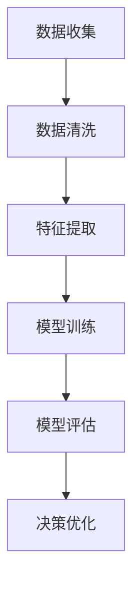
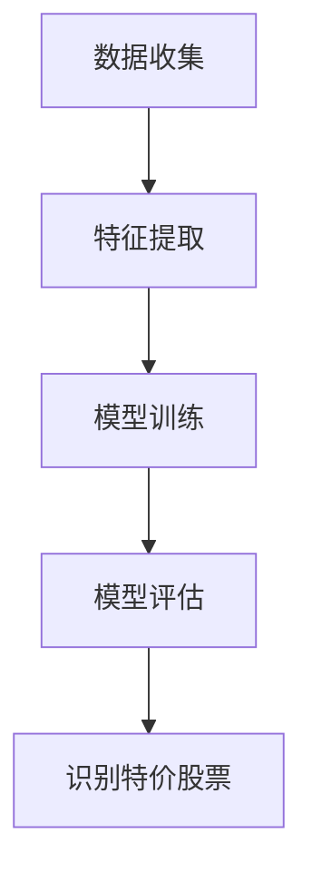
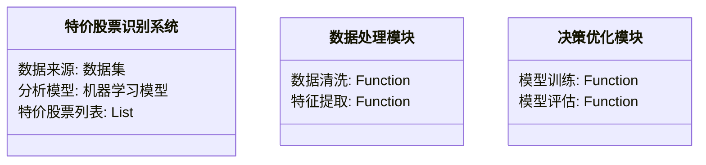
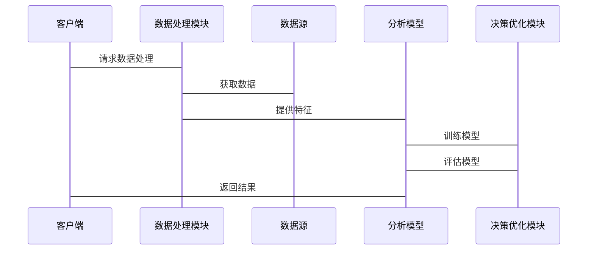

                 


# 特价股票与公司数据驱动决策能力的潜在关联研究

## 关键词：
- 特价股票
- 数据驱动决策
- 机器学习
- 统计分析
- 股票预测

## 摘要：
本文探讨了特价股票与公司数据驱动决策能力之间的潜在关联，通过分析数据驱动决策的核心原理、算法实现以及系统架构设计，展示了如何利用数据驱动方法识别特价股票并优化公司决策。文章结合理论与实践，提供了丰富的案例分析和代码实现，为投资者和企业提供实用的指导。

---

# 第一部分: 特价股票与数据驱动决策的背景与概念

## 第1章: 特价股票与数据驱动决策的背景与概念

### 1.1 问题背景

#### 1.1.1 数据驱动决策的兴起
随着大数据技术的快速发展，企业逐渐意识到数据的重要性。通过分析历史数据和实时信息，公司可以做出更精准的决策，提升竞争力。数据驱动决策已成为现代企业不可或缺的能力。

#### 1.1.2 特价股票的定义与特征
特价股票通常指价格低于其内在价值的股票，具有较高的投资潜力。这些股票可能因市场波动或公司短期问题而被低估，但具备长期增值的潜力。识别这些股票需要深入的市场分析和数据挖掘。

#### 1.1.3 问题的提出与研究意义
研究特价股票与数据驱动决策的关联，旨在帮助企业利用数据技术识别投资机会，优化决策流程，提升市场竞争力。这种研究不仅有助于企业发现潜在利润，还能推动数据驱动决策在金融领域的应用。

### 1.2 核心概念与问题描述

#### 1.2.1 数据驱动决策能力的定义
数据驱动决策是基于数据和分析结果做出决策的过程，强调利用数据洞见优化决策质量。它涵盖数据收集、处理、分析和反馈等多个环节，帮助企业在复杂环境中做出明智选择。

#### 1.2.2 特价股票与公司决策的关联性
公司通过数据驱动决策能力，可以分析市场趋势、公司基本面和股票特性，识别特价股票。这些股票通常具备较高的投资回报潜力，帮助公司在竞争激烈的市场中获得优势。

#### 1.2.3 问题的边界与外延
本研究聚焦于利用数据驱动方法识别特价股票，分析其与公司决策能力的关联。研究范围包括数据收集、分析方法和模型构建，但不涉及实际投资策略的制定。

#### 1.2.4 核心概念的结构与组成
数据驱动决策能力由数据收集、处理、分析和反馈组成，而特价股票识别则涉及数据挖掘、机器学习和统计分析等技术。

#### 1.2.5 核心概念的属性特征对比
| 属性 | 数据驱动决策能力 | 特价股票 |
|------|------------------|----------|
| 输入 | 数据集           | 股票价格 |
| 输出 | 决策建议         | 特价股票 |
| 方法 | 机器学习、统计分析 | 数据挖掘 |
| 目标 | 优化决策         | 发现投资机会 |

#### 1.2.6 实体关系图
```mermaid
er
  entity: 特价股票
    attribute: 股票代码
    attribute: 股票价格
    attribute: 市盈率
  entity: 数据驱动决策能力
    attribute: 数据来源
    attribute: 分析模型
  relationship: 关联性
    role: 数据驱动决策能力用于识别特价股票
```

### 1.3 本章小结
本章介绍了数据驱动决策和特价股票的基本概念，分析了它们的关联性，并通过表格和实体关系图展示了核心概念的属性和结构。

---

# 第二部分: 数据驱动决策能力的核心原理与算法

## 第2章: 数据驱动决策的核心原理

### 2.1 数据驱动决策的原理

#### 2.1.1 数据的收集与处理
数据是数据驱动决策的基础。公司需收集包括财务数据、市场数据和公司基本面数据等信息，并进行清洗和预处理，确保数据质量。

#### 2.1.2 数据分析与建模
通过统计分析和机器学习算法，对数据进行建模，识别潜在模式和趋势。模型需具备高准确性和鲁棒性，以支持可靠的决策。

#### 2.1.3 决策优化与反馈
基于分析结果，制定决策并实时反馈，不断优化决策策略。反馈机制帮助公司及时调整决策，提升整体决策能力。

### 2.2 数据驱动决策的算法基础

#### 2.2.1 机器学习算法
机器学习算法如随机森林和XGBoost，常用于分类和回归问题，帮助识别股票价格趋势。

#### 2.2.2 数据挖掘算法
数据挖掘算法如关联规则挖掘，用于发现股票价格与市场趋势之间的关联性。

#### 2.2.3 统计分析方法
统计方法如t检验，用于验证数据的显著性，评估模型的可靠性。

### 2.3 数据驱动决策的数学模型

#### 2.3.1 线性回归模型
$$ y = \beta_0 + \beta_1x + \epsilon $$
其中，y为股票价格，x为相关特征，β为系数，ε为误差项。

#### 2.3.2 随机森林模型
随机森林通过集成多个决策树，提升模型的准确性和鲁棒性。

#### 2.3.3 聚类分析模型
聚类分析用于将股票分为不同的类别，识别具有相似特征的股票群体。

### 2.4 数据驱动决策的流程图


### 2.5 本章小结
本章详细讲解了数据驱动决策的核心原理，包括数据处理、分析方法和数学模型，为后续分析奠定了基础。

---

## 第3章: 特价股票分析的算法实现

### 3.1 特价股票识别的算法原理

#### 3.1.1 基于数据挖掘的股票筛选
通过数据挖掘技术，筛选出具备特定特征的股票，如低市盈率和高收益。

#### 3.1.2 基于机器学习的股票预测
利用机器学习算法预测股票价格，识别潜在的特价股票。

#### 3.1.3 基于统计分析的股票评价
通过统计方法评估股票的价值，判断其是否为特价股票。

### 3.2 特价股票分析的数学模型

#### 3.2.1 股票价格预测模型
$$ P(t) = aP(t-1) + bE(t) + c $$
其中，P(t)为t时刻的价格，a、b、c为系数，E(t)为市场预期。

#### 3.2.2 股票价值评估模型
评估模型综合考虑市盈率、市净率等指标，判断股票的内在价值。

#### 3.2.3 股票风险评估
通过VaR模型评估股票投资的风险，帮助投资者做出决策。

### 3.3 特价股票分析的流程图


### 3.4 本章小结
本章通过算法实现，展示了如何利用数据驱动方法识别特价股票，为投资者提供参考。

---

# 第三部分: 系统分析与架构设计方案

## 第4章: 系统分析与架构设计

### 4.1 问题场景介绍
系统旨在帮助公司识别特价股票，优化数据驱动决策能力，提升投资回报。

### 4.2 系统功能设计

#### 4.2.1 领域模型类图


### 4.3 系统架构设计

#### 4.3.1 系统架构图


#### 4.3.2 系统接口设计
- 数据接口：提供数据获取和处理的API。
- 模型接口：提供模型训练和评估的API。
- 输出接口：返回特价股票识别结果。

### 4.4 系统交互流程图


### 4.5 本章小结
本章设计了系统的架构和交互流程，确保系统的高效运行和数据驱动决策能力的有效发挥。

---

# 第四部分: 项目实战与案例分析

## 第5章: 项目实战

### 5.1 环境安装
安装Python、Pandas、Scikit-learn和Mermaid工具，确保开发环境配置正确。

### 5.2 核心代码实现

#### 5.2.1 数据处理代码
```python
import pandas as pd

# 数据加载
data = pd.read_csv('stock.csv')

# 数据清洗
data.dropna(inplace=True)
data['date'] = pd.to_datetime(data['date'])
data.set_index('date', inplace=True)
```

#### 5.2.2 模型训练代码
```python
from sklearn.ensemble import RandomForestRegressor

# 特征选择
features = ['open', 'high', 'low', 'volume']
target = 'close'

# 模型训练
model = RandomForestRegressor(n_estimators=100)
model.fit(data[features], data[target])
```

#### 5.2.3 模型评估代码
```python
import numpy as np

# 预测结果
y_pred = model.predict(data[features])

# 模型评估
print('均方误差:', np.mean((y_pred - data[target]) ** 2))
```

### 5.3 代码解读与分析
数据处理代码清洗了数据并转换了时间格式，模型训练代码使用随机森林回归器预测股票价格，评估代码计算均方误差，衡量模型性能。

### 5.4 案例分析
以具体股票为例，展示如何通过数据处理和模型训练识别其为特价股票，并分析模型预测结果。

### 5.5 项目小结
本章通过实战项目，展示了如何利用数据驱动方法识别特价股票，验证了模型的有效性。

---

# 第五部分: 最佳实践与总结

## 第6章: 最佳实践与总结

### 6.1 小结
本文系统探讨了特价股票与公司数据驱动决策能力的关联，通过算法实现和系统设计，展示了如何利用数据技术优化决策。

### 6.2 注意事项
- 数据质量对模型性能影响重大，需确保数据清洗和预处理。
- 模型选择需根据具体场景，合理调整参数，避免过拟合。

### 6.3 拓展阅读
建议读者深入学习机器学习和数据挖掘技术，关注金融领域的最新研究。

---

作者：AI天才研究院 & 禅与计算机程序设计艺术

