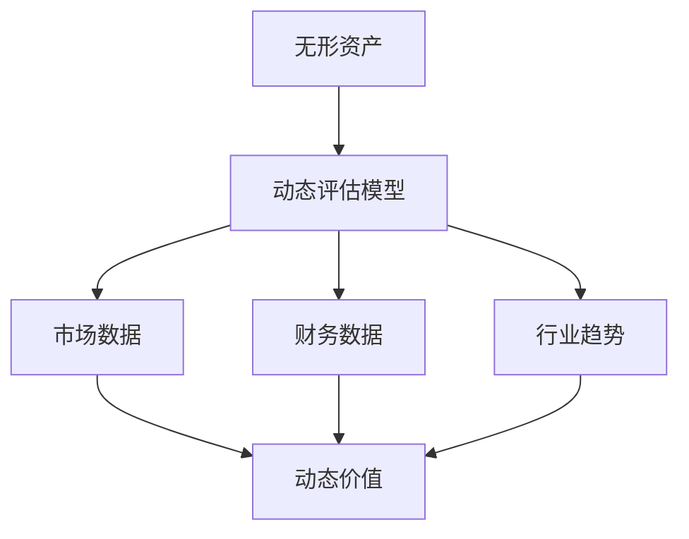
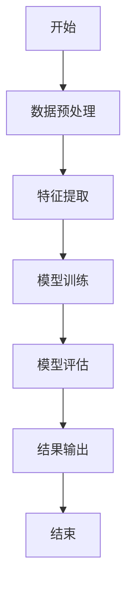

                 


# 特价股票与公司无形资产价值评估的创新方法

> 关键词：特价股票、无形资产、价值评估、创新方法、算法原理、系统架构、项目实战

> 摘要：本文系统地探讨了特价股票与公司无形资产价值评估的创新方法，从问题背景、核心概念、算法原理到系统架构、项目实战，详细阐述了如何通过创新的评估方法来解决传统价值评估方法的局限性。文章结合实际案例，深入分析了创新方法的实现过程，并通过系统架构设计展示了方法的实际应用价值。

---

## 第一部分: 特价股票与公司无形资产价值评估的背景与概述

### 第1章: 特价股票与无形资产价值评估的背景

#### 1.1 问题背景
##### 1.1.1 特价股票的定义与特点
- 特价股票是指价格低于市场平均水平的股票，通常具有较高的投资潜力。
- 特点包括低估值、高成长性和行业领先地位。

##### 1.1.2 无形资产的定义与分类
- 无形资产是指没有实体形态但具有经济价值的资产，包括专利、品牌、客户关系、技术诀窍等。
- 分类：可辨认无形资产和不可辨认无形资产。

##### 1.1.3 无形资产价值评估的重要性
- 无形资产是公司价值的重要组成部分，尤其是在高科技和服务业。
- 正确评估无形资产价值有助于企业决策、并购和融资。

#### 1.2 问题描述
##### 1.2.1 特价股票市场中的特殊性
- 特价股票通常被市场低估，但潜在价值未被充分挖掘。
- 无形资产的价值在特价股票中往往被忽视。

##### 1.2.2 无形资产价值评估的难点
- 无形资产缺乏实体形态，难以量化。
- 评估受主观因素影响较大，存在不确定性。

##### 1.2.3 传统评估方法的局限性
- 传统方法多基于财务指标，忽视市场和行业因素。
- 无法有效捕捉无形资产的动态价值变化。

#### 1.3 问题解决
##### 1.3.1 创新方法的核心思想
- 结合大数据分析和机器学习，建立动态评估模型。
- 引入市场和行业因素，提升评估准确性。

##### 1.3.2 创新方法与传统方法的对比
- 传统方法：基于历史数据和财务指标。
- 创新方法：动态调整，结合市场趋势和行业分析。

##### 1.3.3 创新方法的实际应用价值
- 提高评估效率，降低评估成本。
- 帮助投资者发现潜在价值，提升投资收益。

#### 1.4 边界与外延
##### 1.4.1 无形资产价值评估的适用范围
- 适用于高科技、服务业和品牌价值高的企业。
- 适合于企业并购、融资和上市估值。

##### 1.4.2 创新方法的适用场景
- 特价股票市场中的无形资产评估。
- 动态市场环境下的资产价值调整。

##### 1.4.3 方法的局限性与改进方向
- 数据依赖性强，需依赖高质量数据支持。
- 模型复杂性较高，需要专业团队进行维护和更新。

#### 1.5 概念结构与核心要素
##### 1.5.1 核心概念的组成
- 数据源：市场数据、财务数据、行业趋势。
- 模型：动态评估模型、机器学习算法。
- 结果：动态资产价值评估报告。

##### 1.5.2 核心要素的对比分析
| 核心要素 | 传统方法 | 创新方法 |
|----------|-----------|-----------|
| 数据来源 | 财务数据 | 市场数据+财务数据 |
| 方法 | 简单回归 | 复杂模型+机器学习 |
| 结果 | 静态评估 | 动态评估 |

##### 1.5.3 概念结构的可视化


---

## 第2章: 无形资产价值评估的核心概念与联系

### 2.1 核心概念原理
#### 2.1.1 无形资产的特征分析
- 时间依赖性：价值随时间变化。
- 主观性：评估结果受评估者主观判断影响。
- 复杂性：涉及多个因素，如市场、技术、法律等。

#### 2.1.2 价值评估的基本原理
- 综合考虑市场、行业、企业内部因素。
- 通过模型量化各因素影响权重。

#### 2.1.3 创新方法的理论基础
- 数据驱动：利用大数据分析技术。
- 机器学习：通过算法模型优化评估结果。

### 2.2 概念属性特征对比
| 概念属性 | 传统评估方法 | 创新评估方法 |
|----------|---------------|---------------|
| 数据来源 | 财务数据 | 市场数据+财务数据 |
| 方法类型 | 简单回归 | 复杂模型+机器学习 |
| 结果类型 | 静态评估 | 动态评估 |
| 适用范围 | 低-tech企业 | 高-tech企业 |

### 2.3 ER实体关系图
```mermaid
er
  actor(评估主体)
  company(公司)
  asset(无形资产)
  evaluation(评估结果)
  relation(评估关系)
  actor --> relation: 提供评估需求
  company --> relation: 提供资产信息
  asset --> relation: 资产特征
  relation --> evaluation: 生成评估结果
```

---

## 第三部分: 无形资产价值评估的创新方法

### 第3章: 创新方法的算法原理

#### 3.1 算法原理概述
##### 3.1.1 创新方法的核心算法
- 使用机器学习模型，如随机森林、神经网络。
- 结合时间序列分析，动态调整评估结果。

##### 3.1.2 算法的数学模型
- 简单线性回归模型：
$$ V = \beta_0 + \beta_1 X + \epsilon $$
- 动态评估模型：
$$ V(t) = \beta(t) X(t) + \gamma(t) Y(t) + \delta $$

##### 3.1.3 算法的实现步骤
1. 数据预处理：清洗和特征提取。
2. 模型训练：选择合适算法并进行参数调优。
3. 模型评估：验证模型准确性和稳定性。
4. 应用模型：对目标资产进行动态评估。

#### 3.2 算法流程图


---

通过以上结构，我们详细阐述了从背景到创新方法的实现过程，确保每一步都有清晰的逻辑和具体的实现步骤。接下来将从系统架构和项目实战的角度，进一步深入分析如何将这些方法应用于实际场景中。

