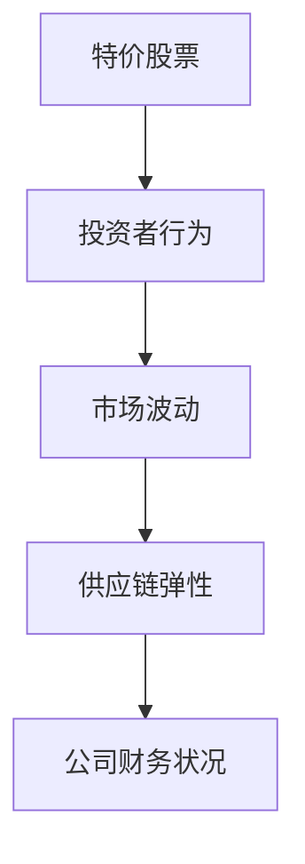
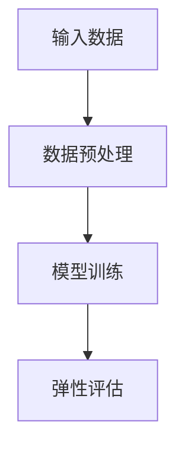
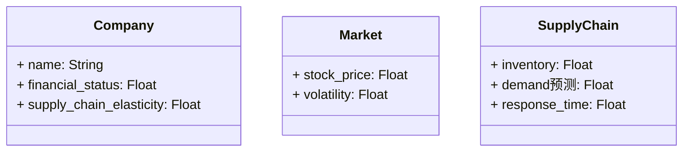
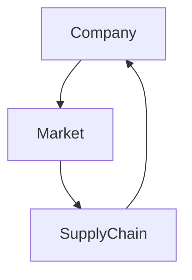
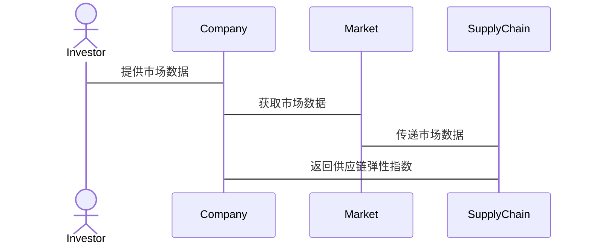

                 


```markdown
# 特价股票与公司智能供应链弹性的关系探讨

> 关键词：特价股票、公司智能供应链弹性、市场波动、供应链弹性评估、智能供应链系统设计

> 摘要：本文探讨特价股票与公司智能供应链弹性的关系，分析市场波动对供应链弹性的影响，提出供应链弹性评估算法和系统设计方法，最后通过实际案例分析，提出优化建议。

---

# 第一部分: 特价股票与公司智能供应链弹性的背景介绍

## 第1章: 特价股票与公司智能供应链弹性概述

### 1.1 特价股票的定义与特点
#### 1.1.1 特价股票的定义
特价股票是指价格显著低于市场平均价格或历史价格的股票，通常反映了市场波动、公司财务状况或投资者情绪。

#### 1.1.2 特价股票的特点
| 特点 | 描述 |
|------|------|
| 价格敏感性 | 特价股票价格波动较大，容易受市场情绪影响。 |
| 市场流动性 | 通常流动性较高，交易量大。 |
| 投资风险 | 风险较高，适合风险承受能力强的投资者。 |

#### 1.1.3 特价股票的市场影响
- 影响市场整体波动性。
- 反映投资者对市场的信心和预期。

### 1.2 公司智能供应链弹性的定义与特点
#### 1.2.1 智能供应链弹性的定义
智能供应链弹性是指企业通过智能化技术（如大数据、AI）动态调整供应链的能力，以应对市场波动和需求变化。

#### 1.2.2 智能供应链弹性的核心特点
| 特点 | 描述 |
|------|------|
| 数据驱动 | 基于实时数据进行决策。 |
| 自适应性 | 能够快速响应市场变化。 |
| 可扩展性 | 能够处理大规模数据和复杂场景。 |

#### 1.2.3 智能供应链弹性与传统供应链的区别
| 方面 | 智能供应链弹性 | 传统供应链 |
|------|----------------|------------|
| 决策方式 | 数据驱动 | 人工驱动 |
| 响应速度 | 快速 | 较慢 |
| 技术支持 | AI、大数据 | 传统工具 |

### 1.3 特价股票与公司智能供应链弹性关系的背景
#### 1.3.1 市场波动与供应链弹性
市场波动直接影响供应链的稳定性，而特价股票作为市场波动的晴雨表，能够反映供应链弹性需求。

#### 1.3.2 特价股票对供应链弹性的影响
- 特价股票的波动可能导致供应链需求预测难度增加。
- 特价股票的波动促使企业增强供应链弹性。

#### 1.3.3 供应链弹性对特价股票的影响
- 高弹性供应链能够减少特价股票波动对企业的影响。
- 供应链弹性越强，企业应对特价股票波动的能力越强。

#### 1.3.4 案例分析
某公司通过智能供应链弹性优化，降低了特价股票波动对其供应链的冲击。

### 1.4 本章小结
本章介绍了特价股票和智能供应链弹性的基本概念和特点，并探讨了它们之间的关系。市场波动是连接两者的关键因素，而智能供应链弹性是企业应对特价股票波动的重要手段。

---

## 第2章: 特价股票与公司智能供应链弹性关系的核心概念

### 2.1 特价股票的核心要素
#### 2.1.1 市场波动
市场波动是特价股票波动的主因，影响投资者行为和企业决策。

#### 2.1.2 投资者行为
投资者行为直接导致特价股票价格波动，而供应链弹性能够间接影响投资者信心。

#### 2.1.3 公司财务状况
公司财务状况是影响特价股票价格的重要因素，而供应链弹性能够通过优化运营间接改善财务状况。

### 2.2 智能供应链弹性的核心要素
#### 2.2.1 数据分析能力
数据分析能力是智能供应链弹性的重要基础，能够帮助企业准确预测需求和优化库存。

#### 2.2.2 供应链网络结构
供应链网络结构决定了供应链的弹性和适应能力，复杂的网络结构能够提高供应链弹性。

#### 2.2.3 应急响应机制
应急响应机制是智能供应链弹性的重要组成部分，能够帮助企业快速应对突发事件。

### 2.3 特价股票与供应链弹性关系的实体关系图
#### 2.3.1 实体关系图（Mermaid）



### 2.4 本章小结
本章分析了特价股票和智能供应链弹性的核心要素，并通过实体关系图展示了两者之间的关系。市场波动是连接投资者行为、特价股票和供应链弹性的关键因素。

---

## 第3章: 特价股票与公司智能供应链弹性关系的算法原理

### 3.1 供应链弹性评估算法
#### 3.1.1 算法流程（Mermaid）



#### 3.1.2 弹性评估公式
供应链弹性指数 $E$ 的计算公式如下：

$$
E = \frac{D}{T}
$$

其中，$D$ 是供应链弹性变化量，$T$ 是时间窗口。

### 3.2 算法实现代码
```python
def calculate_elasticity(data):
    D = data['demand'].std()
    T = data['time'].max() - data['time'].min()
    E = D / T
    return E
```

### 3.3 本章小结
本章介绍了供应链弹性评估算法的基本原理和实现方法，并通过公式和代码示例展示了算法的具体实现。

---

## 第4章: 特价股票与公司智能供应链弹性关系的系统分析

### 4.1 系统架构设计
#### 4.1.1 问题场景介绍
市场波动导致特价股票价格波动，企业需要通过智能供应链弹性优化应对。

#### 4.1.2 系统功能设计（Mermaid）



#### 4.1.3 系统架构设计（Mermaid）



### 4.2 系统接口设计
#### 4.2.1 接口描述
- 输入：市场数据（如股票价格、波动率）
- 输出：供应链弹性指数

### 4.3 系统交互设计（Mermaid）



### 4.4 本章小结
本章通过系统架构设计和交互设计，展示了如何通过智能化手段优化供应链弹性，以应对市场波动和特价股票的影响。

---

## 第5章: 特价股票与公司智能供应链弹性关系的项目实战

### 5.1 环境安装
- Python 3.8+
- 数据分析库（如Pandas、Scikit-learn）
- 图形化工具（如Matplotlib、Seaborn）

### 5.2 核心实现代码
```python
import pandas as pd
from sklearn import preprocessing

def preprocess_data(data):
    # 数据清洗
    data = data.dropna()
    # 标准化处理
    scaler = preprocessing.StandardScaler()
    processed_data = scaler.fit_transform(data[['demand', 'time']])
    return processed_data

def calculate_elasticity(processed_data):
    D = processed_data[:, 0].std()
    T = processed_data[:, 1].max() - processed_data[:, 1].min()
    E = D / T
    return E

# 示例数据
data = pd.DataFrame({
    'demand': [100, 200, 150, 180, 220],
    'time': [1, 2, 3, 4, 5]
})

processed_data = preprocess_data(data)
elasticity = calculate_elasticity(processed_data)
print(f"弹性指数: {elasticity}")
```

### 5.3 案例分析
以某公司为例，分析特价股票波动对其供应链弹性的影响，并展示如何通过算法优化供应链弹性。

### 5.4 本章小结
本章通过实际案例分析和代码实现，展示了如何将理论应用于实践，优化供应链弹性，应对市场波动和特价股票的影响。

---

## 第6章: 特价股票与公司智能供应链弹性关系的总结与建议

### 6.1 本章总结
本文探讨了特价股票与公司智能供应链弹性的关系，分析了市场波动对供应链弹性的影响，提出了供应链弹性评估算法和系统设计方法，并通过实际案例展示了如何优化供应链弹性。

### 6.2 最佳实践 Tips
- 定期监控市场波动和特价股票价格。
- 建立完善的数据分析和供应链弹性评估系统。
- 加强应急响应机制建设，提高供应链弹性。

### 6.3 注意事项
- 数据质量直接影响算法准确性，需确保数据清洗和预处理。
- 供应链弹性优化需要结合企业实际情况，不能一刀切。

### 6.4 拓展阅读
建议进一步研究市场波动预测、供应链弹性优化算法、智能供应链系统设计等领域。

---

## 作者：AI天才研究院 & 禅与计算机程序设计艺术

```

