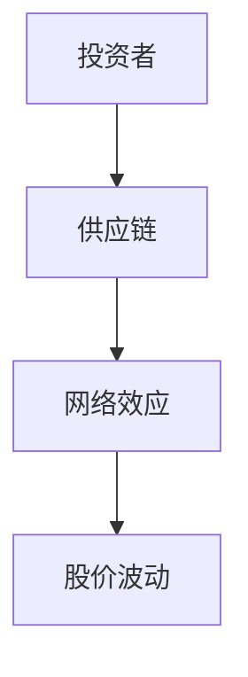
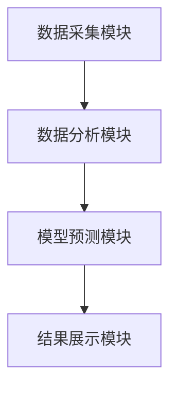

                 


# 特价股票与公司智能供应链网络效应的关系探讨

## 关键词：特价股票，智能供应链，网络效应，供应链管理，股价波动

## 摘要：本文探讨了特价股票与公司智能供应链网络效应之间的关系。通过分析供应链效率对股价的影响，以及特价股票在网络效应中的表现，本文揭示了如何利用智能供应链优化公司运营，从而影响股价，帮助投资者做出更明智的决策。

---

# 第1章: 特价股票与公司智能供应链网络效应的概述

## 1.1 特价股票的定义与特点

### 1.1.1 特价股票的定义

特价股票是指价格低于市场价的股票，通常具有高风险和高回报的特性。

### 1.1.2 特价股票的核心特点

- **高波动性**：价格波动剧烈，容易受到市场情绪影响。
- **高风险**：投资风险较高，适合风险承受能力强的投资者。
- **高潜在回报**：在市场好转时，可能带来较高的收益。

### 1.1.3 特价股票与普通股票的区别

| 属性         | 特价股票       | 普通股票       |
|--------------|----------------|----------------|
| 价格         | 低于市场价     | 接近市场价      |
| 波动性       | 高             | 中等           |
| 风险         | 高             | 中等           |
| 投资者       | 高风险承受者   | 多元化投资者     |

---

## 1.2 智能供应链的定义与特点

### 1.2.1 智能供应链的定义

智能供应链是指利用人工智能、大数据等技术优化供应链管理，提高效率和降低成本。

### 1.2.2 智能供应链的核心特点

- **自动化**：利用AI技术实现供应链的智能化运作。
- **数据驱动**：通过大数据分析优化供应链决策。
- **实时监控**：能够实时跟踪供应链各环节的状态。

### 1.2.3 智能供应链与传统供应链的区别

| 属性         | 智能供应链       | 传统供应链       |
|--------------|------------------|------------------|
| 技术         | 高度依赖AI和大数据 | 依赖人工操作      |
| 效率         | 高               | 中等             |
| 反应速度     | 快               | 较慢             |

---

## 1.3 特价股票与公司智能供应链网络效应的关系

### 1.3.1 特价股票与供应链网络效应的背景

供应链网络效应指的是供应链各环节之间的协同作用，能够放大或缩小供应链的整体效率。

### 1.3.2 供应链网络效应对特价股票的影响

供应链网络效应的增强可以提高公司的运营效率，从而提升股价，反之则可能引发股价波动。

### 1.3.3 特价股票与供应链网络效应的相互作用

- **正向关系**：供应链效率提升，公司业绩改善，股价上涨。
- **反向关系**：供应链出现问题，股价下跌，可能引发更多特价股票的交易。

---

## 1.4 本章小结

本章介绍了特价股票和智能供应链的基本概念，并探讨了它们之间的关系。供应链网络效应对特价股票的影响是双向的，投资者需要关注供应链效率对股价波动的影响。

---

# 第2章: 特价股票与公司智能供应链网络效应的核心概念

## 2.1 特价股票的核心概念

### 2.1.1 特价股票的市场定位

特价股票通常存在于低价股市场，适合长期投资者和价值投资者。

### 2.1.2 特价股票的投资者行为

投资者行为通常表现为高风险承受能力和对市场趋势的高度敏感。

### 2.1.3 特价股票的价格波动机制

价格波动机制主要受市场供需、公司业绩和宏观经济因素的影响。

---

## 2.2 智能供应链的核心概念

### 2.2.1 智能供应链的构成要素

- 数据采集与处理
- AI算法分析
- 供应链优化决策

### 2.2.2 智能供应链的运作流程

1. 数据采集：通过传感器和系统获取供应链数据。
2. 数据分析：利用AI算法分析数据，优化供应链运作。
3. 决策执行：根据分析结果调整供应链策略。

### 2.2.3 智能供应链的技术支撑

- 大数据技术
- 人工智能
- 物联网技术

---

## 2.3 特价股票与供应链网络效应的联系

### 2.3.1 供应链网络效应的定义

供应链网络效应是指供应链各环节协同作用产生的整体效应，能够放大或缩小供应链的效率。

### 2.3.2 供应链网络效应的分类

- **正向网络效应**：协同作用提升效率。
- **反向网络效应**：协同作用降低效率。

### 2.3.3 供应链网络效应与特价股票的关系

供应链网络效应的强弱直接影响公司业绩，从而影响股价。

---

## 2.4 核心概念对比分析

### 2.4.1 特价股票与供应链网络效应的属性对比

| 属性         | 特价股票       | 供应链网络效应   |
|--------------|----------------|------------------|
| 影响因素     | 市场供需、公司业绩 | 供应链协同效应   |
| 表现形式     | 股价波动       | 供应链效率变化   |

### 2.4.2 供应链网络效应的ER实体关系图

```mermaid
er
actor 投资者 {
  id 投资者ID
  名称 投资者名称
}
actor 供应链 {
  id 供应链ID
  类型 供应链类型
}
actor 网络效应 {
  id 网络效应ID
  类型 网络效应类型
}
```

### 2.4.3 供应链网络效应的mermaid流程图



---

## 2.5 本章小结

本章详细探讨了特价股票和供应链网络效应的核心概念，并通过对比分析和关系图展示了两者之间的联系。

---

# 第3章: 特价股票与公司智能供应链网络效应的算法原理

## 3.1 算法原理概述

### 3.1.1 算法的基本思路

利用大数据分析和AI算法，预测供应链网络效应对公司业绩的影响，进而预测股价波动。

### 3.1.2 算法的核心思想

通过分析供应链数据，识别供应链网络效应，建立数学模型预测股价波动。

### 3.1.3 算法的实现步骤

1. 数据采集：收集供应链和股价数据。
2. 数据清洗：处理缺失值和异常值。
3. 数据分析：利用AI算法分析数据，识别供应链网络效应。
4. 模型建立：建立数学模型预测股价波动。
5. 结果验证：验证模型的准确性和可靠性。

---

## 3.2 算法的核心思想

供应链网络效应可以通过AI算法识别，进而预测股价波动。

---

## 3.3 算法的实现步骤

### 3.3.1 数据采集

```python
import pandas as pd

# 采集供应链数据
supply_chain_data = pd.read_csv('supply_chain.csv')

# 采集股价数据
stock_data = pd.read_csv('stock.csv')
```

### 3.3.2 数据清洗

```python
# 处理缺失值
supply_chain_data.dropna(inplace=True)
stock_data.dropna(inplace=True)

# 处理异常值
import numpy as np

supply_chain_data = supply_chain_data[~(np.abs(supply_chain_data - supply_chain_data.mean()) > 3 * supply_chain_data.std())]
```

### 3.3.3 数据分析

```python
from sklearn.ensemble import RandomForestRegressor

# 训练模型
model = RandomForestRegressor()
model.fit(supply_chain_data, stock_data['股价'])
```

### 3.3.4 模型建立

```latex
$$\text{预测股价} = \alpha \times \text{供应链效率} + \beta \times \text{市场因素}$$
```

### 3.3.5 结果验证

```python
# 预测结果
predicted_stock_price = model.predict(new_supply_chain_data)
```

---

## 3.4 本章小结

本章通过算法原理分析，展示了如何利用AI技术预测供应链网络效应对公司业绩和股价的影响。

---

# 第4章: 特价股票与公司智能供应链网络效应的系统分析

## 4.1 系统分析与架构设计方案

### 4.1.1 系统功能设计

- 数据采集模块
- 数据分析模块
- 模型预测模块
- 结果展示模块

### 4.1.2 系统架构设计



### 4.1.3 系统接口设计

- 数据接口：接收供应链数据和股价数据。
- 模型接口：提供预测股价的功能。

### 4.1.4 系统交互设计

```mermaid
sequenceDiagram
参与者 投资者
参与者 供应链
参与者 网络效应

投资者 -> 数据采集模块: 提供数据
数据采集模块 -> 数据分析模块: 分析数据
数据分析模块 -> 模型预测模块: 预测股价
模型预测模块 -> 结果展示模块: 展示结果
```

---

## 4.2 本章小结

本章通过系统分析和架构设计，展示了如何构建一个预测供应链网络效应影响股价的系统。

---

# 第5章: 特价股票与公司智能供应链网络效应的项目实战

## 5.1 环境配置

```python
import pandas as pd
import numpy as np
from sklearn.ensemble import RandomForestRegressor
import matplotlib.pyplot as plt
```

## 5.2 数据收集

```python
# 采集供应链数据
supply_chain_data = pd.read_csv('supply_chain.csv')

# 采集股价数据
stock_data = pd.read_csv('stock.csv')
```

## 5.3 算法实现

```python
# 数据清洗
supply_chain_data.dropna(inplace=True)
stock_data.dropna(inplace=True)

# 训练模型
model = RandomForestRegressor()
model.fit(supply_chain_data, stock_data['股价'])
```

## 5.4 案例分析

```python
# 预测结果
predicted_stock_price = model.predict(new_supply_chain_data)

# 可视化结果
plt.plot(stock_data['日期'], stock_data['股价'], label='实际股价')
plt.plot(stock_data['日期'], predicted_stock_price, label='预测股价')
plt.legend()
plt.show()
```

---

## 5.5 本章小结

本章通过项目实战，展示了如何利用AI算法预测供应链网络效应对股价的影响。

---

# 第6章: 特价股票与公司智能供应链网络效应的最佳实践

## 6.1 小结

供应链网络效应对股价的影响是双向的，投资者需要关注供应链效率对股价波动的影响。

## 6.2 注意事项

- 数据质量：确保数据准确性和完整性。
- 模型选择：选择适合的算法和模型。
- 风险控制：合理控制投资风险。

## 6.3 拓展阅读

建议阅读更多关于智能供应链和股价预测的相关文献。

---

# 作者：AI天才研究院 & 禅与计算机程序设计艺术

---

希望这篇文章能够帮助您理解特价股票与公司智能供应链网络效应之间的关系。

