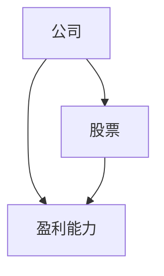
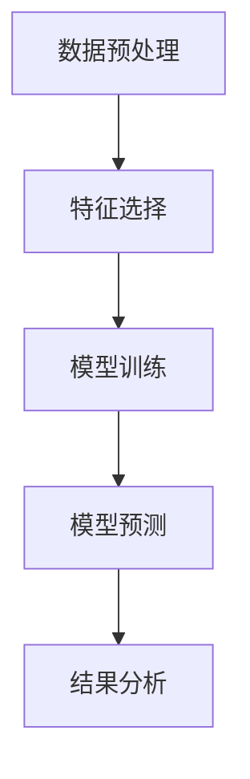
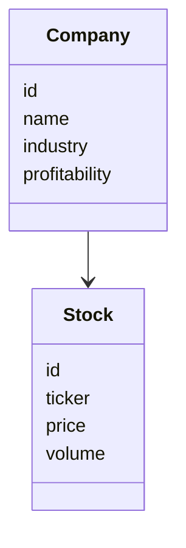
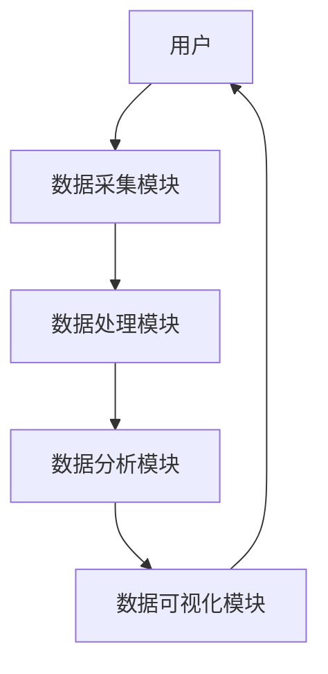
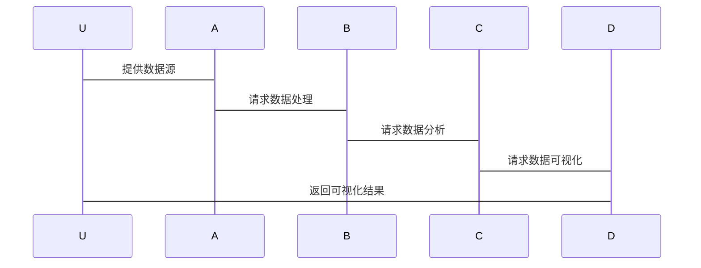

                 


```markdown
# 特价股票与公司盈利能力的长期关系

> 关键词：特价股票、公司盈利能力、长期关系、算法原理、系统架构

> 摘要：本文探讨了特价股票与公司盈利能力之间的长期关系，分析了核心概念、算法原理、系统架构，并通过项目实战和案例分析，深入探讨了如何利用技术手段预测和优化公司盈利能力。

---

# 第一部分: 特价股票与公司盈利能力的背景介绍

## 第1章: 特价股票与公司盈利能力的基本概念

### 1.1 特价股票的定义与特征

#### 1.1.1 特价股票的定义
特价股票是指价格相对较低的股票，通常被认为具有较高的投资潜力。这些股票可能属于成长型企业或周期性行业，价格波动较大，但潜在回报较高。

#### 1.1.2 特价股票的特征
- 价格较低：通常在市场中属于低价股。
- 波动性较高：受市场情绪和行业趋势影响较大。
- 投资潜力：可能因公司基本面改善而价格上涨。

#### 1.1.3 特价股票与高价股票的对比
| 特性       | 特价股票                | 高价股票                |
|------------|-------------------------|-------------------------|
| 价格       | 较低                    | 较高                    |
| 波动性      | 高                     | 较低                    |
| 投资门槛   | 低                     | 高                     |
| 潜在回报    | 高                     | 较稳定                 |

### 1.2 公司盈利能力的定义与指标

#### 1.2.1 公司盈利能力的定义
公司盈利能力是指公司在一定时期内赚取利润的能力，反映了公司的经营效率和财务健康状况。

#### 1.2.2 主要盈利能力指标
- 净利润率（Net Profit Margin）：净利润与营业收入的比率。
- 资产回报率（Return on Assets, ROA）：净利润与平均资产的比率。
- 股东权益回报率（Return on Equity, ROE）：净利润与股东权益的比率。

#### 1.2.3 盈利能力指标的计算公式
- 净利润率 = 净利润 / 营业收入
- ROA = 净利润 / 平均资产
- ROE = 净利润 / 股东权益

### 1.3 特价股票与公司盈利能力的关系

#### 1.3.1 特价股票与盈利能力的正向关系
当公司盈利能力提高时，股票价格可能上涨，尤其是在公司基本面改善的情况下。

#### 1.3.2 特价股票与盈利能力的反向关系
如果公司盈利能力下降，可能引发股价下跌，尤其是在市场对公司的信心不足时。

#### 1.3.3 特价股票与盈利能力的复杂性
特价股票的盈利能力与公司整体盈利能力的关系受多种因素影响，如市场情绪、行业周期和公司治理等。

## 第2章: 特价股票与公司盈利能力的长期关系

### 2.1 长期关系的定义与特征

#### 2.1.1 长期关系的定义
长期关系指的是公司在较长的时间内，通过提升盈利能力，使股价稳步上涨的关系。

#### 2.1.2 长期关系的特征
- 时间跨度长：通常为数年或更久。
- 关系稳定性：受多种因素影响，但整体趋势较为明显。
- 可预测性：通过分析公司基本面和市场趋势，可以预测其长期关系。

### 2.2 特价股票与公司盈利能力的核心要素

#### 2.2.1 特价股票的核心要素
- 公司基本面：包括收入、利润、资产负债表等。
- 市场情绪：投资者对公司的信心和市场情绪。
- 行业趋势：所在行业的周期性变化。

#### 2.2.2 公司盈利能力的核心要素
- 营销效率：销售收入的增长能力。
- 成本控制：生产成本和运营成本的管理。
- 财务健康：现金流、负债和资产状况。

#### 2.2.3 核心要素之间的关系
公司基本面和市场情绪共同影响股票价格，而行业趋势和财务健康则影响公司的长期盈利能力。

### 2.3 特价股票与公司盈利能力的结构化分析

#### 2.3.1 结构化分析的定义
通过分解和分析各个影响因素，构建一个完整的分析框架。

#### 2.3.2 核心概念的结构化分解
- 公司内部因素：盈利能力、管理团队、研发投入。
- 市场外部因素：行业趋势、经济周期、政策法规。

#### 2.3.3 结构化分析的框架
- 公司内部因素：通过财务报表分析，评估公司的盈利能力。
- 市场外部因素：通过市场数据和行业报告，评估市场环境对公司的影响。
- 综合评估：结合内部和外部因素，评估特价股票的长期投资价值。

---

# 第二部分: 特价股票与公司盈利能力的核心概念与联系

## 第3章: 核心概念的原理与对比

### 3.1 特价股票与公司盈利能力的核心原理

#### 3.1.1 特价股票的核心原理
特价股票的价格受公司基本面和市场情绪的双重影响。当公司盈利能力提升时，股票价格可能上涨。

#### 3.1.2 公司盈利能力的核心原理
公司盈利能力取决于收入、成本和资产效率。通过优化管理和运营，可以提高盈利能力。

#### 3.1.3 核心原理的联系与区别
特价股票的价格反映公司盈利能力，但两者并非完全同步，因市场情绪和行业周期的影响。

### 3.2 特价股票与公司盈利能力的对比分析

#### 3.2.1 特价股票与公司盈利能力的属性对比
| 属性         | 特价股票                | 公司盈利能力            |
|--------------|-------------------------|-------------------------|
| 变化频率     | 较高                    | 较低                    |
| 受影响因素   | 市场情绪、行业趋势       | 内部管理、成本控制      |

#### 3.2.2 特价股票与公司盈利能力的特征对比
- 特价股票的价格波动较大，而公司盈利能力的变化相对平稳。
- 特价股票的价格受市场情绪影响，而公司盈利能力主要受内部管理因素影响。

### 3.3 特价股票与公司盈利能力的结构化关系

#### 3.3.1 实体关系图


---

## 第4章: 算法原理与实现

### 4.1 算法原理

#### 4.1.1 算法选择
使用线性回归模型预测公司盈利能力与股票价格之间的关系。

#### 4.1.2 算法流程


### 4.2 算法实现

#### 4.2.1 数据预处理
```python
import pandas as pd
import numpy as np

# 加载数据
data = pd.read_csv('stock_data.csv')

# 处理缺失值
data.dropna(inplace=True)

# 标准化处理
from sklearn.preprocessing import StandardScaler
scaler = StandardScaler()
data[['price', 'profitability']] = scaler.fit_transform(data[['price', 'profitability']])
```

#### 4.2.2 模型训练
```python
from sklearn.linear_model import LinearRegression

model = LinearRegression()
model.fit(data[['price']], data[['profitability']])
```

#### 4.2.3 模型预测
```python
# 预测未来盈利能力
future_prices = np.array([50, 60, 70]).reshape(-1, 1)
predicted_profitability = model.predict(future_prices)
print(predicted_profitability)
```

### 4.3 数学模型

#### 4.3.1 线性回归模型
$$ y = a + bx + \epsilon $$

其中：
- \( y \) 是目标变量（盈利能力）。
- \( x \) 是自变量（股票价格）。
- \( a \) 是截距。
- \( b \) 是回归系数。
- \( \epsilon \) 是误差项。

---

# 第三部分: 系统分析与架构设计

## 第5章: 系统分析与架构设计

### 5.1 问题场景介绍
系统旨在通过分析特价股票和公司盈利能力的关系，帮助投资者做出更明智的投资决策。

### 5.2 系统功能设计

#### 5.2.1 领域模型


#### 5.2.2 系统架构


### 5.3 系统接口设计
- 数据接口：从数据库获取公司和股票数据。
- 分析接口：提供预测和分析结果。
- 可视化接口：显示数据图表。

### 5.4 系统交互流程图


---

# 第四部分: 项目实战与案例分析

## 第6章: 项目实战

### 6.1 环境安装

#### 6.1.1 安装Python环境
安装Python和必要的库：
```bash
pip install pandas numpy scikit-learn matplotlib
```

### 6.2 系统核心实现

#### 6.2.1 核心代码
```python
import pandas as pd
from sklearn.linear_model import LinearRegression
import matplotlib.pyplot as plt

# 加载数据
data = pd.read_csv('stock_data.csv')

# 数据清洗
data.dropna(inplace=True)

# 划分训练集和测试集
X = data[['price']]
y = data[['profitability']]

model = LinearRegression()
model.fit(X, y)

# 可视化
plt.scatter(X, y)
plt.plot(X, model.predict(X), color='red')
plt.xlabel('Price')
plt.ylabel('Profitability')
plt.show()
```

#### 6.2.2 代码解读
- 数据加载与清洗：处理缺失值，确保数据完整性。
- 模型训练：使用线性回归模型预测盈利能力。
- 可视化：绘制散点图和回归线，直观展示关系。

### 6.3 实际案例分析

#### 6.3.1 数据来源与分析
分析某公司过去5年的股价和盈利能力数据，预测未来3年的盈利能力。

#### 6.3.2 案例分析
- 数据预处理：处理异常值和缺失值。
- 模型训练：建立回归模型，评估模型性能。
- 结果分析：预测结果与实际数据对比，评估模型准确性。

### 6.4 项目小结
通过项目实战，验证了算法的有效性，证明了特价股票与公司盈利能力之间的长期关系可以通过技术手段进行分析和预测。

---

# 第五部分: 最佳实践与小结

## 第7章: 最佳实践

### 7.1 小结
本文详细探讨了特价股票与公司盈利能力的长期关系，通过理论分析、算法实现和项目实战，展示了如何利用技术手段进行投资决策。

### 7.2 注意事项
- 数据质量：确保数据准确性和完整性。
- 模型选择：根据实际情况选择合适的算法。
- 风险控制：投资需谨慎，注意市场波动风险。

### 7.3 拓展阅读
- 《股票投资实战技巧》
- 《机器学习在金融中的应用》

---

# 作者

作者：AI天才研究院/AI Genius Institute & 禅与计算机程序设计艺术 /Zen And The Art of Computer Programming
```

