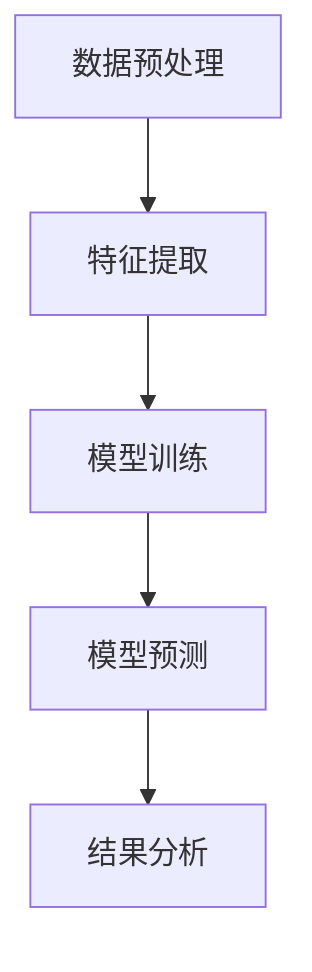
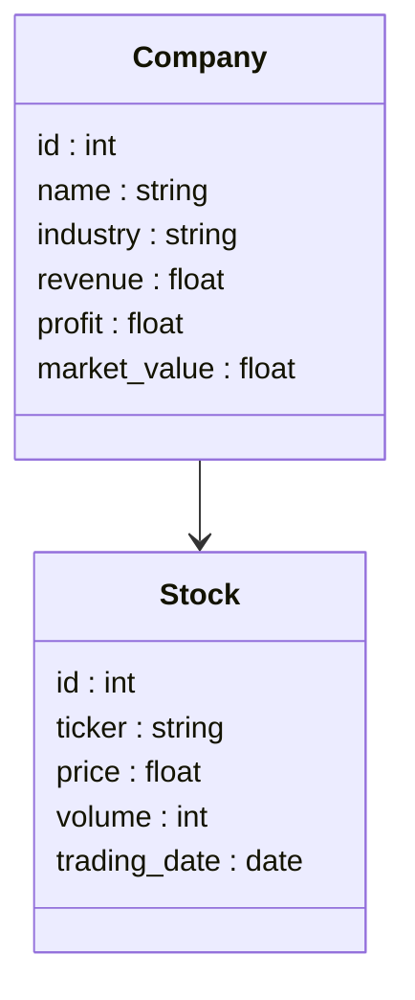
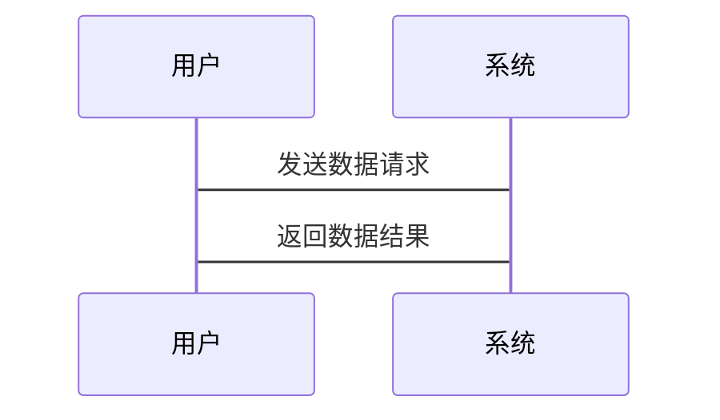

                 


```markdown
# 特价股票与公司盈利质量的深度分析

> 关键词：特价股票、公司盈利质量、市场分析、财务指标、投资策略

> 摘要：本文深入探讨了特价股票与公司盈利质量之间的关系，通过数据分析和模型构建，揭示了如何利用财务指标和市场信息来评估公司盈利质量，并为投资者提供科学的决策支持。文章结合实际案例，详细分析了特价股票市场的特点、盈利质量的核心要素以及如何通过技术手段优化投资策略。

---

# 第1章: 特价股票与公司盈利质量的背景介绍

## 1.1 特价股票的概念与特点
### 1.1.1 特价股票的定义
特价股票是指在特定市场或时间段内，价格相对较低的股票。这类股票通常具有较高的波动性和潜在的高回报率。

### 1.1.2 特价股票的分类与特点
- **折扣股票**：价格远低于市场平均水平的股票。
- **成长股票**：公司盈利增长潜力大的股票。
- **周期性股票**：受经济周期影响较大的股票。

### 1.1.3 特价股票在市场中的作用
特价股票为投资者提供了高风险高回报的投资机会，同时也为市场提供了流动性。

## 1.2 公司盈利质量的核心要素
### 1.2.1 盈利能力的定义与衡量指标
盈利能力是公司财务健康的核心指标，常用的衡量指标包括：
- 净利润率（Net Profit Margin）
- 毛利率（Gross Profit Margin）
- 资产回报率（Return on Assets, ROA）

### 1.2.2 盈利质量的关键影响因素
- 公司的经营效率
- 行业竞争状况
- 宏观经济环境

### 1.2.3 盈利质量与股价的关系
公司盈利质量直接影响股价，高盈利质量的公司通常能获得更高的股价溢价。

## 1.3 特价股票与公司盈利质量的关联性
### 1.3.1 特价股票市场的特点
- 价格波动剧烈
- 市场参与者以散户为主
- 信息不对称问题严重

### 1.3.2 公司盈利质量对特价股票的影响
高盈利质量的公司在特价股票市场中更具竞争力，能够吸引更多的投资者。

### 1.3.3 市场中的主要参与者与交易机制
- 主要参与者：散户、机构投资者、做市商
- 交易机制：竞价交易、撮合交易

## 1.4 当前市场中的问题与挑战
### 1.4.1 特价股票市场的风险
- 市场波动大，投资风险高
- 信息不对称导致的决策失误

### 1.4.2 公司盈利质量评估的难点
- 数据获取困难
- 评估指标的多样性与复杂性

### 1.4.3 市场中的信息不对称问题
信息不对称导致投资者难以准确评估公司盈利质量，增加了投资风险。

## 1.5 本章小结
- 特价股票的核心概念
- 盈利质量的关键要素
- 当前市场的主要问题

---

# 第2章: 特价股票与公司盈利质量的核心概念与联系

## 2.1 特价股票的核心概念原理
### 2.1.1 特价股票的定价机制
- 市场供需关系
- 公司基本面分析
- 市场情绪影响

### 2.1.2 特价股票的市场流动性分析
- 市场深度
- 成交量分析
- 流动性风险

### 2.1.3 特价股票的风险评估模型
- 风险-收益分析
- 市场波动性分析
- 盈利能力预测

## 2.2 公司盈利质量的属性特征对比
### 2.2.1 盈利能力的多维度分析
- 净利润、毛利、ROE（净资产收益率）对比
- 盈利能力的稳定性与波动性

### 2.2.2 盈利质量的稳定性与波动性
- 历史盈利数据分析
- 盈利质量的周期性变化

### 2.2.3 盈利质量的可持续性评估
- 公司未来盈利预测
- 行业发展趋势分析

## 2.3 实体关系图（ER图）架构
```mermaid
erDiagram
    company {
        id
        name
        industry
        revenue
        profit
        market_value
    }
    stock {
        id
        ticker
        price
        volume
        trading_date
    }

    company -[many]-> stock
    stock --> company
```

---

# 第3章: 特价股票与公司盈利质量的算法原理

## 3.1 算法原理概述
### 3.1.1 数据预处理
- 数据清洗
- 特征提取

### 3.1.2 模型选择
- 线性回归
- 支持向量机（SVM）
- 随机森林

## 3.2 机器学习算法实现


### 3.2.1 线性回归模型
$$ y = \beta_0 + \beta_1x + \epsilon $$

### 3.2.2 支持向量机（SVM）
$$ \text{目标函数}：\min_{\beta,b,\xi} \frac{1}{2}\|\beta\|^2 + C\sum_{i=1}^n \xi_i $$
$$ \text{约束条件}：y_i(\beta \cdot x_i + b) \geq 1 - \xi_i $$
$$ \xi_i \geq 0 $$

### 3.2.3 随机森林
- 树的数量：N_estimators
- 最大深度：max_depth
- 分裂标准：Gini指数

## 3.3 算法实现代码
```python
import pandas as pd
from sklearn.model_selection import train_test_split
from sklearn.ensemble import RandomForestRegressor
from sklearn.metrics import mean_squared_error

# 数据加载
data = pd.read_csv('stock_data.csv')

# 特征与目标分离
X = data[['revenue', 'profit', 'market_value']]
y = data['price']

# 数据分割
X_train, X_test, y_train, y_test = train_test_split(X, y, test_size=0.2, random_state=42)

# 模型训练
model = RandomForestRegressor(n_estimators=100, max_depth=10, random_state=42)
model.fit(X_train, y_train)

# 模型预测
y_pred = model.predict(X_test)

# 评估指标
 mse = mean_squared_error(y_test, y_pred)
 print(f'均方误差：{mse}')
```

---

# 第4章: 特价股票与公司盈利质量的系统分析与架构设计

## 4.1 系统分析
### 4.1.1 问题场景介绍
- 数据采集
- 数据处理
- 模型部署

### 4.1.2 项目介绍
- 项目目标：构建盈利质量评估系统
- 项目范围：特价股票市场分析

## 4.2 系统功能设计
### 4.2.1 领域模型（mermaid类图）


### 4.2.2 系统架构设计（mermaid架构图）
```mermaid
container 特价股票分析系统 {
    组件1：数据采集模块
    组件2：数据处理模块
    组件3：模型训练模块
    组件4：结果展示模块
}
```

## 4.3 系统接口设计
### 4.3.1 接口设计
- 数据接口：REST API
- 模型接口：WebService

## 4.4 系统交互设计（mermaid序列图）


---

# 第5章: 特价股票与公司盈利质量的项目实战

## 5.1 项目环境安装
- 数据库：MySQL
- 开发工具：Python、Jupyter Notebook
- 依赖库：pandas、numpy、scikit-learn

## 5.2 系统核心实现源代码
```python
import pandas as pd
import numpy as np
from sklearn.ensemble import RandomForestRegressor
from sklearn.metrics import mean_squared_error
from sklearn.model_selection import train_test_split

# 数据加载
data = pd.read_csv('stock_data.csv')

# 特征与目标分离
X = data[['revenue', 'profit', 'market_value']]
y = data['price']

# 数据分割
X_train, X_test, y_train, y_test = train_test_split(X, y, test_size=0.2, random_state=42)

# 模型训练
model = RandomForestRegressor(n_estimators=100, max_depth=10, random_state=42)
model.fit(X_train, y_train)

# 模型预测
y_pred = model.predict(X_test)

# 评估指标
 mse = mean_squared_error(y_test, y_pred)
 print(f'均方误差：{mse}')
```

## 5.3 代码应用解读与分析
- 数据加载：读取CSV文件
- 特征提取：选择关键财务指标
- 模型训练：使用随机森林算法
- 模型预测：预测股票价格
- 评估指标：计算均方误差

## 5.4 实际案例分析
### 5.4.1 数据分析
- 数据清洗与预处理
- 数据可视化

### 5.4.2 案例分析
- 选择一家公司进行盈利质量评估
- 对比分析其股价走势

## 5.5 项目小结
- 项目实现的关键步骤
- 项目中的问题与解决方案
- 项目总结与经验分享

---

# 第6章: 特价股票与公司盈利质量的结论与最佳实践

## 6.1 结论
- 特价股票与公司盈利质量之间的关系
- 算法模型的有效性
- 系统设计的可行性

## 6.2 投资策略建议
- 理性投资，避免盲目跟风
- 结合财务指标与市场信息进行综合分析
- 长期投资，关注公司基本面

## 6.3 注意事项
- 风险提示
- 信息来源的可靠性
- 模型的局限性

## 6.4 拓展阅读
- 推荐书籍：《投资学基础》、《股票技术分析》
- 推荐网站：Yahoo Finance、Google Finance

---

# 作者：AI天才研究院/AI Genius Institute & 禅与计算机程序设计艺术 /Zen And The Art of Computer Programming
```

