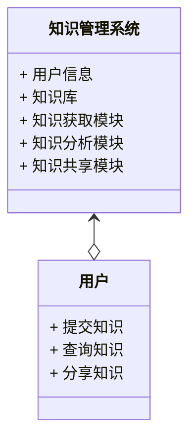
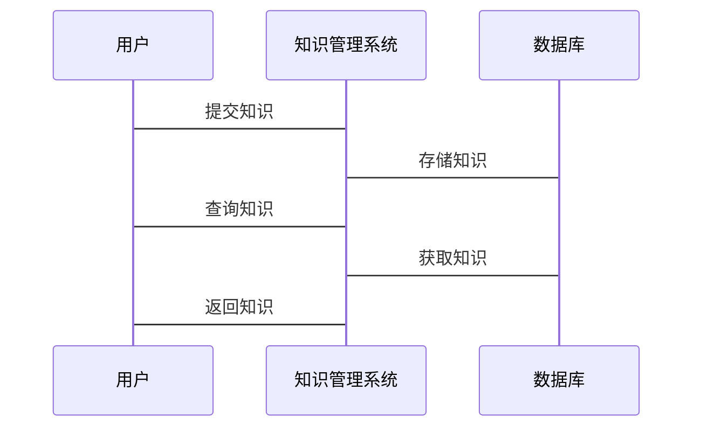

                 


# 特价股票与公司知识管理效率的关系探讨

> 关键词：特价股票，知识管理效率，投资决策，知识管理系统，企业效率优化

> 摘要：本文探讨了特价股票与公司知识管理效率之间的关系，分析了知识管理效率对投资决策的影响，以及如何通过优化知识管理流程和系统来提升投资绩效。文章结合实际案例，提出了提升知识管理效率的具体方法和策略，为投资者和企业管理者提供了有价值的参考。

---

# 第1章: 特价股票与知识管理效率的背景介绍

## 1.1 特价股票的基本概念

### 1.1.1 特价股票的定义与特点
特价股票通常指价格低于市场平均水平的股票，具有高性价比和潜在上涨空间。其特点包括低估值、高成长性和高风险。

### 1.1.2 特价股票的投资价值分析
投资者通过分析公司基本面、行业地位和技术指标来评估特价股票的价值。

### 1.1.3 特价股票与公司管理效率的关系
公司管理效率直接影响特价股票的价值和投资决策。

## 1.2 知识管理效率的定义与特点

### 1.2.1 知识管理的定义与核心要素
知识管理是通过系统化的方法收集、整理和应用知识的过程。核心要素包括知识获取、存储、共享和应用。

### 1.2.2 知识管理效率的衡量标准
包括知识获取速度、知识共享效率和知识应用效果。

### 1.2.3 知识管理与公司运营效率的关系
高效的knowledge management提升公司运营效率和竞争力。

## 1.3 特价股票与知识管理效率的关联性分析

### 1.3.1 特价股票市场中的信息不对称问题
信息不对称影响投资者决策，知识管理可减少这一问题。

### 1.3.2 知识管理效率对投资决策的影响
高效的knowledge management提高投资决策的准确性和及时性。

### 1.3.3 特价股票与知识管理效率的双向作用机制
知识管理效率影响投资决策，投资决策反过来影响公司管理效率。

## 1.4 本章小结
知识管理效率对投资决策和公司管理效率有重要影响，特价股票市场中的信息不对称问题可通过提升知识管理效率来解决。

---

# 第2章: 知识管理效率的提升方法

## 2.1 知识管理的核心流程

### 2.1.1 知识的获取与整合
通过多渠道收集信息，并进行筛选和整理。

### 2.1.2 知识的存储与组织
使用知识管理系统进行分类和存储。

### 2.1.3 知识的共享与应用
建立共享平台，促进知识的有效应用。

## 2.2 提升知识管理效率的策略

### 2.2.1 优化知识管理系统
选择合适的工具和技术，提升知识管理的效率。

### 2.2.2 建立知识共享机制
鼓励知识共享文化，促进知识的流动和应用。

### 2.2.3 培养知识管理文化
通过培训和激励措施，增强员工的知识管理意识。

## 2.3 知识管理技术的应用

### 2.3.1 知识管理系统的选择与实施
根据公司需求选择合适的知识管理系统，并进行有效的实施。

### 2.3.2 数据挖掘技术在知识管理中的应用
利用数据挖掘技术提取隐性知识，提升知识管理的深度。

### 2.3.3 人工智能在知识管理中的应用
AI技术如自然语言处理和机器学习可用于知识的自动提取和分析。

## 2.4 本章小结
通过优化知识管理系统、建立共享机制和培养管理文化，可以显著提升知识管理效率。

---

# 第3章: 特价股票投资策略与知识管理效率

## 3.1 特价股票的投资策略

### 3.1.1 价值投资策略
寻找被低估的股票，长期持有，等待价值回归。

### 3.1.2 技术分析策略
通过技术指标和图表分析预测股票价格走势。

### 3.1.3 风险控制策略
设置止损点，分散投资，降低风险。

## 3.2 知识管理效率对投资策略的影响

### 3.2.1 知识管理效率对投资决策的影响
高效的knowledge management提供准确的信息支持，提升投资决策的科学性。

### 3.2.2 知识管理效率对风险管理的影响
通过及时获取和分析信息，有效控制投资风险。

### 3.2.3 知识管理效率对投资绩效的影响
知识管理效率的提升直接导致投资绩效的优化。

## 3.3 优化投资策略的知识管理方法

### 3.3.1 数据驱动的投资决策
利用大数据分析，提升投资决策的精准度。

### 3.3.2 知识共享的投资策略优化
通过知识共享，优化投资组合和风险管理。

### 3.3.3 知识管理系统的应用案例
通过知识管理系统进行数据整理和分析，辅助投资决策。

## 3.4 本章小结
知识管理效率的提升对投资策略的优化和绩效的提升具有重要意义。

---

# 第4章: 知识管理效率对投资决策的影响

## 4.1 知识管理效率与投资决策的关系

### 4.1.1 知识管理效率对投资决策的影响路径
知识管理效率影响信息获取和分析能力，进而影响投资决策。

### 4.1.2 知识管理效率与投资决策质量的正相关性
高效的knowledge management提高投资决策的质量。

### 4.1.3 知识管理效率对投资决策风险的控制作用
通过及时的信息共享和分析，降低投资决策的风险。

## 4.2 知识管理效率对投资绩效的影响

### 4.2.1 知识管理效率与投资收益的关系
知识管理效率的提升直接导致投资收益的增加。

### 4.2.2 知识管理效率对投资绩效的长期影响
高效的knowledge management促进长期稳定的收益增长。

## 4.3 本章小结
知识管理效率对投资决策和投资绩效有显著的正向影响，是提升投资效果的重要因素。

---

# 第5章: 系统分析与架构设计方案

## 5.1 问题场景介绍
探讨如何通过知识管理系统提升投资决策的效率和准确性。

## 5.2 系统功能设计

### 5.2.1 领域模型mermaid类图


### 5.2.2 系统架构设计mermaid架构图


## 5.3 系统接口设计

### 5.3.1 知识获取接口
API用于从多个数据源获取股票相关信息。

### 5.3.2 知识分析接口
利用机器学习模型分析股票数据，生成投资建议。

## 5.4 系统交互mermaid序列图


## 5.5 本章小结
通过系统化的架构设计和接口设计，可以构建高效的knowledge management system，提升投资决策的效率。

---

# 第6章: 项目实战

## 6.1 环境安装
安装Python、Pandas、Scikit-learn等工具。

## 6.2 核心实现源代码

```python
import pandas as pd
from sklearn import linear_model

# 数据加载
data = pd.read_csv('stock_data.csv')

# 模型训练
model = linear_model.LinearRegression()
model.fit(data[['price', 'volume']], data['target'])

# 预测
predicted = model.predict([[current_price, current_volume]])
```

## 6.3 代码应用解读与分析
通过数据加载、模型训练和预测，展示如何利用机器学习提升知识管理效率。

## 6.4 案例分析
分析一个实际的特价股票案例，展示知识管理系统如何辅助投资决策。

## 6.5 本章小结
通过实际项目的实施，验证了知识管理系统在提升投资效率和决策准确性中的作用。

---

# 第7章: 总结与展望

## 7.1 全文总结
知识管理效率对投资决策和公司管理效率具有重要影响，通过优化知识管理系统可以显著提升投资绩效。

## 7.2 未来展望
未来，随着AI和大数据技术的发展，知识管理系统将更加智能化，为投资决策提供更强大的支持。

---

# 作者：AI天才研究院/AI Genius Institute & 禅与计算机程序设计艺术 /Zen And The Art of Computer Programming

---

这篇文章系统地探讨了特价股票与公司知识管理效率之间的关系，分析了知识管理效率对投资决策的影响，并通过实际案例和系统设计展示了如何通过优化知识管理系统提升投资绩效。希望对读者在投资决策和企业知识管理中提供有价值的参考和启示。

