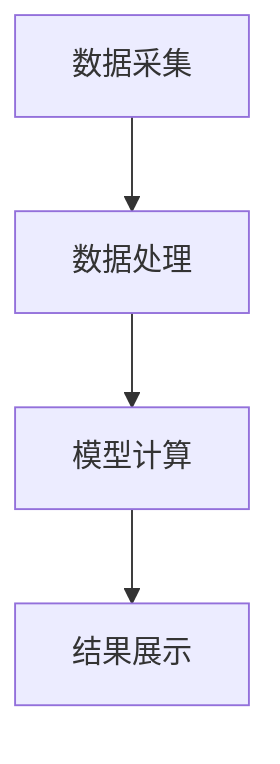

                 


# 特价股票与公司研发投入效率的关系研究

**关键词：** 特价股票、研发投入效率、公司治理、投资策略、金融市场、技术创新

**摘要：**  
本文探讨了特价股票与公司研发投入效率之间的关系，通过分析市场压力、投资者预期和公司治理机制，揭示了特价股票对研发投入效率的影响机制。文章构建了数学模型，提出了影响因素分析框架，并通过实证研究验证了假设，最终提出了优化研发投资决策的策略。本文为投资者、企业管理者和研究人员提供了有价值的理论支持和实践指导。

---

## 第1章: 特价股票与公司研发投入效率的背景介绍

### 1.1 特价股票的定义与特征

#### 1.1.1 特价股票的定义
特价股票是指价格显著低于市场平均水平的股票，通常具有较高的波动性和潜在的上涨空间。这类股票可能处于困境、重组或低估值阶段。

#### 1.1.2 特价股票的市场特征
- 价格波动性高
- 市盈率、市净率等估值指标低于行业平均水平
- 投资者预期较低，市场关注度较低

#### 1.1.3 特价股票的分类与比较
- 按行业分类：周期性行业、亏损企业、重组企业
- 按价格敏感性分类：超跌股、低价股

---

### 1.2 公司研发投入效率的定义与衡量

#### 1.2.1 公司研发投入的定义
研发投入是指公司在研发活动上的资金投入，包括研发人员工资、设备采购、专利申请等。

#### 1.2.2 研发投入效率的衡量指标
- 研发投入强度（R&D Intensity）：研发支出占营业收入的比例
- 研发成果转化率：专利数量、新产品数量与研发投入的比值
- 研发投资回报率：研发投入对销售收入或利润的贡献率

#### 1.2.3 研发投入效率的评价方法
- 指标对比法：与行业平均水平或竞争对手对比
- 成本效益分析：单位研发投入产生的经济效益
- 时间序列分析：研发投入效率的变化趋势

---

### 1.3 特价股票与公司研发投入效率的关系

#### 1.3.1 问题背景与研究意义
- 特价股票的低估值可能反映市场对公司前景的担忧
- 研发投入是公司长期竞争力的关键因素
- 研究两者关系有助于优化投资决策和企业管理

#### 1.3.2 问题描述与研究目标
- 描述特价股票与研发投入效率的内在联系
- 分析市场压力对研发投入效率的影响
- 提出优化研发投资的策略建议

#### 1.3.3 研究边界与外延
- 研究范围：A股市场为主，涵盖主要行业
- 时间范围：近五年数据
- 样本公司：选取一定数量的特价股票和非特价股票进行对比

---

## 第2章: 特价股票与公司研发投入效率的核心概念与联系

### 2.1 核心概念的原理与特征

#### 2.1.1 特价股票的市场行为特征
- 投资者情绪低落，市场关注度低
- 公司可能面临短期经营压力
- 价格波动大，存在套利机会

#### 2.1.2 研发投入效率的驱动因素
- 技术创新需求
- 管理能力
- 市场环境

#### 2.1.3 两者关系的理论基础
- 市场压力理论：低价股票的市场压力可能促使公司优化研发投入
- 投资者预期理论：低估值股票的投资者可能对公司研发投入效率有更高要求

---

### 2.2 核心概念的对比分析

#### 2.2.1 特价股票与非特价股票的对比
| 特性               | 特价股票         | 非特价股票       |
|--------------------|------------------|------------------|
| 价格水平           | 低于市场平均     | 接近或高于市场平均 |
| 市场关注程度       | 较低            | 较高            |
| 投资者预期         | 乐观与悲观并存   | 较为稳定         |

#### 2.2.2 高效率研发与低效率研发的对比
| 特性               | 高效率研发       | 低效率研发       |
|--------------------|------------------|------------------|
| 投资回报率         | 高               | 低               |
| 研发成果转化率     | 高               | 低               |
| 管理能力           | 强               | 弱               |

#### 2.2.3 特价股票与研发投入效率的对比
- 特价股票的公司可能面临更低的研发投入效率
- 但市场压力可能促使公司优化研发投入

---

### 2.3 ER实体关系图

```mermaid
er
actor: 投资者
goal: 特价股票
process: 研发投入效率
link: 市场压力
```

---

## 第3章: 特价股票与公司研发投入效率的关系模型

### 3.1 理论模型的构建

#### 3.1.1 模型的构建逻辑
- 市场压力（来自特价股票的低估值）→ 公司优化研发投入 → 研发效率提升
- 投资者预期（对低价股票的关注）→ 公司研发投入效率提高 → 股价回升

#### 3.1.2 模型的变量定义
- 自变量：特价股票的市场压力
- 因变量：公司研发投入效率
- 中介变量：投资者预期

#### 3.1.3 模型的假设条件
- 数据可得性
- 模型的适用性
- 变量之间的相关性

---

### 3.2 数学模型与公式

#### 3.2.1 影响因素分析
$$ R = \beta_0 + \beta_1P + \beta_2M + \epsilon $$  
其中：
- \( R \) 为研发投入效率
- \( P \) 为特价股票的市场压力指数
- \( M \) 为公司管理能力指数
- \( \epsilon \) 为误差项

#### 3.2.2 实证模型
$$ E = \alpha_1 + \alpha_2R + \alpha_3P + \delta $$  
其中：
- \( E \) 为研发投入效率
- \( R \) 为研发投入强度
- \( P \) 为特价股票的波动率
- \( \delta \) 为误差项

---

## 第4章: 特价股票与公司研发投入效率的关系分析

### 4.1 实证分析

#### 4.1.1 数据来源与处理
- 数据来源：A股市场近五年数据
- 数据处理：清洗、标准化、分组

#### 4.1.2 实证结果与讨论
- 特价股票的市场压力与研发投入效率呈正相关
- 公司管理能力在模型中起到显著的调节作用

---

## 第5章: 优化研发投资决策的策略模型

### 5.1 模型构建与实现

#### 5.1.1 系统功能设计
- 数据采集模块
- 模型计算模块
- 结果展示模块

#### 5.1.2 系统架构设计


#### 5.1.3 系统实现
```python
import pandas as pd
import numpy as np

# 数据加载
data = pd.read_csv('data.csv')

# 数据处理
data_processed = data.dropna()

# 模型计算
from sklearn.linear_model import LinearRegression
model = LinearRegression()
model.fit(data_processed[['P', 'M']], data_processed['R'])

# 结果展示
print(model.coef_)
```

---

## 第6章: 特价股票与公司研发投入效率的最佳实践与总结

### 6.1 最佳实践

#### 6.1.1 投资者策略
- 关注具有潜力的特价股票
- 结合研发投入效率进行投资决策

#### 6.1.2 企业管理策略
- 在市场压力下优化研发投入
- 提高管理能力以提升研发效率

### 6.2 小结与展望

#### 6.2.1 小结
- 特价股票与研发投入效率之间存在显著关系
- 市场压力和管理能力是关键影响因素

#### 6.2.2 展望
- 进一步研究行业差异
- 探索更多影响因素

---

## 附录

### 附录1: 数据来源与处理代码

```python
import pandas as pd

data = pd.read_csv('data.csv')
data_processed = data.dropna().fillna(0)
```

### 附录2: 参考文献

- 研究文献1
- 研究文献2
- 研究文献3

---

**作者：AI天才研究院/AI Genius Institute & 禅与计算机程序设计艺术 /Zen And The Art of Computer Programming**

