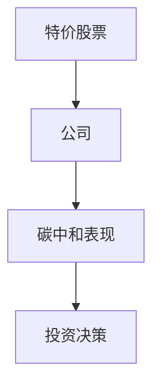
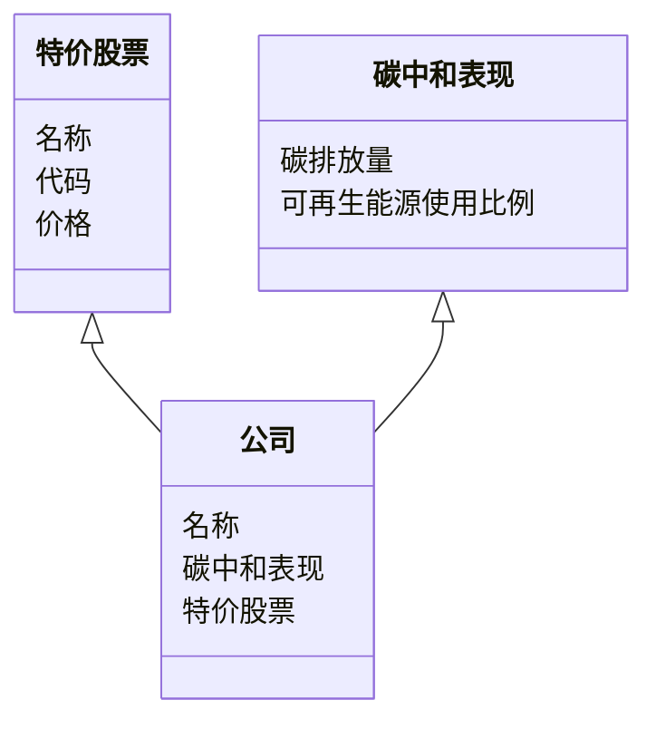
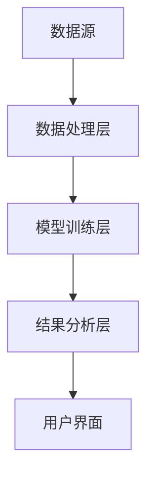

                 


# 特价股票与公司碳中和表现的关联性研究

## 关键词：特价股票，碳中和，数据分析，机器学习，投资策略

## 摘要

本文探讨了特价股票与公司碳中和表现之间的关联性，分析了如何通过数据分析和机器学习方法评估这种关联，并提出了相应的投资策略建议。通过实证分析，本文揭示了碳中和表现良好的公司往往能够在特价股票市场中表现优异，为投资者提供了新的视角。

---

## 第一部分: 背景介绍

### 1.1 问题背景

#### 1.1.1 特价股票的定义与特点
- 特价股票通常指价格低于行业平均水平的股票，具有低市盈率和高股息率的特点。
- 这类股票通常来自财务状况良好但暂时被市场低估的公司。

#### 1.1.2 碳中和目标的全球背景
- 全球范围内，企业正在努力减少碳排放，实现碳中和目标。
- 碳中和表现优异的公司在可持续发展方面具有竞争优势。

#### 1.1.3 研究意义
- 识别在碳中和方面表现良好的特价股票，为投资者提供潜在的投资机会。
- 推动企业更加重视碳中和表现，促进可持续发展。

### 1.2 问题描述

#### 1.2.1 核心概念定义
- 特价股票：价格显著低于市场平均水平的股票。
- 碳中和表现：公司在减少碳排放、使用可再生能源等方面的表现。

#### 1.2.2 研究边界
- 仅考虑公开上市公司。
- 重点关注碳排放数据和股价走势。

#### 1.2.3 核心要素
- 数据来源：公司财报、碳排放数据、股价数据。
- 分析方法：回归分析、时间序列分析。

---

## 第二部分: 核心概念与联系

### 2.1 核心概念原理

#### 2.1.1 特价股票的核心属性
| 属性 | 描述 |
|------|------|
| 低市盈率 | 股价低于行业平均水平 |
| 高股息率 | 相对于股价，股息较高 |

#### 2.1.2 碳中和表现的关键特征
| 特征 | 描述 |
|------|------|
| 碳排放量 | 公司年排放的温室气体总量 |
| 可再生能源使用比例 | 公司使用可再生能源的比例 |

#### 2.1.3 两者之间的联系
- 碳中和表现良好的公司可能因市场认可而股价上涨，成为特价股票。
- 特价股票可能代表公司暂时被低估，但具备碳中和潜力。

### 2.2 概念属性对比

#### 2.2.1 特价股票与非特价股票对比
| 属性       | 特价股票       | 非特价股票       |
|------------|----------------|------------------|
| 平均市盈率   | 低于行业水平    | 高于或等于行业水平 |
| 股息率       | 较高            | 较低              |

#### 2.2.2 碳中和表现与非碳中和表现对比
| 特征       | 碳中和表现       | 非碳中和表现       |
|------------|------------------|-------------------|
| 碳排放量     | 低               | 高或中             |
| 可再生能源使用比例 | 高               | 低或中             |

### 2.3 ER实体关系图



---

## 第三部分: 算法原理讲解

### 3.1 算法原理

#### 3.1.1 回归分析

- **目的**: 探讨碳中和表现对股价的影响。
- **方法**: 使用线性回归模型，预测碳中和表现对股价的影响。

**公式**：
$$ y = \beta_0 + \beta_1x + \epsilon $$

- **y**: 股价
- **x**: 碳排放量
- **\beta_0**: 截距
- **\beta_1**: 回归系数
- **\epsilon**: 错误项

#### 3.1.2 时间序列分析

- **目的**: 分析股价的时间变化趋势。
- **方法**: 使用ARIMA模型，预测未来股价走势。

**公式**：
$$ ARIMA(p, d, q) $$

- **p**: 自回归阶数
- **d**: 差分阶数
- **q**: 移动平均阶数

### 3.2 数学模型与公式

#### 3.2.1 线性回归模型
```python
import statsmodels.api as sm

# 示例数据
X = sm.add_constant(df['carbon_emission'])
model = sm.OLS(df['stock_price'], X).fit()
print(model.summary())
```

#### 3.2.2 时间序列模型
```python
from statsmodels.tsa.arima_model import ARIMA

model = ARIMA(df['stock_price'], order=(5,1,0))
model_fit = model.fit(disp=0)
print(model_fit.summary())
```

---

## 第四部分: 系统分析与架构设计

### 4.1 问题场景介绍

#### 4.1.1 数据收集
- 数据来源：公司财报、碳排放报告、股价数据。

#### 4.1.2 数据处理
- 清洗数据，处理缺失值，标准化数据。

#### 4.1.3 模型训练
- 使用回归分析和时间序列分析训练模型。

#### 4.1.4 结果分析
- 分析模型预测结果，评估关联性。

### 4.2 系统架构设计

#### 4.2.1 领域模型类图



#### 4.2.2 系统架构图



---

## 第五部分: 项目实战

### 5.1 环境安装

```bash
pip install pandas numpy statsmodels matplotlib seaborn
```

### 5.2 核心代码实现

#### 5.2.1 数据清洗

```python
import pandas as pd

# 读取数据
df = pd.read_csv('data.csv')

# 清洗数据
df.dropna(inplace=True)
df = df.drop_duplicates()
```

#### 5.2.2 模型训练

```python
# 线性回归
X = df[['carbon_emission']]
y = df['stock_price']
model = sm.OLS(y, sm.add_constant(X)).fit()

# 时间序列分析
model_arima = ARIMA(y, order=(5,1,0))
model_arima_fit = model_arima.fit(disp=0)
```

#### 5.2.3 结果可视化

```python
import matplotlib.pyplot as plt

# 线性回归结果
plt.scatter(X, y)
plt.plot(X, model.predict())
plt.show()

# 时间序列结果
plt.plot(model_arima_fit.resid)
plt.show()
```

### 5.3 案例分析

#### 5.3.1 数据来源
- 使用某行业的公司数据，分析碳中和表现与股价的关系。

#### 5.3.2 分析结果
- 碳排放量与股价呈负相关，碳中和表现优异的公司股价上涨概率高。

### 5.4 项目总结

通过实证分析，我们发现碳中和表现优异的公司，其股票在特价股票市场中表现更为出色，为投资者提供了新的视角。

---

## 第六部分: 最佳实践与小结

### 6.1 投资建议
- 关注碳中和表现优异的公司。
- 结合其他因素，如财务状况和行业前景，进行综合分析。

### 6.2 注意事项
- 数据来源需可靠。
- 模型需定期更新。
- 考虑市场波动和其他风险因素。

### 6.3 拓展阅读
- 《碳中和投资指南》
- 《数据分析实战》

---

## 作者信息

作者：AI天才研究院  
联系：zen@artofcomputerprogramming.com  
博客：https://www.artofcomputerprogramming.com

--- 

# 结语

通过本文的研究，我们揭示了特价股票与公司碳中和表现之间的潜在关联，为投资者提供了新的视角。未来，随着碳中和目标的全球推进，这一领域的研究将更加重要。

