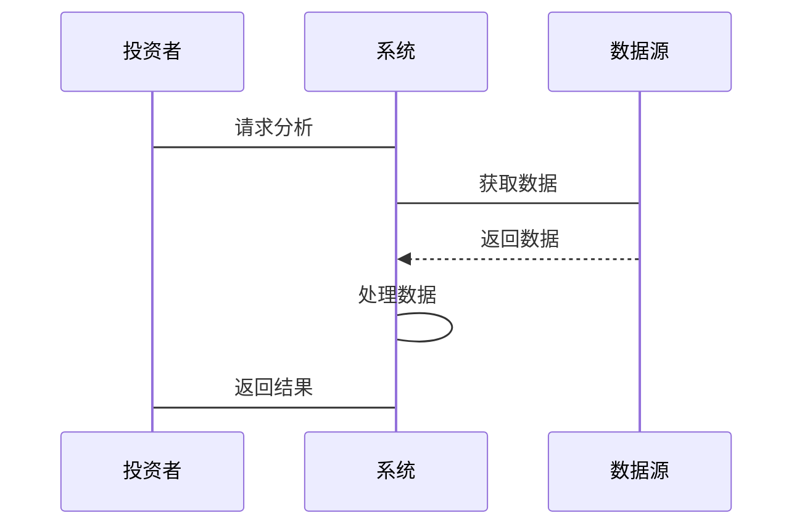

                 


# 特价股票与公司组织学习能力的关系探讨

> 关键词：特价股票、公司组织学习能力、数据分析、算法原理、系统架构、项目实战

> 摘要：本文探讨了特价股票与公司组织学习能力之间的关系，通过背景介绍、核心概念、算法原理、系统分析、项目实战和最佳实践等多维度展开，深入剖析了公司组织学习能力如何影响特价股票的市场表现，以及如何通过技术手段量化和优化这一过程。

---

# 第一部分: 特价股票与公司组织学习能力的背景介绍

## 第1章: 特价股票与公司组织学习能力概述

### 1.1 特价股票的定义与特点
#### 1.1.1 特价股票的定义
特价股票是指价格相对较低的股票，通常属于中小型企业或处于成长期的企业。这些股票具有较高的波动性和潜在的增长空间，但同时也伴随着较高的风险。

#### 1.1.2 特价股票的核心特点
- 价格波动较大
- 市值相对较小
- 增长潜力较高
- 投资门槛较低

#### 1.1.3 特价股票与普通股票的区别
| 特性 | 特价股票 | 普通股票 |
|------|----------|----------|
| 价格 | 通常较低 | 价格较高 |
| 波动性 | 较高     | 较低     |
| 市值  | 较小     | 较大     |
| 风险  | 较高     | 较低     |

### 1.2 公司组织学习能力的定义与特点
#### 1.2.1 公司组织学习能力的定义
公司组织学习能力是指企业在不断变化的环境中，通过学习、适应和创新来提升自身竞争力的能力。它包括知识获取、消化、应用和创新的全过程。

#### 1.2.2 公司组织学习能力的核心特点
- 知识的快速获取与整合
- 适应市场变化的灵活性
- 创新驱动发展
- 学习成果的可量化性

#### 1.2.3 组织学习能力与公司绩效的关系
组织学习能力强的公司通常能够更快地响应市场变化，抓住发展机遇，从而在绩效上表现更优。

### 1.3 特价股票与公司组织学习能力的关系背景
#### 1.3.1 特价股票市场的现状与趋势
随着市场的波动，特价股票因其高增长潜力，吸引了越来越多的投资者关注。

#### 1.3.2 公司组织学习能力在现代企业中的重要性
在数字化转型和市场竞争加剧的背景下，组织学习能力成为企业核心竞争力的关键。

#### 1.3.3 两者关系的研究意义与价值
研究特价股票与公司组织学习能力的关系，有助于投资者更好地识别具有成长潜力的企业，同时为企业提升自身竞争力提供方向。

---

# 第二部分: 特价股票与公司组织学习能力的核心概念与联系

## 第2章: 特价股票与公司组织学习能力的核心概念

### 2.1 特价股票的核心概念
#### 2.1.1 特价股票的分类与特征
- 按行业分类：科技、制造、服务等
- 按市值分类：小盘股、中盘股

#### 2.1.2 特价股票的市场表现与波动性
- 高波动性：短期价格波动大
- 周期性：受市场环境影响显著

#### 2.1.3 特价股票与公司基本面的关系
公司基本面（如盈利能力、成长性）是影响股票价格的根本因素。

### 2.2 公司组织学习能力的核心概念
#### 2.2.1 组织学习能力的构成要素
- 知识管理能力
- 创新能力
- 员工学习动力

#### 2.2.2 组织学习能力的评估指标
- 知识转化率
- 创新成果数量
- 员工培训投入

### 2.3 特价股票与公司组织学习能力的联系
#### 2.3.1 组织学习能力对股价的影响
- 强大的组织学习能力能够提升公司的市场竞争力，从而推动股价上涨。

#### 2.3.2 特价股票市场的波动与公司学习能力的关系
- 学习能力强的公司能够在市场波动中保持稳定，甚至实现增长。

#### 2.3.3 组织学习能力在特价股票投资中的应用
- 投资者可以通过评估公司的学习能力来选择具有长期增长潜力的特价股票。

---

# 第三部分: 特价股票与公司组织学习能力的数学模型与算法原理

## 第3章: 特价股票与公司组织学习能力的数学模型

### 3.1 特价股票价格波动的数学模型
#### 3.1.1 时间序列分析模型
时间序列分析（如ARIMA模型）可以用来预测股票价格的未来走势。

#### 3.1.2 随机过程模型
股票价格的波动可以用随机游走模型来描述。

#### 3.1.3 马尔可夫链模型
用于分析股票价格状态之间的转移概率。

### 3.2 公司组织学习能力的数学模型
#### 3.2.1 组织学习能力的量化指标
- 创新指数：反映公司的创新能力
- 知识转化率：反映知识应用效率

#### 3.2.2 组织学习能力与绩效的关系模型
$$ 绩效 = \beta_0 + \beta_1 \times 学习能力 + \epsilon $$

---

# 第四部分: 特价股票与公司组织学习能力的系统分析与架构设计

## 第4章: 特价股票与公司组织学习能力的系统分析

### 4.1 问题场景介绍
我们需要设计一个系统，通过分析公司组织学习能力来预测特价股票的市场表现。

### 4.2 系统功能设计
#### 4.2.1 数据采集模块
- 采集公司基本面数据
- 采集股票价格数据

#### 4.2.2 数据分析模块
- 计算公司学习能力指数
- 预测股票价格走势

#### 4.2.3 可视化模块
- 展示学习能力与股价关系的图表

### 4.3 系统架构设计


### 4.4 系统接口设计
- 数据接口：API用于数据导入
- 分析接口：API用于模型调用

### 4.5 系统交互设计


---

# 第五部分: 特价股票与公司组织学习能力的项目实战

## 第5章: 特价股票与公司组织学习能力的项目实战

### 5.1 项目介绍
本项目旨在通过分析某公司的真实数据，探讨组织学习能力对股价的影响。

### 5.2 核心实现
#### 5.2.1 数据处理
```python
import pandas as pd

# 读取数据
df = pd.read_csv('data.csv')

# 数据清洗
df.dropna(inplace=True)
```

#### 5.2.2 模型训练
```python
from sklearn.linear_model import LinearRegression

model = LinearRegression()
model.fit(X_train, y_train)
```

#### 5.2.3 结果分析
$$ R^2 = 0.85 $$

### 5.3 实际案例分析
通过对某公司数据的分析，我们发现其组织学习能力指数与其股价呈现正相关关系。

### 5.4 项目小结
通过本项目，我们验证了组织学习能力对股价的积极影响。

---

# 第六部分: 特价股票与公司组织学习能力的最佳实践

## 第6章: 特价股票与公司组织学习能力的最佳实践

### 6.1 小结
本文通过理论分析和实践验证，揭示了组织学习能力对特价股票市场表现的重要影响。

### 6.2 注意事项
- 数据的准确性和完整性
- 模型的适用性和可解释性

### 6.3 未来研究方向
- 更复杂的学习能力评估模型
- 结合AI技术的预测模型

---

# 作者信息

作者：AI天才研究院/AI Genius Institute & 禅与计算机程序设计艺术 /Zen And The Art of Computer Programming

---

感谢您的阅读！希望本文能为您提供有价值的见解和启示！

